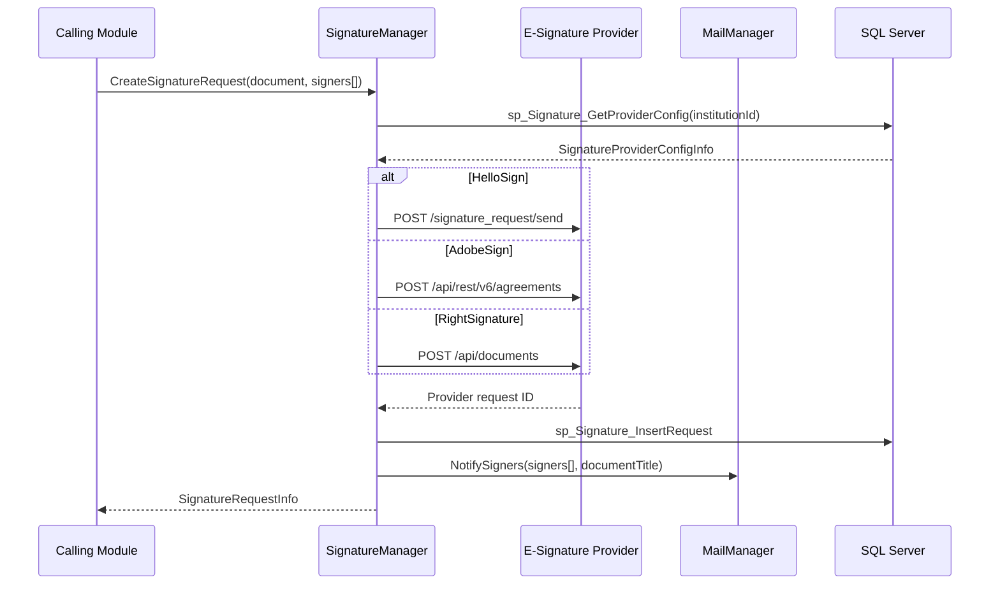
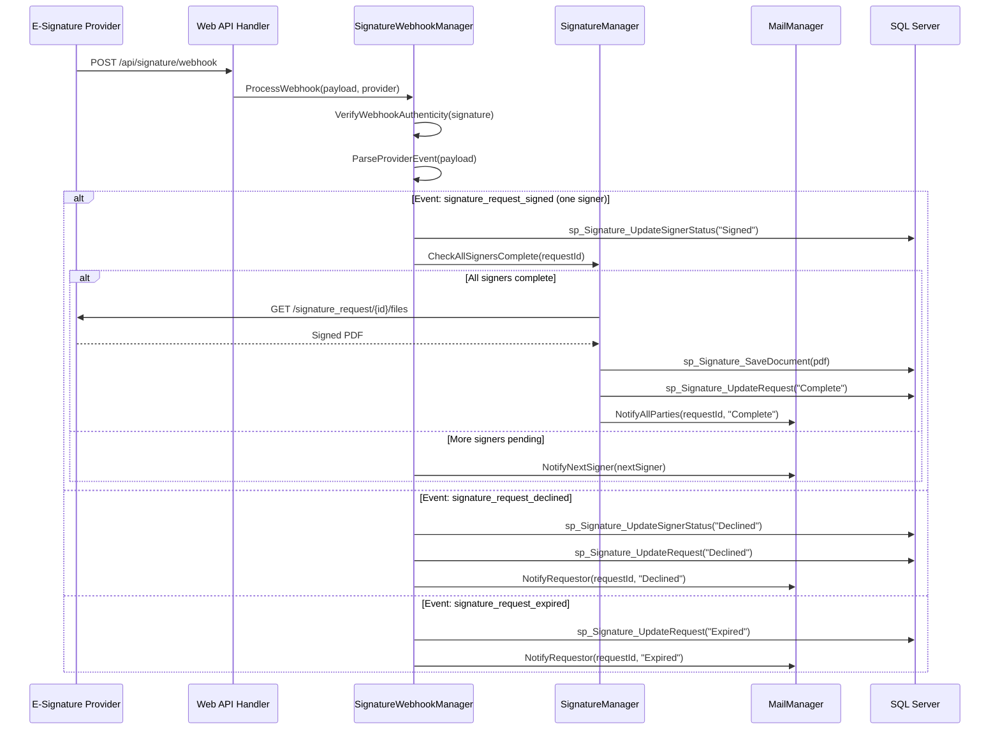
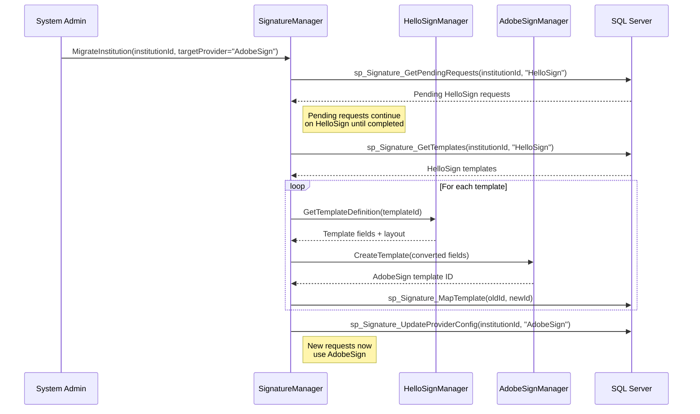
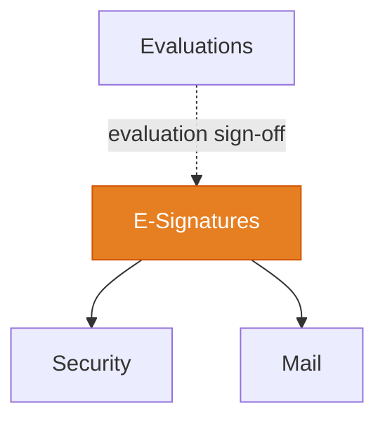

import DependentsPanel from '@site/src/components/DependentsPanel';

# E-Signatures (HelloSign / AdobeSign / RightSignature)

<!-- Content will be enriched by AI parsing scripts -->

## Overview

The E-Signatures module provides electronic signature capabilities for documents that require formal sign-off within the MyEvaluations platform. This includes evaluation sign-offs, training agreements, remediation plans, and other compliance documents. The module integrates with multiple e-signature providers (HelloSign, AdobeSign, and RightSignature) and manages the full document signing lifecycle.

The platform is currently in the process of migrating from HelloSign (now Dropbox Sign) to AdobeSign as the primary e-signature provider, with RightSignature supported as a legacy integration for some institutions.

### Key Responsibilities

- **Document Signing Workflows**: Create, send, and track signature requests for training documents
- **Multi-Provider Support**: Abstract integration layer supporting HelloSign, AdobeSign, and RightSignature
- **Webhook Processing**: Handle real-time events from signature providers (signed, declined, expired)
- **Template Management**: Manage reusable document templates with signature fields and pre-fill data
- **Audit Trail**: Maintain complete signing history for compliance and legal purposes
- **Provider Migration**: Support gradual migration from HelloSign to AdobeSign

## Key Classes

### Manager Classes

| Class | Namespace | Purpose |
|-------|-----------|---------|
| `SignatureManager` | `MyEvaluations.Business.Signature` | Provider-agnostic signature operations: create request, check status, download signed document. |
| `HelloSignManager` | `MyEvaluations.Business.Signature` | HelloSign (Dropbox Sign) API integration. |
| `AdobeSignManager` | `MyEvaluations.Business.Signature` | AdobeSign API integration. |
| `RightSignatureManager` | `MyEvaluations.Business.Signature` | RightSignature API integration (legacy). |
| `SignatureTemplateManager` | `MyEvaluations.Business.Signature` | Document template management with signature field definitions. |
| `SignatureWebhookManager` | `MyEvaluations.Business.Signature` | Webhook event processing from all providers. |

### Info (DTO) Classes

| Class | Purpose |
|-------|---------|
| `SignatureRequestInfo` | Signature request: document, signers list, status, provider, created date, completed date. |
| `SignerInfo` | Individual signer: name, email, role, signing order, status (pending/signed/declined). |
| `SignatureTemplateInfo` | Template: name, provider template ID, fields, pre-fill mappings, institution. |
| `SignatureEventInfo` | Webhook event: event type, request ID, signer, timestamp, provider-specific data. |
| `SignedDocumentInfo` | Completed document: download URL, signed date, certificate of completion, audit trail. |
| `SignatureProviderConfigInfo` | Provider configuration: API key, callback URL, default settings, per institution. |

## Business Workflows

### Document Signing Request

### Webhook Event Processing

### Provider Migration (HelloSign to AdobeSign)

## Stored Procedure References

| Stored Procedure | Purpose |
|-----------------|---------|
| `sp_Signature_GetProviderConfig` | Retrieve e-signature provider config for institution |
| `sp_Signature_InsertRequest` | Create signature request record |
| `sp_Signature_UpdateSignerStatus` | Update individual signer status |
| `sp_Signature_UpdateRequest` | Update overall request status |
| `sp_Signature_SaveDocument` | Store signed document |
| `sp_Signature_GetPendingRequests` | Retrieve pending requests for institution/provider |
| `sp_Signature_GetTemplates` | Retrieve document templates |
| `sp_Signature_MapTemplate` | Map template IDs during provider migration |
| `sp_Signature_UpdateProviderConfig` | Update provider configuration |
| `sp_Signature_GetAuditTrail` | Retrieve signing audit trail |

## Cross-Module Dependencies

### Dependency Details

| Direction | Module | Relationship |
|-----------|--------|-------------|
| Depends on | Security | Permission checks for signature request creation and template management |
| Depends on | Mail | Signer notifications and completion alerts |
| Depended on by | Evaluations | Evaluation sign-off workflow can use e-signatures (when configured by institution) |

{/* DEPENDENTS-PANEL:START */}
<DependentsPanel
  module="HelloSign"
  webDependents={[]}
  schedulerDependents={[]}
/>
{/* DEPENDENTS-PANEL:END */}

## File Reference

Browse per-file implementation documentation for every class in this module:

- [**HelloSign Implementation Files**](./files/hellosign) — 30 classes with summaries, key methods, and migration notes
- [**AdobeSign Implementation Files**](./files/adobesign) — 8 classes with summaries, key methods, and migration notes
- [**RightSignature Implementation Files**](./files/rightsignature) — 10 classes with summaries, key methods, and migration notes
