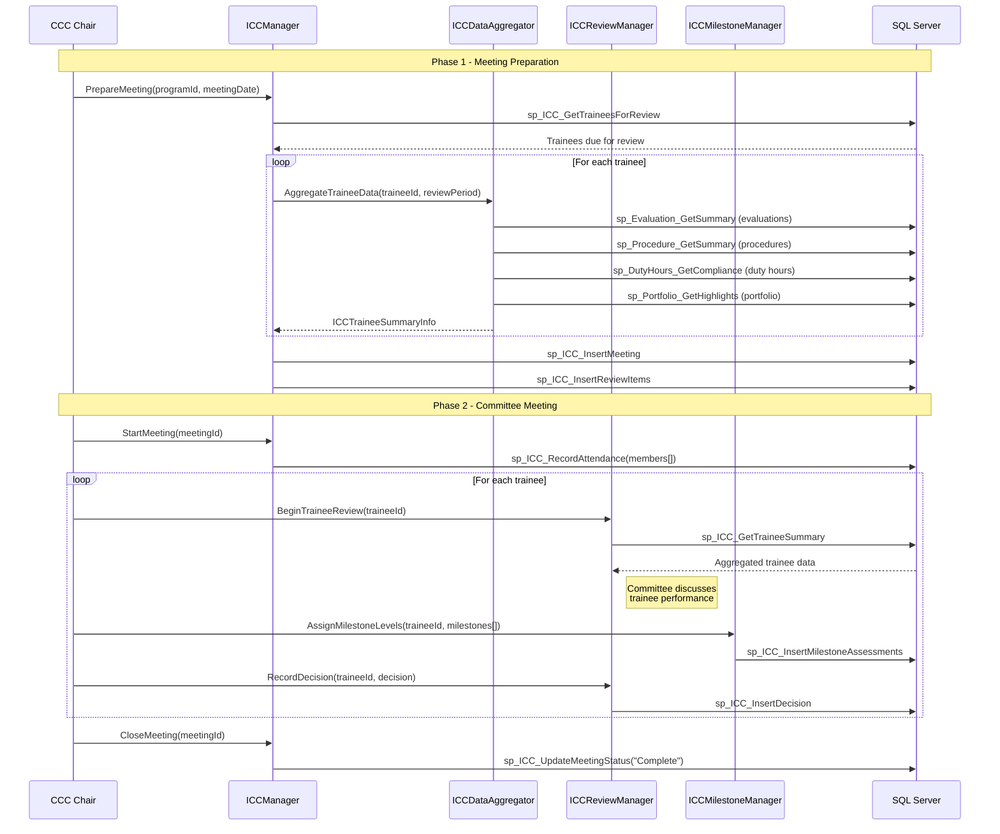
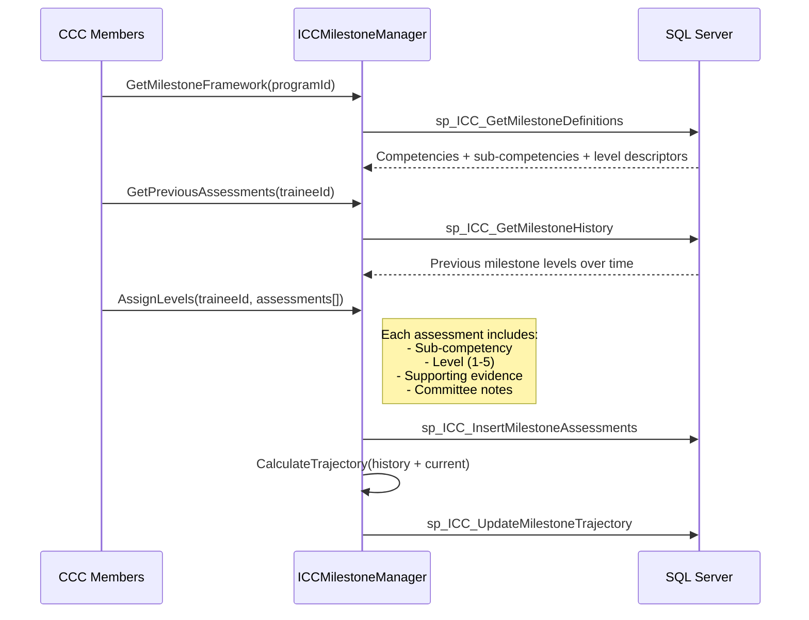
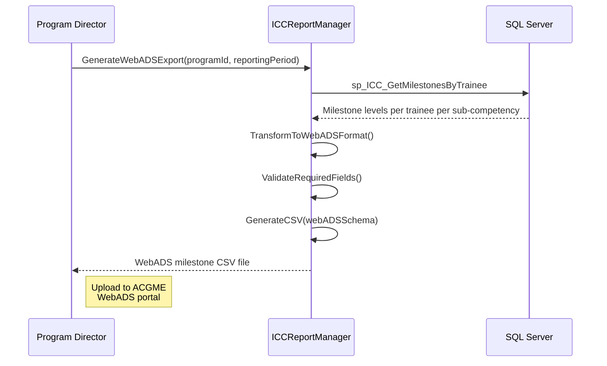
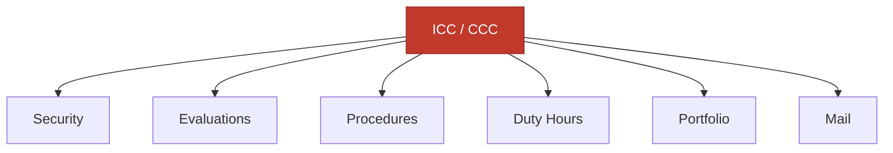

import DependentsPanel from '@site/src/components/DependentsPanel';

# ICC (In-Training / Clinical Competency Committee)

<!-- Content will be enriched by AI parsing scripts -->

## Overview

The ICC module supports Clinical Competency Committee (CCC) operations, which are required by the ACGME for all residency and fellowship programs. The CCC is responsible for reviewing trainee performance data at least semi-annually and making recommendations about trainee progression, including milestone assessments, remediation plans, and promotion or dismissal decisions.

This module aggregates data from evaluations, procedures, duty hours, and portfolios to present a comprehensive trainee profile to committee members. It manages the committee meeting workflow, milestone level assignments, and formal documentation of CCC decisions.

### Key Responsibilities

- **Committee Management**: Define CCC membership, meeting schedules, and quorum requirements
- **Data Aggregation**: Pull trainee performance data from all relevant modules for committee review
- **Milestone Assessment**: Facilitate semi-annual milestone level assignments by CCC members
- **Meeting Workflow**: Structured meeting process with resident review, discussion, and voting
- **Decision Documentation**: Record CCC recommendations (advancement, remediation, probation, dismissal)
- **ACGME Reporting**: Generate milestone data for ACGME WebADS submission

## Key Classes

### Manager Classes

| Class | Namespace | Purpose |
|-------|-----------|---------|
| `ICCManager` | `MyEvaluations.Business.ICC` | Core CCC operations: committee setup, meeting management, and decision recording. |
| `ICCReviewManager` | `MyEvaluations.Business.ICC` | Individual trainee review workflow within CCC meetings. |
| `ICCMilestoneManager` | `MyEvaluations.Business.ICC` | Milestone level assessment and tracking during CCC reviews. |
| `ICCDataAggregator` | `MyEvaluations.Business.ICC` | Aggregates trainee data from evaluations, procedures, duty hours, and portfolios. |
| `ICCReportManager` | `MyEvaluations.Business.ICC` | CCC meeting minutes, decision reports, and ACGME WebADS milestone exports. |

### Info (DTO) Classes

| Class | Purpose |
|-------|---------|
| `ICCReviewInfo` | Review record: trainee, committee, review date, milestone assessments, recommendation, comments. |
| `ICCMeetingInfo` | Meeting record: date, committee members present, trainees reviewed, quorum status. |
| `ICCCommitteeInfo` | Committee definition: program, members (roles), chair, meeting schedule, quorum rules. |
| `ICCMilestoneAssessmentInfo` | Milestone assessment: competency, sub-competency, assigned level (1-5), evidence, assessor notes. |
| `ICCDecisionInfo` | Formal decision: trainee, recommendation type, effective date, conditions, follow-up date. |
| `ICCTraineeSummaryInfo` | Aggregated trainee data: evaluation scores, procedure counts, duty hour compliance, portfolio highlights. |

## Business Workflows

### Semi-Annual CCC Review

### Milestone Level Assignment

### ACGME WebADS Export

## Stored Procedure References

| Stored Procedure | Purpose |
|-----------------|---------|
| `sp_ICC_GetTraineesForReview` | Retrieve trainees due for semi-annual review |
| `sp_ICC_InsertMeeting` | Create CCC meeting record |
| `sp_ICC_InsertReviewItems` | Create review agenda items |
| `sp_ICC_RecordAttendance` | Record committee member attendance |
| `sp_ICC_GetTraineeSummary` | Retrieve aggregated trainee data for review |
| `sp_ICC_InsertMilestoneAssessments` | Save milestone level assignments |
| `sp_ICC_InsertDecision` | Record CCC recommendation/decision |
| `sp_ICC_UpdateMeetingStatus` | Update meeting status (in progress/complete) |
| `sp_ICC_GetMilestoneDefinitions` | Retrieve milestone framework for program |
| `sp_ICC_GetMilestoneHistory` | Retrieve historical milestone assessments |
| `sp_ICC_UpdateMilestoneTrajectory` | Update milestone trajectory analysis |
| `sp_ICC_GetMilestonesByTrainee` | Retrieve milestone data for ACGME export |

## Cross-Module Dependencies

### Dependency Details

| Direction | Module | Relationship |
|-----------|--------|-------------|
| Depends on | Security | Committee membership verification, permission checks for milestone assignment |
| Depends on | Evaluations | Evaluation summaries and scores are primary data for CCC review |
| Depends on | Procedures | Procedure counts and competency milestones inform CCC assessment |
| Depends on | Duty Hours | Compliance data reviewed during CCC meetings |
| Depends on | Portfolio | Portfolio data provides comprehensive trainee context |
| Depends on | Mail | Meeting notifications, decision communications, and reminder alerts |

{/* DEPENDENTS-PANEL:START */}
<DependentsPanel module="ICC" />
{/* DEPENDENTS-PANEL:END */}

## File Reference

Browse per-file implementation documentation for every class in this module:

- [**ICC Implementation Files**](./files/icc) — 2 classes with summaries, key methods, stored procedures, and migration notes
