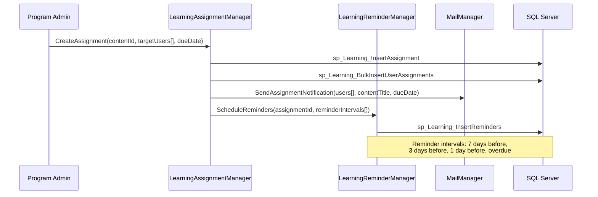
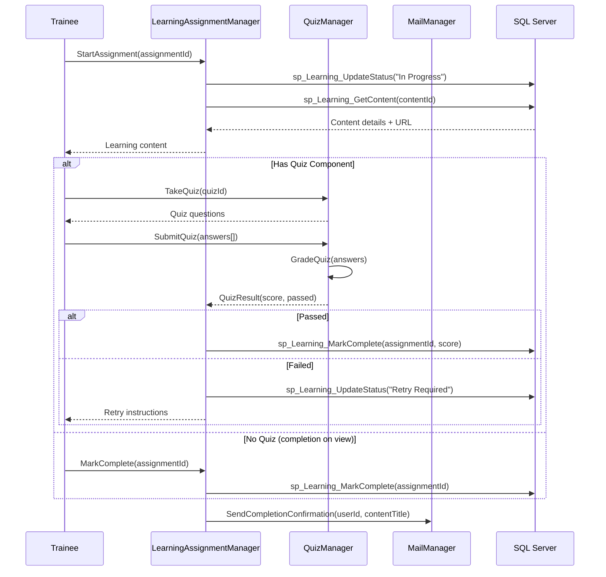
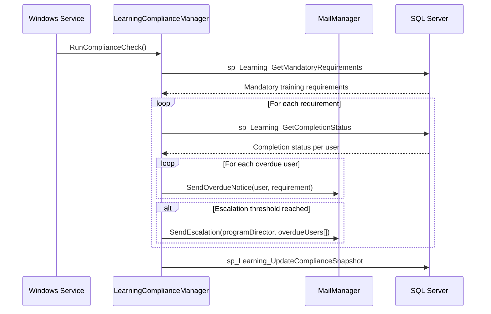
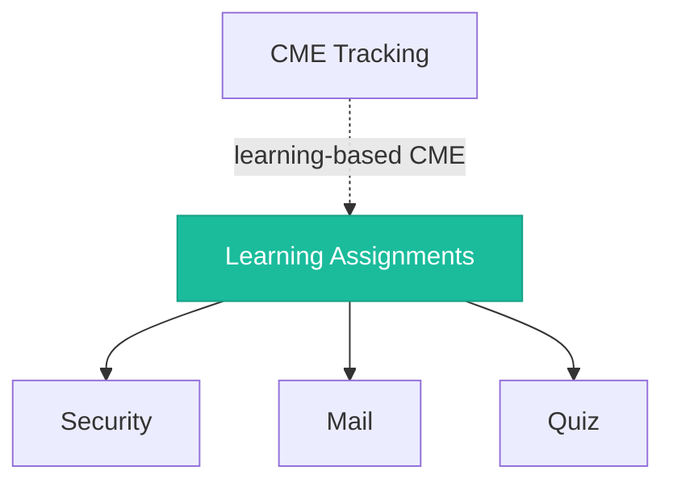

# Learning Assignments

<!-- Content will be enriched by AI parsing scripts -->

## Overview

The Learning Assignments module manages the distribution and tracking of educational content to trainees and faculty. Programs assign learning materials -- such as articles, videos, policy documents, online modules, and quizzes -- to users with due dates and completion tracking. This module supports mandatory compliance training (e.g., HIPAA, safety), program-specific curriculum delivery, and self-directed learning.

### Key Responsibilities

- **Assignment Creation**: Create and distribute learning materials with configurable due dates, target audiences, and completion criteria
- **Completion Tracking**: Monitor assignment completion status with timestamps, attempts, and scores
- **Due Date Management**: Configurable due dates with automated reminders at multiple intervals
- **Curriculum Management**: Group assignments into curricula or learning paths for structured training
- **Quiz Integration**: Link assignments to quiz assessments for knowledge verification
- **Compliance Reporting**: Track mandatory training completion rates for compliance audits

## Key Classes

### Manager Classes

| Class | Namespace | Purpose |
|-------|-----------|---------|
| `LearningAssignmentManager` | `MyEvaluations.Business.Learning` | Core assignment CRUD, distribution, and completion tracking. |
| `LearningContentManager` | `MyEvaluations.Business.Learning` | Learning content management: upload, categorize, version, and retrieve materials. |
| `LearningCurriculumManager` | `MyEvaluations.Business.Learning` | Curriculum/learning path definition and sequencing. |
| `LearningComplianceManager` | `MyEvaluations.Business.Learning` | Compliance tracking and reporting for mandatory training requirements. |
| `LearningReminderManager` | `MyEvaluations.Business.Learning` | Automated reminder scheduling and escalation logic. |

### Info (DTO) Classes

| Class | Purpose |
|-------|---------|
| `LearningAssignmentInfo` | Assignment record: content, assignee, assigner, due date, status, completion date, attempts. |
| `LearningContentInfo` | Content item: title, type (article/video/document/module), URL or file path, duration, version. |
| `LearningCurriculumInfo` | Curriculum: name, description, ordered list of content items, prerequisites, target audience. |
| `LearningCompletionInfo` | Completion record: user, assignment, completion timestamp, score (if quiz), certificate generated. |
| `LearningComplianceReportInfo` | Compliance report: requirement, user group, completion rate, overdue count, non-compliant users. |

## Business Workflows

### Assignment Distribution

### Assignment Completion Flow

### Compliance Monitoring

## Stored Procedure References

| Stored Procedure | Purpose |
|-----------------|---------|
| `sp_Learning_InsertAssignment` | Create new learning assignment |
| `sp_Learning_BulkInsertUserAssignments` | Assign content to multiple users |
| `sp_Learning_InsertReminders` | Schedule reminder notifications |
| `sp_Learning_UpdateStatus` | Update assignment status |
| `sp_Learning_GetContent` | Retrieve learning content details |
| `sp_Learning_MarkComplete` | Mark assignment as completed |
| `sp_Learning_GetMandatoryRequirements` | Retrieve mandatory training requirements |
| `sp_Learning_GetCompletionStatus` | Retrieve completion status for users |
| `sp_Learning_UpdateComplianceSnapshot` | Update compliance tracking data |
| `sp_Learning_GetAssignments` | Retrieve assignments for a user |
| `sp_Learning_GetCurriculum` | Retrieve curriculum with ordered content |

## Cross-Module Dependencies

### Dependency Details

| Direction | Module | Relationship |
|-----------|--------|-------------|
| Depends on | Security | Permission checks for assignment creation, content management, and compliance reporting |
| Depends on | Mail | Assignment notifications, reminders, completion confirmations, and escalations |
| Depends on | Quiz | Quiz assessments linked to learning assignments for knowledge verification |
| Related to | CME Tracking | Completed learning activities may award CME credits |

## File Reference

Browse per-file implementation documentation for every class in this module:

- [**Learning Assignment Implementation Files**](./files/learningassignment) — 12 classes with summaries, key methods, stored procedures, and migration notes
