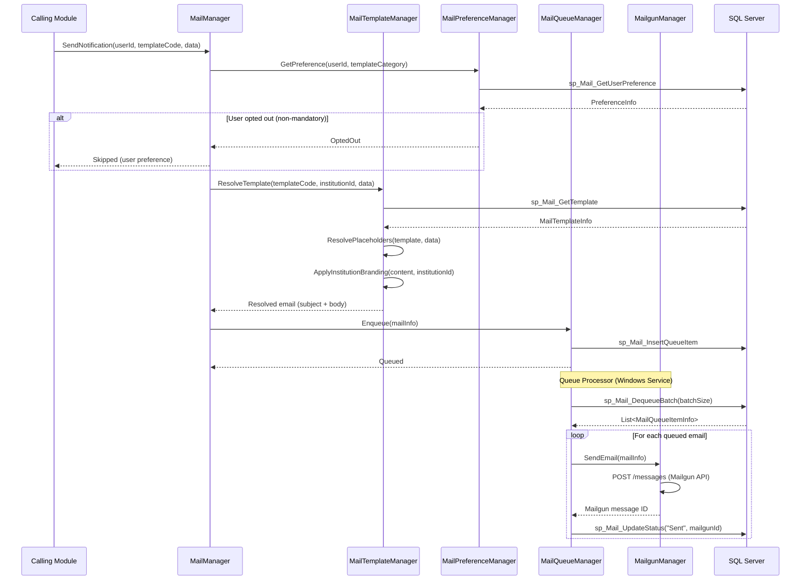
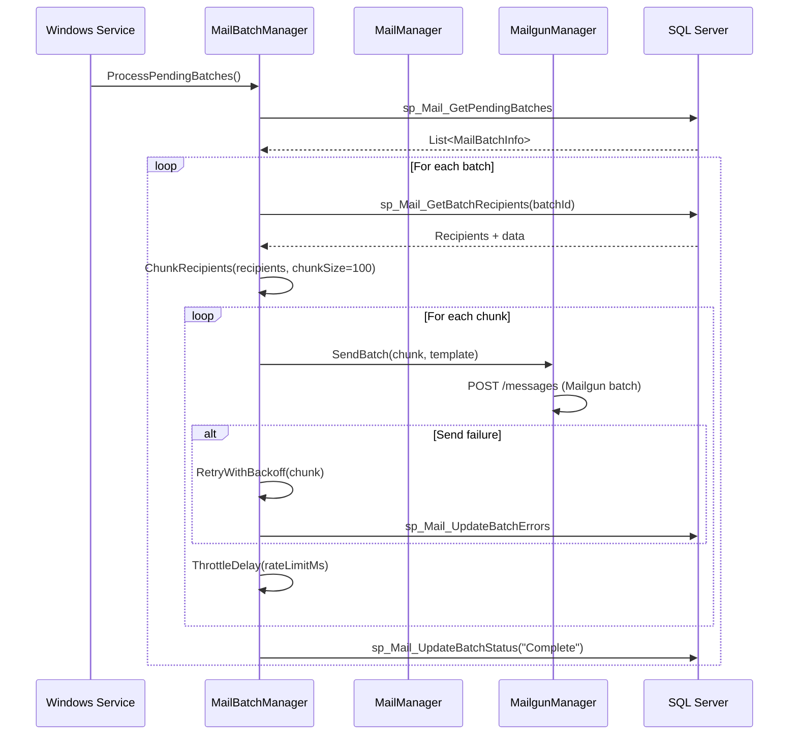
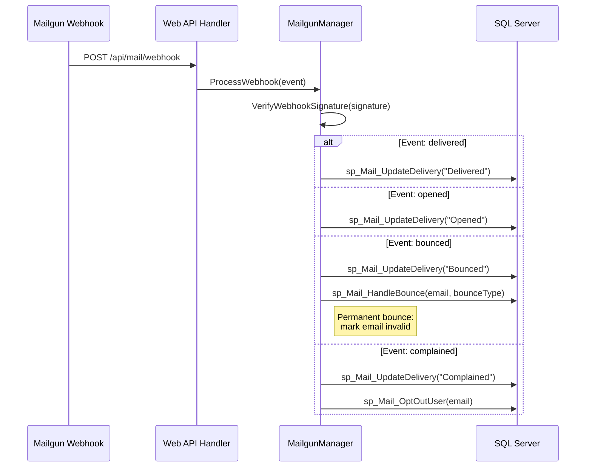
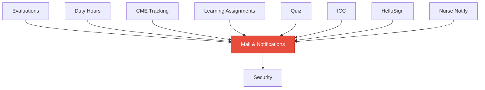

# Mail & Notifications

<!-- Content will be enriched by AI parsing scripts -->

## Overview

The Mail module is the centralized email and notification system for the MyEvaluations platform. Nearly every other module depends on it for user communication -- evaluation reminders, duty hour violation alerts, learning assignment notifications, compliance warnings, and administrative messages all flow through this module.

The module uses a template-based email system with support for dynamic content, personalization, and institutional branding. Emails are sent via Mailgun API integration, with batch processing for high-volume sends and comprehensive delivery tracking.

### Key Responsibilities

- **Email Template System**: Configurable email templates with dynamic placeholders, institutional branding, and multi-language support
- **Notification Preferences**: User-configurable notification preferences (email, digest, opt-out for non-mandatory)
- **Mailgun Integration**: Email delivery via Mailgun API with delivery tracking, bounce handling, and unsubscribe management
- **Batch Processing**: High-volume email batching for scheduled sends (evaluation reminders, compliance notifications)
- **Delivery Tracking**: Track sent, delivered, opened, bounced, and failed emails
- **Notification Queue**: Database-backed queue for reliable, ordered notification delivery

## Key Classes

### Manager Classes

| Class | Namespace | Purpose |
|-------|-----------|---------|
| `MailManager` | `MyEvaluations.Business.Mail` | Core email operations: compose, queue, send, and delivery tracking. |
| `MailTemplateManager` | `MyEvaluations.Business.Mail` | Template CRUD, placeholder resolution, and institutional customization. |
| `MailPreferenceManager` | `MyEvaluations.Business.Mail` | User notification preference management and opt-out handling. |
| `MailBatchManager` | `MyEvaluations.Business.Mail` | Batch email processing: chunking, throttling, and retry logic. |
| `MailgunManager` | `MyEvaluations.Business.Mail` | Mailgun API integration: sending, webhook processing, and bounce management. |
| `MailQueueManager` | `MyEvaluations.Business.Mail` | Database-backed notification queue management. |

### Info (DTO) Classes

| Class | Purpose |
|-------|---------|
| `MailInfo` | Email record: to, from, subject, body (HTML), template ID, status, sent timestamp, delivery status. |
| `MailTemplateInfo` | Template: name, subject template, body template, placeholders, category, institution override. |
| `MailPreferenceInfo` | User preferences: notification category, delivery method (immediate/digest/none), frequency. |
| `MailBatchInfo` | Batch record: batch ID, total count, sent count, failed count, start time, completion time. |
| `MailDeliveryInfo` | Delivery tracking: message ID, Mailgun ID, status (sent/delivered/opened/bounced/failed), timestamp. |
| `MailQueueItemInfo` | Queue entry: priority, created timestamp, recipient, template, data payload, retry count, status. |

## Business Workflows

### Email Sending Flow

### Batch Email Processing

### Mailgun Webhook Processing

## Stored Procedure References

| Stored Procedure | Purpose |
|-----------------|---------|
| `sp_Mail_GetUserPreference` | Retrieve notification preferences for user and category |
| `sp_Mail_GetTemplate` | Retrieve email template by code and institution |
| `sp_Mail_InsertQueueItem` | Add email to send queue |
| `sp_Mail_DequeueBatch` | Retrieve batch of queued emails for processing |
| `sp_Mail_UpdateStatus` | Update email send status |
| `sp_Mail_InsertBatch` | Create email batch record |
| `sp_Mail_GetPendingBatches` | Retrieve unprocessed batches |
| `sp_Mail_GetBatchRecipients` | Retrieve recipients for a batch |
| `sp_Mail_UpdateBatchStatus` | Update batch completion status |
| `sp_Mail_UpdateBatchErrors` | Record batch send errors |
| `sp_Mail_UpdateDelivery` | Update delivery tracking from webhook |
| `sp_Mail_HandleBounce` | Process email bounce |
| `sp_Mail_OptOutUser` | Opt out user from email (spam complaint) |

## Cross-Module Dependencies

### Dependency Details

| Direction | Module | Relationship |
|-----------|--------|-------------|
| Depends on | Security | User email retrieval, institution context, permission checks for template management |
| Depended on by | Evaluations | Evaluation assignment notifications, reminders, and completion alerts |
| Depended on by | Duty Hours | Violation notifications and compliance alerts |
| Depended on by | CME Tracking | Compliance reminders and certificate delivery |
| Depended on by | Learning Assignments | Assignment notifications, reminders, and completion confirmations |
| Depended on by | Quiz | Quiz assignment notifications and score delivery |
| Depended on by | ICC | Committee review notifications and meeting reminders |
| Depended on by | HelloSign | Signature request notifications |
| Depended on by | Nurse Notify | Nursing program notifications routed through mail system |
