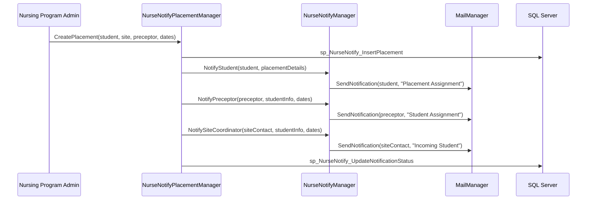
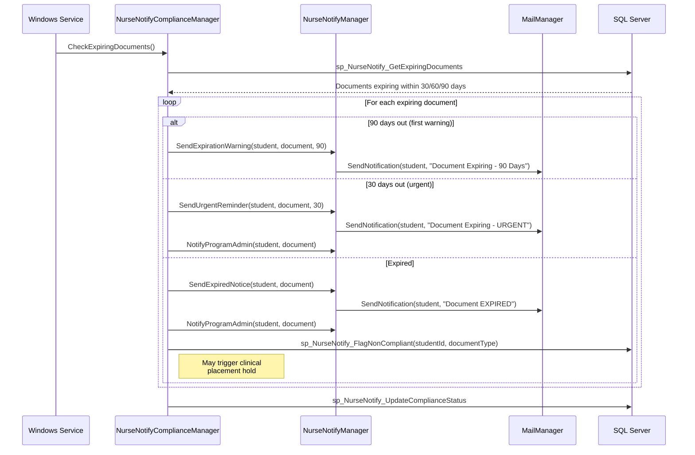
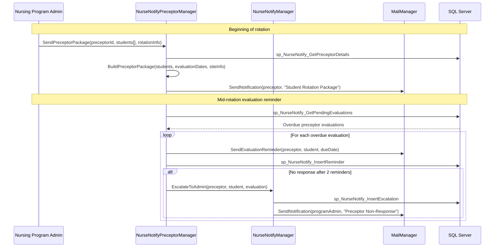
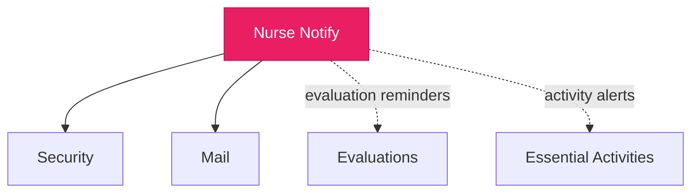

import DependentsPanel from '@site/src/components/DependentsPanel';

# Nurse Notify

<!-- Content will be enriched by AI parsing scripts -->

## Overview

The Nurse Notify module provides a specialized notification system for nursing education programs. While the general Mail module handles platform-wide email delivery, Nurse Notify addresses the unique communication needs of nursing programs: clinical placement alerts, preceptor notifications, compliance document reminders, clinical site communications, and program-specific announcements.

Nursing programs have distinct notification requirements compared to GME programs. They coordinate with external clinical sites, manage student-preceptor assignments, track compliance documents (immunizations, background checks, drug screens, CPR certification), and communicate with clinical site coordinators who may not have MyEvaluations accounts.

### Key Responsibilities

- **Clinical Placement Alerts**: Notify students, preceptors, and clinical sites about placement assignments and changes
- **Compliance Document Reminders**: Track and alert on expiring compliance documents (immunizations, certifications, background checks)
- **Preceptor Communication**: Notify preceptors about student assignments, evaluation requests, and schedule changes
- **Clinical Site Coordination**: Communicate with clinical site coordinators about student schedules and requirements
- **Program Announcements**: Broadcast program-specific messages to student cohorts
- **Escalation Workflows**: Automated escalation for overdue compliance items and unresponsive recipients

## Key Classes

### Manager Classes

| Class | Namespace | Purpose |
|-------|-----------|---------|
| `NurseNotifyManager` | `MyEvaluations.Business.NurseNotify` | Core nursing notification operations: create, schedule, and track notifications. |
| `NurseNotifyPlacementManager` | `MyEvaluations.Business.NurseNotify` | Clinical placement notification workflows. |
| `NurseNotifyComplianceManager` | `MyEvaluations.Business.NurseNotify` | Compliance document expiration tracking and reminders. |
| `NurseNotifyPreceptorManager` | `MyEvaluations.Business.NurseNotify` | Preceptor-specific communication management. |
| `NurseNotifySiteManager` | `MyEvaluations.Business.NurseNotify` | Clinical site coordinator communication. |

### Info (DTO) Classes

| Class | Purpose |
|-------|---------|
| `NurseNotificationInfo` | Notification record: type, recipients, message, status, sent date, delivery tracking. |
| `ClinicalPlacementAlertInfo` | Placement alert: student, clinical site, preceptor, start date, end date, shift details. |
| `ComplianceDocumentInfo` | Compliance document: type (immunization/background/CPR/drug screen), expiration date, status, student. |
| `PreceptorNotificationInfo` | Preceptor notification: preceptor, students assigned, evaluation due dates, site details. |
| `ClinicalSiteContactInfo` | Site contact: name, email, phone, clinical site, role, notification preferences. |
| `NurseNotifyEscalationInfo` | Escalation record: original notification, escalation level, escalated to, escalation date. |

## Business Workflows

### Clinical Placement Notification

### Compliance Document Monitoring

### Preceptor Communication Workflow

## Stored Procedure References

| Stored Procedure | Purpose |
|-----------------|---------|
| `sp_NurseNotify_InsertPlacement` | Record clinical placement |
| `sp_NurseNotify_UpdateNotificationStatus` | Update notification delivery status |
| `sp_NurseNotify_GetExpiringDocuments` | Retrieve documents approaching expiration |
| `sp_NurseNotify_FlagNonCompliant` | Flag student as non-compliant for expired documents |
| `sp_NurseNotify_UpdateComplianceStatus` | Update compliance tracking |
| `sp_NurseNotify_GetPreceptorDetails` | Retrieve preceptor contact and assignment info |
| `sp_NurseNotify_GetPendingEvaluations` | Retrieve overdue preceptor evaluations |
| `sp_NurseNotify_InsertReminder` | Record sent reminder |
| `sp_NurseNotify_InsertEscalation` | Record escalation event |
| `sp_NurseNotify_GetSiteContacts` | Retrieve clinical site coordinator contacts |

## Cross-Module Dependencies

### Dependency Details

| Direction | Module | Relationship |
|-----------|--------|-------------|
| Depends on | Security | Permission checks for notification management and compliance monitoring |
| Depends on | Mail | All notifications ultimately delivered through the Mail module's Mailgun integration |
| Related to | Evaluations | Preceptor evaluation reminders are triggered based on evaluation assignment status |
| Related to | Essential Activities | Essential activity completion reminders may be routed through nursing-specific notification workflows |

{/* DEPENDENTS-PANEL:START */}
<DependentsPanel module="NurseNotifyService" />
{/* DEPENDENTS-PANEL:END */}

## File Reference

Browse per-file implementation documentation for every class in this module:

- [**Nurse Notify Implementation Files**](./files/nursenotifyservice) — 1 class with summary, key methods, stored procedures, and migration notes
