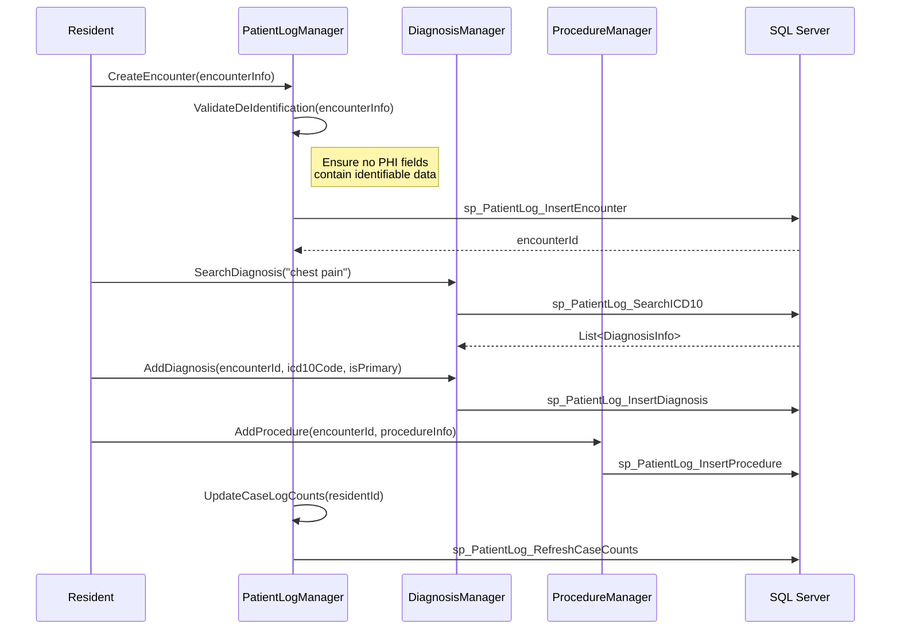
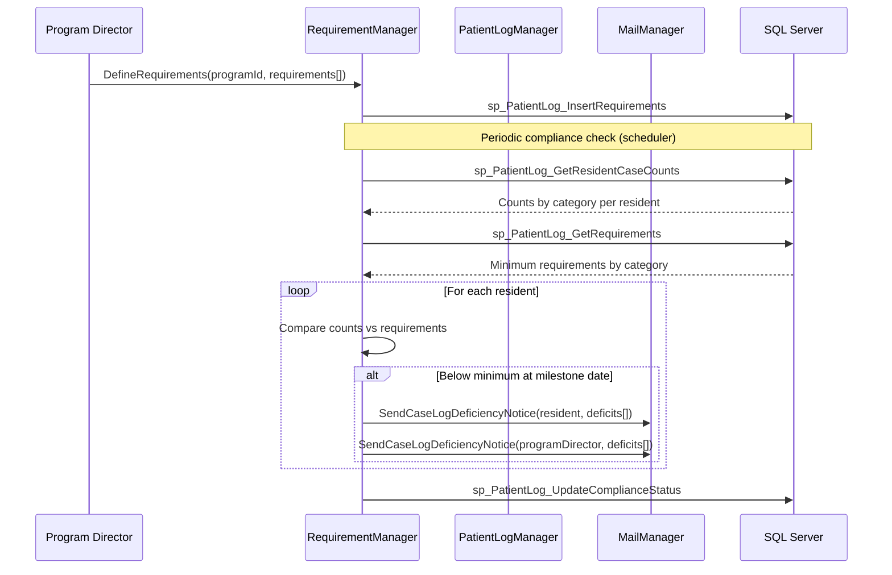
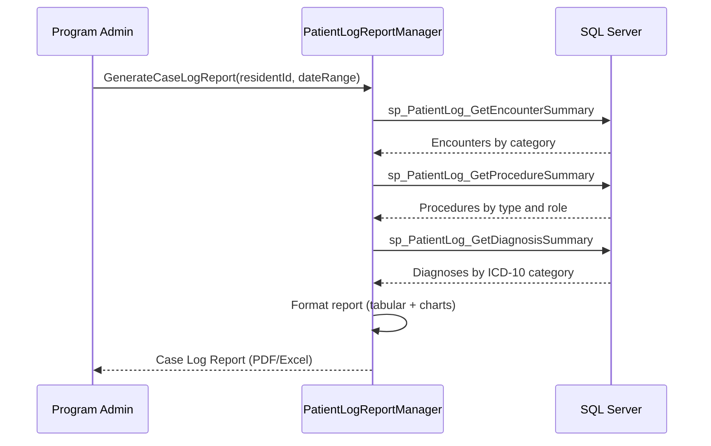
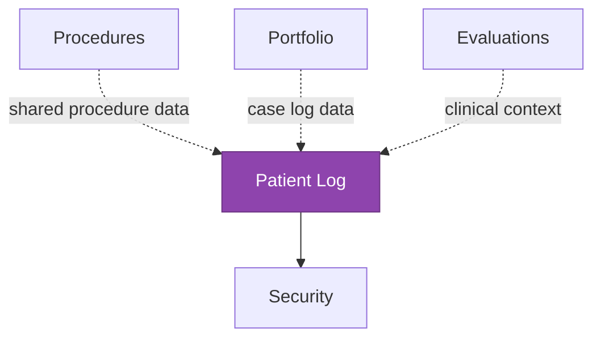

# Patient Log

<!-- Content will be enriched by AI parsing scripts -->

## Overview

The Patient Log module provides HIPAA-compliant patient encounter logging for medical trainees. Residents and fellows record their clinical encounters in a de-identified format to track procedural experience, diagnostic breadth, and case volume requirements mandated by residency review committees and specialty boards.

With 20+ classes, this module handles encounter entry (including diagnosis codes, procedures performed, patient demographics without PHI), case log requirement tracking per specialty, and reporting for program accreditation. All data is de-identified at the point of entry -- no patient names, MRNs, or other protected health information is stored.

### Key Responsibilities

- **Encounter Recording**: Log patient encounters with de-identified demographics, diagnoses (ICD-10), procedures, and clinical settings
- **Case Log Requirements**: Track minimum case volume requirements per specialty board and program
- **Procedure Tracking**: Record procedures performed or observed, linking to competency milestones
- **Diagnosis Code Management**: Maintain ICD-10 code sets and map diagnoses to specialty-specific categories
- **Reporting**: Generate case log reports for residency review committees, specialty boards, and ACGME
- **HIPAA Compliance**: Enforce de-identification at entry; no PHI stored in the system

## Key Classes

### Manager Classes

| Class | Namespace | Purpose |
|-------|-----------|---------|
| `PatientLogManager` | `MyEvaluations.Business.PatientLog` | Core encounter CRUD, search, and summary operations. |
| `PatientLogDiagnosisManager` | `MyEvaluations.Business.PatientLog` | ICD-10 code management, diagnosis search, and category mapping. |
| `PatientLogProcedureManager` | `MyEvaluations.Business.PatientLog` | Procedure recording linked to encounters, CPT code management. |
| `PatientLogRequirementManager` | `MyEvaluations.Business.PatientLog` | Case log requirement definitions per specialty and tracking against minimums. |
| `PatientLogReportManager` | `MyEvaluations.Business.PatientLog` | Case log reports, procedure summaries, and board-specific exports. |

### Info (DTO) Classes

| Class | Purpose |
|-------|---------|
| `PatientLogInfo` | Encounter record: date, setting (inpatient/outpatient/ED), de-identified demographics (age range, gender), role (primary/consultant), supervising attending. |
| `DiagnosisInfo` | Diagnosis entry: ICD-10 code, description, category, primary/secondary flag. |
| `PatientLogProcedureInfo` | Procedure performed: CPT code, description, role (performed/assisted/observed), supervision level. |
| `CaseRequirementInfo` | Requirement definition: specialty, procedure/diagnosis category, minimum count, time period. |
| `CaseLogSummaryInfo` | Summary statistics: category, count logged, minimum required, percentage complete. |
| `PatientLogSearchInfo` | Search criteria: date range, diagnosis, procedure, setting, attending. |

## Business Workflows

### Patient Encounter Logging

### Case Log Requirement Tracking

### Case Log Reporting

## Stored Procedure References

| Stored Procedure | Purpose |
|-----------------|---------|
| `sp_PatientLog_InsertEncounter` | Create new patient encounter record |
| `sp_PatientLog_UpdateEncounter` | Update existing encounter |
| `sp_PatientLog_SearchICD10` | Search ICD-10 codes by keyword |
| `sp_PatientLog_InsertDiagnosis` | Add diagnosis to encounter |
| `sp_PatientLog_InsertProcedure` | Add procedure to encounter |
| `sp_PatientLog_RefreshCaseCounts` | Recalculate case counts after new entry |
| `sp_PatientLog_InsertRequirements` | Define case log requirements |
| `sp_PatientLog_GetResidentCaseCounts` | Retrieve case counts by category |
| `sp_PatientLog_GetRequirements` | Retrieve case log requirements |
| `sp_PatientLog_UpdateComplianceStatus` | Update case log compliance status |
| `sp_PatientLog_GetEncounterSummary` | Summary data for reporting |
| `sp_PatientLog_GetProcedureSummary` | Procedure summary for reporting |
| `sp_PatientLog_GetDiagnosisSummary` | Diagnosis summary for reporting |

## Cross-Module Dependencies

### Dependency Details

| Direction | Module | Relationship |
|-----------|--------|-------------|
| Depends on | Security | Permission checks for encounter entry, report access, requirement management |
| Related to | Procedures | Shared procedure/competency taxonomy; procedures logged here contribute to procedure module totals |
| Depended on by | Portfolio | Case log summaries are included in resident portfolios |
| Related to | Evaluations | Clinical encounter context informs evaluation assignments |
