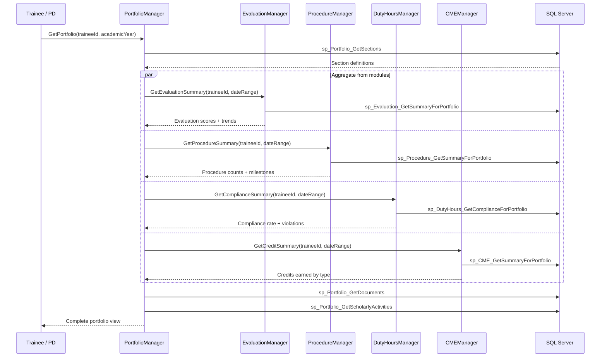
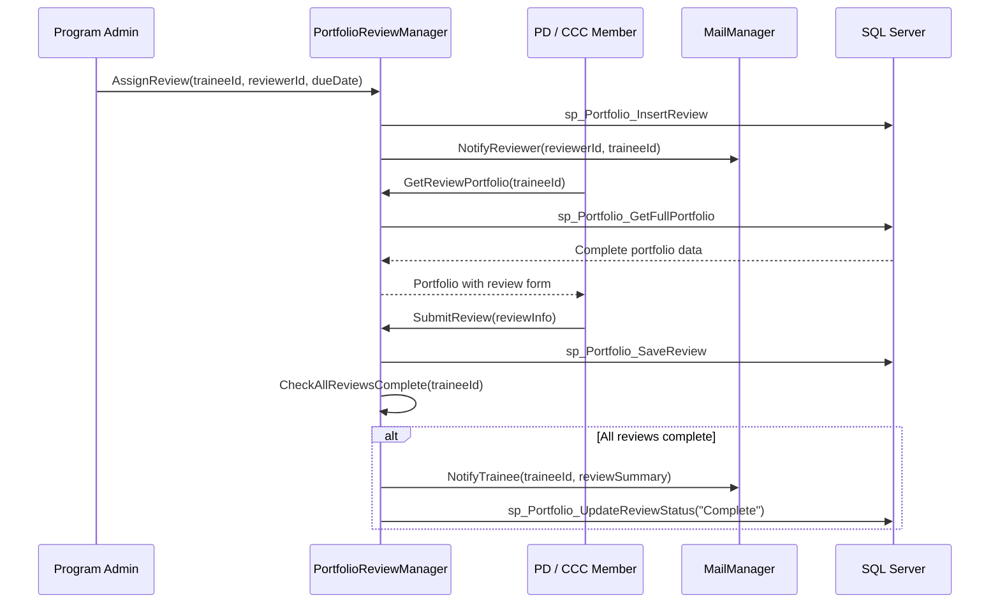
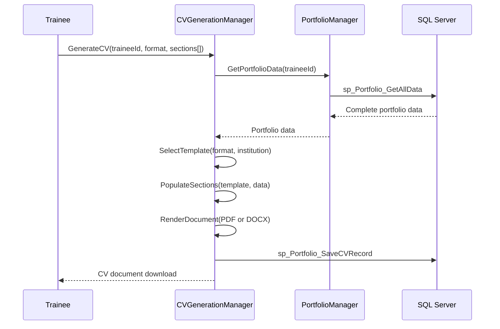
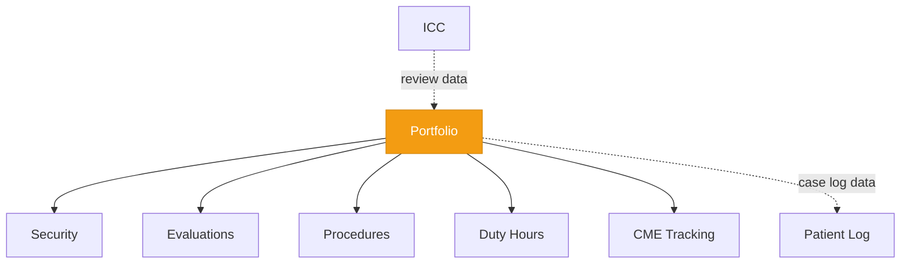

# Portfolio

<!-- Content will be enriched by AI parsing scripts -->

## Overview

The Portfolio module manages comprehensive trainee portfolios that aggregate data from across the MyEvaluations platform. A portfolio serves as the central repository for a resident's or fellow's training documentation, including evaluation summaries, procedure logs, scholarly activities, conference presentations, certifications, and uploaded documents.

Program directors and Clinical Competency Committees (CCCs) use portfolios during semi-annual reviews to assess overall trainee progress. The module also supports automated CV generation from portfolio data, which trainees use for fellowship applications, board certification, and credentialing.

### Key Responsibilities

- **Document Management**: Upload, categorize, and store training documents (certificates, letters, publications)
- **Scholarly Activity Tracking**: Track research projects, publications, presentations, and teaching activities
- **Portfolio Review Workflows**: Structured review processes for program directors and CCC members
- **Data Aggregation**: Pull evaluation summaries, procedure logs, duty hour compliance, and CME credits from other modules
- **CV Generation**: Automated CV creation from portfolio data in multiple formats
- **Milestone Integration**: Display milestone progression alongside supporting evidence

## Key Classes

### Manager Classes

| Class | Namespace | Purpose |
|-------|-----------|---------|
| `PortfolioManager` | `MyEvaluations.Business.Portfolio` | Core portfolio operations: creation, retrieval, section management, and data aggregation. |
| `PortfolioDocumentManager` | `MyEvaluations.Business.Portfolio` | Document upload, storage, categorization, and retrieval. |
| `ScholarlyActivityManager` | `MyEvaluations.Business.Portfolio` | Research, publications, presentations, and teaching activity tracking. |
| `PortfolioReviewManager` | `MyEvaluations.Business.Portfolio` | Review workflow: assignment, completion, feedback, sign-off. |
| `CVGenerationManager` | `MyEvaluations.Business.Portfolio` | Automated CV generation from portfolio data in configurable formats. |

### Info (DTO) Classes

| Class | Purpose |
|-------|---------|
| `PortfolioInfo` | Portfolio record: trainee, program, academic year, sections, review status. |
| `PortfolioDocumentInfo` | Document: file name, category, upload date, file size, storage path, description. |
| `ScholarlyActivityInfo` | Scholarly activity: type (research/publication/presentation/teaching), title, date, details, status. |
| `PortfolioReviewInfo` | Review record: reviewer, review date, overall assessment, comments, action items, sign-off status. |
| `PortfolioSectionInfo` | Section definition: name, data source (evaluation/procedure/duty-hours/custom), display order. |
| `CVInfo` | Generated CV: format (PDF/Word), sections included, generation date, download URL. |

## Business Workflows

### Portfolio Data Aggregation

### Portfolio Review Workflow

### CV Generation

## Stored Procedure References

| Stored Procedure | Purpose |
|-----------------|---------|
| `sp_Portfolio_GetSections` | Retrieve section definitions for a portfolio |
| `sp_Portfolio_GetDocuments` | Retrieve uploaded documents |
| `sp_Portfolio_GetScholarlyActivities` | Retrieve scholarly activities |
| `sp_Portfolio_InsertDocument` | Upload new document record |
| `sp_Portfolio_InsertScholarlyActivity` | Add scholarly activity |
| `sp_Portfolio_InsertReview` | Create portfolio review assignment |
| `sp_Portfolio_GetFullPortfolio` | Retrieve complete portfolio for review |
| `sp_Portfolio_SaveReview` | Save reviewer assessment and comments |
| `sp_Portfolio_UpdateReviewStatus` | Update overall review status |
| `sp_Portfolio_GetAllData` | Retrieve all portfolio data for CV generation |
| `sp_Portfolio_SaveCVRecord` | Record generated CV metadata |
| `sp_Evaluation_GetSummaryForPortfolio` | Evaluation summary for portfolio aggregation |
| `sp_Procedure_GetSummaryForPortfolio` | Procedure summary for portfolio aggregation |
| `sp_DutyHours_GetComplianceForPortfolio` | Duty hour compliance for portfolio |
| `sp_CME_GetSummaryForPortfolio` | CME credits for portfolio |

## Cross-Module Dependencies

### Dependency Details

| Direction | Module | Relationship |
|-----------|--------|-------------|
| Depends on | Security | Permission checks for portfolio access, document upload, review assignment |
| Depends on | Evaluations | Aggregates evaluation summaries and scores |
| Depends on | Procedures | Aggregates procedure logs and competency milestones |
| Depends on | Duty Hours | Aggregates duty hour compliance data |
| Depends on | CME Tracking | Aggregates CME credit summaries |
| Related to | Patient Log | Case log summaries contribute to portfolio |
| Depended on by | ICC | CCC committees access portfolios during semi-annual reviews |
