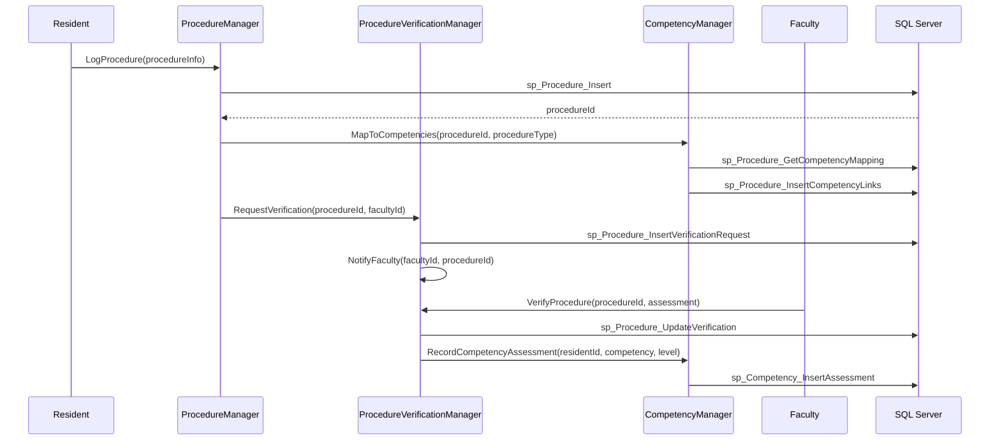
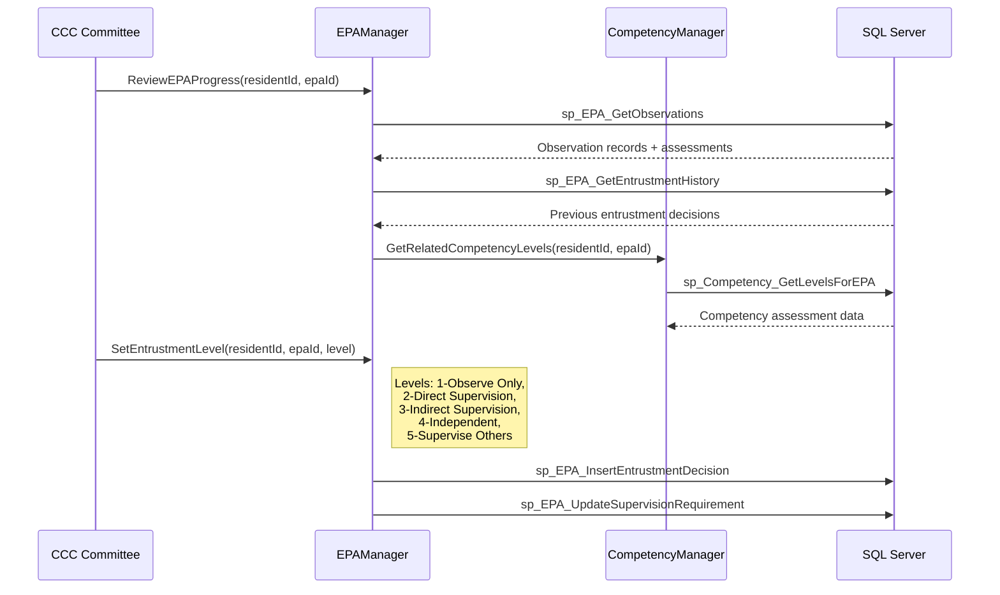
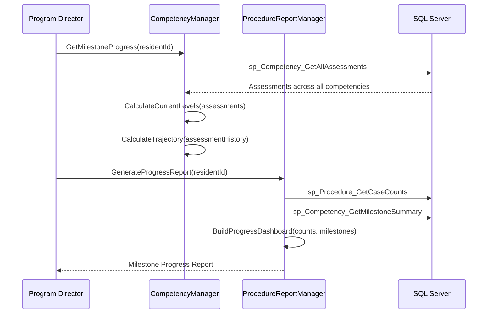
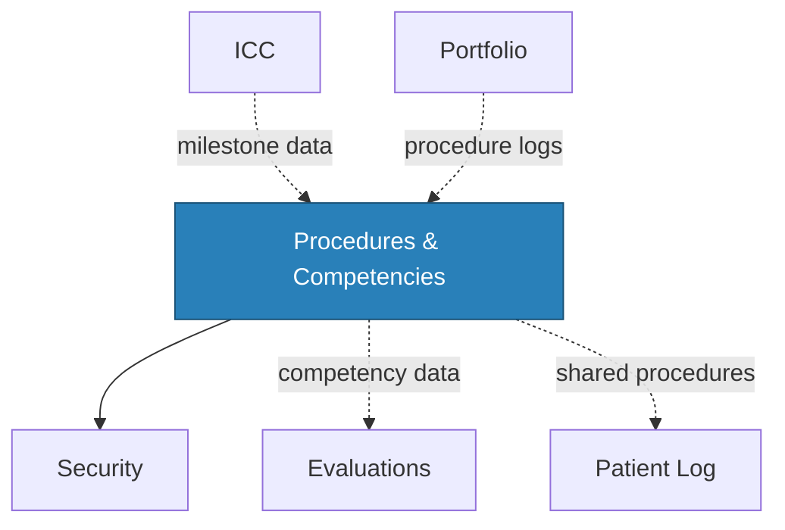

# Procedures & Competencies

<!-- Content will be enriched by AI parsing scripts -->

## Overview

The Procedures module tracks trainee competency development through procedure logging, milestone assessments, and Entrustable Professional Activity (EPA) tracking. With 30+ classes, this module provides a comprehensive view of a trainee's procedural skills development throughout their training program.

Unlike the Patient Log module (which focuses on encounter recording), the Procedures module centers on competency assessment -- tracking not just what procedures were performed but the trainee's level of competence, supervision requirements, and progression toward independent practice.

### Key Responsibilities

- **Procedure Logging**: Record procedures with supervision level, complexity, outcome, and competency assessment
- **Competency Milestones**: Track ACGME milestone progression across six core competencies and specialty-specific sub-competencies
- **EPA Tracking**: Manage Entrustable Professional Activities with entrustment decisions and progression
- **Minimum Case Requirements**: Enforce specialty board minimum procedure volume requirements
- **Verification Workflow**: Faculty verification and attestation of procedure performance
- **Competency Dashboards**: Visual progression tracking with trend analysis

### ACGME Core Competencies

| Competency | Abbreviation | Description |
|-----------|-------------|-------------|
| Patient Care | PC | Clinical skills and patient management |
| Medical Knowledge | MK | Biomedical, clinical, and social sciences |
| Practice-Based Learning | PBLI | Self-assessment and continuous improvement |
| Interpersonal and Communication Skills | ICS | Communication with patients, families, teams |
| Professionalism | PROF | Ethical behavior and commitment to responsibilities |
| Systems-Based Practice | SBP | Healthcare system awareness and resource utilization |

## Key Classes

### Manager Classes

| Class | Namespace | Purpose |
|-------|-----------|---------|
| `ProcedureManager` | `MyEvaluations.Business.Procedures` | Core procedure logging CRUD, search, and summary operations. |
| `CompetencyManager` | `MyEvaluations.Business.Procedures` | Competency definition management, milestone tracking, and level assessments. |
| `EPAManager` | `MyEvaluations.Business.Procedures` | EPA definition, entrustment tracking, and supervision requirement mapping. |
| `ProcedureVerificationManager` | `MyEvaluations.Business.Procedures` | Faculty verification workflow for logged procedures. |
| `ProcedureRequirementManager` | `MyEvaluations.Business.Procedures` | Minimum case requirement definition and compliance tracking. |
| `ProcedureReportManager` | `MyEvaluations.Business.Procedures` | Procedure log reports, competency dashboards, and milestone progression reports. |
| `CompetencyMappingManager` | `MyEvaluations.Business.Procedures` | Maps procedures to ACGME competencies and milestones. |

### Info (DTO) Classes

| Class | Purpose |
|-------|---------|
| `ProcedureInfo` | Procedure record: procedure type, date, patient setting, role, supervision level, complexity, outcome. |
| `CompetencyInfo` | Competency definition: core competency, sub-competency, milestone levels (1-5), descriptors. |
| `EPAInfo` | EPA definition: title, description, entrustment levels, required observations, associated competencies. |
| `ProcedureVerificationInfo` | Verification record: procedure, verifying faculty, verification date, comments, attestation. |
| `CompetencyAssessmentInfo` | Assessment record: trainee, competency, assessed level, assessor, date, evidence references. |
| `ProcedureRequirementInfo` | Requirement: procedure category, minimum count, time period, specialty board source. |
| `CompetencyProgressInfo` | Progress tracking: trainee, competency, current level, trajectory, assessments over time. |

## Business Workflows

### Procedure Logging and Verification

### EPA Entrustment Workflow

### Milestone Progression Tracking

## Stored Procedure References

| Stored Procedure | Purpose |
|-----------------|---------|
| `sp_Procedure_Insert` | Log a new procedure |
| `sp_Procedure_Update` | Update procedure details |
| `sp_Procedure_GetCompetencyMapping` | Get competency mappings for a procedure type |
| `sp_Procedure_InsertCompetencyLinks` | Link procedure to competencies |
| `sp_Procedure_InsertVerificationRequest` | Create faculty verification request |
| `sp_Procedure_UpdateVerification` | Record faculty verification |
| `sp_Procedure_GetCaseCounts` | Get procedure counts by category |
| `sp_Competency_InsertAssessment` | Record competency assessment |
| `sp_Competency_GetLevelsForEPA` | Get competency levels for EPA review |
| `sp_Competency_GetAllAssessments` | Get all assessments for milestone tracking |
| `sp_Competency_GetMilestoneSummary` | Summary data for milestone reports |
| `sp_EPA_GetObservations` | Retrieve EPA observations |
| `sp_EPA_GetEntrustmentHistory` | Retrieve entrustment decision history |
| `sp_EPA_InsertEntrustmentDecision` | Record entrustment level decision |
| `sp_EPA_UpdateSupervisionRequirement` | Update required supervision level |

## Cross-Module Dependencies

### Dependency Details

| Direction | Module | Relationship |
|-----------|--------|-------------|
| Depends on | Security | Permission checks for procedure logging, verification, and reporting |
| Related to | Evaluations | Competency assessments from evaluations feed into milestone tracking |
| Related to | Patient Log | Procedures logged in patient encounters contribute to procedure counts |
| Depended on by | ICC | CCC reviews consume milestone and competency data |
| Depended on by | Portfolio | Procedure logs and competency summaries included in portfolios |
