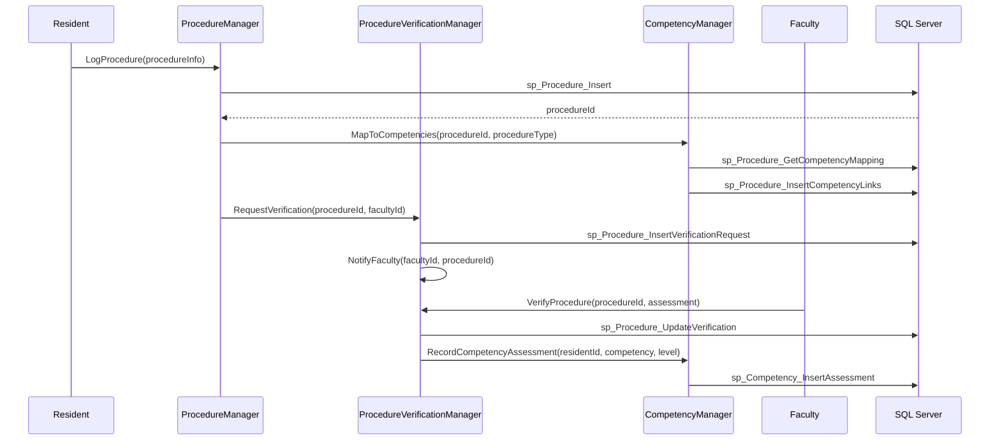
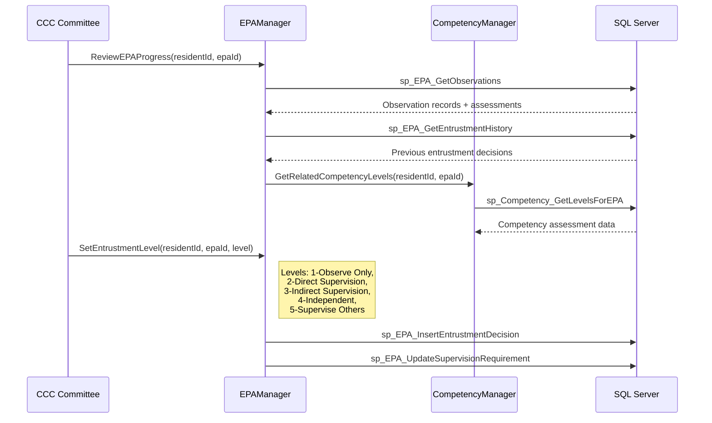
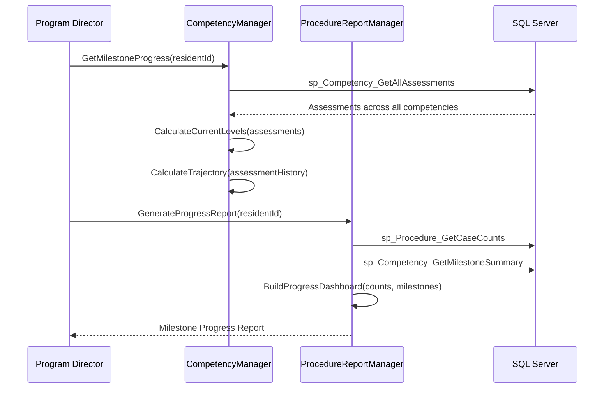
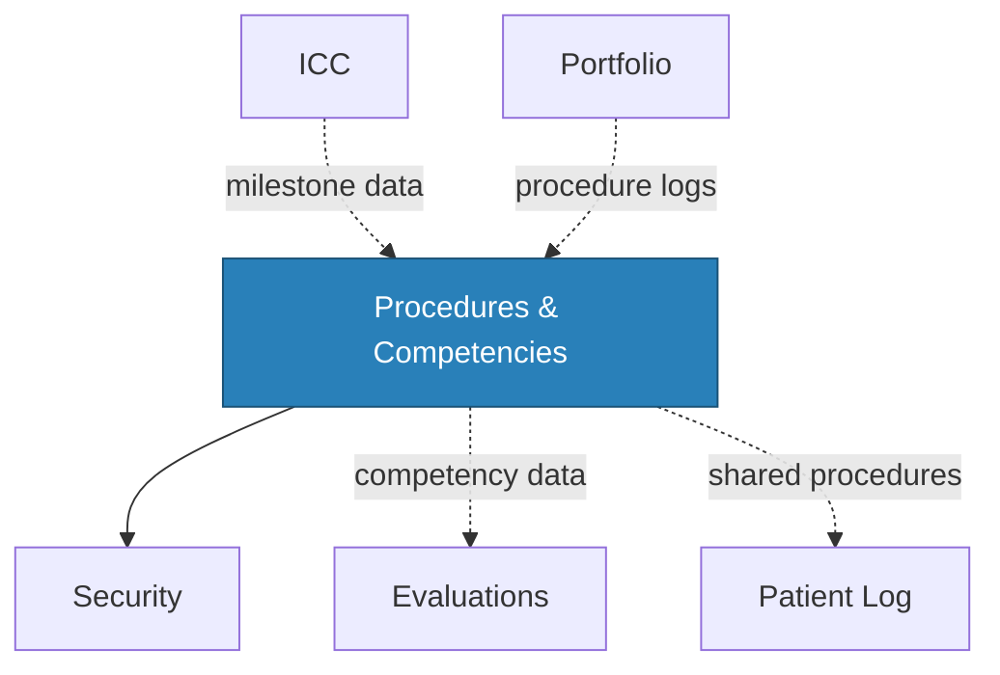

import DependentsPanel from '@site/src/components/DependentsPanel';

# Procedures & Competencies

<!-- Content will be enriched by AI parsing scripts -->

## Overview

The Procedures module tracks trainee competency development through procedure logging, milestone assessments, and Entrustable Professional Activity (EPA) tracking. With 30+ classes, this module provides a comprehensive view of a trainee's procedural skills development throughout their training program.

Unlike the Patient Log module (which focuses on encounter recording), the Procedures module centers on competency assessment -- tracking not just what procedures were performed but the trainee's level of competence, supervision requirements, and progression toward independent practice.

### Key Responsibilities

- **Procedure Logging**: Record procedures with supervision level, complexity, outcome, and competency assessment
- **Competency Milestones**: Track ACGME milestone progression across six core competencies and specialty-specific sub-competencies
- **EPA Tracking**: Manage Entrustable Professional Activities with entrustment decisions and progression
- **Minimum Case Requirements**: Enforce specialty board minimum procedure volume requirements
- **Verification Workflow**: Faculty verification and attestation of procedure performance
- **Competency Dashboards**: Visual progression tracking with trend analysis

### ACGME Core Competencies

| Competency | Abbreviation | Description |
|-----------|-------------|-------------|
| Patient Care | PC | Clinical skills and patient management |
| Medical Knowledge | MK | Biomedical, clinical, and social sciences |
| Practice-Based Learning | PBLI | Self-assessment and continuous improvement |
| Interpersonal and Communication Skills | ICS | Communication with patients, families, teams |
| Professionalism | PROF | Ethical behavior and commitment to responsibilities |
| Systems-Based Practice | SBP | Healthcare system awareness and resource utilization |

## Key Classes

### Manager Classes

| Class | Namespace | Purpose |
|-------|-----------|---------|
| `ProcedureManager` | `MyEvaluations.Business.Procedures` | Core procedure logging CRUD, search, and summary operations. |
| `CompetencyManager` | `MyEvaluations.Business.Procedures` | Competency definition management, milestone tracking, and level assessments. |
| `EPAManager` | `MyEvaluations.Business.Procedures` | EPA definition, entrustment tracking, and supervision requirement mapping. |
| `ProcedureVerificationManager` | `MyEvaluations.Business.Procedures` | Faculty verification workflow for logged procedures. |
| `ProcedureRequirementManager` | `MyEvaluations.Business.Procedures` | Minimum case requirement definition and compliance tracking. |
| `ProcedureReportManager` | `MyEvaluations.Business.Procedures` | Procedure log reports, competency dashboards, and milestone progression reports. |
| `CompetencyMappingManager` | `MyEvaluations.Business.Procedures` | Maps procedures to ACGME competencies and milestones. |

### Info (DTO) Classes

| Class | Purpose |
|-------|---------|
| `ProcedureInfo` | Procedure record: procedure type, date, patient setting, role, supervision level, complexity, outcome. |
| `CompetencyInfo` | Competency definition: core competency, sub-competency, milestone levels (1-5), descriptors. |
| `EPAInfo` | EPA definition: title, description, entrustment levels, required observations, associated competencies. |
| `ProcedureVerificationInfo` | Verification record: procedure, verifying faculty, verification date, comments, attestation. |
| `CompetencyAssessmentInfo` | Assessment record: trainee, competency, assessed level, assessor, date, evidence references. |
| `ProcedureRequirementInfo` | Requirement: procedure category, minimum count, time period, specialty board source. |
| `CompetencyProgressInfo` | Progress tracking: trainee, competency, current level, trajectory, assessments over time. |

## Business Workflows

### Procedure Logging and Verification

### EPA Entrustment Workflow

### Milestone Progression Tracking

## Stored Procedure References

| Stored Procedure | Purpose |
|-----------------|---------|
| `sp_Procedure_Insert` | Log a new procedure |
| `sp_Procedure_Update` | Update procedure details |
| `sp_Procedure_GetCompetencyMapping` | Get competency mappings for a procedure type |
| `sp_Procedure_InsertCompetencyLinks` | Link procedure to competencies |
| `sp_Procedure_InsertVerificationRequest` | Create faculty verification request |
| `sp_Procedure_UpdateVerification` | Record faculty verification |
| `sp_Procedure_GetCaseCounts` | Get procedure counts by category |
| `sp_Competency_InsertAssessment` | Record competency assessment |
| `sp_Competency_GetLevelsForEPA` | Get competency levels for EPA review |
| `sp_Competency_GetAllAssessments` | Get all assessments for milestone tracking |
| `sp_Competency_GetMilestoneSummary` | Summary data for milestone reports |
| `sp_EPA_GetObservations` | Retrieve EPA observations |
| `sp_EPA_GetEntrustmentHistory` | Retrieve entrustment decision history |
| `sp_EPA_InsertEntrustmentDecision` | Record entrustment level decision |
| `sp_EPA_UpdateSupervisionRequirement` | Update required supervision level |

## Cross-Module Dependencies

### Dependency Details

| Direction | Module | Relationship |
|-----------|--------|-------------|
| Depends on | Security | Permission checks for procedure logging, verification, and reporting |
| Related to | Evaluations | Competency assessments from evaluations feed into milestone tracking |
| Related to | Patient Log | Procedures logged in patient encounters contribute to procedure counts |
| Depended on by | ICC | CCC reviews consume milestone and competency data |
| Depended on by | Portfolio | Procedure logs and competency summaries included in portfolios |

{/* DEPENDENTS-PANEL:START */}
<DependentsPanel
  module="Procedures"
  webDependents={[
  {
    "fileName": "AssignEvaluations.aspx.cs",
    "filePath": "Web/BSNProgram/AssignEvaluations.aspx.cs",
    "directory": "Web/BSNProgram",
    "module": "BSNProgram"
  },
  {
    "fileName": "BSNProgramActivities.aspx.cs",
    "filePath": "Web/BSNProgram/BSNProgramActivities.aspx.cs",
    "directory": "Web/BSNProgram",
    "module": "BSNProgram"
  },
  {
    "fileName": "ExportBSNSalesforceData.aspx.cs",
    "filePath": "Web/BSNProgram/ExportBSNSalesforceData.aspx.cs",
    "directory": "Web/BSNProgram",
    "module": "BSNProgram"
  },
  {
    "fileName": "AddEditManageSessionNames.aspx.cs",
    "filePath": "Web/EssentialActivities/AddEditManageSessionNames.aspx.cs",
    "directory": "Web/EssentialActivities",
    "module": "EssentialActivities"
  },
  {
    "fileName": "AdminLog.aspx.cs",
    "filePath": "Web/EssentialActivities/AdminLog.aspx.cs",
    "directory": "Web/EssentialActivities",
    "module": "EssentialActivities"
  },
  {
    "fileName": "AssignCourses.aspx.cs",
    "filePath": "Web/EssentialActivities/AssignCourses.aspx.cs",
    "directory": "Web/EssentialActivities",
    "module": "EssentialActivities"
  },
  {
    "fileName": "AssignFNPEvaluations.aspx.cs",
    "filePath": "Web/EssentialActivities/AssignFNPEvaluations.aspx.cs",
    "directory": "Web/EssentialActivities",
    "module": "EssentialActivities"
  },
  {
    "fileName": "AssignFNPVoluntaryEvaluations.aspx.cs",
    "filePath": "Web/EssentialActivities/AssignFNPVoluntaryEvaluations.aspx.cs",
    "directory": "Web/EssentialActivities",
    "module": "EssentialActivities"
  },
  {
    "fileName": "AssignSessionCourses.aspx.cs",
    "filePath": "Web/EssentialActivities/AssignSessionCourses.aspx.cs",
    "directory": "Web/EssentialActivities",
    "module": "EssentialActivities"
  },
  {
    "fileName": "ClincalAlternativeLogs.aspx.cs",
    "filePath": "Web/EssentialActivities/ClincalAlternativeLogs.aspx.cs",
    "directory": "Web/EssentialActivities",
    "module": "EssentialActivities"
  },
  {
    "fileName": "ClinicalLogDataExport.aspx.cs",
    "filePath": "Web/EssentialActivities/ClinicalLogDataExport.aspx.cs",
    "directory": "Web/EssentialActivities",
    "module": "EssentialActivities"
  },
  {
    "fileName": "ClinicalLogReviews.aspx.cs",
    "filePath": "Web/EssentialActivities/ClinicalLogReviews.aspx.cs",
    "directory": "Web/EssentialActivities",
    "module": "EssentialActivities"
  },
  {
    "fileName": "ClinicalPerformanceImprovementPlan.aspx.cs",
    "filePath": "Web/EssentialActivities/ClinicalPerformanceImprovementPlan.aspx.cs",
    "directory": "Web/EssentialActivities",
    "module": "EssentialActivities"
  },
  {
    "fileName": "CourseObjectiveReport.aspx.cs",
    "filePath": "Web/EssentialActivities/CourseObjectiveReport.aspx.cs",
    "directory": "Web/EssentialActivities",
    "module": "EssentialActivities"
  },
  {
    "fileName": "DNPLogForm.aspx.cs",
    "filePath": "Web/EssentialActivities/DNPLogForm.aspx.cs",
    "directory": "Web/EssentialActivities",
    "module": "EssentialActivities"
  },
  {
    "fileName": "DNPReport.aspx.cs",
    "filePath": "Web/EssentialActivities/DNPReport.aspx.cs",
    "directory": "Web/EssentialActivities",
    "module": "EssentialActivities"
  },
  {
    "fileName": "DNPReportResults.aspx.cs",
    "filePath": "Web/EssentialActivities/DNPReportResults.aspx.cs",
    "directory": "Web/EssentialActivities",
    "module": "EssentialActivities"
  },
  {
    "fileName": "DevClinicalLogReviews.aspx.cs",
    "filePath": "Web/EssentialActivities/DevClinicalLogReviews.aspx.cs",
    "directory": "Web/EssentialActivities",
    "module": "EssentialActivities"
  },
  {
    "fileName": "DevFNPRecords.aspx.cs",
    "filePath": "Web/EssentialActivities/DevFNPRecords.aspx.cs",
    "directory": "Web/EssentialActivities",
    "module": "EssentialActivities"
  },
  {
    "fileName": "EditAdmin.aspx.cs",
    "filePath": "Web/EssentialActivities/EditAdmin.aspx.cs",
    "directory": "Web/EssentialActivities",
    "module": "EssentialActivities"
  },
  {
    "fileName": "EssentialActivitiesMain.aspx.cs",
    "filePath": "Web/EssentialActivities/EssentialActivitiesMain.aspx.cs",
    "directory": "Web/EssentialActivities",
    "module": "EssentialActivities"
  },
  {
    "fileName": "EvaluationsAssignments.aspx.cs",
    "filePath": "Web/EssentialActivities/EvaluationsAssignments.aspx.cs",
    "directory": "Web/EssentialActivities",
    "module": "EssentialActivities"
  },
  {
    "fileName": "ExportFNPSalesForceData.aspx.cs",
    "filePath": "Web/EssentialActivities/ExportFNPSalesForceData.aspx.cs",
    "directory": "Web/EssentialActivities",
    "module": "EssentialActivities"
  },
  {
    "fileName": "ExportSalesForceData.aspx.cs",
    "filePath": "Web/EssentialActivities/ExportSalesForceData.aspx.cs",
    "directory": "Web/EssentialActivities",
    "module": "EssentialActivities"
  },
  {
    "fileName": "FNPClinicalLogForm.aspx.cs",
    "filePath": "Web/EssentialActivities/FNPClinicalLogForm.aspx.cs",
    "directory": "Web/EssentialActivities",
    "module": "EssentialActivities"
  },
  {
    "fileName": "FNPRecords.aspx.cs",
    "filePath": "Web/EssentialActivities/FNPRecords.aspx.cs",
    "directory": "Web/EssentialActivities",
    "module": "EssentialActivities"
  },
  {
    "fileName": "FNPReport.aspx.cs",
    "filePath": "Web/EssentialActivities/FNPReport.aspx.cs",
    "directory": "Web/EssentialActivities",
    "module": "EssentialActivities"
  },
  {
    "fileName": "FNPReportResults.aspx.cs",
    "filePath": "Web/EssentialActivities/FNPReportResults.aspx.cs",
    "directory": "Web/EssentialActivities",
    "module": "EssentialActivities"
  },
  {
    "fileName": "PreceptorHoursMarketingReport.aspx.cs",
    "filePath": "Web/EssentialActivities/FNPReports/PreceptorHoursMarketingReport.aspx.cs",
    "directory": "Web/EssentialActivities",
    "module": "EssentialActivities"
  },
  {
    "fileName": "PreceptorHoursReport.aspx.cs",
    "filePath": "Web/EssentialActivities/FNPReports/PreceptorHoursReport.aspx.cs",
    "directory": "Web/EssentialActivities",
    "module": "EssentialActivities"
  },
  {
    "fileName": "StudentTallyReport.aspx.cs",
    "filePath": "Web/EssentialActivities/FNPReports/StudentTallyReport.aspx.cs",
    "directory": "Web/EssentialActivities",
    "module": "EssentialActivities"
  },
  {
    "fileName": "FacultyEvaluationAndPreceptorReport.aspx.cs",
    "filePath": "Web/EssentialActivities/FacultyEvaluationAndPreceptorReport.aspx.cs",
    "directory": "Web/EssentialActivities",
    "module": "EssentialActivities"
  },
  {
    "fileName": "FacultyEvaluationReport.aspx.cs",
    "filePath": "Web/EssentialActivities/FacultyEvaluationReport.aspx.cs",
    "directory": "Web/EssentialActivities",
    "module": "EssentialActivities"
  },
  {
    "fileName": "FacultyLog.aspx.cs",
    "filePath": "Web/EssentialActivities/FacultyLog.aspx.cs",
    "directory": "Web/EssentialActivities",
    "module": "EssentialActivities"
  },
  {
    "fileName": "FnpManualImport.aspx.cs",
    "filePath": "Web/EssentialActivities/FnpManualImport.aspx.cs",
    "directory": "Web/EssentialActivities",
    "module": "EssentialActivities"
  },
  {
    "fileName": "ImportBannerData.aspx.cs",
    "filePath": "Web/EssentialActivities/ImportBannerData.aspx.cs",
    "directory": "Web/EssentialActivities",
    "module": "EssentialActivities"
  },
  {
    "fileName": "ImportFNPData.aspx.cs",
    "filePath": "Web/EssentialActivities/ImportFNPData.aspx.cs",
    "directory": "Web/EssentialActivities",
    "module": "EssentialActivities"
  },
  {
    "fileName": "IsDeleteActivity.aspx.cs",
    "filePath": "Web/EssentialActivities/IsDeleteActivity.aspx.cs",
    "directory": "Web/EssentialActivities",
    "module": "EssentialActivities"
  },
  {
    "fileName": "LedgerofEvaluations.aspx.cs",
    "filePath": "Web/EssentialActivities/LedgerofEvaluations.aspx.cs",
    "directory": "Web/EssentialActivities",
    "module": "EssentialActivities"
  },
  {
    "fileName": "LinkEvaluationtoCourses.aspx.cs",
    "filePath": "Web/EssentialActivities/LinkEvaluationtoCourses.aspx.cs",
    "directory": "Web/EssentialActivities",
    "module": "EssentialActivities"
  },
  {
    "fileName": "ManageCoursesNames.aspx.cs",
    "filePath": "Web/EssentialActivities/ManageCoursesNames.aspx.cs",
    "directory": "Web/EssentialActivities",
    "module": "EssentialActivities"
  },
  {
    "fileName": "ManageDetailedLogActivities.aspx.cs",
    "filePath": "Web/EssentialActivities/ManageDetailedLogActivities.aspx.cs",
    "directory": "Web/EssentialActivities",
    "module": "EssentialActivities"
  },
  {
    "fileName": "ManageEssentialActivities.aspx.cs",
    "filePath": "Web/EssentialActivities/ManageEssentialActivities.aspx.cs",
    "directory": "Web/EssentialActivities",
    "module": "EssentialActivities"
  },
  {
    "fileName": "ManageFNPEvaluationAssignments.aspx.cs",
    "filePath": "Web/EssentialActivities/ManageFNPEvaluationAssignments.aspx.cs",
    "directory": "Web/EssentialActivities",
    "module": "EssentialActivities"
  },
  {
    "fileName": "ManageGroupSessions.aspx.cs",
    "filePath": "Web/EssentialActivities/ManageGroupSessions.aspx.cs",
    "directory": "Web/EssentialActivities",
    "module": "EssentialActivities"
  },
  {
    "fileName": "ManageLogActivities.aspx.cs",
    "filePath": "Web/EssentialActivities/ManageLogActivities.aspx.cs",
    "directory": "Web/EssentialActivities",
    "module": "EssentialActivities"
  },
  {
    "fileName": "ManageLogActivitiesandRoster.aspx.cs",
    "filePath": "Web/EssentialActivities/ManageLogActivitiesandRoster.aspx.cs",
    "directory": "Web/EssentialActivities",
    "module": "EssentialActivities"
  },
  {
    "fileName": "ManagePIPAssignmentUsers.aspx.cs",
    "filePath": "Web/EssentialActivities/ManagePIPAssignmentUsers.aspx.cs",
    "directory": "Web/EssentialActivities",
    "module": "EssentialActivities"
  },
  {
    "fileName": "ManagePIPEvaluationAssignments.aspx.cs",
    "filePath": "Web/EssentialActivities/ManagePIPEvaluationAssignments.aspx.cs",
    "directory": "Web/EssentialActivities",
    "module": "EssentialActivities"
  },
  {
    "fileName": "ManageSessionCourses.aspx.cs",
    "filePath": "Web/EssentialActivities/ManageSessionCourses.aspx.cs",
    "directory": "Web/EssentialActivities",
    "module": "EssentialActivities"
  },
  {
    "fileName": "ManageSessionNames.aspx.cs",
    "filePath": "Web/EssentialActivities/ManageSessionNames.aspx.cs",
    "directory": "Web/EssentialActivities",
    "module": "EssentialActivities"
  },
  {
    "fileName": "ManageStudentLogDetails.aspx.cs",
    "filePath": "Web/EssentialActivities/ManageStudentLogDetails.aspx.cs",
    "directory": "Web/EssentialActivities",
    "module": "EssentialActivities"
  },
  {
    "fileName": "PIPReport.aspx.cs",
    "filePath": "Web/EssentialActivities/PIPReport.aspx.cs",
    "directory": "Web/EssentialActivities",
    "module": "EssentialActivities"
  },
  {
    "fileName": "SchedulerSetup.aspx.cs",
    "filePath": "Web/EssentialActivities/SchedulerSetup.aspx.cs",
    "directory": "Web/EssentialActivities",
    "module": "EssentialActivities"
  },
  {
    "fileName": "StudentEvaluationReport.aspx.cs",
    "filePath": "Web/EssentialActivities/StudentEvaluationReport.aspx.cs",
    "directory": "Web/EssentialActivities",
    "module": "EssentialActivities"
  },
  {
    "fileName": "AddAPEDefaultCaseLogCategories.aspx.cs",
    "filePath": "Web/Evaluations/AddAPEDefaultCaseLogCategories.aspx.cs",
    "directory": "Web/Evaluations",
    "module": "Evaluations"
  },
  {
    "fileName": "EvaluationsToReview.aspx.cs",
    "filePath": "Web/Evaluations/EvaluationsToReview.aspx.cs",
    "directory": "Web/Evaluations",
    "module": "Evaluations"
  },
  {
    "fileName": "EvaluationsToSign.aspx.cs",
    "filePath": "Web/Evaluations/EvaluationsToSign.aspx.cs",
    "directory": "Web/Evaluations",
    "module": "Evaluations"
  },
  {
    "fileName": "ManageMilestones.aspx.cs",
    "filePath": "Web/Evaluations/ManageMilestones.aspx.cs",
    "directory": "Web/Evaluations",
    "module": "Evaluations"
  },
  {
    "fileName": "ManageMilestonesBeta.aspx.cs",
    "filePath": "Web/Evaluations/ManageMilestonesBeta.aspx.cs",
    "directory": "Web/Evaluations",
    "module": "Evaluations"
  },
  {
    "fileName": "ManageOutcomes.aspx.cs",
    "filePath": "Web/Evaluations/ManageOutcomes.aspx.cs",
    "directory": "Web/Evaluations",
    "module": "Evaluations"
  },
  {
    "fileName": "ManageOutcomesBeta.aspx.cs",
    "filePath": "Web/Evaluations/ManageOutcomesBeta.aspx.cs",
    "directory": "Web/Evaluations",
    "module": "Evaluations"
  },
  {
    "fileName": "ManageOutcomesBeta1.aspx.cs",
    "filePath": "Web/Evaluations/ManageOutcomesBeta1.aspx.cs",
    "directory": "Web/Evaluations",
    "module": "Evaluations"
  },
  {
    "fileName": "ManageRotationRequirements.aspx.cs",
    "filePath": "Web/Evaluations/ManageRotationRequirements.aspx.cs",
    "directory": "Web/Evaluations",
    "module": "Evaluations"
  },
  {
    "fileName": "AjaxOperations.aspx.cs",
    "filePath": "Web/PatientLog/AjaxOperations.aspx.cs",
    "directory": "Web/PatientLog",
    "module": "PatientLog"
  },
  {
    "fileName": "ManagePatientLogs.aspx.cs",
    "filePath": "Web/PatientLog/ManagePatientLogs.aspx.cs",
    "directory": "Web/PatientLog",
    "module": "PatientLog"
  },
  {
    "fileName": "SubmitPatientLog.aspx.cs",
    "filePath": "Web/PatientLog/SubmitPatientLog.aspx.cs",
    "directory": "Web/PatientLog",
    "module": "PatientLog"
  },
  {
    "fileName": "AccountApplicationDeniedReason.aspx.cs",
    "filePath": "Web/Procedures/AccountApplicationDeniedReason.aspx.cs",
    "directory": "Web/Procedures",
    "module": "Procedures"
  },
  {
    "fileName": "AccountApplications.aspx.cs",
    "filePath": "Web/Procedures/AccountApplications.aspx.cs",
    "directory": "Web/Procedures",
    "module": "Procedures"
  },
  {
    "fileName": "AddLevelOfParticipation.aspx.cs",
    "filePath": "Web/Procedures/AddLevelOfParticipation.aspx.cs",
    "directory": "Web/Procedures",
    "module": "Procedures"
  },
  {
    "fileName": "AddSupervisionRequirement.aspx.cs",
    "filePath": "Web/Procedures/AddSupervisionRequirement.aspx.cs",
    "directory": "Web/Procedures",
    "module": "Procedures"
  },
  {
    "fileName": "AjaxOperations.aspx.cs",
    "filePath": "Web/Procedures/AjaxOperations.aspx.cs",
    "directory": "Web/Procedures",
    "module": "Procedures"
  },
  {
    "fileName": "CustomField.aspx.cs",
    "filePath": "Web/Procedures/CustomField.aspx.cs",
    "directory": "Web/Procedures",
    "module": "Procedures"
  },
  {
    "fileName": "DeleteProcedure.aspx.cs",
    "filePath": "Web/Procedures/DeleteProcedure.aspx.cs",
    "directory": "Web/Procedures",
    "module": "Procedures"
  },
  {
    "fileName": "DetailedProcedureExport.aspx.cs",
    "filePath": "Web/Procedures/DetailedProcedureExport.aspx.cs",
    "directory": "Web/Procedures",
    "module": "Procedures"
  },
  {
    "fileName": "DetailedProcedureExporting.aspx.cs",
    "filePath": "Web/Procedures/DetailedProcedureExporting.aspx.cs",
    "directory": "Web/Procedures",
    "module": "Procedures"
  },
  {
    "fileName": "EditSupervisionRequirement.aspx.cs",
    "filePath": "Web/Procedures/EditSupervisionRequirement.aspx.cs",
    "directory": "Web/Procedures",
    "module": "Procedures"
  },
  {
    "fileName": "Error.aspx.cs",
    "filePath": "Web/Procedures/Error.aspx.cs",
    "directory": "Web/Procedures",
    "module": "Procedures"
  },
  {
    "fileName": "ErrorCategory.aspx.cs",
    "filePath": "Web/Procedures/ErrorCategory.aspx.cs",
    "directory": "Web/Procedures",
    "module": "Procedures"
  },
  {
    "fileName": "HowTo.aspx.cs",
    "filePath": "Web/Procedures/HowTo.aspx.cs",
    "directory": "Web/Procedures",
    "module": "Procedures"
  },
  {
    "fileName": "ImportProcedures.aspx.cs",
    "filePath": "Web/Procedures/ImportProcedures.aspx.cs",
    "directory": "Web/Procedures",
    "module": "Procedures"
  },
  {
    "fileName": "ImportedProcedureDetails.aspx.cs",
    "filePath": "Web/Procedures/ImportedProcedureDetails.aspx.cs",
    "directory": "Web/Procedures",
    "module": "Procedures"
  },
  {
    "fileName": "ManageCustomFields.aspx.cs",
    "filePath": "Web/Procedures/ManageCustomFields.aspx.cs",
    "directory": "Web/Procedures",
    "module": "Procedures"
  },
  {
    "fileName": "ManageCustomFieldsPG2.aspx.cs",
    "filePath": "Web/Procedures/ManageCustomFieldsPG2.aspx.cs",
    "directory": "Web/Procedures",
    "module": "Procedures"
  },
  {
    "fileName": "ManageCustomFieldsPG3.aspx.cs",
    "filePath": "Web/Procedures/ManageCustomFieldsPG3.aspx.cs",
    "directory": "Web/Procedures",
    "module": "Procedures"
  },
  {
    "fileName": "ManageDeletedLevelsOfParticipation.aspx.cs",
    "filePath": "Web/Procedures/ManageDeletedLevelsOfParticipation.aspx.cs",
    "directory": "Web/Procedures",
    "module": "Procedures"
  },
  {
    "fileName": "ManageDeletedSupervisionRequirements.aspx.cs",
    "filePath": "Web/Procedures/ManageDeletedSupervisionRequirements.aspx.cs",
    "directory": "Web/Procedures",
    "module": "Procedures"
  },
  {
    "fileName": "ManageErrorCategories.aspx.cs",
    "filePath": "Web/Procedures/ManageErrorCategories.aspx.cs",
    "directory": "Web/Procedures",
    "module": "Procedures"
  },
  {
    "fileName": "ManageErrors.aspx.cs",
    "filePath": "Web/Procedures/ManageErrors.aspx.cs",
    "directory": "Web/Procedures",
    "module": "Procedures"
  },
  {
    "fileName": "ManageFields.aspx.cs",
    "filePath": "Web/Procedures/ManageFields.aspx.cs",
    "directory": "Web/Procedures",
    "module": "Procedures"
  },
  {
    "fileName": "ManageProcedureCategories.aspx.cs",
    "filePath": "Web/Procedures/ManageProcedureCategories.aspx.cs",
    "directory": "Web/Procedures",
    "module": "Procedures"
  },
  {
    "fileName": "ManageProcedures.aspx.cs",
    "filePath": "Web/Procedures/ManageProcedures.aspx.cs",
    "directory": "Web/Procedures",
    "module": "Procedures"
  },
  {
    "fileName": "ManageSubmittedProcedures.aspx.cs",
    "filePath": "Web/Procedures/ManageSubmittedProcedures.aspx.cs",
    "directory": "Web/Procedures",
    "module": "Procedures"
  },
  {
    "fileName": "ManageSupervisionRequirements.aspx.cs",
    "filePath": "Web/Procedures/ManageSupervisionRequirements.aspx.cs",
    "directory": "Web/Procedures",
    "module": "Procedures"
  },
  {
    "fileName": "PendingProcedures.aspx.cs",
    "filePath": "Web/Procedures/PendingProcedures.aspx.cs",
    "directory": "Web/Procedures",
    "module": "Procedures"
  },
  {
    "fileName": "PrintProcedure.aspx.cs",
    "filePath": "Web/Procedures/PrintProcedure.aspx.cs",
    "directory": "Web/Procedures",
    "module": "Procedures"
  },
  {
    "fileName": "ProcRev.aspx.cs",
    "filePath": "Web/Procedures/ProcRev.aspx.cs",
    "directory": "Web/Procedures",
    "module": "Procedures"
  },
  {
    "fileName": "Procedure.aspx.cs",
    "filePath": "Web/Procedures/Procedure.aspx.cs",
    "directory": "Web/Procedures",
    "module": "Procedures"
  },
  {
    "fileName": "ProcedureCertification.aspx.cs",
    "filePath": "Web/Procedures/ProcedureCertification.aspx.cs",
    "directory": "Web/Procedures",
    "module": "Procedures"
  },
  {
    "fileName": "ProcedureCertificationReport.aspx.cs",
    "filePath": "Web/Procedures/ProcedureCertificationReport.aspx.cs",
    "directory": "Web/Procedures",
    "module": "Procedures"
  },
  {
    "fileName": "ProcedureDesignStep3.aspx.cs",
    "filePath": "Web/Procedures/ProcedureDesignStep3.aspx.cs",
    "directory": "Web/Procedures",
    "module": "Procedures"
  },
  {
    "fileName": "ProcedureReview.aspx.cs",
    "filePath": "Web/Procedures/ProcedureReview.aspx.cs",
    "directory": "Web/Procedures",
    "module": "Procedures"
  },
  {
    "fileName": "ProcedureSubmitLogDetails.aspx.cs",
    "filePath": "Web/Procedures/ProcedureSubmitLogDetails.aspx.cs",
    "directory": "Web/Procedures",
    "module": "Procedures"
  },
  {
    "fileName": "DepartmentProcedures.aspx.cs",
    "filePath": "Web/Procedures/Reports/DepartmentProcedures.aspx.cs",
    "directory": "Web/Procedures",
    "module": "Procedures"
  },
  {
    "fileName": "DepartmentProceduresResults.aspx.cs",
    "filePath": "Web/Procedures/Reports/DepartmentProceduresResults.aspx.cs",
    "directory": "Web/Procedures",
    "module": "Procedures"
  },
  {
    "fileName": "Errors.aspx.cs",
    "filePath": "Web/Procedures/Reports/Errors.aspx.cs",
    "directory": "Web/Procedures",
    "module": "Procedures"
  },
  {
    "fileName": "ErrorsResults.aspx.cs",
    "filePath": "Web/Procedures/Reports/ErrorsResults.aspx.cs",
    "directory": "Web/Procedures",
    "module": "Procedures"
  },
  {
    "fileName": "IndividualProcedures.aspx.cs",
    "filePath": "Web/Procedures/Reports/IndividualProcedures.aspx.cs",
    "directory": "Web/Procedures",
    "module": "Procedures"
  },
  {
    "fileName": "IndividualProceduresResults.aspx.cs",
    "filePath": "Web/Procedures/Reports/IndividualProceduresResults.aspx.cs",
    "directory": "Web/Procedures",
    "module": "Procedures"
  },
  {
    "fileName": "PendingAuthorizations.aspx.cs",
    "filePath": "Web/Procedures/Reports/PendingAuthorizations.aspx.cs",
    "directory": "Web/Procedures",
    "module": "Procedures"
  },
  {
    "fileName": "PendingAuthorizationsResults.aspx.cs",
    "filePath": "Web/Procedures/Reports/PendingAuthorizationsResults.aspx.cs",
    "directory": "Web/Procedures",
    "module": "Procedures"
  },
  {
    "fileName": "PendingProceduresRequired.aspx.cs",
    "filePath": "Web/Procedures/Reports/PendingProceduresRequired.aspx.cs",
    "directory": "Web/Procedures",
    "module": "Procedures"
  },
  {
    "fileName": "PendingProceduresRequiredResults.aspx.cs",
    "filePath": "Web/Procedures/Reports/PendingProceduresRequiredResults.aspx.cs",
    "directory": "Web/Procedures",
    "module": "Procedures"
  },
  {
    "fileName": "ProcedureTestingPerformanceResults.aspx.cs",
    "filePath": "Web/Procedures/Reports/ProcedureTestingPerformanceResults.aspx.cs",
    "directory": "Web/Procedures",
    "module": "Procedures"
  },
  {
    "fileName": "SummaryProcedures.aspx.cs",
    "filePath": "Web/Procedures/Reports/SummaryProcedures.aspx.cs",
    "directory": "Web/Procedures",
    "module": "Procedures"
  },
  {
    "fileName": "SummaryProceduresResults.aspx.cs",
    "filePath": "Web/Procedures/Reports/SummaryProceduresResults.aspx.cs",
    "directory": "Web/Procedures",
    "module": "Procedures"
  },
  {
    "fileName": "SupervisedProcedures.aspx.cs",
    "filePath": "Web/Procedures/Reports/SupervisedProcedures.aspx.cs",
    "directory": "Web/Procedures",
    "module": "Procedures"
  },
  {
    "fileName": "SupervisedProceduresResults.aspx.cs",
    "filePath": "Web/Procedures/Reports/SupervisedProceduresResults.aspx.cs",
    "directory": "Web/Procedures",
    "module": "Procedures"
  },
  {
    "fileName": "RestoreDeletedSubmittedProcedures.aspx.cs",
    "filePath": "Web/Procedures/RestoreDeletedSubmittedProcedures.aspx.cs",
    "directory": "Web/Procedures",
    "module": "Procedures"
  },
  {
    "fileName": "ReviewPendingProcedures.aspx.cs",
    "filePath": "Web/Procedures/ReviewPendingProcedures.aspx.cs",
    "directory": "Web/Procedures",
    "module": "Procedures"
  },
  {
    "fileName": "SelectSupervisors.aspx.cs",
    "filePath": "Web/Procedures/SelectSupervisors.aspx.cs",
    "directory": "Web/Procedures",
    "module": "Procedures"
  },
  {
    "fileName": "SubmitError.aspx.cs",
    "filePath": "Web/Procedures/SubmitError.aspx.cs",
    "directory": "Web/Procedures",
    "module": "Procedures"
  },
  {
    "fileName": "SubmitProcedure.aspx.cs",
    "filePath": "Web/Procedures/SubmitProcedure.aspx.cs",
    "directory": "Web/Procedures",
    "module": "Procedures"
  },
  {
    "fileName": "SubmittedProcedurePrint.aspx.cs",
    "filePath": "Web/Procedures/SubmittedProcedurePrint.aspx.cs",
    "directory": "Web/Procedures",
    "module": "Procedures"
  },
  {
    "fileName": "SummaryProcedureExport.aspx.cs",
    "filePath": "Web/Procedures/SummaryProcedureExport.aspx.cs",
    "directory": "Web/Procedures",
    "module": "Procedures"
  },
  {
    "fileName": "SummaryProcedureExporting.aspx.cs",
    "filePath": "Web/Procedures/SummaryProcedureExporting.aspx.cs",
    "directory": "Web/Procedures",
    "module": "Procedures"
  },
  {
    "fileName": "DiagnosisSearch.ascx.cs",
    "filePath": "Web/UserControls/Common/DiagnosisSearch.ascx.cs",
    "directory": "Web/UserControls",
    "module": "UserControls/Common"
  },
  {
    "fileName": "DiagnosisSelect.ascx.cs",
    "filePath": "Web/UserControls/Common/DiagnosisSelect.ascx.cs",
    "directory": "Web/UserControls",
    "module": "UserControls/Common"
  },
  {
    "fileName": "DiagnosisSelectNoPostBack.ascx.cs",
    "filePath": "Web/UserControls/Common/DiagnosisSelectNoPostBack.ascx.cs",
    "directory": "Web/UserControls",
    "module": "UserControls/Common"
  },
  {
    "fileName": "ErrorSelect.ascx.cs",
    "filePath": "Web/UserControls/Common/ErrorSelect.ascx.cs",
    "directory": "Web/UserControls",
    "module": "UserControls/Common"
  },
  {
    "fileName": "FNPDiagnosisLog.ascx.cs",
    "filePath": "Web/UserControls/Common/FNPDiagnosisLog.ascx.cs",
    "directory": "Web/UserControls",
    "module": "UserControls/Common"
  },
  {
    "fileName": "ImportElogData.aspx.cs",
    "filePath": "Web/ImportElogData.aspx.cs",
    "directory": "Web",
    "module": "Data Import"
  },
  {
    "fileName": "SaveFavoriteSettings.aspx.cs",
    "filePath": "Web/SaveFavoriteSettings.aspx.cs",
    "directory": "Web",
    "module": "Reporting"
  },
  {
    "fileName": "medcomreg.aspx.cs",
    "filePath": "Web/medcomreg.aspx.cs",
    "directory": "Web",
    "module": "User Registration"
  }
]}
  schedulerDependents={[
  {
    "fileName": "Program.cs",
    "filePath": "Schedulers/FNPSalesForceIntegration/FNPSalesForceIntegration/Program.cs",
    "directory": "Schedulers"
  },
  {
    "fileName": "Program.cs",
    "filePath": "Schedulers/GenerateCourseInstructorWeeklyNotifications/GenerateCourseInstructorWeeklyNotifications/Program.cs",
    "directory": "Schedulers"
  },
  {
    "fileName": "ImportData.cs",
    "filePath": "Schedulers/ImportBannerLogsScheduler/ImportBannerLogsScheduler/ImportData.cs",
    "directory": "Schedulers"
  },
  {
    "fileName": "Program.cs",
    "filePath": "Schedulers/ImportBannerLogsScheduler/ImportBannerLogsScheduler/Program.cs",
    "directory": "Schedulers"
  },
  {
    "fileName": "ImportData.cs",
    "filePath": "Schedulers/ImportFNPBannerLogs/ImportFNPBannerLogs/ImportData.cs",
    "directory": "Schedulers"
  },
  {
    "fileName": "Program.cs",
    "filePath": "Schedulers/ImportFNPBannerLogs/ImportFNPBannerLogs/Program.cs",
    "directory": "Schedulers"
  }
]}
/>
{/* DEPENDENTS-PANEL:END */}

## File Reference

Browse per-file implementation documentation for every class in this module:

- [**Procedures Implementation Files**](./files/procedures) — 51 classes with summaries, key methods, stored procedures, and migration notes
