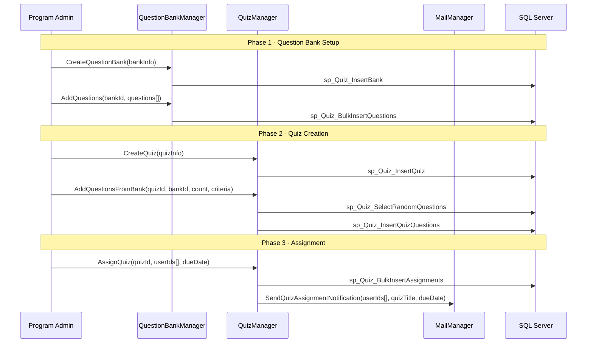
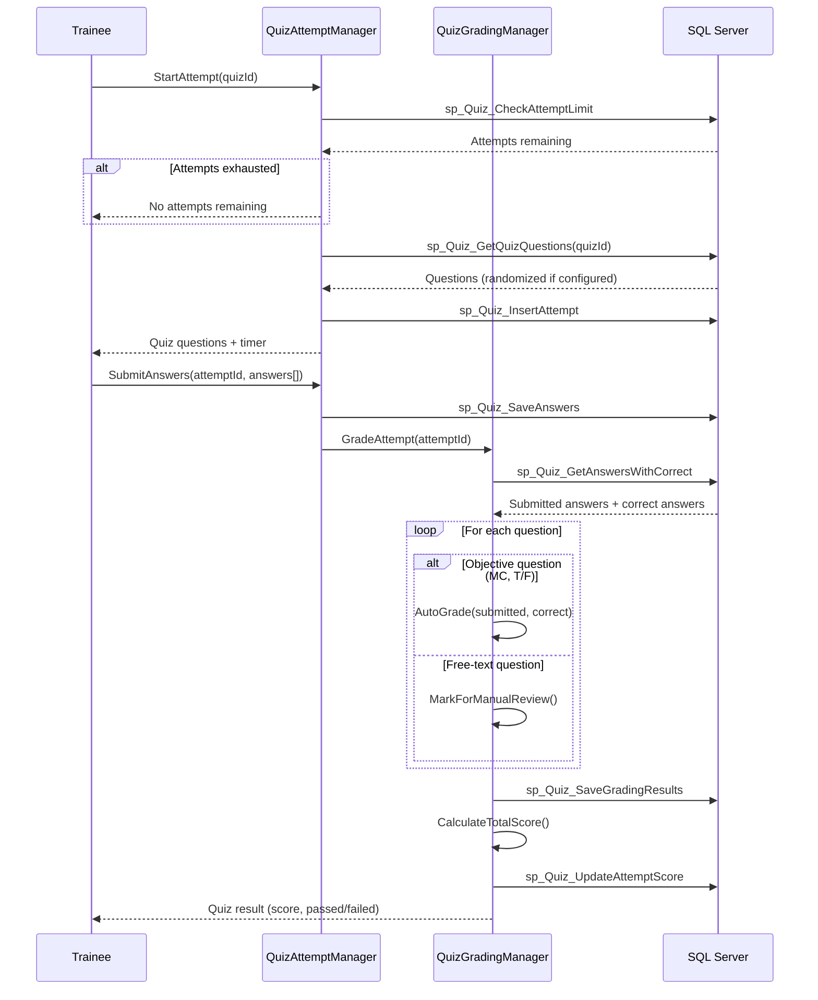
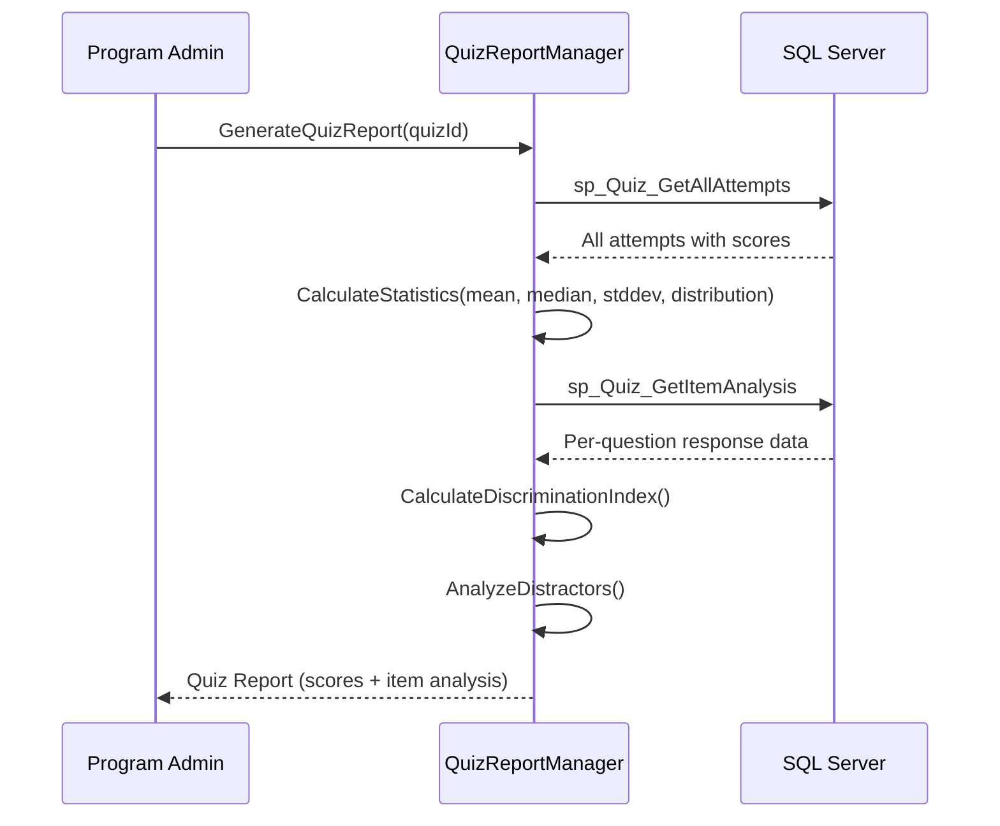
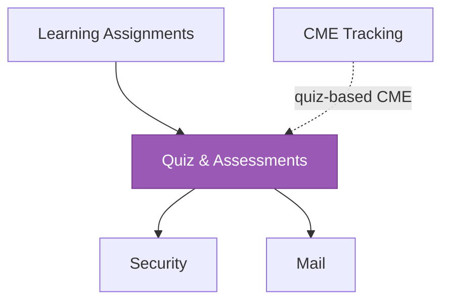

# Quiz & Assessments

<!-- Content will be enriched by AI parsing scripts -->

## Overview

The Quiz module provides assessment capabilities for knowledge testing within the MyEvaluations platform. It supports question bank management, quiz creation from question pools, timed and untimed assessments, automated grading, and score reporting. Quizzes are commonly used alongside learning assignments for knowledge verification, for in-service exam preparation, and for CME activity assessments.

### Key Responsibilities

- **Question Bank Management**: Create, categorize, and maintain pools of assessment questions by topic, difficulty, and competency
- **Quiz Creation**: Build quizzes from question banks with configurable settings (time limits, randomization, passing scores, attempt limits)
- **Quiz Assignment**: Assign quizzes to individuals or groups with due dates
- **Automated Grading**: Grade objective questions automatically; support manual grading for free-text responses
- **Score Reporting**: Individual scores, cohort statistics, item analysis, and trend reporting
- **Integration**: Link quizzes to learning assignments and CME activities

## Key Classes

### Manager Classes

| Class | Namespace | Purpose |
|-------|-----------|---------|
| `QuizManager` | `MyEvaluations.Business.Quiz` | Core quiz operations: creation, configuration, assignment, and retrieval. |
| `QuestionBankManager` | `MyEvaluations.Business.Quiz` | Question bank CRUD, categorization, and pool management. |
| `QuizGradingManager` | `MyEvaluations.Business.Quiz` | Automated and manual grading, score calculation, and result storage. |
| `QuizReportManager` | `MyEvaluations.Business.Quiz` | Score reporting, item analysis, and performance statistics. |
| `QuizAttemptManager` | `MyEvaluations.Business.Quiz` | Attempt tracking, time management, and answer submission. |

### Info (DTO) Classes

| Class | Purpose |
|-------|---------|
| `QuizInfo` | Quiz definition: title, description, time limit, passing score, attempt limit, randomize flag, question count. |
| `QuestionInfo` | Question: text, type (multiple-choice/true-false/free-text/matching), options, correct answer, points, difficulty, competency tag. |
| `QuizAttemptInfo` | Attempt record: user, quiz, start time, end time, answers submitted, score, passed flag. |
| `QuizAnswerInfo` | Individual answer: question, selected option(s), free-text response, correct flag, points earned. |
| `QuizResultInfo` | Result summary: user, quiz, score, percentage, percentile, attempt number. |
| `QuestionBankInfo` | Question bank: name, category, question count, difficulty distribution, last updated. |
| `ItemAnalysisInfo` | Item analysis: question, correct response rate, discrimination index, distractor analysis. |

## Business Workflows

### Quiz Creation and Assignment

### Quiz Taking and Grading

### Score Reporting and Item Analysis

## Stored Procedure References

| Stored Procedure | Purpose |
|-----------------|---------|
| `sp_Quiz_InsertBank` | Create question bank |
| `sp_Quiz_BulkInsertQuestions` | Add questions to bank |
| `sp_Quiz_InsertQuiz` | Create quiz definition |
| `sp_Quiz_SelectRandomQuestions` | Select random questions from bank based on criteria |
| `sp_Quiz_InsertQuizQuestions` | Associate questions with quiz |
| `sp_Quiz_BulkInsertAssignments` | Assign quiz to multiple users |
| `sp_Quiz_CheckAttemptLimit` | Check remaining attempts for user |
| `sp_Quiz_GetQuizQuestions` | Retrieve quiz questions for attempt |
| `sp_Quiz_InsertAttempt` | Create new attempt record |
| `sp_Quiz_SaveAnswers` | Save submitted answers |
| `sp_Quiz_GetAnswersWithCorrect` | Retrieve answers with correct values for grading |
| `sp_Quiz_SaveGradingResults` | Save per-question grading results |
| `sp_Quiz_UpdateAttemptScore` | Update total score on attempt |
| `sp_Quiz_GetAllAttempts` | Retrieve all attempts for reporting |
| `sp_Quiz_GetItemAnalysis` | Per-question response data for item analysis |

## Cross-Module Dependencies

### Dependency Details

| Direction | Module | Relationship |
|-----------|--------|-------------|
| Depends on | Security | Permission checks for question bank management, quiz creation, and score access |
| Depends on | Mail | Quiz assignment notifications and score delivery |
| Depended on by | Learning Assignments | Quizzes are linked to learning assignments for knowledge verification |
| Related to | CME Tracking | Quiz completion may award CME credits for certain activities |
