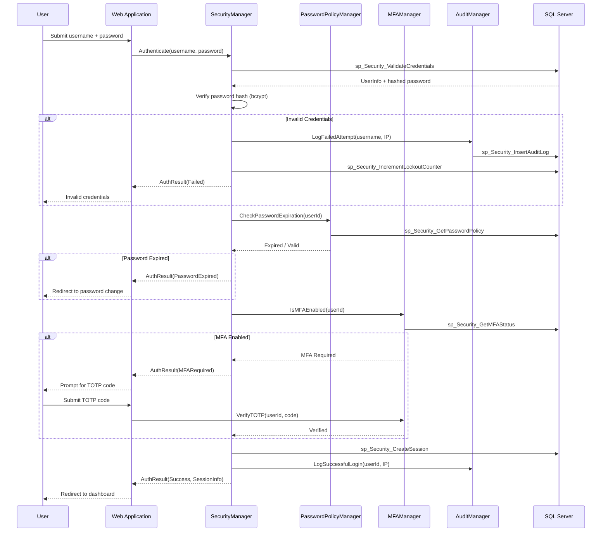
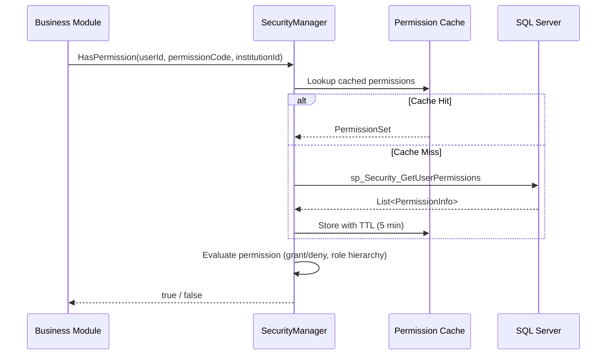
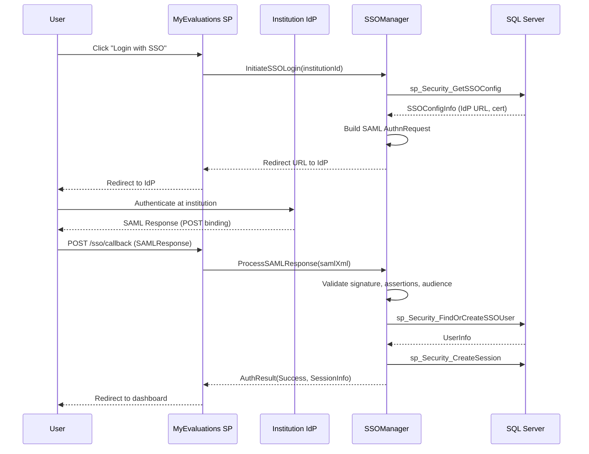

import DependentsPanel from '@site/src/components/DependentsPanel';

# Security & Authentication

<!-- Content will be enriched by AI parsing scripts -->

## Overview

The Security module is the foundational layer of the MyEvaluations .NET backend. Every request flows through security checks before reaching any business logic. This module handles user authentication (local credentials, SAML SSO, MFA), role-based access control (RBAC) with institution-scoped permissions, session lifecycle management, and password policy enforcement.

With 900+ institutions and 10,000+ users spanning GME, CME, Nursing, and PA programs, the security model must support multi-tenant isolation where users at one institution cannot access data from another, while platform administrators can operate across institutions.

### Key Responsibilities

- **Authentication**: Local username/password login, SAML 2.0 SSO (institutional IdPs), multi-factor authentication (TOTP)
- **Authorization**: Role-based access control with granular permissions scoped to institution, program, and user level
- **Session Management**: Server-side session tracking with configurable timeout, concurrent session limits, and audit logging
- **Password Policies**: Configurable complexity requirements, expiration intervals, history enforcement, and account lockout
- **Audit Trail**: All authentication events (login, logout, failed attempts, permission changes) are logged for compliance

## Key Classes

### Manager Classes

| Class | Namespace | Purpose |
|-------|-----------|---------|
| `SecurityManager` | `MyEvaluations.Business.Security` | Core authentication and authorization logic. Validates credentials, manages sessions, checks permissions. |
| `SSOManager` | `MyEvaluations.Business.Security` | SAML 2.0 SSO integration. Processes SAML assertions, maps IdP attributes to local users, handles SP-initiated and IdP-initiated flows. |
| `MFAManager` | `MyEvaluations.Business.Security` | Multi-factor authentication. TOTP setup, code verification, backup codes, trusted device management. |
| `PasswordPolicyManager` | `MyEvaluations.Business.Security` | Password rule enforcement. Complexity validation, expiration checks, history comparison. |
| `AuditManager` | `MyEvaluations.Business.Security` | Security event logging. Writes authentication, authorization, and administrative events to audit tables. |

### Info (DTO) Classes

| Class | Purpose |
|-------|---------|
| `UserInfo` | User profile data: ID, username, email, institution, active status, last login timestamp. |
| `RoleInfo` | Role definition: ID, name, description, institution scope, built-in vs custom flag. |
| `PermissionInfo` | Individual permission: ID, code, module, description, grant/deny flag. |
| `SessionInfo` | Active session: session ID, user ID, IP address, user agent, creation time, last activity, expiry. |
| `LoginAttemptInfo` | Authentication attempt record: timestamp, username, IP, success/failure, failure reason. |
| `SSOConfigInfo` | SSO configuration per institution: IdP metadata URL, entity ID, certificate, attribute mappings. |

## Business Workflows

### Login Flow (Local Credentials)

### Permission Check Pattern

### SAML SSO Flow

## Stored Procedure References

The following stored procedures are used by the Security module. Detailed schemas and parameter documentation will be auto-generated from the database.

| Stored Procedure | Purpose |
|-----------------|---------|
| `sp_Security_ValidateCredentials` | Retrieve user record for credential validation |
| `sp_Security_CreateSession` | Insert new session record |
| `sp_Security_DestroySession` | Mark session as expired |
| `sp_Security_GetUserPermissions` | Retrieve all permissions for a user (role-resolved) |
| `sp_Security_GetUserRoles` | Retrieve roles assigned to a user for an institution |
| `sp_Security_InsertAuditLog` | Write security audit event |
| `sp_Security_IncrementLockoutCounter` | Track failed login attempts for lockout |
| `sp_Security_GetPasswordPolicy` | Retrieve password policy for institution |
| `sp_Security_UpdatePassword` | Update user password with history check |
| `sp_Security_GetMFAStatus` | Check if MFA is enabled for user |
| `sp_Security_SaveMFASecret` | Store TOTP secret during MFA setup |
| `sp_Security_GetSSOConfig` | Retrieve SAML SSO config for institution |
| `sp_Security_FindOrCreateSSOUser` | Find existing or provision new SSO user |

## Cross-Module Dependencies

The Security module is a **dependency of every other module** in the system. No business operation occurs without a security context.

```mermaid
graph TD
    SEC[Security & Authentication]
    EVAL[Evaluations]
    DH[Duty Hours]
    CME[CME Tracking]
    PL[Patient Log]
    PROC[Procedures]
    PORT[Portfolio]
    LA[Learning Assignments]
    QUIZ[Quiz]
    MAIL[Mail]
    TS[Timesheet]
    HS[HelloSign]
    ERAS[ERAS]
    ICC[ICC]
    EA[Essential Activities]
    NN[Nurse Notify]

    EVAL --> SEC
    DH --> SEC
    CME --> SEC
    PL --> SEC
    PROC --> SEC
    PORT --> SEC
    LA --> SEC
    QUIZ --> SEC
    MAIL --> SEC
    TS --> SEC
    HS --> SEC
    ERAS --> SEC
    ICC --> SEC
    EA --> SEC
    NN --> SEC

    style SEC fill:#e74c3c,color:#fff,stroke:#c0392b
```

### Dependency Details

| Dependent Module | Usage |
|-----------------|-------|
| All modules | `SecurityManager.HasPermission()` for authorization checks |
| All modules | `SecurityManager.GetCurrentUser()` for user context |
| Evaluations | Role-based evaluation routing (e.g., only attendings can evaluate residents) |
| Duty Hours | Program director permissions for violation overrides |
| Mail | User email retrieval and notification preferences |
| ERAS | Admin-only access controls for application data |
| ICC | Committee membership verification |

{/* DEPENDENTS-PANEL:START */}
<DependentsPanel module="Security" />
{/* DEPENDENTS-PANEL:END */}

## File Reference

Browse per-file implementation documentation for every class in this module:

- [**Security Implementation Files**](./files/security) — 128 classes with summaries, key methods, stored procedures, and migration notes
