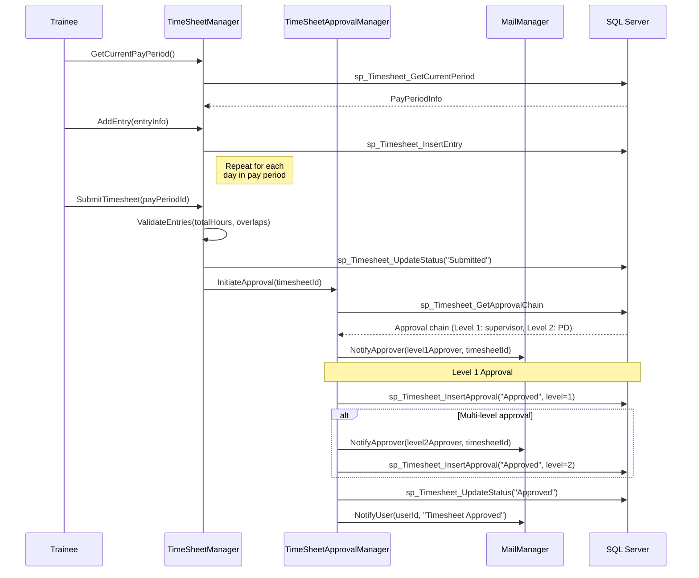
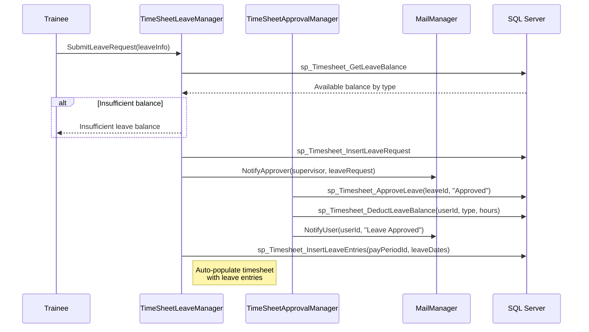
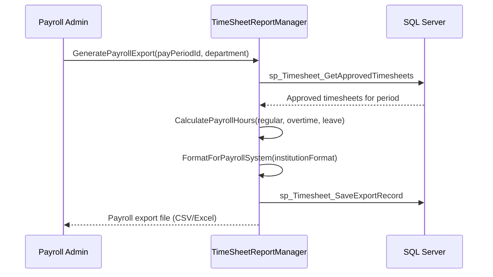
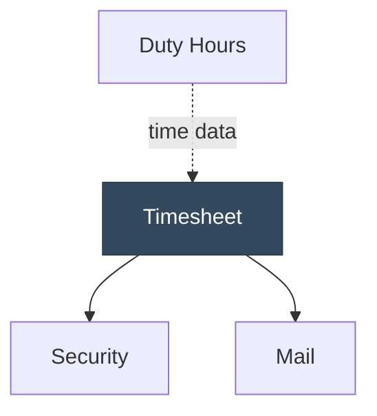

# Timesheet

<!-- Content will be enriched by AI parsing scripts -->

## Overview

The Timesheet module provides time tracking and approval workflows for healthcare trainees and staff. While related to the Duty Hours module (which focuses on ACGME compliance), the Timesheet module addresses administrative time tracking for payroll, leave management, and institutional reporting purposes.

This module supports configurable pay periods, multi-level approval workflows, leave type categorization, and integration with institutional payroll systems. It is particularly important for programs where trainees are employed by the institution and must submit timesheets for compensation.

### Key Responsibilities

- **Time Entry**: Clock-in/clock-out and manual time entry with activity categorization
- **Pay Period Management**: Configurable pay periods (weekly, bi-weekly, semi-monthly, monthly)
- **Approval Workflows**: Multi-level approval chains (supervisor, program director, department)
- **Leave Management**: Vacation, sick, conference, and other leave type tracking
- **Reporting**: Individual timesheet reports, payroll summaries, and leave balance reports
- **Payroll Integration**: Export data in formats compatible with institutional payroll systems

## Key Classes

### Manager Classes

| Class | Namespace | Purpose |
|-------|-----------|---------|
| `TimeSheetManager` | `MyEvaluations.Business.Timesheet` | Core timesheet operations: time entry CRUD, period management, and summary calculations. |
| `TimeSheetApprovalManager` | `MyEvaluations.Business.Timesheet` | Multi-level approval workflow management. |
| `TimeSheetLeaveManager` | `MyEvaluations.Business.Timesheet` | Leave request, approval, and balance tracking. |
| `TimeSheetReportManager` | `MyEvaluations.Business.Timesheet` | Reporting: payroll exports, leave summaries, and utilization reports. |
| `TimeSheetPayPeriodManager` | `MyEvaluations.Business.Timesheet` | Pay period definition, calendar management, and period locking. |

### Info (DTO) Classes

| Class | Purpose |
|-------|---------|
| `TimeSheetInfo` | Timesheet record: user, pay period, entries, total hours, status (draft/submitted/approved/rejected). |
| `TimeSheetEntryInfo` | Individual entry: date, start time, end time, activity type, hours, description. |
| `TimeSheetApprovalInfo` | Approval record: approver, action (approve/reject/return), comments, timestamp, level. |
| `TimeSheetLeaveInfo` | Leave record: type (vacation/sick/conference/other), start date, end date, hours, status. |
| `PayPeriodInfo` | Pay period: start date, end date, type, locked flag, submission deadline. |
| `TimeSheetSummaryInfo` | Summary: total hours worked, leave hours by type, overtime hours, regular hours. |

## Business Workflows

### Timesheet Submission and Approval

### Leave Request Flow

### Payroll Export

## Stored Procedure References

| Stored Procedure | Purpose |
|-----------------|---------|
| `sp_Timesheet_GetCurrentPeriod` | Retrieve current pay period |
| `sp_Timesheet_InsertEntry` | Add time entry |
| `sp_Timesheet_UpdateStatus` | Update timesheet status |
| `sp_Timesheet_GetApprovalChain` | Retrieve approval chain for user |
| `sp_Timesheet_InsertApproval` | Record approval decision |
| `sp_Timesheet_GetLeaveBalance` | Retrieve leave balances |
| `sp_Timesheet_InsertLeaveRequest` | Create leave request |
| `sp_Timesheet_ApproveLeave` | Approve/reject leave request |
| `sp_Timesheet_DeductLeaveBalance` | Deduct leave balance after approval |
| `sp_Timesheet_InsertLeaveEntries` | Populate timesheet with leave entries |
| `sp_Timesheet_GetApprovedTimesheets` | Retrieve approved timesheets for payroll |
| `sp_Timesheet_SaveExportRecord` | Record payroll export metadata |

## Cross-Module Dependencies

### Dependency Details

| Direction | Module | Relationship |
|-----------|--------|-------------|
| Depends on | Security | Permission checks for time entry, approval authority, and payroll access |
| Depends on | Mail | Approval notifications, submission confirmations, and leave request alerts |
| Related to | Duty Hours | Both track time but for different purposes (payroll vs ACGME compliance); data may overlap |

## File Reference

Browse per-file implementation documentation for every class in this module:

- [**Timesheet Implementation Files**](./files/timesheet) — 28 classes with summaries, key methods, stored procedures, and migration notes
