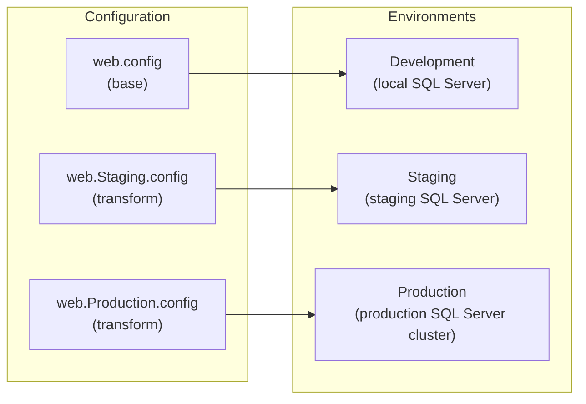

# Connection Management

The MyEvaluations .NET backend manages SQL Server connections across multiple environments (development, staging, production) with built-in connection pooling and multi-database support. Understanding connection management is essential for troubleshooting performance issues and configuring new environments.

## Connection String Configuration

Connection strings are stored in the `<connectionStrings>` section of configuration files:

- **Web Application:** `web.config`
- **Windows Services (Schedulers):** `app.config` per service
- **Shared Libraries:** Inherited from the hosting application's config

```xml
<connectionStrings>
  <!-- Primary database connection -->
  <add name="MyEvaluationsDB"
       connectionString="Server=sql-server-host;Database=MyEvaluations;User Id=app_user;Password=***;
                         Application Name=MyEvaluations Web;
                         Connect Timeout=30;
                         Max Pool Size=200;
                         Min Pool Size=10;
                         MultipleActiveResultSets=True;"
       providerName="System.Data.SqlClient" />

  <!-- Read-only replica (for heavy reports) -->
  <add name="MyEvaluationsDB_ReadOnly"
       connectionString="Server=sql-readonly-host;Database=MyEvaluations;User Id=readonly_user;Password=***;
                         Application Name=MyEvaluations Reports;
                         ApplicationIntent=ReadOnly;
                         Connect Timeout=60;"
       providerName="System.Data.SqlClient" />
</connectionStrings>
```

## Multi-Environment Configuration

Each environment uses a different connection string, managed through config transforms or environment-specific config files:



| Environment | Server | Database | Notes |
|-------------|--------|----------|-------|
| Development | `localhost` or `.\SQLEXPRESS` | `MyEvaluations_Dev` | Developer's local SQL instance |
| Staging | `staging-sql.internal` | `MyEvaluations_Staging` | Shared staging environment |
| Production | `prod-sql-cluster.internal` | `MyEvaluations` | High-availability cluster |

## Connection Pooling

ADO.NET manages connection pooling automatically. The MyEvaluations configuration optimizes pooling for the application's usage patterns:

### Pool Configuration

```
Max Pool Size=200      -- Maximum concurrent connections
Min Pool Size=10       -- Minimum idle connections kept open
Connect Timeout=30     -- Seconds to wait for a connection from the pool
Connection Lifetime=0  -- Connections never expire (default)
```

### Pool Monitoring

```sql
-- Check current connection pool usage
SELECT
    DB_NAME(database_id) AS DatabaseName,
    login_name,
    program_name,
    COUNT(*) AS ConnectionCount,
    SUM(CASE WHEN status = 'sleeping' THEN 1 ELSE 0 END) AS IdleConnections,
    SUM(CASE WHEN status = 'running' THEN 1 ELSE 0 END) AS ActiveConnections
FROM sys.dm_exec_sessions
WHERE database_id = DB_ID('MyEvaluations')
GROUP BY database_id, login_name, program_name
ORDER BY ConnectionCount DESC;
```

### Best Practices

1. **Always close connections:** The DAL's `DBDataAccess` class handles this automatically, but custom code must use `using` statements
2. **Do not change pool size without load testing:** The default of 200 was tuned for production traffic patterns
3. **Monitor pool exhaustion:** If `Connect Timeout` errors appear in logs, the pool may be exhausted

## Connection Resolution in Code

The `DBDataAccess` class resolves connection strings at runtime:

```csharp
public class DBDataAccess
{
    // Default connection string name
    private const string DEFAULT_CONNECTION = "MyEvaluationsDB";

    // Get connection string by name from config
    private static string GetConnectionString(string name = null)
    {
        string connName = name ?? DEFAULT_CONNECTION;
        var connString = ConfigurationManager.ConnectionStrings[connName];

        if (connString == null)
            throw new ConfigurationErrorsException(
                $"Connection string '{connName}' not found in configuration.");

        return connString.ConnectionString;
    }

    // Execute with default connection
    public static DataSet ExecuteDataSet(string spName, SqlParameter[] parameters)
    {
        return ExecuteDataSet(DEFAULT_CONNECTION, spName, parameters);
    }

    // Execute with specific connection
    public static DataSet ExecuteDataSet(string connectionName, string spName, SqlParameter[] parameters)
    {
        using (var conn = new SqlConnection(GetConnectionString(connectionName)))
        {
            conn.Open();
            using (var cmd = new SqlCommand(spName, conn))
            {
                cmd.CommandType = CommandType.StoredProcedure;
                cmd.CommandTimeout = GetCommandTimeout();

                if (parameters != null)
                    cmd.Parameters.AddRange(parameters);

                var adapter = new SqlDataAdapter(cmd);
                var ds = new DataSet();
                adapter.Fill(ds);
                return ds;
            }
        }
    }
}
```

## Multi-Database Support

Some features access additional databases beyond the primary MyEvaluations database:

| Connection Name | Database | Purpose |
|----------------|----------|---------|
| `MyEvaluationsDB` | `MyEvaluations` | Primary application database |
| `MyEvaluationsDB_ReadOnly` | `MyEvaluations` (replica) | Heavy report queries |
| `ASPStateDB` | `ASPState` | Session state storage |
| `ArchiveDB` | `MyEvaluations_Archive` | Archived historical data |

## Timeout Configuration

```xml
<!-- Command timeout (seconds) for stored procedure execution -->
<appSettings>
  <add key="CommandTimeout" value="120" />           <!-- Default: 2 minutes -->
  <add key="ReportCommandTimeout" value="600" />     <!-- Reports: 10 minutes -->
  <add key="ImportCommandTimeout" value="1800" />    <!-- Data imports: 30 minutes -->
</appSettings>
```

## Troubleshooting

### Common Issues

| Issue | Symptom | Resolution |
|-------|---------|------------|
| Pool exhaustion | `Timeout expired. The timeout period elapsed prior to obtaining a connection` | Check for connection leaks; increase pool size cautiously |
| Slow connections | High connect time in SQL Profiler | Check network latency; verify DNS resolution |
| Connection failures | `A network-related or instance-specific error` | Verify SQL Server is running; check firewall rules |
| Deadlocks | `Transaction was deadlocked on lock resources` | Review transaction isolation levels; check stored procedure locking hints |
| Timeout errors | `Execution Timeout Expired` | Investigate slow query; check for blocking; increase `CommandTimeout` |

### Diagnostic Queries

```sql
-- Check for blocking sessions
SELECT
    blocking_session_id AS BlockingSession,
    session_id AS BlockedSession,
    wait_type,
    wait_time / 1000 AS WaitTimeSec,
    TEXT AS QueryText
FROM sys.dm_exec_requests
CROSS APPLY sys.dm_exec_sql_text(sql_handle)
WHERE blocking_session_id <> 0;

-- Check connection count by application
SELECT
    program_name,
    COUNT(*) AS Connections,
    MIN(login_time) AS OldestConnection,
    MAX(last_request_start_time) AS LastActivity
FROM sys.dm_exec_sessions
WHERE database_id = DB_ID('MyEvaluations')
GROUP BY program_name
ORDER BY Connections DESC;
```

## Related Documentation

- [Data Access Overview](./overview) -- How the DAL uses connections
- [Stored Procedures](./stored-procedures) -- Complete SP catalog
