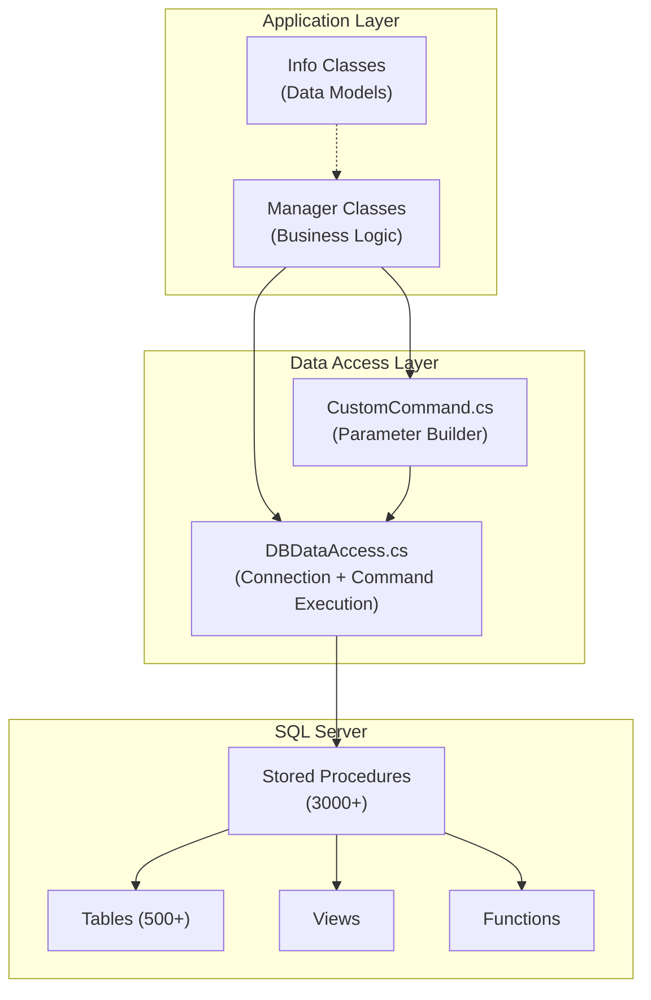
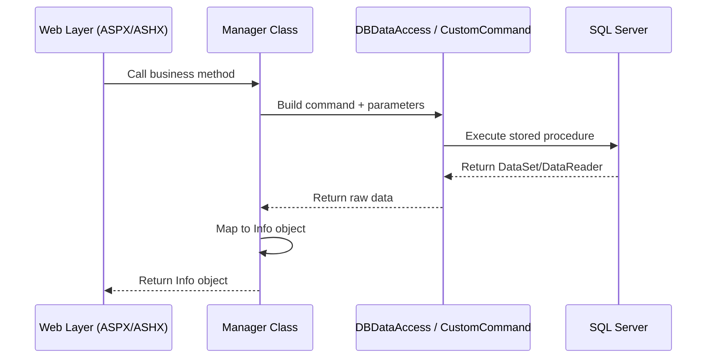

# Data Access Layer Overview

The MyEvaluations .NET backend uses a custom data access layer (DAL) built on **ADO.NET** with **SQL Server**. Rather than using an ORM like Entity Framework, the codebase employs a utility-class pattern centered around `DBDataAccess.cs` and `CustomCommand.cs` that simplifies calling stored procedures and handling database connections.

## Architecture



## Core Components

### DBDataAccess.cs

`DBDataAccess.cs` is the central utility class for all database operations. It wraps ADO.NET's `SqlConnection` and `SqlCommand` with convenience methods for common patterns.

**Key Methods:**

```csharp
public class DBDataAccess
{
    // Execute a stored procedure and return a DataSet
    public static DataSet ExecuteDataSet(string spName, SqlParameter[] parameters)

    // Execute a stored procedure and return a DataReader
    public static SqlDataReader ExecuteReader(string spName, SqlParameter[] parameters)

    // Execute a stored procedure with no result set (INSERT, UPDATE, DELETE)
    public static int ExecuteNonQuery(string spName, SqlParameter[] parameters)

    // Execute a stored procedure and return a scalar value
    public static object ExecuteScalar(string spName, SqlParameter[] parameters)

    // Execute with a specific connection string (for multi-database scenarios)
    public static DataSet ExecuteDataSet(string connectionStringKey, string spName, SqlParameter[] parameters)
}
```

**Usage Pattern:**

```csharp
// Typical usage in a Manager class
public EvaluationInfo GetEvaluation(int evaluationId)
{
    SqlParameter[] parameters = new SqlParameter[]
    {
        new SqlParameter("@EvaluationID", evaluationId)
    };

    DataSet ds = DBDataAccess.ExecuteDataSet("usp_GetEvaluation", parameters);

    if (ds.Tables[0].Rows.Count > 0)
    {
        return MapToEvaluationInfo(ds.Tables[0].Rows[0]);
    }
    return null;
}
```

**Key Characteristics:**
- All methods are **static** -- no instance management needed
- Connection strings are resolved from `web.config` / `app.config`
- Connections are opened and closed within each method call (no connection leaking)
- Built-in retry logic for transient SQL errors (timeout, deadlock)
- Logging of slow queries (configurable threshold)

### CustomCommand.cs

`CustomCommand.cs` is a fluent builder for constructing stored procedure calls with typed parameters. It simplifies parameter creation and reduces boilerplate.

**Usage Pattern:**

```csharp
// Fluent parameter building with CustomCommand
DataSet ds = new CustomCommand("usp_GetEvaluationsByProgram")
    .AddParameter("@ProgramID", SqlDbType.Int, programId)
    .AddParameter("@StartDate", SqlDbType.DateTime, startDate)
    .AddParameter("@EndDate", SqlDbType.DateTime, endDate)
    .AddParameter("@Status", SqlDbType.VarChar, 50, status)
    .ExecuteDataSet();
```

**Key Methods:**

```csharp
public class CustomCommand
{
    public CustomCommand(string storedProcedureName)
    public CustomCommand AddParameter(string name, SqlDbType type, object value)
    public CustomCommand AddParameter(string name, SqlDbType type, int size, object value)
    public CustomCommand AddOutputParameter(string name, SqlDbType type)

    public DataSet ExecuteDataSet()
    public SqlDataReader ExecuteReader()
    public int ExecuteNonQuery()
    public object ExecuteScalar()
}
```

## Data Flow Pattern

The typical data flow through the DAL follows this pattern:



1. **Web layer** (ASPX page, ASHX handler, or ApiHandler) calls a Manager method
2. **Manager** constructs the stored procedure call using `DBDataAccess` or `CustomCommand`
3. **DAL** opens a connection, executes the stored procedure, and returns raw ADO.NET data
4. **Manager** maps the raw `DataRow` or `DataReader` to an `Info` class (POCO)
5. **Info object** is returned to the web layer for rendering or serialization

## Common Patterns

### Reading Data

```csharp
// Pattern 1: DataSet approach (most common)
public List<EvaluationInfo> GetEvaluations(int programId)
{
    var parameters = new SqlParameter[]
    {
        new SqlParameter("@ProgramID", programId)
    };

    DataSet ds = DBDataAccess.ExecuteDataSet("usp_GetEvaluations", parameters);
    var results = new List<EvaluationInfo>();

    foreach (DataRow row in ds.Tables[0].Rows)
    {
        results.Add(MapToEvaluationInfo(row));
    }
    return results;
}

// Pattern 2: DataReader approach (for large result sets)
public List<UserInfo> GetAllUsers()
{
    using (SqlDataReader reader = DBDataAccess.ExecuteReader("usp_GetAllUsers", null))
    {
        var users = new List<UserInfo>();
        while (reader.Read())
        {
            users.Add(MapToUserInfo(reader));
        }
        return users;
    }
}
```

### Writing Data

```csharp
// Insert with output parameter for new ID
public int CreateEvaluation(EvaluationInfo eval)
{
    var cmd = new CustomCommand("usp_InsertEvaluation")
        .AddParameter("@FormID", SqlDbType.Int, eval.FormID)
        .AddParameter("@EvaluatorID", SqlDbType.Int, eval.EvaluatorID)
        .AddParameter("@SubjectID", SqlDbType.Int, eval.SubjectID)
        .AddParameter("@DueDate", SqlDbType.DateTime, eval.DueDate)
        .AddOutputParameter("@NewEvaluationID", SqlDbType.Int);

    cmd.ExecuteNonQuery();
    return (int)cmd.GetOutputParameterValue("@NewEvaluationID");
}
```

### Null Handling

```csharp
// The codebase uses DBNull.Value extensively
new SqlParameter("@EndDate", endDate ?? (object)DBNull.Value)

// Helper method found in some Manager classes
private object ToDbValue(object value)
{
    return value ?? DBNull.Value;
}
```

## Multiple Result Sets

Some stored procedures return multiple result sets. The `DataSet` approach handles this naturally:

```csharp
DataSet ds = DBDataAccess.ExecuteDataSet("usp_GetEvaluationWithDetails", parameters);

// First result set: evaluation header
var evaluation = MapToEvaluationInfo(ds.Tables[0].Rows[0]);

// Second result set: evaluation questions
var questions = new List<QuestionInfo>();
foreach (DataRow row in ds.Tables[1].Rows)
{
    questions.Add(MapToQuestionInfo(row));
}

// Third result set: evaluation responses
var responses = new List<ResponseInfo>();
foreach (DataRow row in ds.Tables[2].Rows)
{
    responses.Add(MapToResponseInfo(row));
}
```

## Error Handling

The DAL includes built-in error handling:

- **SqlException** is caught and logged with the stored procedure name and parameters
- **Timeout exceptions** are retried once with a doubled timeout value
- **Deadlock exceptions** (error code 1205) are retried up to 3 times with a brief delay
- **Connection failures** trigger an alert to the operations team

## Important Notes

:::warning Historical Context
The DAL was designed in the early 2000s when ADO.NET + stored procedures was the standard .NET data access pattern. While it works reliably, it lacks features modern ORMs provide (change tracking, migrations, LINQ queries). The Node.js backend uses MikroORM as a modern alternative.
:::

:::info Migration Status
As features migrate to the Node.js backend, the corresponding stored procedures and DAL code remain in place (the .NET backend continues to use them). New features are built exclusively on the Node.js backend with MikroORM and PostgreSQL.
:::

## Related Documentation

- [Stored Procedures Catalog](./stored-procedures) -- Complete catalog of stored procedures
- [Connection Management](./connection-management) -- Connection string configuration and pooling
- [Manager/Info Pattern](../patterns/manager-info) -- How Manager and Info classes work together
