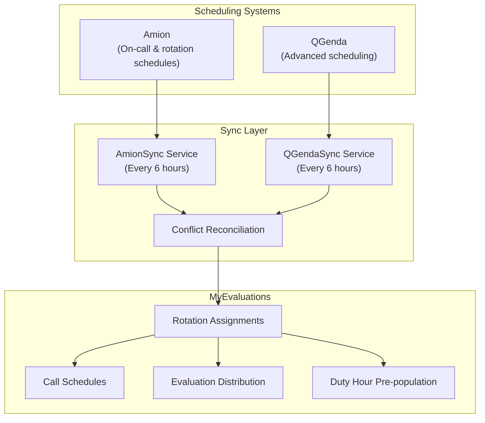
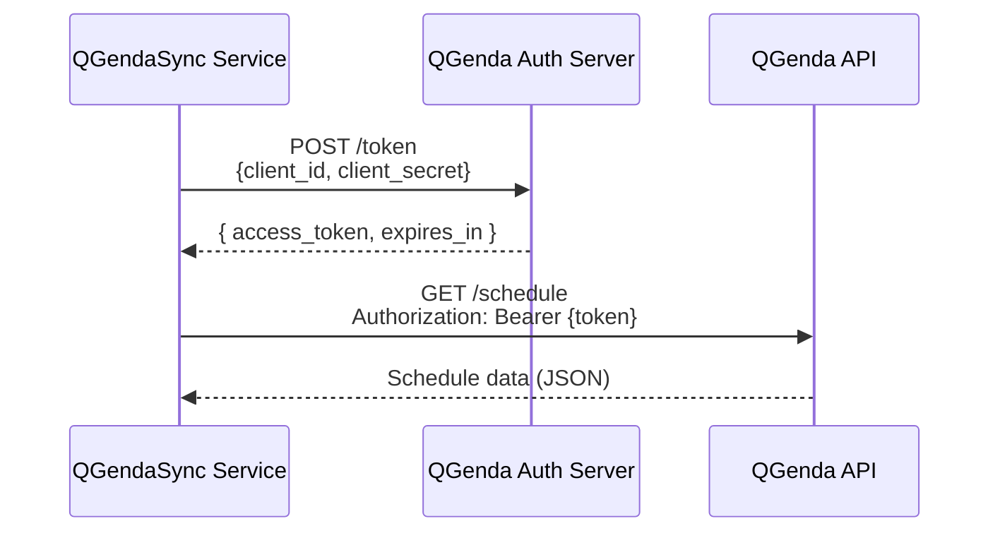

# Amion & QGenda Integration

MyEvaluations integrates with two major physician scheduling systems -- **Amion** and **QGenda** -- to synchronize resident and attending schedules. Accurate schedule data is critical because it drives evaluation distribution, duty hour pre-population, and supervision tracking.

## Overview



## Amion Integration

**Amion** is a widely used on-call scheduling system in academic medical centers. It manages resident call schedules, rotation assignments, and day-off tracking.

### API Details

| Aspect | Details |
|--------|---------|
| **Protocol** | HTTP API (proprietary, not REST) |
| **Authentication** | Institution-specific login + password |
| **Data Format** | Proprietary text format (parsed by custom parser) |
| **Endpoint** | `https://www.amion.com/cgi-bin/ocs` |
| **Rate Limits** | No documented limits; requests are throttled client-side |

### Data Synced

- **Rotation assignments** -- Who is on which service/rotation for each date
- **Call schedules** -- On-call assignments (primary, backup, senior)
- **Day-off tracking** -- Vacation, sick days, conference days
- **Attending assignments** -- Supervising attending per service

### Amion Data Mapping

| Amion Field | MyEvaluations Field | Notes |
|-------------|---------------------|-------|
| Staff name | User (matched by name/email) | Fuzzy matching with manual override |
| Service | Rotation | Mapped via configuration table |
| Date range | Rotation start/end dates | Daily granularity |
| Call type | Call assignment type | Primary, backup, senior |

### Configuration

```xml
<appSettings>
  <add key="Amion_BaseUrl" value="https://www.amion.com/cgi-bin/ocs" />
  <add key="Amion_Login" value="institution_login" />
  <add key="Amion_Password" value="*** (stored securely)" />
  <add key="Amion_SyncDateRangeDays" value="30" />
  <add key="Amion_InstitutionCode" value="XXXX" />
</appSettings>
```

---

## QGenda Integration

**QGenda** is a modern cloud-based physician scheduling platform with a well-documented REST API. It provides more granular scheduling data than Amion, including shift-level details and task assignments.

### API Details

| Aspect | Details |
|--------|---------|
| **Protocol** | REST API (JSON) |
| **Authentication** | OAuth2 (client credentials flow) |
| **Base URL** | `https://api.qgenda.com/v2` |
| **Rate Limits** | 100 requests/minute per client |
| **Documentation** | `https://restapi.qgenda.com` |

### Key Endpoints Used

| Endpoint | Purpose |
|----------|---------|
| `GET /schedule` | Retrieve schedule entries for date range |
| `GET /staff` | List staff members and their IDs |
| `GET /task` | List task/rotation types |
| `GET /location` | List locations/sites |

### Data Synced

- **Schedule entries** -- Staff assigned to tasks for specific dates/shifts
- **Staff profiles** -- Name, credentials, department
- **Task definitions** -- Rotation/service types and their properties
- **Location data** -- Clinical sites and facilities

### QGenda Data Mapping

| QGenda Field | MyEvaluations Field | Notes |
|-------------|---------------------|-------|
| `StaffKey` | User ID | Mapped via lookup table |
| `TaskName` | Rotation name | Mapped via configuration |
| `Date` + `StartTime`/`EndTime` | Rotation dates | Shift-level granularity available |
| `LocationName` | Clinical site | Mapped to institution sites |

### Authentication Flow



---

## Conflict Resolution

When an institution uses both Amion and QGenda (or has overlapping data), the sync layer applies conflict resolution rules:

1. **Priority source:** The institution configures which system is authoritative (typically QGenda for newer implementations)
2. **Timestamp comparison:** The most recently updated record wins
3. **Manual overrides:** Records manually edited in MyEvaluations are preserved over synced data
4. **Conflict logging:** All conflicts are logged for administrative review

## Key Stored Procedures

| Procedure | Purpose |
|-----------|---------|
| `usp_UpsertAmionScheduleData` | Insert/update rotation records from Amion |
| `usp_UpsertQGendaScheduleData` | Insert/update rotation records from QGenda |
| `usp_GetScheduleSyncMapping` | Retrieve mapping between external and internal IDs |
| `usp_ResolveSchedulingConflicts` | Apply conflict resolution rules |
| `usp_GetScheduleSyncLog` | Retrieve sync history and errors |
| `usp_TriggerPostSyncProcesses` | Kick off evaluation and duty hour recalculations |

## Troubleshooting

| Issue | Cause | Resolution |
|-------|-------|------------|
| Amion sync returns no data | Login credentials changed | Update Amion credentials in config |
| QGenda 401 error | OAuth token expired or client secret rotated | Regenerate client credentials in QGenda admin |
| Staff not matched | New resident not in mapping table | Add mapping entry or enable auto-match by email |
| Rotations not appearing | Service/task mapping missing | Add mapping in the scheduling config admin page |
| Duplicate rotation entries | Both Amion and QGenda syncing same data | Configure priority source; disable duplicate source |

## Related Documentation

- [Data Integration Schedulers](../schedulers/data-integration-schedulers) -- AmionSync and QGendaSync scheduler details
- [Clinical Schedulers](../schedulers/clinical-schedulers#clinicalrotationsync) -- ClinicalRotationSync
