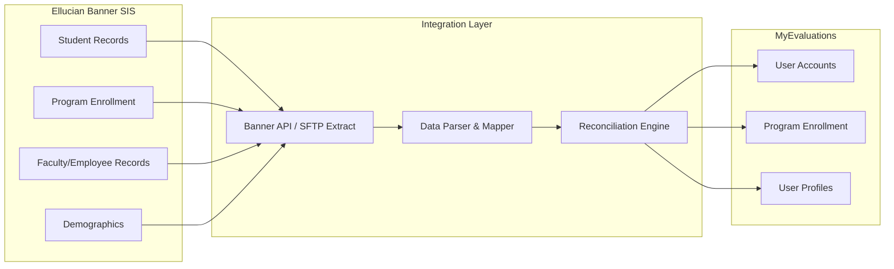
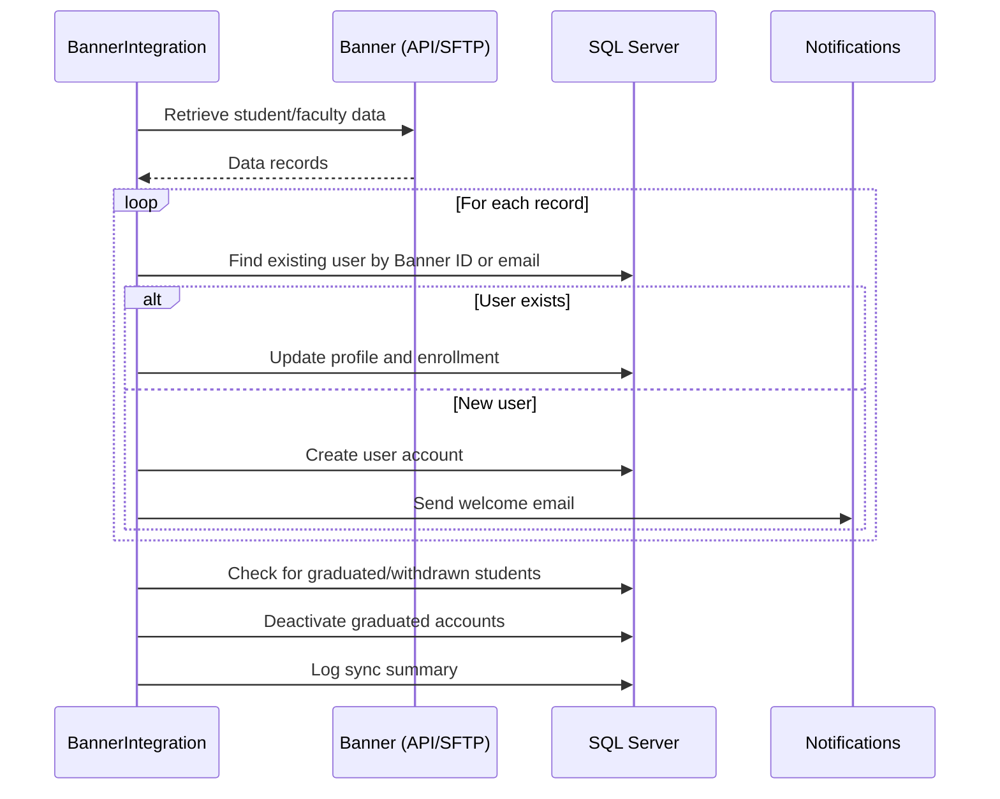

# Banner Integration

MyEvaluations integrates with **Ellucian Banner**, a widely used Student Information System (SIS) in higher education, to synchronize student enrollment, program affiliation, and demographic data. This ensures that trainee records in MyEvaluations stay current with the university's official enrollment data.

## Overview



## Integration Methods

Banner integration supports two methods depending on the institution's infrastructure:

### Method 1: Banner REST API (Preferred)

| Aspect | Details |
|--------|---------|
| **Protocol** | REST API (Ellucian Ethos/Banner API) |
| **Authentication** | API key or OAuth2 |
| **Format** | JSON |
| **Real-time** | Near-real-time (polled every 24 hours) |

### Method 2: SFTP File Extract (Legacy)

| Aspect | Details |
|--------|---------|
| **Protocol** | SFTP file transfer |
| **Format** | CSV or fixed-width text files |
| **Schedule** | Daily file drop by Banner overnight batch |
| **Processing** | Parsed by BannerIntegration scheduler |

## Data Synced

| Data Type | Direction | Fields |
|-----------|-----------|--------|
| Student enrollment | Banner to MyEvals | Student ID, program, status, start/end dates |
| Demographics | Banner to MyEvals | Name, email, phone, address |
| Program affiliation | Banner to MyEvals | Department, degree program, PGY level |
| Faculty/employee | Banner to MyEvals | Faculty ID, department, title, status |
| Graduation status | Banner to MyEvals | Graduation date, degree awarded |

## Data Mapping

| Banner Field | MyEvaluations Field | Notes |
|-------------|---------------------|-------|
| `SPRIDEN_PIDM` | External ID (Banner) | Primary matching key |
| `SPRIDEN_FIRST_NAME` | FirstName | |
| `SPRIDEN_LAST_NAME` | LastName | |
| `GOREMAL_EMAIL_ADDRESS` | Email | Used for user matching |
| `SGBSTDN_PROGRAM_1` | Program Code | Mapped to MyEvals program via config |
| `SGBSTDN_STST_CODE` | Enrollment Status | Active, Graduated, Withdrawn |
| `SGBSTDN_TERM_CODE_EFF` | Enrollment Term | Mapped to academic year |

## Sync Process



## Configuration

```xml
<appSettings>
  <!-- Banner API configuration (Method 1) -->
  <add key="Banner_ApiUrl" value="https://banner.university.edu/api/v1" />
  <add key="Banner_ApiKey" value="*** (stored securely)" />

  <!-- Banner SFTP configuration (Method 2) -->
  <add key="Banner_SftpHost" value="sftp.university.edu" />
  <add key="Banner_SftpUser" value="myevals_integration" />
  <add key="Banner_SftpKeyPath" value="/certs/banner-sftp-key.pem" />
  <add key="Banner_SftpRemotePath" value="/outbound/myevaluations/" />

  <!-- Mapping configuration -->
  <add key="Banner_ProgramMappingTable" value="BannerProgramMapping" />
  <add key="Banner_DefaultRoleForNewStudents" value="Trainee" />
  <add key="Banner_AutoDeactivateOnGraduation" value="true" />
</appSettings>
```

## Key Stored Procedures

| Procedure | Purpose |
|-----------|---------|
| `usp_ImportBannerStudentData` | Create or update user records from Banner |
| `usp_GetBannerProgramMapping` | Retrieve program code mappings |
| `usp_DeactivateGraduatedUsers` | Deactivate users with graduated status |
| `usp_GetBannerSyncLog` | Retrieve sync history |
| `usp_MatchBannerUserToExisting` | Match Banner record to existing MyEvals user |
| `usp_ReconcileBannerEnrollment` | Update enrollment records from Banner data |

## Troubleshooting

| Issue | Cause | Resolution |
|-------|-------|------------|
| SFTP connection fails | SSH key rotation or firewall change | Verify SSH key; check SFTP connectivity |
| New students not created | Program code not in mapping table | Add new program code to `BannerProgramMapping` |
| Active students being deactivated | Banner enrollment status incorrect | Review Banner data; check status code mapping |
| Duplicate users created | Email mismatch between Banner and MyEvals | Review matching logic; update email addresses |
| API returning 403 | API key expired or permissions changed | Contact Banner admin; renew API credentials |

## Related Documentation

- [Data Integration Schedulers](../schedulers/data-integration-schedulers#bannerintegration) -- BannerIntegration scheduler details
