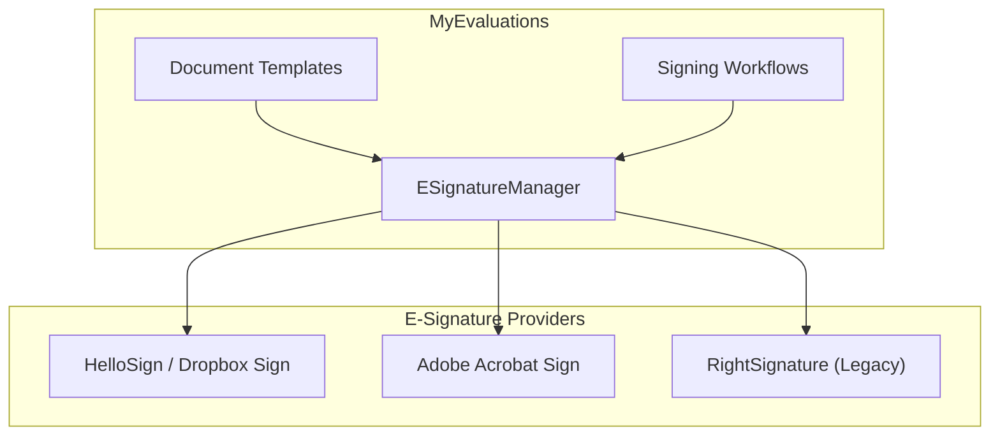
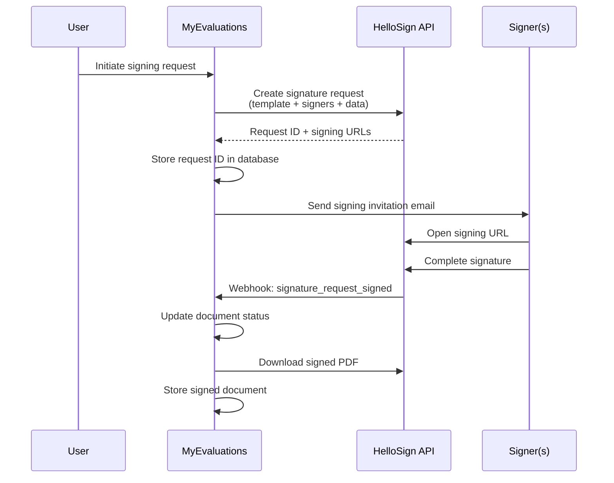

# E-Signature Integrations

MyEvaluations supports electronic signatures through multiple providers to accommodate different institutional preferences. E-signatures are used for evaluation attestation, milestone committee approvals, training verification, and official document signing.

## Supported Providers

| Provider | Status | API Version | Use Cases |
|----------|--------|-------------|-----------|
| **HelloSign** (now Dropbox Sign) | Active (primary) | v3 | Evaluation sign-off, training agreements |
| **AdobeSign** (Adobe Acrobat Sign) | Active | REST API v6 | Formal documents, institutional agreements |
| **RightSignature** | Legacy/Deprecated | v1 | Historical documents only |



## HelloSign (Primary Provider)

### Integration Flow



### Key API Calls

| Operation | HelloSign API Endpoint | Purpose |
|-----------|----------------------|---------|
| Create request | `POST /signature_request/send_with_template` | Initiate a new signing request from a template |
| Check status | `GET /signature_request/{id}` | Check signing progress |
| Download | `GET /signature_request/files/{id}` | Download completed signed document |
| Cancel | `POST /signature_request/cancel/{id}` | Cancel a pending signing request |
| Remind | `POST /signature_request/remind/{id}` | Send reminder to pending signer |

### Document Templates

| Template | Signers | Purpose |
|----------|---------|---------|
| Evaluation Attestation | Evaluator, Subject | Attestation that evaluation was discussed |
| Training Verification | Program Director, Trainee | Verify completion of training requirements |
| Competency Committee | Committee Chair, 2+ Members | CCC milestone decision approval |
| Procedural Consent | Supervising Attending, Resident | Procedure supervision documentation |

## AdobeSign Integration

Used for more formal documents that require institutional-level signatures.

### Authentication

AdobeSign uses OAuth2 with refresh tokens:

```csharp
public class AdobeSignService
{
    public async Task<string> GetAccessTokenAsync()
    {
        // Refresh the access token using stored refresh token
        var response = await _httpClient.PostAsync(
            "https://api.adobesign.com/oauth/refresh",
            new FormUrlEncodedContent(new Dictionary<string, string>
            {
                { "refresh_token", _refreshToken },
                { "client_id", _clientId },
                { "client_secret", _clientSecret },
                { "grant_type", "refresh_token" }
            }));

        var result = await response.Content.ReadAsAsync<TokenResponse>();
        return result.AccessToken;
    }
}
```

## Common Signing Workflow

Regardless of the provider, the signing workflow follows the same pattern:

1. **Initiate:** User triggers a signing request from within MyEvaluations
2. **Create:** The system creates a signature request via the provider's API
3. **Notify:** Signers receive email invitations with signing links
4. **Sign:** Signers complete signatures in the provider's embedded UI
5. **Webhook:** Provider notifies MyEvaluations of completion via webhook
6. **Store:** Signed PDF is downloaded and stored in the document system
7. **Update:** Related records (evaluation, training, etc.) are updated with signature status

## Configuration

```xml
<appSettings>
  <!-- HelloSign configuration -->
  <add key="HelloSign_ApiKey" value="*** (stored securely)" />
  <add key="HelloSign_ClientId" value="*** (stored securely)" />
  <add key="HelloSign_TestMode" value="false" />
  <add key="HelloSign_WebhookUrl" value="https://app.myevaluations.com/api/hellosign/webhook" />

  <!-- AdobeSign configuration -->
  <add key="AdobeSign_ClientId" value="*** (stored securely)" />
  <add key="AdobeSign_ClientSecret" value="*** (stored securely)" />
  <add key="AdobeSign_RefreshToken" value="*** (stored securely)" />
  <add key="AdobeSign_ApiBaseUrl" value="https://api.adobesign.com/api/rest/v6" />

  <!-- Provider selection -->
  <add key="ESignature_DefaultProvider" value="HelloSign" />
</appSettings>
```

## Troubleshooting

| Issue | Cause | Resolution |
|-------|-------|------------|
| Signing request fails | API key expired or rate limited | Check provider dashboard; rotate API key |
| Webhook not received | Webhook URL changed or firewall blocking | Verify webhook URL in provider settings; check firewall rules |
| Signed PDF not downloading | Provider file retention expired | Re-request download; adjust retention settings |
| Signer cannot access document | Email mismatch or link expired | Resend invitation; verify signer email address |

## Related Documentation

- [HelloSign Business Module](../business/hellosign) -- Business logic for HelloSign
