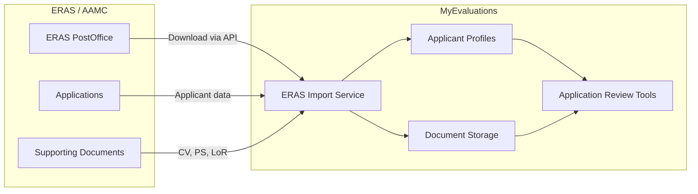
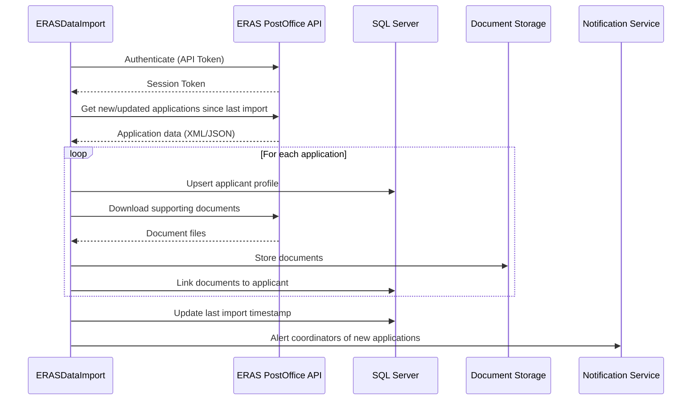

# ERAS Integration

**ERAS (Electronic Residency Application Service)** is the centralized application system managed by the AAMC (Association of American Medical Colleges) used by medical students to apply for residency positions. MyEvaluations integrates with ERAS to import applicant data during the annual Match season.

## Overview



## Integration Details

| Aspect | Details |
|--------|---------|
| **Protocol** | ERAS PostOffice API (SOAP/REST hybrid) |
| **Authentication** | Institution-specific API token (issued annually by AAMC) |
| **Season** | September through March (annual Match cycle) |
| **Data Direction** | Inbound only (ERAS to MyEvaluations) |
| **Scheduler** | `ERASDataImport` -- Daily at 4:00 AM during season |

## Data Imported

### Applicant Profile Data

- AAMC ID and ERAS application ID
- Name, contact information, and demographics
- Medical school name, graduation date, and USMLE/COMLEX scores
- Program preferences and application signals
- Work experience and research history
- Publications and presentations

### Supporting Documents

- Curriculum Vitae (CV)
- Personal Statement
- Letters of Recommendation (LoR)
- Medical Student Performance Evaluation (MSPE/Dean's Letter)
- Transcripts
- USMLE/COMLEX score reports

## Import Process



## Configuration

```xml
<appSettings>
  <!-- ERAS API configuration -->
  <add key="ERAS_ApiUrl" value="https://postoffice.eras.aamc.org/api/v2" />
  <add key="ERAS_ApiToken" value="*** (stored securely)" />
  <add key="ERAS_InstitutionCode" value="XXXX" />

  <!-- Import settings -->
  <add key="ERAS_SeasonStartMonth" value="9" />
  <add key="ERAS_SeasonEndMonth" value="3" />
  <add key="ERAS_ImportBatchSize" value="50" />

  <!-- Document storage -->
  <add key="ERAS_DocumentStoragePath" value="/documents/eras/{year}/" />
</appSettings>
```

## Key Stored Procedures

| Procedure | Purpose |
|-----------|---------|
| `usp_ImportERASApplication` | Create or update an applicant profile from ERAS data |
| `usp_GetERASLastImportTimestamp` | Retrieve the last successful import time |
| `usp_StoreERASDocument` | Save imported document metadata |
| `usp_GetERASApplicationsByProgram` | List imported applications by program |
| `usp_GetERASImportLog` | Retrieve import history and error log |
| `usp_MatchERASToInternalUser` | Link ERAS applicant to existing MyEvaluations user (for re-applicants) |

## Troubleshooting

| Issue | Cause | Resolution |
|-------|-------|------------|
| Import returns zero applications | API token expired (annual renewal) | Contact AAMC for new token; update config |
| Documents failing to download | Document access not granted in ERAS | Verify program has document download permissions in ERAS |
| Duplicate applicant records | Applicant applied to multiple programs | Review deduplication logic; match on AAMC ID |
| Score data missing | Scores not yet released by NBME | Scores import on subsequent sync once available |

## Related Documentation

- [Data Integration Schedulers](../schedulers/data-integration-schedulers#erasdataimport) -- ERASDataImport scheduler details
- [ERAS Business Module](../business/eras) -- ERAS business logic
