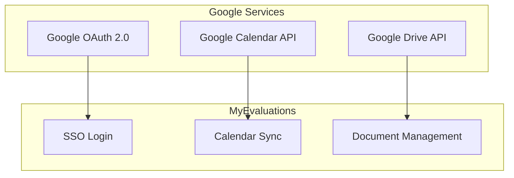
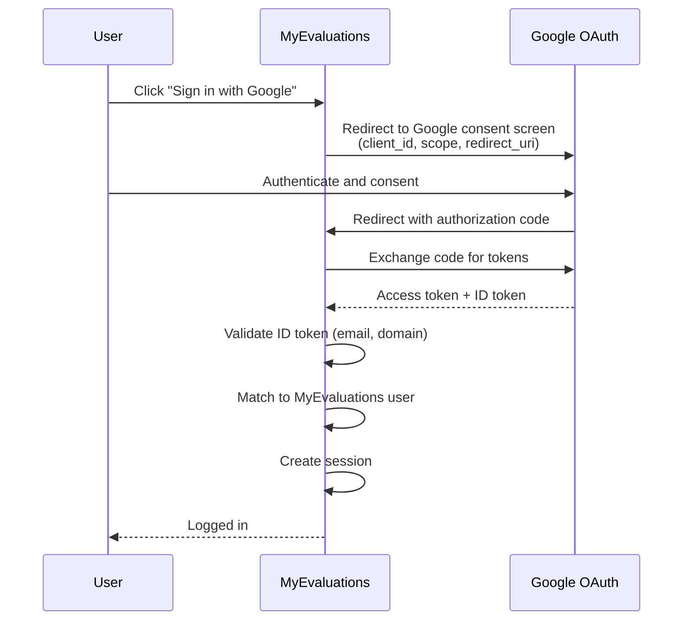
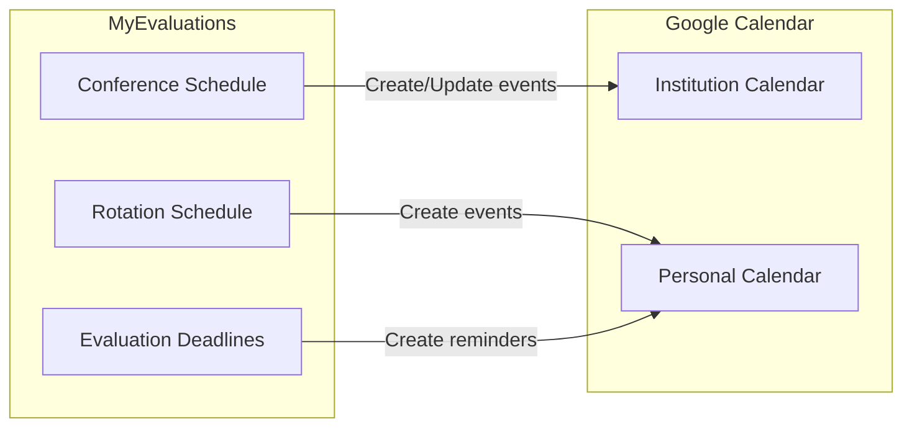

# Google API Integrations

MyEvaluations integrates with several Google services to provide single sign-on (SSO), calendar synchronization, and document management capabilities for institutions that use Google Workspace.

## Overview

| Service | Purpose | Status |
|---------|---------|--------|
| **Google OAuth 2.0** | Single Sign-On (SSO) authentication | Active |
| **Google Calendar API** | Conference and rotation calendar sync | Active |
| **Google Drive API** | Document storage and sharing | Limited use |

## Google OAuth 2.0 (SSO)

### Authentication Flow

### Configuration

Google OAuth is configured per institution. Each institution can enable Google SSO if their domain is a Google Workspace domain.

| Setting | Description |
|---------|-------------|
| `GoogleOAuth_ClientId` | OAuth 2.0 client ID from Google Cloud Console |
| `GoogleOAuth_ClientSecret` | OAuth 2.0 client secret |
| `GoogleOAuth_RedirectUri` | Callback URL after Google authentication |
| `GoogleOAuth_AllowedDomains` | Comma-separated list of allowed email domains |

### User Matching

When a user authenticates via Google SSO:

1. The ID token is decoded to extract the user's email address
2. The email domain is verified against the institution's allowed domains
3. The email is matched to an existing MyEvaluations user account
4. If matched, a session is created; if not matched, the user sees an error

## Google Calendar API

### Calendar Sync Features

- **Conference schedules** pushed to institution Google Calendar
- **Rotation schedules** exported as calendar events
- **Duty hour blocks** exported to personal calendars (opt-in)
- **Evaluation deadlines** added as calendar reminders

### Sync Direction

The calendar sync is primarily **outbound** (MyEvaluations to Google Calendar):

### Key API Operations

| Operation | Google Calendar Endpoint | Purpose |
|-----------|------------------------|---------|
| Create event | `POST /calendars/{calId}/events` | Add conference or rotation to calendar |
| Update event | `PUT /calendars/{calId}/events/{eventId}` | Update schedule changes |
| Delete event | `DELETE /calendars/{calId}/events/{eventId}` | Remove cancelled events |
| List events | `GET /calendars/{calId}/events` | Verify sync status |

## Google Drive API

### Document Storage

Limited integration for institutions that prefer Google Drive for document management:

- Signed documents uploaded to shared Google Drive folders
- Portfolio documents linked from Google Drive
- Scholarly activity manuscripts stored in Drive

## Troubleshooting

| Issue | Cause | Resolution |
|-------|-------|------------|
| SSO login fails | OAuth client credentials expired | Regenerate credentials in Google Cloud Console |
| Calendar events not syncing | Calendar API not enabled in Google Cloud | Enable Calendar API in the GCP project |
| Domain not allowed | User's email domain not in allowed list | Add domain to `GoogleOAuth_AllowedDomains` |
| Token refresh failing | Refresh token revoked by user | User must re-authenticate; delete stored refresh token |
