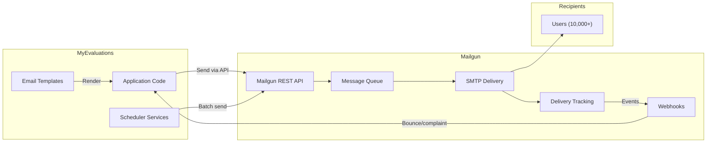

# Mailgun Integration

MyEvaluations uses **Mailgun** as its email delivery service for all transactional emails, notification digests, and system alerts. Mailgun provides reliable delivery, tracking, and bounce handling.

## Overview



## Integration Details

| Aspect | Details |
|--------|---------|
| **API Version** | Mailgun API v3 |
| **Domain** | Custom sending domain (e.g., `mail.myevaluations.com`) |
| **Authentication** | API key (Basic Auth) |
| **Rate Limits** | Account-specific (typically 300 messages/minute) |
| **Tracking** | Opens, clicks, bounces, complaints, unsubscribes |

## Email Types Sent

| Email Type | Volume | Trigger | Priority |
|------------|--------|---------|----------|
| Evaluation reminders | High (~500/day) | EvaluationReminder scheduler | Normal |
| Daily digest | High (~2000/day) | EmailDigestService scheduler | Normal |
| Duty hour violations | Low (~20/day) | DutyHoursViolationCheck | High |
| Password reset | Low (on-demand) | User action | High |
| Account activation | Low (on-demand) | Admin action | High |
| System alerts | Very low | SystemHealthCheck | Critical |

## Implementation

```csharp
public class MailgunService
{
    private static readonly HttpClient _client = new HttpClient();
    private static string ApiKey => ConfigurationManager.AppSettings["Mailgun_ApiKey"];
    private static string Domain => ConfigurationManager.AppSettings["Mailgun_Domain"];
    private static string BaseUrl => $"https://api.mailgun.net/v3/{Domain}";

    public static async Task<bool> SendEmailAsync(
        string to,
        string subject,
        string htmlBody,
        string textBody = null,
        string from = null,
        Dictionary<string, string> customHeaders = null)
    {
        var form = new MultipartFormDataContent
        {
            { new StringContent(from ?? $"MyEvaluations <noreply@{Domain}>"), "from" },
            { new StringContent(to), "to" },
            { new StringContent(subject), "subject" },
            { new StringContent(htmlBody), "html" },
        };

        if (textBody != null)
            form.Add(new StringContent(textBody), "text");

        // Add tracking tags
        form.Add(new StringContent("myevaluations"), "o:tag");

        var request = new HttpRequestMessage(HttpMethod.Post, $"{BaseUrl}/messages")
        {
            Content = form
        };
        request.Headers.Authorization = new AuthenticationHeaderValue(
            "Basic",
            Convert.ToBase64String(Encoding.ASCII.GetBytes($"api:{ApiKey}")));

        var response = await _client.SendAsync(request);
        return response.IsSuccessStatusCode;
    }
}
```

## Email Templates

Email templates are stored in the database and rendered server-side with token replacement:

| Template | Tokens | Used By |
|----------|--------|---------|
| `EvaluationReminder` | `{UserName}`, `{EvaluationList}`, `{DueDate}`, `{LoginUrl}` | EvaluationReminder scheduler |
| `DailyDigest` | `{UserName}`, `{PendingTasks}`, `{Deadlines}`, `{Notifications}` | EmailDigestService |
| `DutyHourViolation` | `{ResidentName}`, `{ViolationType}`, `{Details}` | DutyHoursViolationCheck |
| `PasswordReset` | `{UserName}`, `{ResetLink}`, `{ExpirationTime}` | Password reset flow |
| `WelcomeEmail` | `{UserName}`, `{LoginUrl}`, `{TempPassword}` | Account creation |

## Webhook Handling

Mailgun sends delivery event webhooks back to MyEvaluations:

```csharp
// Webhook endpoint for delivery events
[Route("api/mailgun/webhook")]
public class MailgunWebhookHandler : IHttpHandler
{
    public void ProcessRequest(HttpContext context)
    {
        var eventData = ParseWebhookPayload(context.Request);

        switch (eventData.EventType)
        {
            case "bounced":
                HandleBounce(eventData);
                break;
            case "complained":
                HandleComplaint(eventData);
                break;
            case "delivered":
                HandleDelivered(eventData);
                break;
        }
    }
}
```

## Configuration

```xml
<appSettings>
  <add key="Mailgun_ApiKey" value="key-*** (stored securely)" />
  <add key="Mailgun_Domain" value="mail.myevaluations.com" />
  <add key="Mailgun_FromAddress" value="noreply@myevaluations.com" />
  <add key="Mailgun_FromName" value="MyEvaluations" />
  <add key="Mailgun_WebhookSigningKey" value="*** (stored securely)" />
  <add key="Mailgun_BatchSize" value="100" />
</appSettings>
```

## Troubleshooting

| Issue | Cause | Resolution |
|-------|-------|------------|
| Emails not delivering | API key invalid or domain not verified | Check Mailgun dashboard; verify domain DNS records |
| Emails going to spam | SPF/DKIM not configured | Verify DNS records (SPF, DKIM, DMARC) for sending domain |
| Bounce rate increasing | Invalid email addresses accumulating | Review bounce webhook data; clean email list |
| Rate limit errors | Sending too many emails in batch | Reduce batch size; stagger sends over time |
| Webhook events not processing | Webhook URL changed or signing key mismatch | Verify webhook URL in Mailgun settings; update signing key |
