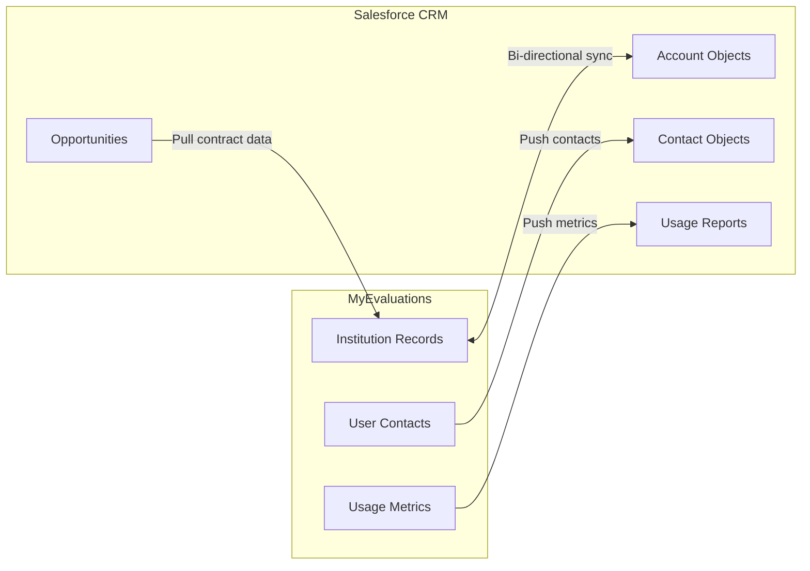
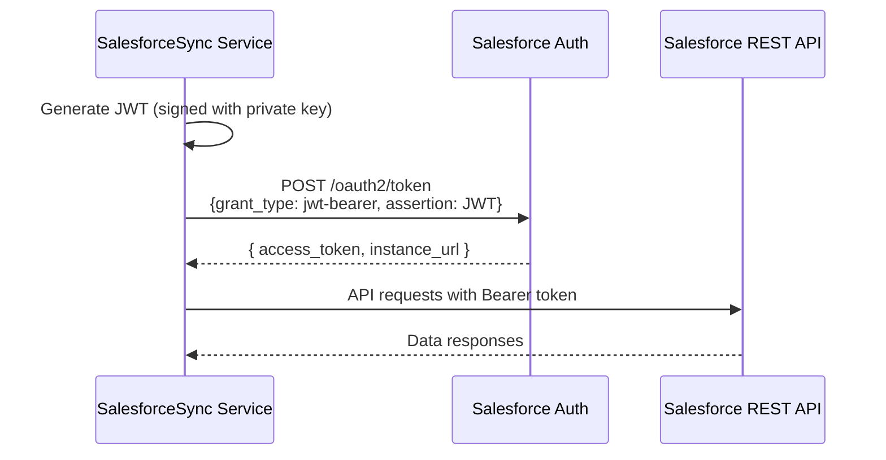

# Salesforce Integration

MyEvaluations integrates with **Salesforce CRM** to maintain alignment between the platform's institution data and the sales/customer success team's customer records. The integration enables bi-directional synchronization of account information, usage metrics, and contact data.

## Overview



## Sync Details

| Direction | Data | Frequency |
|-----------|------|-----------|
| **Outbound** (MyEvals to SF) | Institution usage metrics, user counts, feature adoption | Daily at 2:00 AM |
| **Outbound** (MyEvals to SF) | Admin contact information | Daily at 2:00 AM |
| **Inbound** (SF to MyEvals) | Account name, contract dates, support tier | Daily at 2:00 AM |
| **Inbound** (SF to MyEvals) | Sales contact assignments | Daily at 2:00 AM |

## Authentication

Salesforce integration uses the **OAuth 2.0 JWT Bearer Flow** for server-to-server authentication:



## Data Mapping

### Institution to Account

| MyEvaluations Field | Salesforce Field | Direction |
|--------------------|------------------|-----------|
| `InstitutionID` | `MyEvals_ID__c` (custom field) | Out |
| `InstitutionName` | `Name` | Bi-directional |
| `ActiveUserCount` | `Active_Users__c` | Out |
| `ProgramCount` | `Active_Programs__c` | Out |
| `ContractStartDate` | `Contract_Start__c` | In |
| `ContractEndDate` | `Contract_End__c` | In |
| `SupportTier` | `Support_Tier__c` | In |

### Usage Metrics Pushed

| Metric | Salesforce Field | Calculation |
|--------|-----------------|-------------|
| Active users (30 days) | `Monthly_Active_Users__c` | Users with login in last 30 days |
| Evaluations completed (month) | `Monthly_Evaluations__c` | Count of completed evaluations |
| Feature adoption score | `Feature_Adoption_Score__c` | Weighted score of features used |
| Last login date | `Last_Platform_Login__c` | Most recent user login |

## Key Stored Procedures

| Procedure | Purpose |
|-----------|---------|
| `usp_GetInstitutionUsageMetrics` | Aggregate usage data for Salesforce export |
| `usp_UpdateInstitutionFromSalesforce` | Update institution records from Salesforce data |
| `usp_GetSalesforceSyncMapping` | Retrieve ID mapping between systems |
| `usp_GetSalesforceSyncLog` | Retrieve sync history and errors |

## Configuration

```xml
<appSettings>
  <add key="Salesforce_LoginUrl" value="https://login.salesforce.com" />
  <add key="Salesforce_ClientId" value="*** (stored securely)" />
  <add key="Salesforce_PrivateKeyPath" value="/certs/salesforce-private-key.pem" />
  <add key="Salesforce_Username" value="integration@myevaluations.com" />
  <add key="Salesforce_ApiVersion" value="v58.0" />
</appSettings>
```

## Troubleshooting

| Issue | Cause | Resolution |
|-------|-------|------------|
| Authentication failure | JWT certificate expired | Generate new certificate; upload public key to Salesforce Connected App |
| Sync missing institutions | New institution not mapped in Salesforce | Create Account in Salesforce; add `MyEvals_ID__c` value |
| Usage metrics showing zero | Metrics query timeout | Check query performance; increase timeout for metrics aggregation |
| Rate limit errors | Too many API calls in sync batch | Reduce batch size; use Salesforce Bulk API for large syncs |

## Related Documentation

- [Data Integration Schedulers](../schedulers/data-integration-schedulers#salesforcesync) -- SalesforceSync scheduler details
