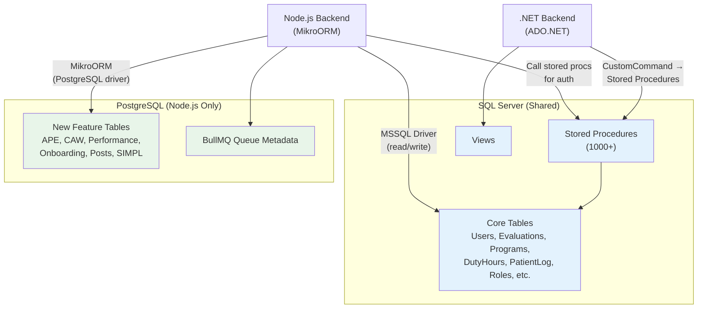
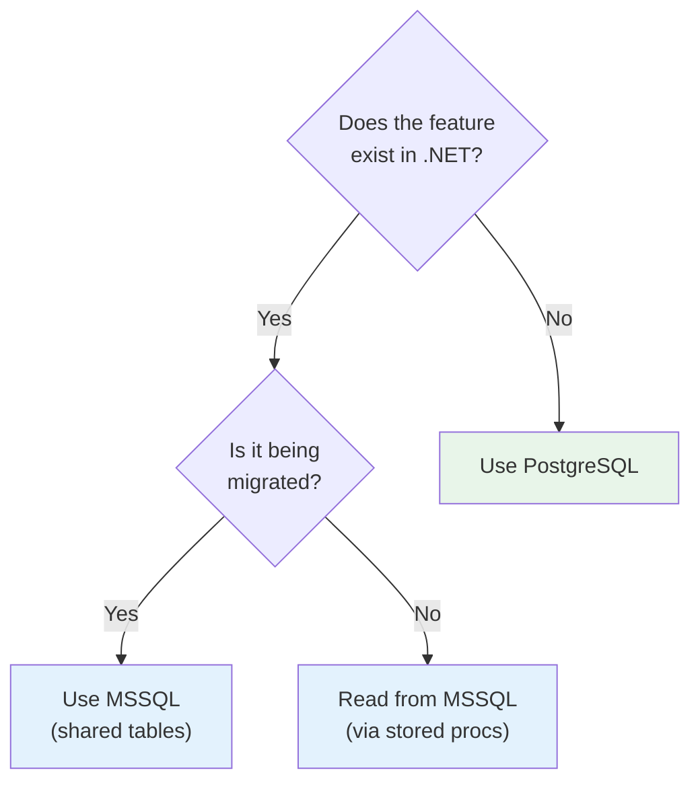

# Shared Database Coexistence

The MyEvaluations MSSQL database is shared between the .NET backend (ADO.NET + stored procedures) and the Node.js backend (MikroORM). This shared-database approach is a deliberate architectural decision that enables incremental migration without data duplication.

## Architecture



## What Lives Where

### MSSQL (Shared Between Both Backends)

All legacy data and any data that both backends need to access:

| Data Category | Examples | Accessed By |
|---------------|----------|-------------|
| User accounts & profiles | `tblUser`, `tblUserRole` | Both |
| Authentication & sessions | `tblSession`, `tblPrivilege` | Both (Node.js reads via stored procs) |
| Evaluations | `tblEvaluation`, `tblEvaluationForm` | Both |
| Duty hours | `tblDutyHours`, `tblDutyHoursEntry` | Both |
| Patient logs | `tblPatientLog`, `tblDiagnosis` | Both |
| Programs & institutions | `tblProgram`, `tblInstitution` | Both |
| CME tracking | `tblCME`, `tblCMECredit` | .NET (migration planned) |
| Scheduling & rotations | `tblRotation`, `tblBlock` | .NET primarily |
| Reports configuration | Various report tables | .NET primarily |

### PostgreSQL (Node.js Only)

New features built exclusively on the Node.js backend:

| Data Category | Examples | Notes |
|---------------|----------|-------|
| APE (Annual Program Evaluation) | `ape_*` tables | Never existed in .NET |
| CAW (Clinical Activity Workflow) | `caw_*` tables | Never existed in .NET |
| Performance reviews | `performance_*` tables | Never existed in .NET |
| Onboarding workflows | `onboarding_*` tables | Never existed in .NET |
| Posts / announcements | `post_*` tables | Never existed in .NET |
| SIMPL | `simpl_*` tables | Never existed in .NET |
| BullMQ job history | Queue metadata tables | Infrastructure |

## Rules for Schema Changes

:::danger Critical Rules
These rules prevent data corruption and ensure both backends remain functional during the migration period.
:::

### Rule 1: MSSQL Schema Changes Must Be Backward-Compatible

Any change to the shared MSSQL schema must work with both the .NET and Node.js backends simultaneously.

**Allowed:**
- Adding new columns with default values
- Adding new tables
- Adding new stored procedures
- Adding new indexes

**Requires Coordination:**
- Renaming columns (both backends must update simultaneously)
- Changing column types (must be compatible with both ADO.NET and MikroORM)
- Modifying stored procedure signatures (Node.js may call them directly)

**Forbidden:**
- Dropping columns that .NET still references
- Dropping stored procedures that .NET still calls
- Changing primary key types

### Rule 2: New Features Use PostgreSQL

If a feature is being built from scratch on Node.js and has no .NET dependency, its data belongs in PostgreSQL.



### Rule 3: Node.js Auth Always Goes Through Stored Procedures

The Node.js backend authenticates users by calling .NET's existing stored procedures:

- `GetLoggedInUserInfo` -- Retrieves the authenticated user's profile
- `GetPrivilegesForRole` -- Returns the role-based access control permissions

This ensures authentication behavior is identical in both backends.

### Rule 4: No Direct Table Writes for Migrating Features (Initially)

When a feature is first being migrated, the Node.js backend should:

1. **Read** from MSSQL tables directly via MikroORM
2. **Write** through stored procedures when they encapsulate business rules
3. Only switch to direct MikroORM writes after the .NET code path is fully deprecated

This prevents situations where one backend writes data that the other cannot correctly read or process.

## MikroORM Configuration for Dual Databases

The Node.js backend maintains two MikroORM connections:

```typescript
// Simplified configuration example
const mikroOrmConfig = {
  // Primary: MSSQL for shared legacy data
  driver: MsSqlDriver,
  host: process.env.MSSQL_HOST,
  dbName: process.env.MSSQL_DATABASE,
  entities: ['./dist/entities/mssql/**/*.js'],
};

const mikroOrmPostgresConfig = {
  // Secondary: PostgreSQL for new features
  driver: PostgreSqlDriver,
  host: process.env.PG_HOST,
  dbName: process.env.PG_DATABASE,
  entities: ['./dist/entities/postgres/**/*.js'],
};
```

## Common Pitfalls

### 1. DateTime Handling

MSSQL uses `datetime` and `datetime2` types. Ensure MikroORM entities map these correctly -- timezone handling differs between ADO.NET and MikroORM.

### 2. Identity Columns

MSSQL identity columns auto-increment. When writing through MikroORM, do not attempt to set identity values manually.

### 3. Stored Procedure Output Parameters

Some .NET stored procedures use output parameters. MikroORM's raw query support handles this differently than ADO.NET's `CustomCommand`.

### 4. Transaction Isolation

The .NET backend defaults to `READ COMMITTED`. Ensure the Node.js backend uses the same isolation level to avoid phantom reads or dirty reads when both backends operate on the same data.

### 5. Collation

The MSSQL database uses a specific collation (typically `SQL_Latin1_General_CP1_CI_AS`). String comparisons in MikroORM queries must account for this, especially for case-sensitive lookups.

## Monitoring Shared Access

To ensure both backends are not conflicting:

- **New Relic** monitors Node.js database queries and latency
- **SQL Server Profiler** can trace queries from both backends (filter by application name)
- **Deadlock monitoring** -- Both backends accessing the same tables increases deadlock risk; monitor via SQL Server's deadlock graph

<!-- AUTO-GENERATED: Table counts and stored procedure mappings will be enriched from parse-dotnet scripts -->
