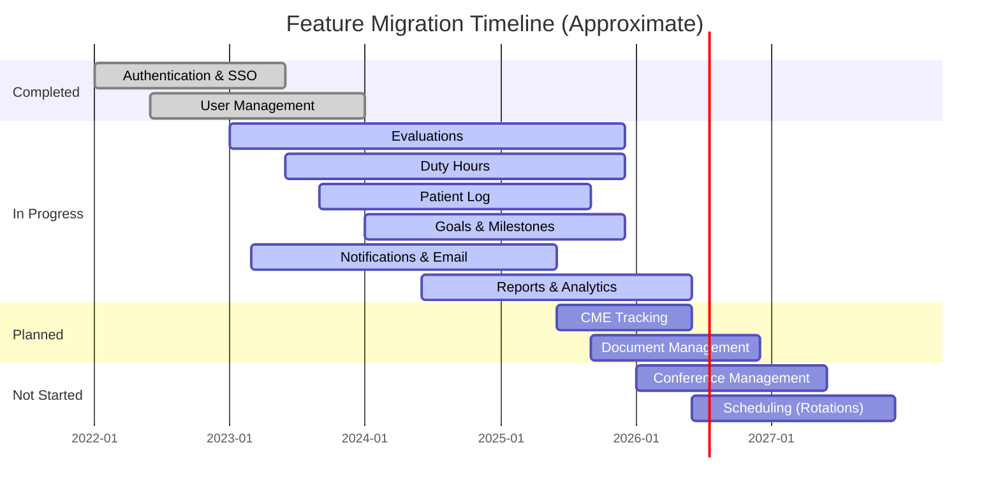

import MigrationTracker from '@site/src/components/MigrationTracker';

# Migration Status

This page tracks the feature-by-feature migration from the legacy .NET WebForms backend to the modern Node.js (NestJS) backend. The tracker below shows the current state of each major feature area.

:::info Auto-Generated Data
The migration percentages below are based on sample data. These will be updated as the automated repo-sync scripts parse actual migration markers from the codebase.
:::

## Current Migration Dashboard

<MigrationTracker />

## Status Definitions

| Status | Meaning |
|--------|---------|
| **Active** (.NET) | Feature is actively used in the .NET backend and handles production traffic |
| **Legacy** (.NET) | Feature still exists in .NET but is being phased out; Node.js handles most traffic |
| **Deprecated** (.NET) | Feature is marked for removal; all traffic should go through Node.js |
| **Complete** (Node.js) | Feature is fully implemented in Node.js and ready for production |
| **In Progress** (Node.js) | Feature is partially implemented; some endpoints or logic still live in .NET |
| **Planned** (Node.js) | Feature is scoped for migration but development has not started |
| **Not Started** (Node.js) | Feature has no migration plan yet |

## How Migration Percentage Is Calculated

The migration percentage for each feature considers:

1. **API endpoint coverage** -- How many .NET API endpoints have equivalent Node.js endpoints
2. **Business logic migration** -- Whether the core business rules have been ported to NestJS services
3. **UI migration** -- Whether the associated WebForms pages have been replaced by React pages
4. **Worker/scheduler migration** -- Whether background jobs have been moved to BullMQ workers
5. **Data access** -- Whether the feature reads/writes through MikroORM instead of stored procedures

## Migration Timeline

## Key Migration Milestones

| Milestone | Target | Status |
|-----------|--------|--------|
| All new features on Node.js only | Ongoing | Active policy since 2022 |
| Authentication fully shared | Q2 2023 | Complete |
| 50% of API endpoints migrated | Q4 2025 | In Progress |
| All BullMQ workers replacing Windows Services | Q2 2026 | In Progress |
| React replaces all critical WebForms pages | Q4 2026 | In Progress |
| .NET backend enters maintenance-only mode | 2027 | Planned |

## Tracking Changes

Migration status is updated when:

- A new NestJS module or controller is merged that replaces .NET functionality
- A React page goes live replacing a WebForms page
- A BullMQ worker replaces a Windows Service scheduler
- A feature's traffic is fully routed away from .NET

<!-- AUTO-GENERATED: Migration percentages will be enriched from parse-dotnet and repo-sync scripts -->
