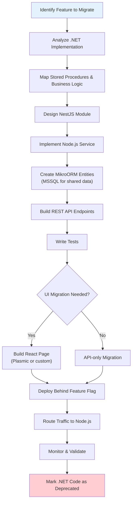

# Strangler Fig Migration Strategy

MyEvaluations follows the [Strangler Fig](https://martinfowler.com/bliki/StranglerFigApplication.html) pattern -- incrementally replacing the .NET monolith feature-by-feature rather than attempting a risky full rewrite. The new system "grows around" the old one, just as a strangler fig grows around its host tree.

## Why Strangler Fig

| Approach | Risk | Timeline | Customer Impact |
|----------|------|----------|-----------------|
| Big-bang rewrite | Very high | 2-3 years with no value | Major disruption at launch |
| **Strangler Fig** | **Low per iteration** | **Continuous delivery** | **Minimal -- features migrate transparently** |
| Freeze and maintain | Low | Indefinite | Technical debt grows forever |

The platform serves 10,000+ users across 900+ healthcare institutions. Any migration strategy must prioritize zero downtime and backward compatibility.

## The Pattern in Practice

```mermaid
graph TB
    subgraph "Step 1: Intercept"
        direction LR
        R1["Request"] --> Proxy1["Routing Layer<br/>(IIS + Reverse Proxy)"]
        Proxy1 -->|"Most traffic"| Old1[".NET Backend"]
        Proxy1 -.->|"New feature"| New1["Node.js Backend"]
    end

    subgraph "Step 2: Build Replacement"
        direction LR
        R2["Request"] --> Proxy2["Routing Layer"]
        Proxy2 -->|"Legacy traffic"| Old2[".NET Backend"]
        Proxy2 -->|"Migrated + new"| New2["Node.js Backend"]
        New2 -->|"Shared data"| DB2["MSSQL"]
        Old2 --> DB2
    end

    subgraph "Step 3: Redirect Traffic"
        direction LR
        R3["Request"] --> Proxy3["Routing Layer"]
        Proxy3 -.->|"Shrinking"| Old3[".NET Backend"]
        Proxy3 -->|"Most traffic"| New3["Node.js Backend"]
    end

    subgraph "Step 4: Retire Legacy"
        direction LR
        R4["Request"] --> New4["Node.js Backend"]
        Old4[".NET Backend<br/>(Decommissioned)"] ~~~ New4
    end

    style Old1 fill:#ffcdd2
    style Old2 fill:#ffcdd2
    style Old3 fill:#ffcdd2,stroke-dasharray: 5 5
    style Old4 fill:#e0e0e0,stroke-dasharray: 5 5
    style New1 fill:#c8e6c9
    style New2 fill:#c8e6c9
    style New3 fill:#c8e6c9
    style New4 fill:#c8e6c9
```

## Migration Decision Criteria

When deciding whether and when to migrate a feature, the team evaluates:

### Must Migrate (High Priority)

- Feature has active development or frequent bug fixes in .NET
- Feature is needed by the mobile app (MAUI talks to Node.js)
- Feature has performance bottlenecks in the legacy stack
- Feature blocks a new capability that cannot be built in .NET

### Should Migrate (Medium Priority)

- Feature is stable but would benefit from modern testing and observability
- Feature has complex stored procedures that are hard to maintain
- Feature is tightly coupled to other features already migrated

### Defer Migration (Low Priority)

- Feature is stable, rarely changed, and has no bugs
- Feature is only used by a small number of institutions
- Cost of migration outweighs benefit (e.g., Conference Management)

### Do Not Migrate

- Feature is already deprecated or unused
- Feature will be removed when a contract or integration is sunset

## How a Feature Gets Migrated

### Step-by-Step Process

1. **Analyze the .NET code**: Read the Manager classes, Info DTOs, stored procedures, and ASPX pages for the feature
2. **Map dependencies**: Identify which other .NET modules or stored procedures the feature depends on
3. **Design the NestJS module**: Create a module with controllers, services, and MikroORM entities
4. **Implement shared-database access**: Use MikroORM's MSSQL driver to read/write the same tables as .NET
5. **Build API endpoints**: Create REST endpoints that match or improve on the .NET API surface
6. **Migrate UI (if applicable)**: Build a React page using Plasmic or custom components
7. **Deploy and route**: Deploy behind a feature flag, then gradually route traffic
8. **Validate**: Compare outputs between .NET and Node.js for correctness
9. **Deprecate .NET code**: Mark the old code as deprecated but do not delete it immediately

## Rules for the Migration

1. **Never modify .NET for new features** -- New functionality is built exclusively in Node.js
2. **.NET receives only bug fixes** -- Critical fixes can still be applied to the legacy codebase
3. **Shared database is sacred** -- Schema changes to MSSQL must be backward-compatible with both backends
4. **Authentication is shared** -- Node.js reads from .NET's auth stored procedures (`GetLoggedInUserInfo`, `GetPrivilegesForRole`)
5. **Feature flags control rollout** -- Traffic shifts happen gradually, not all at once
6. **Both backends must work simultaneously** -- No flag day cutovers

## Current State

The migration is in **Phase 1: Coexistence**. The majority of traffic still flows through the .NET backend, but all new features are built on Node.js. Key areas already migrated or in progress:

- Authentication and SSO (shared)
- User management (largely migrated)
- Evaluations (in progress)
- Duty hours (in progress)
- Patient log (in progress)
- Notifications (in progress)
- APE, CAW, Performance, Onboarding (Node.js-only, never existed in .NET)

See [Migration Status](/docs/dotnet-backend/migration/status) for the full feature-by-feature tracker.
