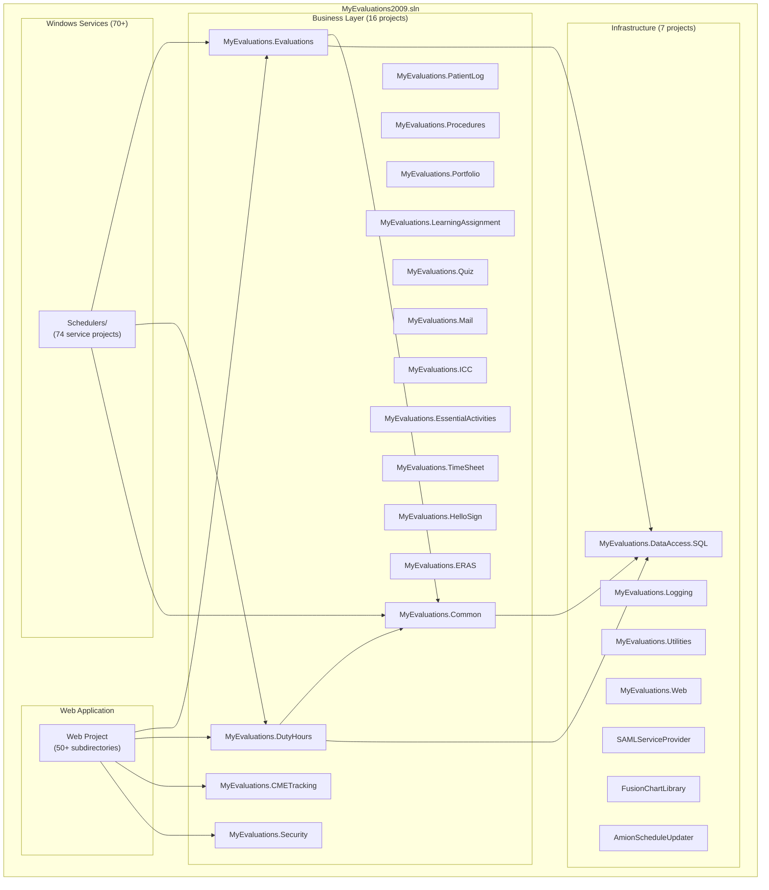
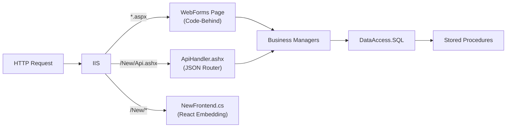

# .NET Backend Overview

The .NET backend is the **core system** of MyEvaluations, originating from 2009 as `MyEvaluations2009.sln`. It is a large-scale ASP.NET WebForms monolith built on .NET Framework 4.6.1, serving as the primary backend for 10,000+ users across 900+ healthcare education institutions.

:::info Primary Documentation Focus
The .NET backend is the primary focus of this documentation site because it contains the majority of business logic, has the steepest learning curve, and is the system most developers need to understand when working on MyEvaluations.
:::

## Technology Stack

| Component | Technology | Version |
|-----------|-----------|---------|
| Framework | .NET Framework | 4.6.1 |
| Web Framework | ASP.NET WebForms | 4.x |
| Language | C# | 5.0 |
| Database | SQL Server | 2016+ |
| Data Access | ADO.NET + Stored Procedures | -- |
| Web Server | IIS (Internet Information Services) | 10.0 |
| Logging | Enterprise Library | 6.0 |
| Charts | FusionCharts | -- |
| File Management | CKFinder | 3.x |
| Build System | MSBuild + NuGet | -- |
| IDE | Visual Studio 2019 | Professional/Enterprise |

## Solution Structure

The solution `MyEvaluations2009.sln` contains **27 main projects** organized into four categories:



## Project Categories

### Business Layer (16 Projects)

The business layer contains all domain logic, organized by functional module. Each business project follows the **Manager/Info pattern** (see [Manager/Info Pattern](/docs/dotnet-backend/patterns/manager-info)).

#### Primary Business Projects

<!-- AUTO-GENERATED: Class counts and method counts will be enriched from parse-dotnet-classes script -->

| Project | Namespace | Key Classes | Description |
|---------|-----------|-------------|-------------|
| `MyEvaluations.Common` | `MyEvaluations.Common` | Shared managers, base classes | Common business logic shared across modules |
| `MyEvaluations.Evaluations` | `MyEvaluations.Evaluations` | 35+ classes | Evaluation creation, distribution, completion, scoring |
| `MyEvaluations.DutyHours` | `MyEvaluations.DutyHours` | 55+ classes | ACGME duty hour tracking, compliance, violations |
| `MyEvaluations.CMETracking` | `MyEvaluations.CMETracking` | 25+ classes | Continuing Medical Education credit tracking |
| `MyEvaluations.PatientLog` | `MyEvaluations.PatientLog` | 20+ classes | Patient encounter logging |
| `MyEvaluations.Procedures` | `MyEvaluations.Procedures` | 30+ classes | Surgical/clinical procedure tracking |
| `MyEvaluations.Portfolio` | `MyEvaluations.Portfolio` | -- | Resident portfolio management |
| `MyEvaluations.LearningAssignment` | `MyEvaluations.LearningAssignment` | 10+ classes | Academic learning assignment management |
| `MyEvaluations.Quiz` | `MyEvaluations.Quiz` | -- | Quiz/assessment creation and grading |
| `MyEvaluations.Mail` | `MyEvaluations.Mail` | -- | Email composition and distribution |
| `MyEvaluations.Security` | `MyEvaluations.Security` | -- | User authentication, roles, privileges |

#### Specialized Business Projects

| Project | Description |
|---------|-------------|
| `MyEvaluations.ICC` | In-Training Competency Committee evaluations |
| `MyEvaluations.EssentialActivities` | Essential activity tracking for accreditation |
| `MyEvaluations.NurseNotifyService` | Nursing notification workflows |
| `MyEvaluations.TimeSheet` | 20+ classes for timesheet management |
| `MyEvaluations.HelloSign` | 25+ classes for e-signature integration |
| `MyEvaluations.ERAS` | Electronic Residency Application Service integration |

### Infrastructure Layer (7 Projects)

| Project | Description | Key Classes |
|---------|-------------|-------------|
| `MyEvaluations.DataAccess.SQL` | Stored procedure wrappers, ADO.NET data access | `DBDataAccess`, `CustomCommand` |
| `MyEvaluations.Logging` | Enterprise Library-based logging | Structured logging, error handling |
| `MyEvaluations.Utilities` | Cross-cutting utilities | `EmailUtility`, `FileManager`, `ExcelProcess`, `CSV`, encryption |
| `MyEvaluations.Web` | Web infrastructure | Auth services, home redirection, session management |
| `SAMLServiceProvider` | SAML SSO implementation | SAML request/response handling |
| `FusionChartLibrary` | Chart generation | 15+ chart classes for reports |
| `AmionScheduleUpdater` | Amion schedule import | Schedule data integration |

### Web Application (1 Project, 50+ Subdirectories)

The web project is the ASP.NET WebForms application that serves the user interface:

| Subdirectory | Pages | Description |
|-------------|-------|-------------|
| `CMETracking/` | 50+ | CME credit management pages |
| `DutyHours/` | 20+ | Duty hours entry and reports |
| `PatientLog/` | 25+ | Patient encounter logging |
| `Evaluations/` | -- | Evaluation forms and management |
| `Procedures/` | -- | Procedure tracking pages |
| `MyPortfolio/` | -- | Resident portfolio pages |
| `LearningAssignment/` | -- | Learning assignment pages |
| `Quiz/` | -- | Quiz/assessment pages |
| `Preceptor/` | 50+ | Administrative/preceptor management |
| `MySchedule/` | -- | Schedule viewing and management |
| `Curriculum/` | 20+ | Curriculum management |
| `Reports/` | -- | Reporting pages |
| `Security/` | -- | User and role management |
| `UserControls/` | 25+ | Reusable ASCX user controls |
| `OnCall/` | -- | QGenda/Momentum/Tangier integration |
| `MyGME/` | -- | GME-specific pages |
| `NewFrontend/` | -- | React integration (HTML partial embedding) |

### Windows Services / Schedulers (70+ Projects)

The `Schedulers/` directory contains 70+ Windows Service projects that run as scheduled tasks. These handle background processing like evaluation reminders, data imports, and compliance checks.

See [Schedulers Documentation](/docs/dotnet-backend/schedulers/) for the complete catalog.

| Category | Count | Examples |
|----------|-------|---------|
| Evaluation & Assessment | 6 | Reminders, auto-filing, auto-assignments |
| Clinical & Patient Care | 7 | Patient log, procedure, FNP reminders |
| Duty Hours & Compliance | 3 | Duty reminders, verification, on-call |
| Learning & Academic | 8 | Assignments, onboarding, rotation requirements |
| License & Certification | 6 | DEA, liability, state licenses, certificates |
| Communication | 6 | Mail distribution, notifications, inbox |
| Data Integration | 12 | Banner, Salesforce, BSN, file processing |
| Administrative | 8 | Accreditation, contracts, user archiving, milestones |
| Conference | 4 | Conference mail, attendee/presenter reminders |
| Specialized | 18+ | Various workflow-specific processors |

## Key Architectural Patterns

### Manager/Info Pattern

The primary architectural pattern throughout the business layer:

- **Managers** (`*Manager.cs`) -- Service classes containing business logic
- **Info** (`*Info.cs`) -- Data Transfer Objects (DTOs) carrying data between layers

```csharp
// Simplified example
public class EvaluationsManager
{
    public EvaluationsInfo GetEvaluation(int evaluationId)
    {
        CustomCommand cmd = new CustomCommand("usp_EvalGetByID");
        cmd.AddParameter("@EvaluationID", evaluationId, SqlDbType.Int);
        DataSet ds = DBDataAccess.ExecuteDataSet(cmd);
        return EvaluationsInfo.FromDataRow(ds.Tables[0].Rows[0]);
    }
}
```

See [Manager/Info Pattern](/docs/dotnet-backend/patterns/manager-info) for detailed documentation.

### Data Access Pattern

All database interaction goes through stored procedures via `DBDataAccess` and `CustomCommand`:

```
Business Manager → CustomCommand (build SQL params) → DBDataAccess (execute) → SQL Server (stored proc)
```

See [Data Access Patterns](/docs/dotnet-backend/patterns/data-access) for detailed documentation.

### Request Routing

The web application handles two types of requests:

1. **WebForms pages** (`*.aspx`) -- Traditional server-rendered pages
2. **JSON API** (`ApiHandler.ashx`) -- Central API router for React frontend calls



## Key Files and Entry Points

| File | Purpose |
|------|---------|
| `Web/Login.aspx` | Login page (start page for local debugging) |
| `Web/ApiHandler.ashx` | Central JSON API router for React frontend |
| `Web/NewFrontend.cs` | Fetches React HTML partials from Azure CDN |
| `Web/Global.asax` | Application lifecycle events |
| `Web/Web.config` | Application configuration (connection strings, etc.) |
| `DataAccess.SQL/DBDataAccess.cs` | Core data access utility class |
| `DataAccess.SQL/CustomCommand.cs` | SQL command builder |

## Build and Run

```bash
# Restore NuGet packages (from VS Developer Command Prompt)
nuget restore MyEvaluations2009.sln

# Build the solution
msbuild MyEvaluations2009.sln /p:Configuration=Debug

# Run locally: Set Web/Login.aspx as Start Page in Visual Studio
# Then press F5 or Ctrl+F5
```

### Required Local Files (Not in Source Control)

These files must be created manually on each developer's machine and on the production server:

- `key.txt` -- Primary encryption key
- `Encryptkey.txt` -- Secondary encryption key
- `Vectorkey.txt` -- Encryption initialization vector

### Connection String

The local connection string is configured in `Web/Web.config`:

```xml
<connectionStrings>
  <add name="MyEvalsConnectionString"
       connectionString="Server=localhost;Database=MyEvaluations;Integrated Security=true;"
       providerName="System.Data.SqlClient" />
</connectionStrings>
```

:::warning VPN Required
Developers must be connected to the VPN to access the development SQL Server database. Local development without VPN requires a local SQL Server instance with a restored database backup.
:::

## Compliance and Patents

- **SOC 2 Compliant** -- The platform maintains SOC 2 compliance
- **U.S. Patent #7,899,702** -- Covers the evaluation management methodology
- **ACGME Requirements** -- Duty hour tracking meets ACGME compliance requirements

## Coding Standards

Enforced via `.editorconfig`:

| Setting | Value |
|---------|-------|
| Indent style | 4 spaces (C#/ASPX), 2 spaces (XML/JSON) |
| Encoding | UTF-8 with BOM |
| Line endings | LF |
| Naming (types, methods) | PascalCase |
| Naming (locals) | camelCase |
| Naming (private fields) | _camelCase |

## Repository Statistics

| Metric | Value |
|--------|-------|
| Pull Requests | 897+ |
| Top Contributors | 7 |
| Repository Size | 453 MB |
| Projects in Solution | 27+ main, 70+ schedulers |
| Stored Procedures | 1000+ |
| ASPX Pages | 200+ |
| Branch | `master` |

<!-- AUTO-GENERATED: Detailed project metrics, class counts, and dependency analysis will be enriched from the parse-dotnet scripts -->
