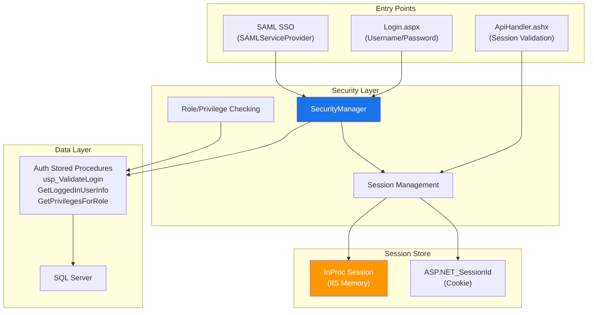
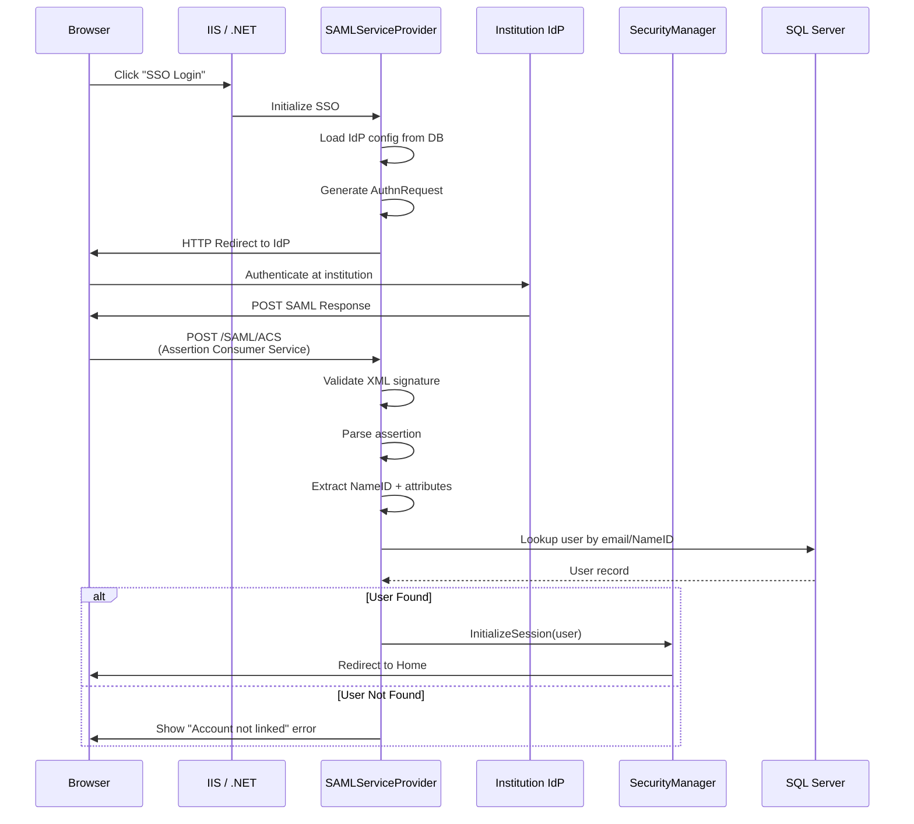
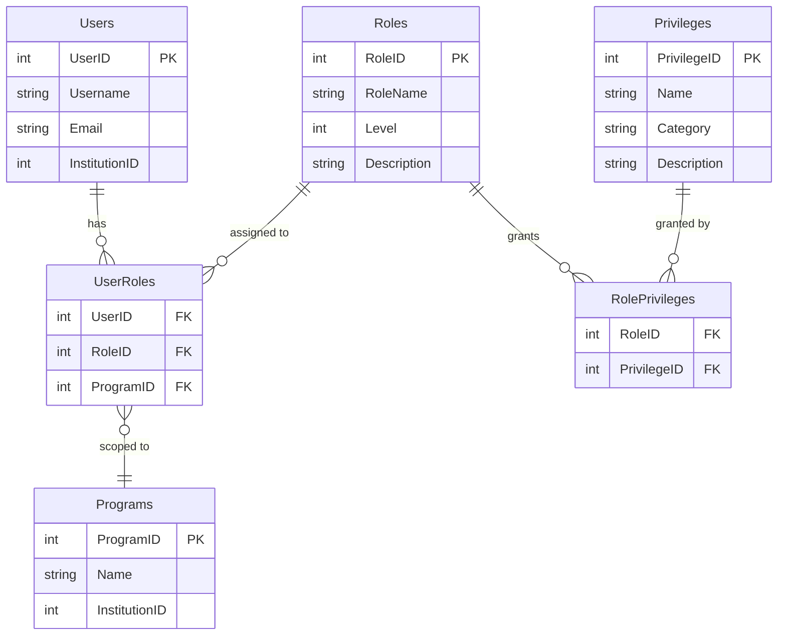
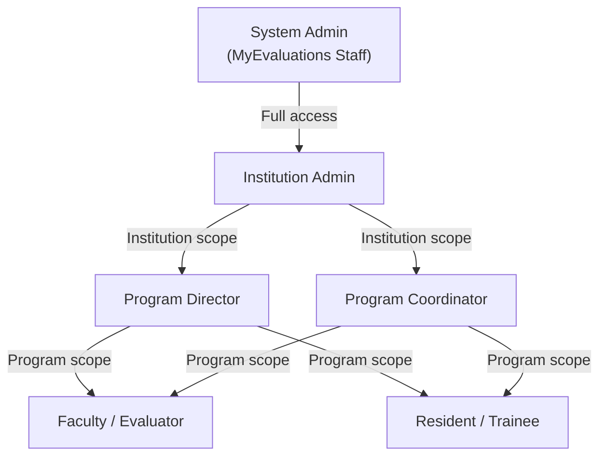
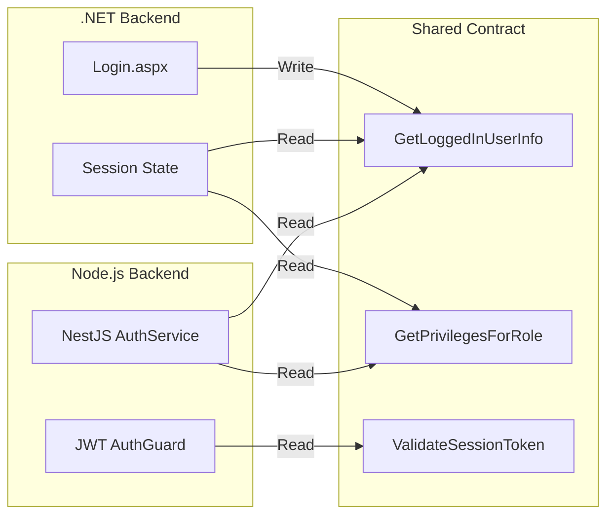

# .NET Authentication Patterns

The .NET backend serves as the **source of truth** for authentication and authorization across the MyEvaluations platform. This page documents the implementation patterns specific to the .NET codebase.

## Authentication Flow Overview



## Session Management

### Session Initialization

After successful authentication, the following data is stored in the ASP.NET session:

```csharp
// Security/SecurityManager.cs (simplified)
public class SecurityManager
{
    /// <summary>
    /// Initializes the user session after successful authentication.
    /// Called from Login.aspx and SAML SSO handler.
    /// </summary>
    public void InitializeSession(UserInfo user)
    {
        HttpContext context = HttpContext.Current;

        // Core user identity
        context.Session["UserID"] = user.UserID;
        context.Session["UserName"] = user.UserName;
        context.Session["Email"] = user.Email;
        context.Session["FirstName"] = user.FirstName;
        context.Session["LastName"] = user.LastName;
        context.Session["FullName"] = $"{user.FirstName} {user.LastName}";

        // Organization context
        context.Session["InstitutionID"] = user.InstitutionID;
        context.Session["InstitutionName"] = user.InstitutionName;
        context.Session["ProgramID"] = user.DefaultProgramID;

        // Role and permissions
        context.Session["RoleID"] = user.RoleID;
        context.Session["RoleName"] = user.RoleName;
        context.Session["IsAdmin"] = user.IsAdmin;
        context.Session["IsSSOUser"] = user.IsSSOUser;

        // Load and cache privileges
        List<string> privileges = GetPrivilegesForRole(user.RoleID);
        context.Session["Privileges"] = privileges;

        // Program access list
        List<int> programIds = GetUserProgramIds(user.UserID);
        context.Session["ProgramIDs"] = programIds;

        // Timestamp
        context.Session["LoginTime"] = DateTime.Now;
    }
}
```

### Session Configuration

```xml
<!-- Web.config -->
<system.web>
  <sessionState
    mode="InProc"
    timeout="60"
    cookieless="false"
    cookieName="ASP.NET_SessionId"
    regenerateExpiredSessionId="true" />

  <authentication mode="Forms">
    <forms loginUrl="~/Login.aspx"
           timeout="60"
           name=".MyEvalsAuth"
           protection="All"
           requireSSL="true"
           slidingExpiration="true" />
  </authentication>
</system.web>
```

| Setting | Value | Purpose |
|---------|-------|---------|
| `mode` | `InProc` | Session stored in IIS worker process memory |
| `timeout` | `60` minutes | Idle session timeout |
| `cookieName` | `ASP.NET_SessionId` | Session identification cookie |
| `requireSSL` | `true` | Cookie only sent over HTTPS |
| `slidingExpiration` | `true` | Timeout resets on each request |

### Session Validation on Each Request

Every page inherits from a base page class that validates the session:

```csharp
// Web/BasePage.cs (simplified)
public class BasePage : System.Web.UI.Page
{
    protected override void OnInit(EventArgs e)
    {
        base.OnInit(e);

        // Check if user is authenticated
        if (Session["UserID"] == null)
        {
            // Session expired or user not logged in
            Response.Redirect("~/Login.aspx?expired=1");
            return;
        }

        // Check page-level access
        string requiredPrivilege = GetRequiredPrivilege();
        if (!string.IsNullOrEmpty(requiredPrivilege))
        {
            if (!HasPrivilege(requiredPrivilege))
            {
                Response.Redirect("~/AccessDenied.aspx");
                return;
            }
        }
    }

    /// <summary>
    /// Checks if the current user has a specific privilege.
    /// </summary>
    protected bool HasPrivilege(string privilegeName)
    {
        List<string> privileges = Session["Privileges"] as List<string>;
        return privileges != null && privileges.Contains(privilegeName);
    }

    /// <summary>
    /// Gets the current user's ID from session.
    /// </summary>
    protected int CurrentUserID
    {
        get { return Convert.ToInt32(Session["UserID"]); }
    }

    /// <summary>
    /// Gets the current institution ID from session.
    /// </summary>
    protected int CurrentInstitutionID
    {
        get { return Convert.ToInt32(Session["InstitutionID"]); }
    }
}
```

## SAML SSO Implementation

### SAMLServiceProvider Project

The `SAMLServiceProvider` project handles SAML 2.0 authentication:



### Key SAML Classes

<!-- AUTO-GENERATED: Specific class names and method signatures will be enriched from .NET backend parsing -->

| Class | Responsibility |
|-------|---------------|
| `SAMLRequest` | Generates SAML AuthnRequest XML |
| `SAMLResponse` | Parses and validates SAML Response XML |
| `SAMLAssertion` | Extracts claims from SAML assertions |
| `SAMLSignature` | Validates XML digital signatures |
| `SAMLMetadata` | Parses IdP metadata XML |
| `SAMLConfig` | Loads per-institution IdP configuration from database |

### IdP Configuration Storage

Each institution's SAML configuration is stored in the database:

```csharp
public class SAMLConfigInfo
{
    public int InstitutionID { get; set; }
    public string IdPEntityID { get; set; }
    public string IdPSSOUrl { get; set; }
    public string IdPSLOUrl { get; set; }        // Single Logout URL
    public string IdPCertificate { get; set; }    // Base64-encoded X.509
    public string SPEntityID { get; set; }
    public string SPACSUrl { get; set; }          // Assertion Consumer Service URL
    public string NameIDFormat { get; set; }
    public bool IsEnabled { get; set; }
    public string AttributeMapping { get; set; }  // JSON mapping config
}
```

## Cookie Handling

### Authentication Cookies

| Cookie | Purpose | Scope | Flags |
|--------|---------|-------|-------|
| `ASP.NET_SessionId` | Session identification | Domain-wide | HttpOnly, Secure |
| `.MyEvalsAuth` | Forms authentication ticket | Domain-wide | HttpOnly, Secure, SameSite=Lax |

### Cookie Security Settings

```xml
<!-- Web.config -->
<system.web>
  <httpCookies httpOnlyCookies="true" requireSSL="true" sameSite="Lax" />
</system.web>
```

### Custom Cookie Usage

Some features use custom cookies for user preferences:

```csharp
// Storing a user preference cookie
HttpCookie cookie = new HttpCookie("MyEvalsPrefs");
cookie.Values["TimeZone"] = userTimeZone;
cookie.Values["DefaultView"] = preferredView;
cookie.Expires = DateTime.Now.AddYears(1);
cookie.HttpOnly = true;
cookie.Secure = true;
Response.Cookies.Add(cookie);
```

## Role-Based Access Control (RBAC)

### RBAC Data Model



### Privilege Checking Pattern

Privileges are checked at multiple levels:

#### Page-Level Access Control

```csharp
// Example: Restricting a page to users with "ManageEvaluations" privilege
public partial class EvaluationAdmin : BasePage
{
    protected override string GetRequiredPrivilege()
    {
        return "ManageEvaluations";
    }

    // Page_Load only executes if the user has the required privilege
    protected void Page_Load(object sender, EventArgs e)
    {
        // ... page logic ...
    }
}
```

#### Feature-Level Access Control

```csharp
// Within a page, showing/hiding controls based on privileges
protected void Page_Load(object sender, EventArgs e)
{
    // Show edit button only for users who can modify evaluations
    btnEdit.Visible = HasPrivilege("EditEvaluation");

    // Show delete button only for admins
    btnDelete.Visible = HasPrivilege("DeleteEvaluation");

    // Show admin panel only for institution admins
    pnlAdmin.Visible = HasPrivilege("InstitutionAdmin");
}
```

#### Business Logic Access Control

```csharp
// SecurityManager checks within business operations
public class EvaluationsManager
{
    public void DeleteEvaluation(int evaluationId, int currentUserId)
    {
        SecurityManager secMgr = new SecurityManager();

        // Verify the user has permission to delete
        if (!secMgr.UserHasPrivilege(currentUserId, "DeleteEvaluation"))
            throw new UnauthorizedAccessException("User does not have delete permission");

        // Verify the user belongs to the same program as the evaluation
        EvaluationsInfo eval = GetEvaluation(evaluationId);
        if (!secMgr.UserHasProgramAccess(currentUserId, eval.ProgramID))
            throw new UnauthorizedAccessException("User does not have access to this program");

        // Proceed with deletion
        CustomCommand cmd = new CustomCommand("usp_EvalDelete");
        cmd.AddParameter("@EvaluationID", evaluationId, SqlDbType.Int);
        cmd.AddParameter("@DeletedBy", currentUserId, SqlDbType.Int);
        DBDataAccess.ExecuteNonQuery(cmd);
    }
}
```

### Role Hierarchy

<!-- AUTO-GENERATED: Specific role names and privilege assignments will be enriched from database analysis -->



## Auth Sharing with Node.js Backend

The Node.js backend reads from the .NET authentication system via shared stored procedures. This ensures both backends enforce identical authorization rules.

### Shared Auth Stored Procedures



### How Node.js Reads .NET Auth

```typescript
// Node.js backend: AuthService (simplified)
@Injectable()
export class AuthService {
  constructor(
    @InjectEntityManager('mssql')
    private readonly em: EntityManager,
  ) {}

  async getUserContext(userId: number): Promise<UserContext> {
    // Call the same stored procedure that .NET uses
    const [userResult] = await this.em.execute(
      'EXEC GetLoggedInUserInfo @UserID = ?',
      [userId],
    );

    const [privilegeResults] = await this.em.execute(
      'EXEC GetPrivilegesForRole @RoleID = ?',
      [userResult.RoleID],
    );

    return {
      userId: userResult.UserID,
      institutionId: userResult.InstitutionID,
      roleId: userResult.RoleID,
      privileges: privilegeResults.map(r => r.PrivilegeName),
    };
  }
}
```

### Auth Contract Rules

| Rule | Details |
|------|---------|
| **Source of truth** | The .NET backend and SQL Server stored procedures are the source of truth for all auth |
| **Read-only from Node.js** | The Node.js backend never writes to auth tables; it only reads |
| **Same privilege names** | Both backends use identical privilege name strings |
| **No cross-backend sessions** | Each backend manages its own session/token mechanism |
| **Permission changes** | When roles/privileges are changed in the .NET admin panel, both backends see the update immediately (no cache sync needed because Node.js reads from the database) |

## Logout Flow

```csharp
// Security/SecurityManager.cs
public void Logout()
{
    HttpContext context = HttpContext.Current;

    // Clear all session data
    context.Session.Clear();
    context.Session.Abandon();

    // Remove authentication cookie
    FormsAuthentication.SignOut();

    // Clear session cookie
    HttpCookie sessionCookie = new HttpCookie("ASP.NET_SessionId");
    sessionCookie.Expires = DateTime.Now.AddDays(-1);
    context.Response.Cookies.Add(sessionCookie);

    // If SSO user, initiate SAML SLO (Single Logout) if configured
    if (context.Session["IsSSOUser"] != null && (bool)context.Session["IsSSOUser"])
    {
        string sloUrl = GetSLOUrl(Convert.ToInt32(context.Session["InstitutionID"]));
        if (!string.IsNullOrEmpty(sloUrl))
        {
            context.Response.Redirect(sloUrl);
            return;
        }
    }

    context.Response.Redirect("~/Login.aspx");
}
```

## Security Considerations

| Concern | Mitigation |
|---------|------------|
| Session hijacking | HTTPS-only cookies, HttpOnly flag, session ID regeneration |
| CSRF | ASP.NET ViewState MAC validation, anti-forgery tokens in API calls |
| Password storage | Hashed with salt in SQL Server (not stored in plain text) |
| Brute force | Account lockout after N failed attempts (configurable per institution) |
| XSS | ASP.NET request validation enabled, output encoding |
| SQL injection | Parameterized stored procedures (no dynamic SQL in application code) |

<!-- AUTO-GENERATED: Specific stored procedure signatures and security class details will be enriched from .NET backend parsing -->
