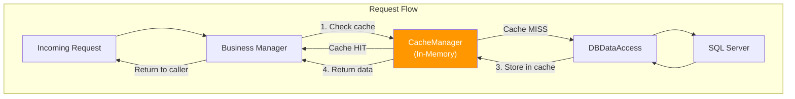
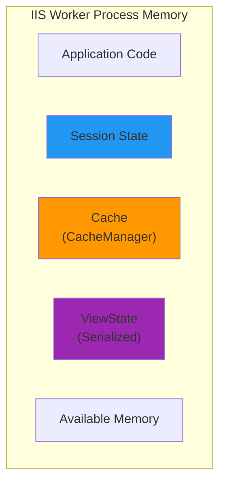

# Caching Patterns

The MyEvaluations .NET backend uses in-memory caching to reduce database load for frequently accessed, relatively static data. The primary caching mechanism is the `CacheManager` class, which wraps the ASP.NET `System.Web.Caching.Cache`.

## Caching Architecture



## CacheManager Class

The `CacheManager` provides a simplified interface for cache operations:

```csharp
// Utilities/CacheManager.cs (simplified)
using System;
using System.Web;
using System.Web.Caching;

namespace MyEvaluations.Utilities
{
    public static class CacheManager
    {
        /// <summary>
        /// Gets an item from the cache. Returns null if not found.
        /// </summary>
        public static T Get<T>(string key) where T : class
        {
            return HttpRuntime.Cache[key] as T;
        }

        /// <summary>
        /// Adds an item to the cache with an absolute expiration time.
        /// </summary>
        public static void Add(string key, object value, TimeSpan duration)
        {
            HttpRuntime.Cache.Insert(
                key,
                value,
                null, // no file dependency
                DateTime.Now.Add(duration),
                Cache.NoSlidingExpiration,
                CacheItemPriority.Normal,
                null // no removal callback
            );
        }

        /// <summary>
        /// Adds an item to the cache with a sliding expiration.
        /// The item expires if not accessed within the specified duration.
        /// </summary>
        public static void AddSliding(string key, object value, TimeSpan slidingExpiration)
        {
            HttpRuntime.Cache.Insert(
                key,
                value,
                null,
                Cache.NoAbsoluteExpiration,
                slidingExpiration,
                CacheItemPriority.Normal,
                null
            );
        }

        /// <summary>
        /// Removes an item from the cache.
        /// </summary>
        public static void Remove(string key)
        {
            HttpRuntime.Cache.Remove(key);
        }

        /// <summary>
        /// Removes all cache entries that match a prefix.
        /// Used for bulk invalidation (e.g., all lookup caches for an institution).
        /// </summary>
        public static void RemoveByPrefix(string prefix)
        {
            var enumerator = HttpRuntime.Cache.GetEnumerator();
            while (enumerator.MoveNext())
            {
                string key = enumerator.Key.ToString();
                if (key.StartsWith(prefix))
                {
                    HttpRuntime.Cache.Remove(key);
                }
            }
        }

        /// <summary>
        /// Checks if a key exists in the cache.
        /// </summary>
        public static bool Exists(string key)
        {
            return HttpRuntime.Cache[key] != null;
        }
    }
}
```

## What Gets Cached

### Lookup Data

Lookup/dropdown values are the most commonly cached data because they change infrequently but are read on nearly every page:

```csharp
public class LookupManager
{
    private const string CACHE_PREFIX = "Lookup_";

    public List<LookupInfo> GetLookupValues(string category, int institutionId)
    {
        string cacheKey = $"{CACHE_PREFIX}{category}_{institutionId}";

        List<LookupInfo> cached = CacheManager.Get<List<LookupInfo>>(cacheKey);
        if (cached != null)
            return cached;

        CustomCommand cmd = new CustomCommand("usp_LookupGetByCategory");
        cmd.AddParameter("@Category", category, SqlDbType.VarChar, 50);
        cmd.AddParameter("@InstitutionID", institutionId, SqlDbType.Int);

        DataSet ds = DBDataAccess.ExecuteDataSet(cmd);

        List<LookupInfo> results = new List<LookupInfo>();
        foreach (DataRow row in ds.Tables[0].Rows)
        {
            results.Add(LookupInfo.FromDataRow(row));
        }

        // Cache for 1 hour (absolute expiration)
        CacheManager.Add(cacheKey, results, TimeSpan.FromHours(1));
        return results;
    }
}
```

### User Permissions

Permission lookups are cached per user session to avoid repeated database calls during a single user's page navigation:

```csharp
public class SecurityManager
{
    public List<string> GetUserPrivileges(int userId, int roleId)
    {
        string cacheKey = $"Privileges_{userId}_{roleId}";

        List<string> cached = CacheManager.Get<List<string>>(cacheKey);
        if (cached != null)
            return cached;

        CustomCommand cmd = new CustomCommand("GetPrivilegesForRole");
        cmd.AddParameter("@RoleID", roleId, SqlDbType.Int);

        DataSet ds = DBDataAccess.ExecuteDataSet(cmd);

        List<string> privileges = new List<string>();
        foreach (DataRow row in ds.Tables[0].Rows)
        {
            privileges.Add(row["PrivilegeName"].ToString());
        }

        // Cache for 30 minutes (sliding -- refreshed on each access)
        CacheManager.AddSliding(cacheKey, privileges, TimeSpan.FromMinutes(30));
        return privileges;
    }
}
```

### Institution Settings

Per-institution configuration settings:

```csharp
public class SettingsManager
{
    public Dictionary<string, string> GetInstitutionSettings(int institutionId)
    {
        string cacheKey = $"InstSettings_{institutionId}";

        var cached = CacheManager.Get<Dictionary<string, string>>(cacheKey);
        if (cached != null)
            return cached;

        // ... load from database ...

        CacheManager.Add(cacheKey, settings, TimeSpan.FromHours(2));
        return settings;
    }
}
```

### Commonly Cached Data Summary

| Data Type | Cache Key Pattern | Expiration | Strategy |
|-----------|-------------------|-----------|----------|
| Lookup values | `Lookup_{category}_{institutionId}` | 1 hour absolute | Changed rarely, read often |
| User privileges | `Privileges_{userId}_{roleId}` | 30 min sliding | Per-session optimization |
| Institution settings | `InstSettings_{institutionId}` | 2 hours absolute | Configuration data |
| Program list | `Programs_{institutionId}` | 1 hour absolute | Organizational data |
| Evaluation templates | `EvalTemplates_{programId}` | 30 min absolute | Template definitions |
| Role definitions | `Roles_{institutionId}` | 2 hours absolute | Auth configuration |

## Cache Invalidation Strategies

### Time-Based Expiration

The most common strategy. Items automatically expire after a set duration:

```csharp
// Absolute: expires at a fixed time regardless of access
CacheManager.Add(key, value, TimeSpan.FromHours(1));

// Sliding: expires if not accessed within the duration
CacheManager.AddSliding(key, value, TimeSpan.FromMinutes(30));
```

### Explicit Invalidation

When data is modified, the related cache entry is explicitly removed:

```csharp
public void UpdateInstitutionSetting(int institutionId, string key, string value)
{
    CustomCommand cmd = new CustomCommand("usp_AdminUpdateSetting");
    cmd.AddParameter("@InstitutionID", institutionId, SqlDbType.Int);
    cmd.AddParameter("@Key", key, SqlDbType.VarChar, 100);
    cmd.AddParameter("@Value", value, SqlDbType.NVarChar, -1);

    DBDataAccess.ExecuteNonQuery(cmd);

    // Invalidate the cached settings for this institution
    CacheManager.Remove($"InstSettings_{institutionId}");
}
```

### Prefix-Based Invalidation

When a broad category of data changes, all related cache entries are invalidated:

```csharp
public void UpdateLookupCategory(string category, int institutionId)
{
    // ... update database ...

    // Remove all lookup cache entries for this category
    CacheManager.RemoveByPrefix($"Lookup_{category}_");
}
```

### Invalidation Decision Matrix

| Scenario | Strategy | Reasoning |
|----------|----------|-----------|
| Lookup value changed by admin | Explicit removal | Immediate consistency needed |
| User role changed | Explicit removal | Security-sensitive |
| Periodic reference data | Time-based (1-2 hours) | Eventual consistency acceptable |
| User session data | Sliding (30 min) | Aligns with session timeout |
| Report data | No caching | Always needs fresh data |
| Large data sets | No caching | Memory concerns |

## Memory Management Considerations

### Cache Size Awareness

Because the cache runs in the IIS worker process (`InProc` mode), cached objects consume application memory directly.



### Guidelines

| Guideline | Details |
|-----------|---------|
| **Do cache** | Lookup values, configuration, permission lists, small reference data |
| **Do not cache** | Large result sets (>1000 rows), user-specific transactional data, reports |
| **Max item size** | Keep individual cache entries under 1 MB |
| **Total cache budget** | Monitor total memory; IIS recycles at the configured memory limit |
| **Serializable objects** | Cache only serializable objects (Info classes are marked `[Serializable]`) |

### Monitoring

Cache behavior can be monitored through:

1. **IIS Performance Counters** -- Monitor ASP.NET cache entries and memory usage
2. **Application Logging** -- Log cache hit/miss ratios in high-traffic managers
3. **New Relic** -- Track database query frequency (reduced queries indicate effective caching)

### Cache and IIS Recycling

When IIS recycles the application pool (which happens during deployment, scheduled recycles, or memory limit hits), **all cached data is lost**. This is by design -- the cache is a performance optimization, not a data store.

After a recycle:
- The first request for each cached item will be a cache miss
- The item will be loaded from the database and re-cached
- Brief increase in database load is expected
- No data loss because the cache is always a mirror of database data

## Cache Patterns Not Used

For context, these caching approaches are **not** used in the .NET backend:

| Pattern | Status | Reason |
|---------|--------|--------|
| Distributed cache (Redis/Memcached) | Not used | Single IIS server; complexity not justified |
| Output caching | Not used | WebForms pages are highly dynamic per user |
| SQL Server query result caching | Not used | Stored procedure plan caching handles this at the database level |
| Second-level ORM cache | Not applicable | No ORM; uses raw ADO.NET |

:::note
The Node.js backend uses **Redis** for both BullMQ job queues and caching. This is separate from the .NET caching system. The two caching systems do not share data.
:::

<!-- AUTO-GENERATED: Specific cache key patterns and hit/miss ratios will be enriched from .NET backend analysis -->
