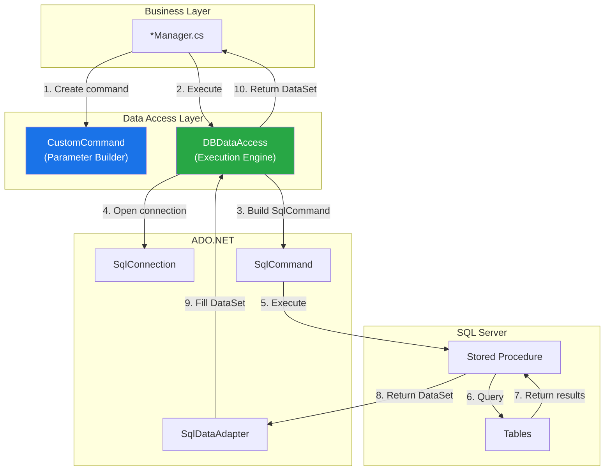

# Data Access Patterns

The MyEvaluations .NET backend uses **ADO.NET with stored procedures** as its exclusive data access mechanism. All database operations are routed through two core utility classes: `DBDataAccess` and `CustomCommand`.

## Architecture Overview



## DBDataAccess.cs

`DBDataAccess` is the central data access utility class. It manages `SqlConnection` lifecycle, executes stored procedures, and returns results as `DataSet`, `DataReader`, or scalar values.

### Key Methods

```csharp
// DataAccess.SQL/DBDataAccess.cs
namespace MyEvaluations.DataAccess.SQL
{
    public static class DBDataAccess
    {
        /// <summary>
        /// Executes a stored procedure and returns a DataSet.
        /// This is the most commonly used method.
        /// </summary>
        public static DataSet ExecuteDataSet(CustomCommand command)
        {
            DataSet ds = new DataSet();
            using (SqlConnection conn = GetConnection())
            {
                SqlCommand sqlCmd = command.BuildSqlCommand(conn);
                SqlDataAdapter adapter = new SqlDataAdapter(sqlCmd);
                adapter.Fill(ds);
            }
            return ds;
        }

        /// <summary>
        /// Executes a stored procedure and returns a single scalar value.
        /// Useful for INSERT operations that return an ID.
        /// </summary>
        public static object ExecuteScalar(CustomCommand command)
        {
            using (SqlConnection conn = GetConnection())
            {
                SqlCommand sqlCmd = command.BuildSqlCommand(conn);
                conn.Open();
                return sqlCmd.ExecuteScalar();
            }
        }

        /// <summary>
        /// Executes a stored procedure with no return value.
        /// Used for UPDATE and DELETE operations.
        /// </summary>
        public static int ExecuteNonQuery(CustomCommand command)
        {
            using (SqlConnection conn = GetConnection())
            {
                SqlCommand sqlCmd = command.BuildSqlCommand(conn);
                conn.Open();
                return sqlCmd.ExecuteNonQuery();
            }
        }

        /// <summary>
        /// Executes a stored procedure and returns a DataReader.
        /// The caller is responsible for closing the reader and connection.
        /// </summary>
        public static SqlDataReader ExecuteReader(CustomCommand command)
        {
            SqlConnection conn = GetConnection();
            SqlCommand sqlCmd = command.BuildSqlCommand(conn);
            conn.Open();
            return sqlCmd.ExecuteReader(CommandBehavior.CloseConnection);
        }

        /// <summary>
        /// Gets a new SqlConnection using the configured connection string.
        /// </summary>
        private static SqlConnection GetConnection()
        {
            string connStr = ConfigurationManager.ConnectionStrings["MyEvalsConnectionString"].ConnectionString;
            return new SqlConnection(connStr);
        }
    }
}
```

### Usage Frequency

| Method | Use Case | Frequency |
|--------|----------|-----------|
| `ExecuteDataSet()` | Read operations (SELECT) returning multiple rows/columns | Most common (~70%) |
| `ExecuteScalar()` | INSERT returning new ID, COUNT queries | Common (~15%) |
| `ExecuteNonQuery()` | UPDATE, DELETE operations | Common (~10%) |
| `ExecuteReader()` | Large result sets (streaming) | Rare (~5%) |

## CustomCommand.cs

`CustomCommand` is a builder class for constructing stored procedure calls with strongly-typed parameters.

### Implementation

```csharp
// DataAccess.SQL/CustomCommand.cs
namespace MyEvaluations.DataAccess.SQL
{
    public class CustomCommand
    {
        private string _storedProcedureName;
        private List<SqlParameter> _parameters;

        /// <summary>
        /// Creates a new CustomCommand for the specified stored procedure.
        /// </summary>
        public CustomCommand(string storedProcedureName)
        {
            _storedProcedureName = storedProcedureName;
            _parameters = new List<SqlParameter>();
        }

        /// <summary>
        /// Adds a parameter with explicit SqlDbType.
        /// </summary>
        public void AddParameter(string name, object value, SqlDbType type)
        {
            SqlParameter param = new SqlParameter(name, type);
            param.Value = value ?? DBNull.Value;
            _parameters.Add(param);
        }

        /// <summary>
        /// Adds a parameter with SqlDbType and size (for VARCHAR, NVARCHAR).
        /// </summary>
        public void AddParameter(string name, object value, SqlDbType type, int size)
        {
            SqlParameter param = new SqlParameter(name, type, size);
            param.Value = value ?? DBNull.Value;
            _parameters.Add(param);
        }

        /// <summary>
        /// Adds an output parameter.
        /// </summary>
        public void AddOutputParameter(string name, SqlDbType type)
        {
            SqlParameter param = new SqlParameter(name, type);
            param.Direction = ParameterDirection.Output;
            _parameters.Add(param);
        }

        /// <summary>
        /// Builds the final SqlCommand from the stored procedure name and parameters.
        /// </summary>
        internal SqlCommand BuildSqlCommand(SqlConnection connection)
        {
            SqlCommand cmd = new SqlCommand(_storedProcedureName, connection);
            cmd.CommandType = CommandType.StoredProcedure;
            cmd.CommandTimeout = 120; // 2-minute timeout

            foreach (SqlParameter param in _parameters)
            {
                cmd.Parameters.Add(param);
            }

            return cmd;
        }
    }
}
```

### Parameter Handling

```csharp
// Common parameter types and their usage

// Integer parameters
cmd.AddParameter("@UserID", userId, SqlDbType.Int);

// String parameters (with size)
cmd.AddParameter("@Name", name, SqlDbType.VarChar, 100);
cmd.AddParameter("@Description", description, SqlDbType.NVarChar, -1); // MAX

// Date parameters
cmd.AddParameter("@StartDate", startDate, SqlDbType.DateTime);

// Boolean parameters
cmd.AddParameter("@IsActive", isActive, SqlDbType.Bit);

// Nullable values (automatically converted to DBNull.Value)
cmd.AddParameter("@EndDate", endDate ?? (object)DBNull.Value, SqlDbType.DateTime);

// Output parameters
cmd.AddOutputParameter("@NewID", SqlDbType.Int);
```

## Common Data Access Patterns

### Pattern 1: Get Single Record

```csharp
public EvaluationsInfo GetEvaluation(int evaluationId)
{
    CustomCommand cmd = new CustomCommand("usp_EvalGetByID");
    cmd.AddParameter("@EvaluationID", evaluationId, SqlDbType.Int);

    DataSet ds = DBDataAccess.ExecuteDataSet(cmd);

    if (ds.Tables.Count == 0 || ds.Tables[0].Rows.Count == 0)
        return null;

    return EvaluationsInfo.FromDataRow(ds.Tables[0].Rows[0]);
}
```

### Pattern 2: Get List of Records

```csharp
public List<DutyHoursInfo> GetDutyHoursByUser(int userId, DateTime startDate, DateTime endDate)
{
    CustomCommand cmd = new CustomCommand("usp_DutyHourGetByUser");
    cmd.AddParameter("@UserID", userId, SqlDbType.Int);
    cmd.AddParameter("@StartDate", startDate, SqlDbType.DateTime);
    cmd.AddParameter("@EndDate", endDate, SqlDbType.DateTime);

    DataSet ds = DBDataAccess.ExecuteDataSet(cmd);

    List<DutyHoursInfo> results = new List<DutyHoursInfo>();
    foreach (DataRow row in ds.Tables[0].Rows)
    {
        results.Add(DutyHoursInfo.FromDataRow(row));
    }
    return results;
}
```

### Pattern 3: Insert and Return New ID

```csharp
public int InsertPatientLog(PatientLogInfo info)
{
    CustomCommand cmd = new CustomCommand("usp_PatientLogInsert");
    cmd.AddParameter("@UserID", info.UserID, SqlDbType.Int);
    cmd.AddParameter("@Date", info.Date, SqlDbType.DateTime);
    cmd.AddParameter("@DiagnosisCode", info.DiagnosisCode, SqlDbType.VarChar, 20);
    cmd.AddParameter("@ProcedureCode", info.ProcedureCode, SqlDbType.VarChar, 20);
    cmd.AddParameter("@Notes", info.Notes, SqlDbType.NVarChar, -1);

    object result = DBDataAccess.ExecuteScalar(cmd);
    return Convert.ToInt32(result);
}
```

### Pattern 4: Update Record

```csharp
public void UpdateEvaluationStatus(int evaluationId, string status, int modifiedBy)
{
    CustomCommand cmd = new CustomCommand("usp_EvalUpdateStatus");
    cmd.AddParameter("@EvaluationID", evaluationId, SqlDbType.Int);
    cmd.AddParameter("@Status", status, SqlDbType.VarChar, 50);
    cmd.AddParameter("@ModifiedBy", modifiedBy, SqlDbType.Int);
    cmd.AddParameter("@ModifiedDate", DateTime.Now, SqlDbType.DateTime);

    DBDataAccess.ExecuteNonQuery(cmd);
}
```

### Pattern 5: Multiple Result Sets

Some stored procedures return multiple result sets in a single call:

```csharp
public EvaluationDetailInfo GetEvaluationWithResponses(int evaluationId)
{
    CustomCommand cmd = new CustomCommand("usp_EvalGetDetailWithResponses");
    cmd.AddParameter("@EvaluationID", evaluationId, SqlDbType.Int);

    DataSet ds = DBDataAccess.ExecuteDataSet(cmd);

    // First result set: evaluation header
    EvaluationDetailInfo detail = EvaluationDetailInfo.FromDataRow(ds.Tables[0].Rows[0]);

    // Second result set: evaluation responses/answers
    detail.Responses = new List<EvaluationResponseInfo>();
    foreach (DataRow row in ds.Tables[1].Rows)
    {
        detail.Responses.Add(EvaluationResponseInfo.FromDataRow(row));
    }

    return detail;
}
```

## Transaction Management

For operations that span multiple stored procedure calls, transactions are managed explicitly:

```csharp
public void CompleteEvaluationWithNotification(int evaluationId, int userId)
{
    string connStr = ConfigurationManager.ConnectionStrings["MyEvalsConnectionString"].ConnectionString;

    using (SqlConnection conn = new SqlConnection(connStr))
    {
        conn.Open();
        using (SqlTransaction transaction = conn.BeginTransaction())
        {
            try
            {
                // Step 1: Update evaluation status
                SqlCommand cmd1 = new SqlCommand("usp_EvalUpdateStatus", conn, transaction);
                cmd1.CommandType = CommandType.StoredProcedure;
                cmd1.Parameters.AddWithValue("@EvaluationID", evaluationId);
                cmd1.Parameters.AddWithValue("@Status", "Completed");
                cmd1.Parameters.AddWithValue("@CompletedDate", DateTime.Now);
                cmd1.ExecuteNonQuery();

                // Step 2: Insert notification
                SqlCommand cmd2 = new SqlCommand("usp_NotificationInsert", conn, transaction);
                cmd2.CommandType = CommandType.StoredProcedure;
                cmd2.Parameters.AddWithValue("@UserID", userId);
                cmd2.Parameters.AddWithValue("@Type", "EvaluationCompleted");
                cmd2.Parameters.AddWithValue("@ReferenceID", evaluationId);
                cmd2.ExecuteNonQuery();

                transaction.Commit();
            }
            catch (Exception ex)
            {
                transaction.Rollback();
                throw;
            }
        }
    }
}
```

:::note
Most operations in the codebase do **not** use explicit transactions because the business logic is encapsulated within a single stored procedure that handles its own transaction internally. Explicit application-level transactions are used only when multiple stored procedures must succeed or fail together.
:::

## Connection String Management

### Configuration

The connection string is stored in `Web/Web.config`:

```xml
<connectionStrings>
  <add name="MyEvalsConnectionString"
       connectionString="Server=...;Database=MyEvaluations;
       User ID=...;Password=...;
       MultipleActiveResultSets=true;
       Connection Timeout=30;
       Max Pool Size=100;"
       providerName="System.Data.SqlClient" />
</connectionStrings>
```

### Connection Pooling

ADO.NET connection pooling is enabled by default. Key settings:

| Setting | Default | Production Value |
|---------|---------|-----------------|
| `Pooling` | `true` | `true` |
| `Min Pool Size` | `0` | `0` |
| `Max Pool Size` | `100` | `100` |
| `Connection Timeout` | `15` | `30` |
| `MultipleActiveResultSets` | `false` | `true` |

### Scheduler Connection Strings

Each Windows Service scheduler has its own `App.config` with a connection string:

```xml
<!-- Schedulers/EvaluationReminderService/App.config -->
<connectionStrings>
  <add name="MyEvalsConnectionString"
       connectionString="Server=...;Database=MyEvaluations;..."
       providerName="System.Data.SqlClient" />
</connectionStrings>
```

## Error Handling

### Standard Error Handling Pattern

```csharp
public List<EvaluationsInfo> GetEvaluations(int programId)
{
    try
    {
        CustomCommand cmd = new CustomCommand("usp_EvalGetByProgram");
        cmd.AddParameter("@ProgramID", programId, SqlDbType.Int);

        DataSet ds = DBDataAccess.ExecuteDataSet(cmd);

        List<EvaluationsInfo> results = new List<EvaluationsInfo>();
        foreach (DataRow row in ds.Tables[0].Rows)
        {
            results.Add(EvaluationsInfo.FromDataRow(row));
        }
        return results;
    }
    catch (SqlException ex)
    {
        // Log the SQL-specific error
        Logger.LogError("GetEvaluations failed", ex,
            new { ProgramID = programId, SPName = "usp_EvalGetByProgram" });
        throw;
    }
    catch (Exception ex)
    {
        // Log general errors
        Logger.LogError("GetEvaluations unexpected error", ex);
        throw;
    }
}
```

### Common SQL Exceptions

| Error Number | Description | Common Cause |
|-------------|-------------|-------------|
| 208 | Invalid object name | Stored procedure does not exist |
| 201 | Procedure expects parameter | Missing required parameter in CustomCommand |
| -2 | Timeout expired | Long-running query; increase CommandTimeout |
| 2601 | Unique constraint violation | Duplicate data insertion |
| 547 | Foreign key constraint | Referencing non-existent parent record |

## Best Practices

1. **Always use `CustomCommand` + `DBDataAccess`** -- Never write raw SQL in business layer code
2. **Always check for empty result sets** -- `ds.Tables[0].Rows.Count == 0` before accessing rows
3. **Handle `DBNull.Value`** -- Always check for `DBNull.Value` in `FromDataRow` methods
4. **Use `SqlDbType` explicitly** -- Avoid `AddWithValue()` which can cause implicit type conversions
5. **Dispose connections** -- `DBDataAccess` handles this via `using` statements, but be careful with `ExecuteReader`
6. **Set appropriate timeouts** -- Default is 120 seconds; adjust for long-running reports
7. **Log stored procedure names** -- Always include the SP name in error logs for debugging

<!-- AUTO-GENERATED: Specific stored procedure mappings per Manager class will be enriched from the parse-dotnet-sprocs script -->
