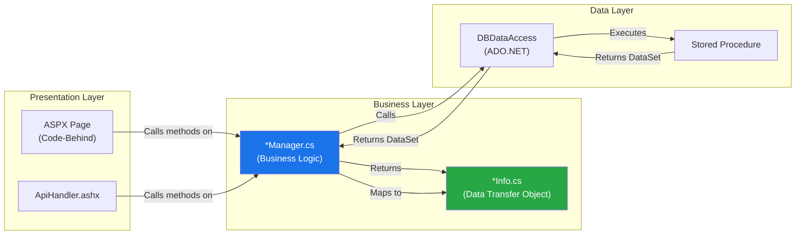

# Manager/Info Pattern

The **Manager/Info pattern** is the primary architectural pattern used throughout the MyEvaluations .NET backend. Every business module follows this convention to separate business logic from data representation.

## Pattern Overview



## Components

### Managers (`*Manager.cs`)

Managers are **service classes** that encapsulate business logic for a specific domain. They:

- Contain all business rules and validation
- Orchestrate calls to the data access layer
- Transform raw `DataSet`/`DataRow` results into `Info` objects
- Handle cross-cutting concerns like caching and logging
- Are typically instantiated directly (not via dependency injection)

**Naming convention:** `[Module]Manager.cs`

**Examples:** `EvaluationsManager`, `DutyHoursManager`, `PatientLogManager`, `SecurityManager`

### Info Classes (`*Info.cs`)

Info classes are **Data Transfer Objects (DTOs)** that carry data between layers. They:

- Contain only properties (no business logic)
- Mirror the shape of database result sets
- Often include a static `FromDataRow()` factory method
- Are serializable for use with ViewState and session state
- May include computed properties derived from stored data

**Naming convention:** `[Module]Info.cs`

**Examples:** `EvaluationsInfo`, `DutyHoursInfo`, `PatientLogInfo`, `UserInfo`

## Code Examples

### Manager Example

```csharp
// Evaluations/EvaluationsManager.cs
using MyEvaluations.DataAccess.SQL;
using System.Data;
using System.Collections.Generic;

namespace MyEvaluations.Evaluations
{
    public class EvaluationsManager
    {
        /// <summary>
        /// Retrieves a single evaluation by its ID.
        /// </summary>
        public EvaluationsInfo GetEvaluation(int evaluationId)
        {
            CustomCommand cmd = new CustomCommand("usp_EvalGetByID");
            cmd.AddParameter("@EvaluationID", evaluationId, SqlDbType.Int);

            DataSet ds = DBDataAccess.ExecuteDataSet(cmd);

            if (ds.Tables[0].Rows.Count == 0)
                return null;

            return EvaluationsInfo.FromDataRow(ds.Tables[0].Rows[0]);
        }

        /// <summary>
        /// Gets all evaluations assigned to a specific user.
        /// </summary>
        public List<EvaluationsInfo> GetEvaluationsByUser(int userId, int programId)
        {
            CustomCommand cmd = new CustomCommand("usp_EvalGetByUser");
            cmd.AddParameter("@UserID", userId, SqlDbType.Int);
            cmd.AddParameter("@ProgramID", programId, SqlDbType.Int);

            DataSet ds = DBDataAccess.ExecuteDataSet(cmd);

            List<EvaluationsInfo> evaluations = new List<EvaluationsInfo>();
            foreach (DataRow row in ds.Tables[0].Rows)
            {
                evaluations.Add(EvaluationsInfo.FromDataRow(row));
            }
            return evaluations;
        }

        /// <summary>
        /// Saves an evaluation response. Returns the evaluation ID.
        /// </summary>
        public int SaveEvaluation(EvaluationsInfo info)
        {
            // Business validation
            if (info.EvaluateeID <= 0)
                throw new ArgumentException("EvaluateeID is required");

            if (info.TemplateID <= 0)
                throw new ArgumentException("TemplateID is required");

            CustomCommand cmd = new CustomCommand("usp_EvalSave");
            cmd.AddParameter("@EvaluationID", info.EvaluationID, SqlDbType.Int);
            cmd.AddParameter("@TemplateID", info.TemplateID, SqlDbType.Int);
            cmd.AddParameter("@EvaluatorID", info.EvaluatorID, SqlDbType.Int);
            cmd.AddParameter("@EvaluateeID", info.EvaluateeID, SqlDbType.Int);
            cmd.AddParameter("@Status", info.Status, SqlDbType.VarChar);
            cmd.AddParameter("@Comments", info.Comments, SqlDbType.NVarChar);

            object result = DBDataAccess.ExecuteScalar(cmd);
            return Convert.ToInt32(result);
        }
    }
}
```

### Info (DTO) Example

```csharp
// Evaluations/EvaluationsInfo.cs
using System;
using System.Data;

namespace MyEvaluations.Evaluations
{
    [Serializable]
    public class EvaluationsInfo
    {
        // Primary key
        public int EvaluationID { get; set; }

        // Foreign keys
        public int TemplateID { get; set; }
        public int EvaluatorID { get; set; }
        public int EvaluateeID { get; set; }
        public int ProgramID { get; set; }

        // Data fields
        public string Status { get; set; }
        public string Comments { get; set; }
        public DateTime? CompletedDate { get; set; }
        public DateTime CreatedDate { get; set; }
        public DateTime? DueDate { get; set; }

        // Display names (populated from JOINed queries)
        public string EvaluatorName { get; set; }
        public string EvaluateeName { get; set; }
        public string TemplateName { get; set; }

        // Computed property
        public bool IsOverdue
        {
            get
            {
                return DueDate.HasValue
                    && DueDate.Value < DateTime.Now
                    && Status != "Completed";
            }
        }

        /// <summary>
        /// Factory method to create an Info object from a DataRow.
        /// This is the standard pattern for mapping database results to DTOs.
        /// </summary>
        public static EvaluationsInfo FromDataRow(DataRow row)
        {
            return new EvaluationsInfo
            {
                EvaluationID = Convert.ToInt32(row["EvaluationID"]),
                TemplateID = Convert.ToInt32(row["TemplateID"]),
                EvaluatorID = Convert.ToInt32(row["EvaluatorID"]),
                EvaluateeID = Convert.ToInt32(row["EvaluateeID"]),
                ProgramID = Convert.ToInt32(row["ProgramID"]),
                Status = row["Status"].ToString(),
                Comments = row["Comments"] == DBNull.Value
                    ? null
                    : row["Comments"].ToString(),
                CompletedDate = row["CompletedDate"] == DBNull.Value
                    ? (DateTime?)null
                    : Convert.ToDateTime(row["CompletedDate"]),
                CreatedDate = Convert.ToDateTime(row["CreatedDate"]),
                DueDate = row["DueDate"] == DBNull.Value
                    ? (DateTime?)null
                    : Convert.ToDateTime(row["DueDate"]),
                EvaluatorName = row["EvaluatorName"].ToString(),
                EvaluateeName = row["EvaluateeName"].ToString(),
                TemplateName = row["TemplateName"].ToString()
            };
        }
    }
}
```

### Page Code-Behind Example

```csharp
// Web/Evaluations/ViewEvaluation.aspx.cs
using MyEvaluations.Evaluations;
using System;

namespace MyEvaluations.Web.Evaluations
{
    public partial class ViewEvaluation : System.Web.UI.Page
    {
        private EvaluationsManager _evaluationsManager = new EvaluationsManager();

        protected void Page_Load(object sender, EventArgs e)
        {
            if (!IsPostBack)
            {
                int evaluationId = Convert.ToInt32(Request.QueryString["id"]);
                LoadEvaluation(evaluationId);
            }
        }

        private void LoadEvaluation(int evaluationId)
        {
            EvaluationsInfo evaluation = _evaluationsManager.GetEvaluation(evaluationId);

            if (evaluation == null)
            {
                Response.Redirect("~/Evaluations/EvaluationList.aspx");
                return;
            }

            // Bind data to WebForms controls
            lblEvaluatorName.Text = evaluation.EvaluatorName;
            lblEvaluateeName.Text = evaluation.EvaluateeName;
            lblStatus.Text = evaluation.Status;
            lblTemplateName.Text = evaluation.TemplateName;

            if (evaluation.IsOverdue)
            {
                lblStatus.CssClass = "text-danger";
            }
        }

        protected void btnSave_Click(object sender, EventArgs e)
        {
            EvaluationsInfo info = new EvaluationsInfo
            {
                EvaluationID = Convert.ToInt32(hdnEvaluationID.Value),
                Comments = txtComments.Text,
                Status = ddlStatus.SelectedValue
            };

            _evaluationsManager.SaveEvaluation(info);
            Response.Redirect("~/Evaluations/EvaluationList.aspx");
        }
    }
}
```

## Pattern Variations

### Manager with Caching

Some managers incorporate caching for frequently accessed, rarely changing data:

```csharp
public class LookupManager
{
    public List<LookupInfo> GetLookupValues(string category)
    {
        string cacheKey = $"Lookup_{category}";

        // Check cache first
        List<LookupInfo> cached = CacheManager.Get<List<LookupInfo>>(cacheKey);
        if (cached != null)
            return cached;

        // Load from database
        CustomCommand cmd = new CustomCommand("usp_LookupGetByCategory");
        cmd.AddParameter("@Category", category, SqlDbType.VarChar);
        DataSet ds = DBDataAccess.ExecuteDataSet(cmd);

        List<LookupInfo> results = new List<LookupInfo>();
        foreach (DataRow row in ds.Tables[0].Rows)
        {
            results.Add(LookupInfo.FromDataRow(row));
        }

        // Store in cache
        CacheManager.Add(cacheKey, results, TimeSpan.FromHours(1));
        return results;
    }
}
```

### Manager with Multiple Info Types

A single Manager may return different Info types depending on the operation:

```csharp
public class DutyHoursManager
{
    // Returns detailed duty hour info
    public DutyHoursInfo GetDutyHour(int dutyHourId) { ... }

    // Returns summary info for reporting
    public DutyHoursSummaryInfo GetWeeklySummary(int userId, DateTime weekStart) { ... }

    // Returns violation info
    public List<DutyHoursViolationInfo> GetViolations(int userId, int programId) { ... }
}
```

### Info with Nested Collections

Info objects can contain collections of related Info objects:

```csharp
public class EvaluationTemplateInfo
{
    public int TemplateID { get; set; }
    public string Name { get; set; }

    // Nested collection of questions
    public List<EvaluationQuestionInfo> Questions { get; set; }
}
```

## Pattern Rules and Conventions

| Rule | Description |
|------|-------------|
| **One Manager per module** | Each business module has one primary Manager (e.g., `EvaluationsManager`) |
| **Managers are not singletons** | Managers are instantiated directly with `new` -- there is no DI container |
| **Info classes are serializable** | All Info classes should be marked `[Serializable]` for ViewState compatibility |
| **FromDataRow is standard** | Every Info class should have a `static FromDataRow(DataRow row)` factory method |
| **No business logic in Info** | Info classes are pure DTOs -- computed properties are acceptable but no methods that modify state |
| **Managers call DAL, not SQL** | Managers never write raw SQL; they always use `CustomCommand` + `DBDataAccess` |
| **Null handling** | `DBNull.Value` must be checked when mapping from DataRow; nullable types used in Info |
| **No cross-module Manager calls** | Managers should not call other Managers directly (use shared stored procedures instead) |

## Common Pitfalls

1. **Forgetting `DBNull.Value` checks** -- Columns from SQL Server can be `DBNull.Value`, which throws `InvalidCastException` if not handled in `FromDataRow`

2. **Large Info objects** -- Some Info classes have grown to 50+ properties over the years; consider creating focused DTOs for specific use cases

3. **ViewState bloat** -- Because Info objects are serialized into ViewState, large collections can cause page size issues

4. **Missing parameters** -- If a stored procedure expects a parameter that the Manager does not provide, SQL Server will throw an error at runtime (not at compile time)

5. **Connection leaks** -- The `DBDataAccess` class handles connection lifecycle, but if you bypass it (e.g., using `SqlConnection` directly), you must ensure proper disposal

<!-- AUTO-GENERATED: Specific Manager/Info class listings per module will be enriched from the parse-dotnet-classes script -->
