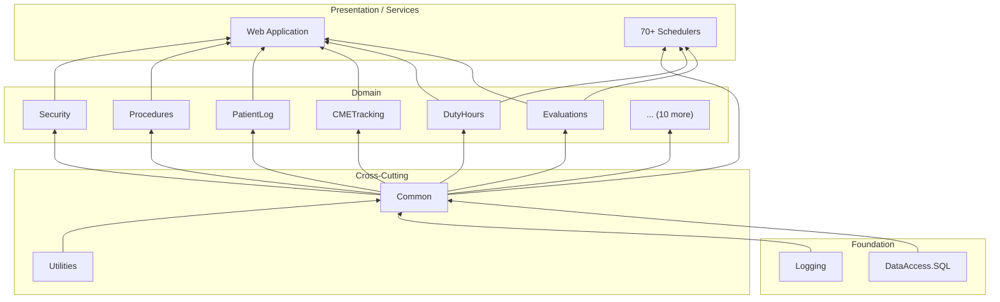

import DependencyGraph from '@site/src/components/DependencyGraph';

# Project Map

The `MyEvaluations2009.sln` solution contains **27 main projects** plus **70+ scheduler service projects**. This page provides a visual dependency map and categorized listing of all projects.

## Interactive Dependency Graph

<DependencyGraph data={{
  nodes: [
    { id: "Common", group: "Business", label: "Common" },
    { id: "Evaluations", group: "Business", label: "Evaluations" },
    { id: "DutyHours", group: "Business", label: "DutyHours" },
    { id: "CMETracking", group: "Business", label: "CMETracking" },
    { id: "PatientLog", group: "Business", label: "PatientLog" },
    { id: "Procedures", group: "Business", label: "Procedures" },
    { id: "Portfolio", group: "Business", label: "Portfolio" },
    { id: "LearningAssignment", group: "Business", label: "LearningAssignment" },
    { id: "Quiz", group: "Business", label: "Quiz" },
    { id: "Mail", group: "Business", label: "Mail" },
    { id: "Security", group: "Business", label: "Security" },
    { id: "ICC", group: "Business", label: "ICC" },
    { id: "EssentialActivities", group: "Business", label: "EssentialActivities" },
    { id: "NurseNotify", group: "Business", label: "NurseNotifyService" },
    { id: "TimeSheet", group: "Business", label: "TimeSheet" },
    { id: "HelloSign", group: "Business", label: "HelloSign" },
    { id: "ERAS", group: "Business", label: "ERAS" },
    { id: "DataAccess", group: "DataAccess", label: "DataAccess.SQL" },
    { id: "Logging", group: "DataAccess", label: "Logging" },
    { id: "Utilities", group: "DataAccess", label: "Utilities" },
    { id: "Web", group: "Web", label: "Web (App)" },
    { id: "WebLib", group: "Web", label: "Web (Library)" },
    { id: "SAML", group: "DataAccess", label: "SAMLServiceProvider" },
    { id: "FusionChart", group: "DataAccess", label: "FusionChartLibrary" },
    { id: "Amion", group: "DataAccess", label: "AmionScheduleUpdater" },
    { id: "Schedulers", group: "Services", label: "Schedulers (70+)" }
  ],
  links: [
    { source: "Common", target: "DataAccess" },
    { source: "Common", target: "Logging" },
    { source: "Evaluations", target: "Common" },
    { source: "Evaluations", target: "DataAccess" },
    { source: "Evaluations", target: "Utilities" },
    { source: "DutyHours", target: "Common" },
    { source: "DutyHours", target: "DataAccess" },
    { source: "CMETracking", target: "Common" },
    { source: "CMETracking", target: "DataAccess" },
    { source: "PatientLog", target: "Common" },
    { source: "PatientLog", target: "DataAccess" },
    { source: "Procedures", target: "Common" },
    { source: "Procedures", target: "DataAccess" },
    { source: "Portfolio", target: "Common" },
    { source: "Portfolio", target: "DataAccess" },
    { source: "LearningAssignment", target: "Common" },
    { source: "LearningAssignment", target: "DataAccess" },
    { source: "Quiz", target: "Common" },
    { source: "Quiz", target: "DataAccess" },
    { source: "Mail", target: "Common" },
    { source: "Mail", target: "DataAccess" },
    { source: "Mail", target: "Utilities" },
    { source: "Security", target: "Common" },
    { source: "Security", target: "DataAccess" },
    { source: "ICC", target: "Common" },
    { source: "ICC", target: "DataAccess" },
    { source: "EssentialActivities", target: "Common" },
    { source: "EssentialActivities", target: "DataAccess" },
    { source: "TimeSheet", target: "Common" },
    { source: "TimeSheet", target: "DataAccess" },
    { source: "HelloSign", target: "Common" },
    { source: "HelloSign", target: "Utilities" },
    { source: "ERAS", target: "Common" },
    { source: "ERAS", target: "DataAccess" },
    { source: "NurseNotify", target: "Common" },
    { source: "Web", target: "Evaluations" },
    { source: "Web", target: "DutyHours" },
    { source: "Web", target: "CMETracking" },
    { source: "Web", target: "PatientLog" },
    { source: "Web", target: "Procedures" },
    { source: "Web", target: "Portfolio" },
    { source: "Web", target: "LearningAssignment" },
    { source: "Web", target: "Quiz" },
    { source: "Web", target: "Mail" },
    { source: "Web", target: "Security" },
    { source: "Web", target: "Common" },
    { source: "Web", target: "WebLib" },
    { source: "Web", target: "SAML" },
    { source: "Web", target: "FusionChart" },
    { source: "Web", target: "Utilities" },
    { source: "WebLib", target: "Common" },
    { source: "WebLib", target: "Security" },
    { source: "Schedulers", target: "Common" },
    { source: "Schedulers", target: "Evaluations" },
    { source: "Schedulers", target: "DutyHours" },
    { source: "Schedulers", target: "Mail" },
    { source: "Schedulers", target: "DataAccess" },
    { source: "Schedulers", target: "Utilities" }
  ]
}} />

:::tip Interactive Graph
The graph above is interactive. You can drag nodes to rearrange them, scroll to zoom, and hover over nodes to see details. Color coding: **Blue** = Business, **Green** = DataAccess/Infrastructure, **Orange** = Web, **Purple** = Services.
:::

## Project Listing by Category

### Business Layer (16 Projects)

These projects contain domain logic and follow the Manager/Info pattern.

#### Primary Business Projects (Actively Maintained)

<!-- AUTO-GENERATED: Class counts, method counts, and line counts will be enriched from parse-dotnet-classes script -->

| # | Project | Namespace | Classes | Status | Description |
|---|---------|-----------|---------|--------|-------------|
| 1 | `MyEvaluations.Common` | `MyEvaluations.Common` | -- | Active | Shared base classes, common managers, utilities used across all modules |
| 2 | `MyEvaluations.Evaluations` | `MyEvaluations.Evaluations` | 35+ | Active | Core evaluation engine: creation, distribution, completion, scoring, reminders |
| 3 | `MyEvaluations.DutyHours` | `MyEvaluations.DutyHours` | 55+ | Active | ACGME duty hour tracking, compliance monitoring, violation detection |
| 4 | `MyEvaluations.CMETracking` | `MyEvaluations.CMETracking` | 25+ | Active | Continuing Medical Education credit tracking and reporting |
| 5 | `MyEvaluations.PatientLog` | `MyEvaluations.PatientLog` | 20+ | Active | Patient encounter logging with diagnosis and procedure codes |
| 6 | `MyEvaluations.Procedures` | `MyEvaluations.Procedures` | 30+ | Active | Surgical and clinical procedure tracking, competency verification |
| 7 | `MyEvaluations.Security` | `MyEvaluations.Security` | -- | Active | Authentication, authorization, RBAC, user management |
| 8 | `MyEvaluations.Mail` | `MyEvaluations.Mail` | -- | Active | Email composition, templates, distribution, notification management |

#### Secondary Business Projects (Moderately Maintained)

| # | Project | Namespace | Classes | Status | Description |
|---|---------|-----------|---------|--------|-------------|
| 9 | `MyEvaluations.Portfolio` | `MyEvaluations.Portfolio` | -- | Moderate | Resident portfolio management (document uploads, reflections) |
| 10 | `MyEvaluations.LearningAssignment` | `MyEvaluations.LearningAssignment` | 10+ | Moderate | Academic learning assignment creation and tracking |
| 11 | `MyEvaluations.Quiz` | `MyEvaluations.Quiz` | -- | Moderate | Quiz and assessment creation, grading, analytics |
| 12 | `MyEvaluations.TimeSheet` | `MyEvaluations.TimeSheet` | 20+ | Moderate | Timesheet management for clinical rotations |
| 13 | `MyEvaluations.HelloSign` | `MyEvaluations.HelloSign` | 25+ | Moderate | E-signature integration for documents and agreements |

#### Specialized Business Projects

| # | Project | Namespace | Status | Description |
|---|---------|-----------|--------|-------------|
| 14 | `MyEvaluations.ICC` | `MyEvaluations.ICC` | Active | In-Training Competency Committee evaluations |
| 15 | `MyEvaluations.EssentialActivities` | `MyEvaluations.EssentialActivities` | Active | Essential activity tracking for ACGME accreditation |
| 16 | `MyEvaluations.NurseNotifyService` | `MyEvaluations.NurseNotifyService` | Moderate | Nursing-specific notification workflows |
| 17 | `MyEvaluations.ERAS` | `MyEvaluations.ERAS` | Active | ERAS (Electronic Residency Application Service) integration |

### Infrastructure Layer (7 Projects)

These projects provide cross-cutting infrastructure services.

| # | Project | Dependencies | Status | Description |
|---|---------|-------------|--------|-------------|
| 1 | `MyEvaluations.DataAccess.SQL` | (none -- foundational) | Active | `DBDataAccess.cs`, `CustomCommand.cs` -- ADO.NET stored procedure wrappers |
| 2 | `MyEvaluations.Logging` | Enterprise Library | Active | Structured logging, error tracking, log file management |
| 3 | `MyEvaluations.Utilities` | -- | Active | `EmailUtility`, `FileManager`, `ExcelProcess`, `CSV`, SMS, encryption |
| 4 | `MyEvaluations.Web` | Common, Security | Active | Auth services, home redirection, session management, base page classes |
| 5 | `SAMLServiceProvider` | -- | Active | SAML 2.0 SSO: AuthnRequest, Response parsing, signature validation |
| 6 | `FusionChartLibrary` | -- | Frozen | 15+ chart classes for report visualizations (no longer actively developed) |
| 7 | `AmionScheduleUpdater` | Common, DataAccess | Moderate | Imports schedule data from Amion scheduling system |

### Web Application (1 Project)

The `Web` project is the ASP.NET WebForms application. It has **50+ subdirectories** organized by feature:

<!-- AUTO-GENERATED: Page counts per directory will be enriched from file system analysis -->

| Subdirectory | Est. Pages | Description | Activity |
|-------------|-----------|-------------|----------|
| `CMETracking/` | 50+ | CME credit entry, reporting, compliance | Active |
| `Preceptor/` | 50+ | Administrative management, preceptor tools | Active |
| `PatientLog/` | 25+ | Patient encounter forms, search, reports | Active |
| `UserControls/` | 25+ | Reusable ASCX controls (grids, pickers, etc.) | Active |
| `DutyHours/` | 20+ | Duty hour entry, weekly view, violations | Active |
| `Curriculum/` | 20+ | Curriculum management, requirements | Moderate |
| `Evaluations/` | 15+ | Evaluation forms, distribution, results | Active |
| `Procedures/` | 10+ | Procedure logging, competency tracking | Active |
| `MyPortfolio/` | 10+ | Portfolio management, document uploads | Moderate |
| `LearningAssignment/` | 10+ | Assignment management, completion tracking | Moderate |
| `Quiz/` | 10+ | Quiz creation, taking, results | Moderate |
| `Reports/` | 10+ | Various reporting pages | Active |
| `Security/` | 10+ | User management, role assignment | Active |
| `MySchedule/` | 5+ | Schedule viewing, calendar | Moderate |
| `OnCall/` | 5+ | QGenda/Momentum/Tangier integration | Active |
| `MyGME/` | 5+ | GME-specific administrative pages | Moderate |
| `EssentialActivities/` | 5+ | Essential activity tracking | Active |
| `NewFrontend/` | -- | React integration entry point (`NewFrontend.cs`) | Active |
| `Common/` | -- | Shared includes, master pages | Active |
| `Include/` | -- | JavaScript, CSS includes | Active |
| `Scripts/` | -- | Client-side JavaScript | Active |
| `Css/` | -- | Stylesheets | Moderate |

### Schedulers / Windows Services (70+ Projects)

The `Schedulers/` directory contains standalone Windows Service projects that run as scheduled tasks on the production server.

| Category | Count | Status | Key Services |
|----------|-------|--------|-------------|
| **Evaluation & Assessment** | 6 | Active | Evaluation reminders, auto-filing, auto-assignment |
| **Clinical & Patient Care** | 7 | Active | Patient log reminders, procedure reminders, FNP |
| **Duty Hours & Compliance** | 3 | Active | Duty hour reminders, verification, on-call processing |
| **Learning & Academic** | 8 | Active | Assignment reminders, onboarding, rotation requirements |
| **License & Certification** | 6 | Active | DEA, liability, state license, certificate expiration |
| **Communication** | 6 | Active | Mail distribution, notification digest, inbox processing |
| **Data Integration** | 12 | Mixed | Banner import, Salesforce sync, BSN, file processing |
| **Administrative** | 8 | Active | Accreditation, contracts, user archiving, milestones |
| **Conference** | 4 | Moderate | Conference reminders, attendee/presenter notifications |
| **Specialized** | 18+ | Mixed | Various workflow-specific processors |

See the [Schedulers documentation](/docs/dotnet-backend/schedulers/) for the complete catalog with individual service details.

## Dependency Flow

The dependency hierarchy flows from bottom (foundational) to top (consumer):

### Key Dependency Rules

1. **DataAccess.SQL** has no dependencies on business projects -- it is purely foundational
2. **Common** depends on DataAccess.SQL and Logging -- all business projects depend on Common
3. **Business projects** depend on Common and DataAccess.SQL; they do **not** reference each other (with rare exceptions)
4. **Web** references all business projects it needs for page rendering
5. **Schedulers** reference only the business projects they need for their specific task
6. **No circular dependencies** -- the dependency graph is a DAG (directed acyclic graph)

## Vendored Dependencies

The `Web/Reference DLL/` directory contains vendored third-party DLLs that are not available via NuGet:

<!-- AUTO-GENERATED: Specific DLL names and versions will be enriched from file system analysis -->

| DLL | Purpose | Notes |
|-----|---------|-------|
| Various FusionChart DLLs | Chart rendering | Licensed component |
| CKFinder DLLs | File management UI | Licensed component |
| Various legacy DLLs | Historical dependencies | May include older library versions |

:::note
These vendored DLLs are committed to the repository because they are not available through NuGet. This is a legacy practice; modern projects use NuGet exclusively.
:::

<!-- AUTO-GENERATED: Full project dependency matrix and line count statistics will be enriched from parse-dotnet-solution script -->
