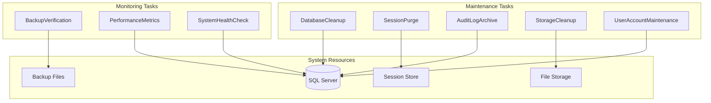
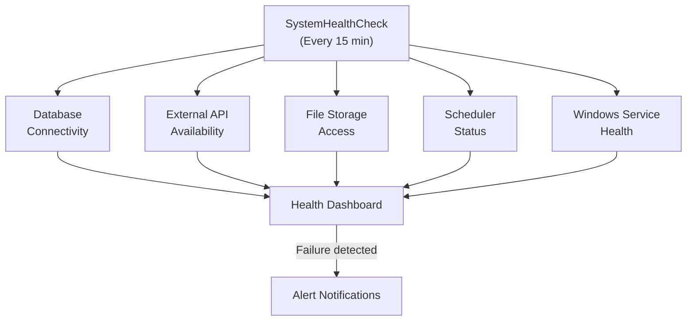

# Administrative Schedulers

The administrative schedulers handle system maintenance, cleanup, monitoring, and infrastructure health. These services run behind the scenes to keep the MyEvaluations platform performant, secure, and compliant with data retention policies.

## Overview

| Scheduler | Frequency | Purpose |
|-----------|-----------|---------|
| [DatabaseCleanup](#databasecleanup) | Weekly (Saturday 11:00 PM) | Clean up temporary tables, orphaned records, and stale data |
| [SessionPurge](#sessionpurge) | Every 2 hours | Remove expired user sessions |
| [AuditLogArchive](#auditlogarchive) | Monthly (1st at 3:00 AM) | Archive old audit log entries |
| [BackupVerification](#backupverification) | Daily at 6:00 AM | Verify database backup integrity |
| [PerformanceMetrics](#performancemetrics) | Every 30 minutes | Collect and store application performance metrics |
| [UserAccountMaintenance](#useraccountmaintenance) | Daily at 1:00 AM | Deactivate expired accounts and clean up orphaned data |
| [StorageCleanup](#storagecleanup) | Weekly (Sunday 2:00 AM) | Clean up temporary files and orphaned uploads |
| [SystemHealthCheck](#systemhealthcheck) | Every 15 minutes | Monitor system component health |



---

## DatabaseCleanup

**Purpose:** Performs routine database maintenance including cleaning up temporary tables, removing orphaned records, rebuilding fragmented indexes, and updating table statistics. This keeps the database performant as data volume grows.

**Frequency:** Weekly (Saturday at 11:00 PM)

**Data Flow:**

1. Cleans up temporary/staging tables used by import processes
2. Removes orphaned records (e.g., notification queue entries for deleted users)
3. Identifies and rebuilds heavily fragmented indexes (fragmentation > 30%)
4. Updates statistics on tables with significant data changes
5. Shrinks transaction log if it has grown beyond the configured threshold
6. Logs cleanup results (records deleted, indexes rebuilt, space reclaimed)

**Key Stored Procedures:**
- `usp_CleanupTemporaryTables` -- Truncates or drops expired temporary tables
- `usp_RemoveOrphanedRecords` -- Deletes records referencing non-existent parent records
- `usp_RebuildFragmentedIndexes` -- Rebuilds indexes with fragmentation above threshold
- `usp_UpdateTableStatistics` -- Updates statistics on modified tables
- `usp_GetDatabaseMaintenanceSummary` -- Reports on maintenance actions taken

**Configuration:**
- `IndexFragmentationThreshold` -- Fragmentation percentage to trigger rebuild (default: 30%)
- `TempTableMaxAgeDays` -- Days before temporary tables are cleaned up (default: 7)
- `LogShrinkThresholdGB` -- Transaction log size threshold for shrinking (default: 10 GB)

:::warning
Database cleanup runs during low-traffic hours (Saturday night) but can still impact performance for any weekend users. Monitor execution duration and adjust if needed.
:::

---

## SessionPurge

**Purpose:** Removes expired user sessions from the session store. The MyEvaluations web application uses server-side sessions stored in SQL Server, and expired sessions must be periodically cleaned to prevent table bloat.

**Frequency:** Every 2 hours

**Data Flow:**

1. Queries the `ASPStateTempSessions` table for sessions past their expiration time
2. Deletes expired session records in batches to avoid locking
3. Reports the number of sessions purged
4. Monitors active session count for capacity planning

**Key Stored Procedures:**
- `usp_PurgeExpiredSessions` -- Deletes expired session records
- `usp_GetActiveSessionCount` -- Reports current active sessions
- `usp_GetSessionStatistics` -- Provides session duration and count metrics

**Configuration:**
- `SessionTimeoutMinutes` -- Session expiration time (default: 480, i.e., 8 hours)
- `PurgeBatchSize` -- Sessions to delete per batch (default: 1000)

---

## AuditLogArchive

**Purpose:** Archives audit log entries older than the configured retention period. The audit log records all significant user actions (logins, data changes, form submissions) and grows rapidly. Archiving moves old entries to a separate archive table while maintaining regulatory compliance.

**Frequency:** Monthly (1st of each month at 3:00 AM)

**Data Flow:**

1. Identifies audit log entries older than the retention period (default: 2 years)
2. Copies qualifying records to `AuditLog_Archive` table
3. Validates that all records were successfully copied
4. Deletes archived records from the active `AuditLog` table
5. Generates an archive summary report

**Key Stored Procedures:**
- `usp_ArchiveAuditLogEntries` -- Copies old audit entries to archive
- `usp_ValidateAuditArchive` -- Verifies archive completeness
- `usp_PurgeArchivedAuditEntries` -- Removes archived entries from active table

**Configuration:**
- `AuditLogRetentionMonths` -- Months to retain in active table (default: 24)
- `ArchiveBatchSize` -- Records per batch (default: 50000)

---

## BackupVerification

**Purpose:** Verifies the integrity and recency of database backups. Checks that backups completed successfully, are not corrupted, and meet the RPO (Recovery Point Objective) requirements.

**Frequency:** Daily at 6:00 AM

**Data Flow:**

1. Checks the SQL Server backup history for the most recent full and differential backups
2. Verifies backup file exists and is accessible
3. Performs `RESTORE VERIFYONLY` to confirm backup integrity
4. Checks backup age against the RPO policy (e.g., no older than 24 hours)
5. Sends alert if backup is missing, corrupted, or too old
6. Logs verification results

**Key Stored Procedures:**
- `usp_GetLatestBackupInfo` -- Retrieves the most recent backup metadata
- `usp_LogBackupVerificationResult` -- Records verification outcome

**Configuration:**
- `BackupRPOHours` -- Maximum acceptable backup age (default: 24)
- `BackupVerifyAlertRecipients` -- Email addresses for backup failure alerts
- `BackupStoragePath` -- Path to verify backup file existence

---

## PerformanceMetrics

**Purpose:** Collects and stores application performance metrics including page response times, database query durations, API endpoint latencies, and resource utilization. This data powers the performance monitoring dashboard.

**Frequency:** Every 30 minutes

**Data Flow:**

1. Queries SQL Server DMVs (Dynamic Management Views) for:
   - Top queries by CPU, duration, and I/O
   - Wait statistics
   - Memory usage and buffer pool metrics
   - Active connections and blocked processes
2. Collects IIS performance counters (if accessible):
   - Request processing time
   - Active requests
   - Error rates
3. Stores metrics in the `PerformanceMetrics` table
4. Generates alerts if metrics exceed configured thresholds

**Key Stored Procedures:**
- `usp_CollectDatabasePerformanceMetrics` -- Gathers SQL Server performance data
- `usp_StorePerformanceMetrics` -- Inserts metrics records
- `usp_CheckPerformanceThresholds` -- Compares metrics against alert thresholds
- `usp_GetPerformanceTrend` -- Retrieves historical performance data for trending

---

## UserAccountMaintenance

**Purpose:** Performs routine user account maintenance including deactivating expired accounts, removing temporary/demo accounts past their expiration, and cleaning up orphaned profile data.

**Frequency:** Daily at 1:00 AM

**Data Flow:**

1. Identifies user accounts marked for deactivation (end date reached)
2. Deactivates expired accounts (sets `IsActive = 0`)
3. Removes temporary/demo accounts past their expiration date
4. Cleans up orphaned data associated with deactivated accounts:
   - Pending evaluations reassigned or closed
   - Notification preferences cleared
   - Active sessions terminated
5. Sends deactivation summary to administrators

**Key Stored Procedures:**
- `usp_GetExpiredUserAccounts` -- Lists accounts past their end date
- `usp_DeactivateUserAccounts` -- Batch deactivates user accounts
- `usp_CleanupDeactivatedUserData` -- Removes orphaned data
- `usp_ReassignPendingEvaluations` -- Reassigns evaluations from deactivated users

---

## StorageCleanup

**Purpose:** Cleans up temporary files, orphaned uploads, and expired cached content from the file storage system. Prevents storage from filling up with unused files.

**Frequency:** Weekly (Sunday at 2:00 AM)

**Data Flow:**

1. Scans the temporary upload directory for files older than 24 hours
2. Identifies uploaded files not referenced by any database record (orphaned)
3. Removes expired cached report files
4. Deletes temporary export files past their retention period
5. Reports storage space reclaimed

**Key Stored Procedures:**
- `usp_GetOrphanedUploadFiles` -- Lists files with no database reference
- `usp_GetExpiredCacheFiles` -- Lists cached files past retention
- `usp_LogStorageCleanupResults` -- Records cleanup statistics

---

## SystemHealthCheck

**Purpose:** Monitors the overall health of system components and reports issues before they become critical. Checks database connectivity, external API availability, file storage access, email delivery capability, and scheduler service status.

**Frequency:** Every 15 minutes

**Data Flow:**

1. Checks database connectivity and response time
2. Verifies external API endpoints are reachable:
   - Mailgun API
   - Amion/QGenda APIs
   - Active Directory/LDAP
3. Checks file storage accessibility and available disk space
4. Verifies the most recent scheduler executions are within expected intervals
5. Checks Windows Service status for all scheduler services
6. Sends alert if any health check fails
7. Updates the system health dashboard



**Key Stored Procedures:**
- `usp_CheckDatabaseHealth` -- Tests database connectivity and response time
- `usp_GetSchedulerExecutionStatus` -- Checks if schedulers are running on schedule
- `usp_UpdateSystemHealthDashboard` -- Updates the health status display
- `usp_LogHealthCheckResult` -- Records health check outcomes

**Configuration:**
- `HealthCheckIntervalMinutes` -- How often to run checks (default: 15)
- `DatabaseResponseTimeThresholdMs` -- Max acceptable DB response time (default: 5000)
- `DiskSpaceWarningThresholdGB` -- Minimum free disk space before warning (default: 10)
- `HealthAlertRecipients` -- Email addresses for health alerts

---

## Troubleshooting

### Common Issues

| Issue | Cause | Resolution |
|-------|-------|------------|
| Database cleanup taking too long | Large number of orphaned records accumulated | Increase cleanup frequency temporarily; run in smaller batches |
| Session purge not keeping up | Very high user traffic creating sessions faster than purge | Reduce session timeout; increase purge frequency |
| Backup verification failing | Backup path changed or permissions revoked | Verify backup storage path and service account permissions |
| Health check false alarms | External API temporarily unavailable | Add retry logic; adjust alert threshold to require consecutive failures |
| Storage cleanup deleting needed files | Retention period too short | Review and increase `TempFileRetentionHours` config |

### Checking Scheduler Logs

```sql
SELECT TOP 20 *
FROM SchedulerLog
WHERE SchedulerName IN (
    'DatabaseCleanup', 'SessionPurge', 'AuditLogArchive',
    'BackupVerification', 'PerformanceMetrics',
    'UserAccountMaintenance', 'SystemHealthCheck'
)
ORDER BY ExecutionDate DESC;
```
