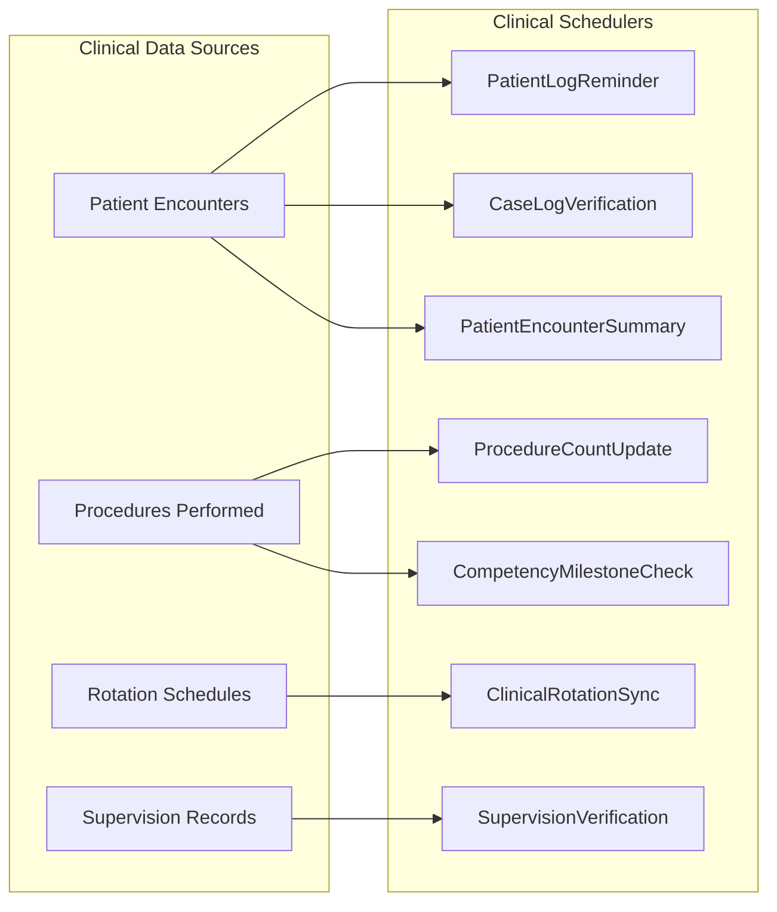
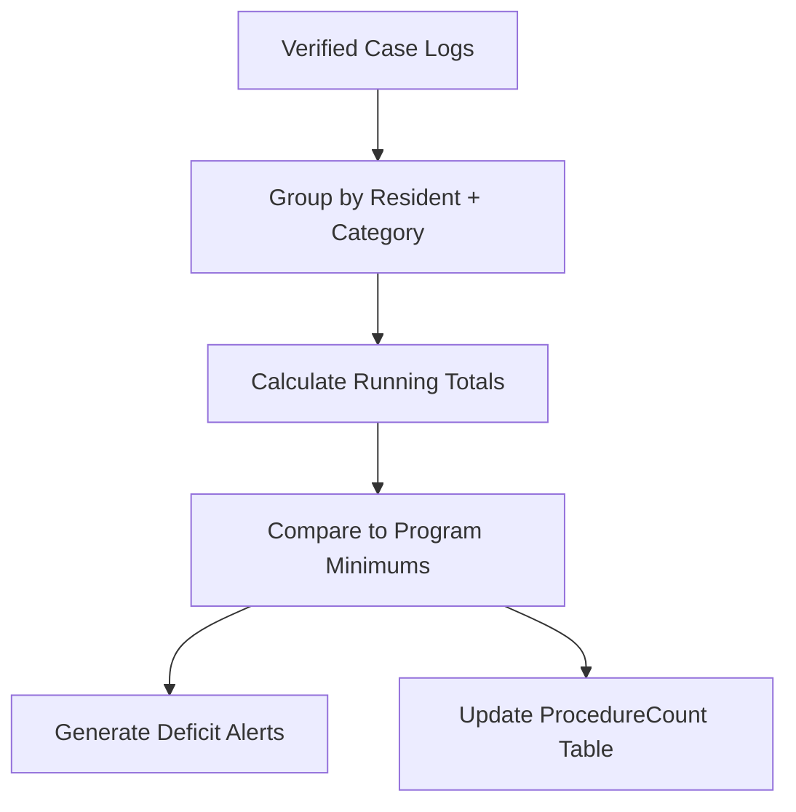

# Clinical & Patient Care Schedulers

The clinical schedulers manage patient care documentation, procedure tracking, clinical rotation synchronization, and supervision compliance. These services ensure that clinical data is accurate, up-to-date, and meets accreditation requirements for medical education programs.

## Overview

| Scheduler | Frequency | Purpose |
|-----------|-----------|---------|
| [PatientLogReminder](#patientlogreminder) | Daily at 8:00 AM | Remind residents to log patient encounters |
| [CaseLogVerification](#caselogverification) | Daily at 3:00 AM | Verify and validate submitted case logs |
| [ProcedureCountUpdate](#procedurecountupdate) | Nightly at 1:00 AM | Aggregate procedure counts by resident and category |
| [ClinicalRotationSync](#clinicalrotationsync) | Daily at 5:00 AM | Sync rotation schedules from external systems |
| [CompetencyMilestoneCheck](#competencymilestonecheck) | Weekly (Sunday 11:00 PM) | Check clinical competency against milestones |
| [SupervisionVerification](#supervisionverification) | Daily at 9:00 AM | Verify attending supervision documentation |
| [PatientEncounterSummary](#patientencountersummary) | Monthly (1st at 4:00 AM) | Generate monthly patient encounter summary reports |



---

## PatientLogReminder

**Purpose:** Sends daily reminders to residents who have not logged their patient encounters for the current rotation period. Consistent patient logging is required for ACGME accreditation and helps track clinical experience breadth.

**Frequency:** Daily at 8:00 AM

**Data Flow:**

1. Identifies residents currently on active rotations
2. Checks patient log entries for the past 24-48 hours
3. Identifies residents with zero or below-threshold entries
4. Sends personalized reminder emails with direct link to the patient log form
5. Logs reminder statistics to `SchedulerLog`

**Key Stored Procedures:**
- `usp_GetResidentsWithoutRecentPatientLogs` -- Identifies residents missing patient logs
- `usp_GetActiveRotationResidents` -- Lists residents on current rotations
- `usp_LogPatientLogReminder` -- Records reminder activity

**Configuration:**
- `PatientLogReminderThreshold` -- Minimum expected logs per day (default: 1)
- `PatientLogReminderExcludeRotations` -- Rotation types exempt from reminders (e.g., vacation, research)

---

## CaseLogVerification

**Purpose:** Validates submitted case logs for data quality, checking for duplicate entries, missing required fields, and statistical outliers that may indicate data entry errors.

**Frequency:** Daily at 3:00 AM

**Data Flow:**

1. Retrieves case logs submitted in the past 24 hours
2. Runs validation rules:
   - Duplicate detection (same patient, same date, same procedure)
   - Required field completeness (diagnosis, procedure, attending)
   - Statistical outlier detection (unusual procedure counts)
3. Flags problematic entries with validation status
4. Notifies program coordinators of entries requiring review

**Key Stored Procedures:**
- `usp_GetRecentCaseLogsForVerification` -- Retrieves recent case log submissions
- `usp_FlagCaseLogValidationIssue` -- Marks case logs with validation problems
- `usp_GetCaseLogDuplicates` -- Detects potential duplicate entries

---

## ProcedureCountUpdate

**Purpose:** Aggregates procedure counts by resident, procedure category, and academic year. These counts are critical for graduation requirements and ACGME case minimum tracking.

**Frequency:** Nightly at 1:00 AM

**Data Flow:**

1. Queries all verified case logs since the last aggregation
2. Groups procedures by resident, category, and subcategory
3. Updates the `ProcedureCount` summary table
4. Compares current counts against program-defined minimums
5. Generates deficit alerts for residents below expected progress



**Key Stored Procedures:**
- `usp_AggregateProcedureCounts` -- Calculates procedure totals by resident and category
- `usp_GetProcedureMinimumDeficits` -- Identifies residents below required minimums
- `usp_UpdateProcedureCountSummary` -- Updates the summary table

---

## ClinicalRotationSync

**Purpose:** Synchronizes clinical rotation schedules from external scheduling systems (Amion, QGenda) into the MyEvaluations database. Accurate rotation data is essential for evaluation distribution, duty hour tracking, and supervision assignment.

**Frequency:** Daily at 5:00 AM

**Data Flow:**

1. Connects to external scheduling system APIs (Amion, QGenda)
2. Retrieves rotation assignments for the next 30 days
3. Compares with existing rotation data in MyEvaluations
4. Creates, updates, or deactivates rotation records as needed
5. Triggers evaluation assignment recalculation for changed rotations
6. Logs sync summary (added, updated, deleted records)

**Key Stored Procedures:**
- `usp_SyncExternalRotationData` -- Upserts rotation records from external sources
- `usp_GetRotationSyncDifferences` -- Compares external data with current records
- `usp_RecalculateEvaluationAssignments` -- Updates evaluation assignments based on rotation changes

**Related Integration Docs:** See [Amion & QGenda Integration](../integrations/amion-qgenda) for API details.

---

## CompetencyMilestoneCheck

**Purpose:** Evaluates resident clinical competency progress against ACGME milestone requirements by analyzing procedure counts, evaluation scores, and clinical activity breadth.

**Frequency:** Weekly (Sunday at 11:00 PM)

**Data Flow:**

1. Retrieves each resident's current procedure counts and evaluation scores
2. Maps clinical data to ACGME competency domains (Patient Care, Medical Knowledge, etc.)
3. Calculates milestone achievement levels for each competency
4. Updates the competency tracking dashboard
5. Flags residents who are significantly behind expected progression

**Key Stored Procedures:**
- `usp_GetResidentClinicalCompetencyData` -- Aggregates clinical data by competency domain
- `usp_CalculateCompetencyMilestones` -- Applies milestone calculation logic
- `usp_UpdateCompetencyDashboard` -- Refreshes the program director's dashboard

---

## SupervisionVerification

**Purpose:** Verifies that all patient encounters have proper attending physician supervision documentation. This is a regulatory requirement -- residents must be supervised, and the supervising attending must be documented.

**Frequency:** Daily at 9:00 AM

**Data Flow:**

1. Queries patient encounters from the past 48 hours
2. Checks that each encounter has an assigned supervising attending
3. Verifies that the attending has acknowledged/co-signed the encounter
4. Flags encounters missing supervision documentation
5. Sends notifications to attendings with unsigned encounters
6. Escalates to program director if encounters remain unsigned after 72 hours

**Key Stored Procedures:**
- `usp_GetEncountersMissingSupervision` -- Finds encounters without attending documentation
- `usp_GetUnsignedAttendingEncounters` -- Lists encounters awaiting co-signature
- `usp_EscalateSupervisionViolations` -- Flags chronic supervision documentation failures

---

## PatientEncounterSummary

**Purpose:** Generates monthly summary reports of patient encounters by resident, service, diagnosis category, and procedure type. These reports are used for program accreditation reviews and resident progress meetings.

**Frequency:** Monthly (1st of each month at 4:00 AM)

**Data Flow:**

1. Aggregates all verified patient encounters from the previous month
2. Generates summary statistics by resident, rotation, and diagnosis category
3. Creates comparison reports (current month vs. historical average)
4. Stores reports in the document management system
5. Sends report availability notifications to program directors

**Key Stored Procedures:**
- `usp_GenerateMonthlyEncounterSummary` -- Creates aggregate encounter statistics
- `usp_GetEncounterTrendData` -- Provides historical comparison data
- `usp_StoreGeneratedReport` -- Saves report to document storage

---

## Troubleshooting

### Common Issues

| Issue | Cause | Resolution |
|-------|-------|------------|
| Rotation sync failures | External API (Amion/QGenda) timeout or credentials expired | Check API connectivity; verify credentials in config |
| Procedure counts not updating | Case logs stuck in "Pending Verification" status | Run CaseLogVerification manually; check validation rules |
| Supervision alerts for inactive rotations | Rotation end dates not synced properly | Verify ClinicalRotationSync ran successfully |
| Duplicate patient log reminders | Timezone mismatch between server and database | Ensure server timezone matches `SchedulerTimezone` config |

### Checking Scheduler Logs

```sql
SELECT TOP 20 *
FROM SchedulerLog
WHERE SchedulerName LIKE 'Clinical%' OR SchedulerName LIKE 'Patient%'
ORDER BY ExecutionDate DESC;
```
