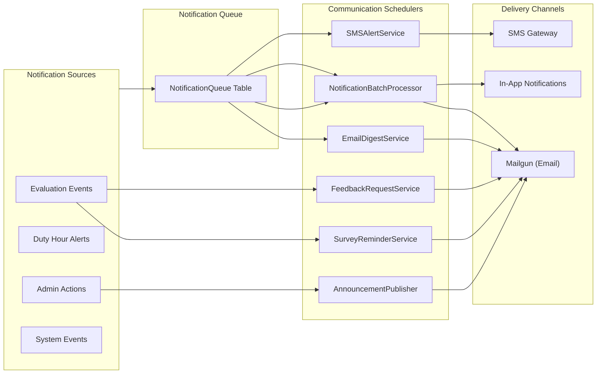

# Communication Schedulers

The communication schedulers manage all outbound messaging from the MyEvaluations platform. Rather than sending individual notifications in real time (which would overwhelm users), these schedulers batch, consolidate, and deliver communications at optimal times.

## Overview

| Scheduler | Frequency | Purpose |
|-----------|-----------|---------|
| [EmailDigestService](#emaildigestservice) | Daily at 7:00 AM | Compile and send daily email digests |
| [NotificationBatchProcessor](#notificationbatchprocessor) | Every 15 minutes | Process queued notifications in batches |
| [SMSAlertService](#smsalertservice) | Every 30 minutes | Send queued SMS notifications |
| [AnnouncementPublisher](#announcementpublisher) | Daily at 8:00 AM | Publish scheduled announcements |
| [SurveyReminderService](#surveyreminderservice) | Daily at 9:00 AM | Send reminders for pending surveys |
| [FeedbackRequestService](#feedbackrequestservice) | Weekly (Friday 3:00 PM) | Request feedback on completed activities |



---

## EmailDigestService

**Purpose:** Compiles a daily email digest for each user, summarizing all their pending tasks, upcoming deadlines, new notifications, and important updates in a single consolidated email. This prevents notification fatigue by replacing dozens of individual emails with one organized summary.

**Frequency:** Daily at 7:00 AM

**Data Flow:**

1. Queries all unread notifications per user from the past 24 hours
2. Groups notifications by category (evaluations, duty hours, administrative, etc.)
3. Adds upcoming deadlines for the next 7 days
4. Renders a responsive HTML email template with categorized sections
5. Sends via Mailgun API with tracking enabled
6. Marks notifications as "included in digest" to prevent duplication

**Key Stored Procedures:**
- `usp_GetUserDigestNotifications` -- Retrieves unread notifications for digest compilation
- `usp_GetUpcomingDeadlinesByUser` -- Lists deadlines within the configured window
- `usp_MarkNotificationsAsDigested` -- Flags notifications included in the digest
- `usp_GetUserDigestPreferences` -- Retrieves user-specific digest settings

**Configuration:**
- `DigestSendTime` -- Time of day to send digests (default: 07:00)
- `DigestLookbackHours` -- Hours of notifications to include (default: 24)
- `DigestDeadlineWindowDays` -- Days ahead for deadline inclusion (default: 7)
- `EnableDigestTracking` -- Track email opens and clicks (default: true)

---

## NotificationBatchProcessor

**Purpose:** Processes the notification queue in batches, sending individual email and in-app notifications that require near-real-time delivery. This is for urgent notifications that should not wait for the daily digest (e.g., evaluation form assigned, duty hour violation detected).

**Frequency:** Every 15 minutes

**Data Flow:**

1. Reads pending notifications from `NotificationQueue` table (ordered by priority)
2. Groups by recipient and delivery channel (email, in-app, both)
3. For email notifications:
   - Renders the appropriate email template
   - Sends via Mailgun API
   - Records delivery status and message ID
4. For in-app notifications:
   - Inserts into the `UserNotification` table
   - Triggers real-time push via SignalR (if user is online)
5. Updates notification status to `Sent` or `Failed`
6. Retries failed notifications (up to 3 attempts)

**Key Stored Procedures:**
- `usp_GetPendingNotificationBatch` -- Retrieves the next batch of notifications to process
- `usp_UpdateNotificationStatus` -- Marks notifications as sent or failed
- `usp_InsertInAppNotification` -- Creates in-app notification records
- `usp_GetNotificationRetryQueue` -- Retrieves failed notifications eligible for retry

**Configuration:**
- `BatchSize` -- Maximum notifications per batch (default: 100)
- `MaxRetryAttempts` -- Number of retry attempts for failed sends (default: 3)
- `RetryDelayMinutes` -- Delay between retries (default: 30)
- `PriorityThreshold` -- Priority level for immediate processing (default: High)

---

## SMSAlertService

**Purpose:** Sends SMS text messages for critical alerts that require immediate attention, such as duty hour violations approaching the limit, expired credentials, and urgent evaluation deadlines.

**Frequency:** Every 30 minutes

**Data Flow:**

1. Queries the notification queue for SMS-eligible notifications
2. Validates phone numbers against the user profile
3. Formats messages to fit SMS character limits (160 characters)
4. Sends via the configured SMS gateway API
5. Records delivery status and tracks undeliverable numbers
6. Escalates to email if SMS delivery fails

**Key Stored Procedures:**
- `usp_GetPendingSMSNotifications` -- Retrieves SMS-eligible notifications
- `usp_GetUserPhoneNumber` -- Validates and retrieves user phone numbers
- `usp_UpdateSMSDeliveryStatus` -- Records SMS delivery outcome
- `usp_EscalateFailedSMSToEmail` -- Creates email fallback for failed SMS

**Configuration:**
- `SMSGatewayProvider` -- SMS provider (e.g., Twilio, Vonage)
- `SMSMaxLength` -- Maximum characters per message (default: 160)
- `SMSEnabledNotificationTypes` -- Notification types eligible for SMS delivery
- `SMSQuietHoursStart/End` -- Do-not-disturb window (default: 10 PM - 7 AM)

---

## AnnouncementPublisher

**Purpose:** Publishes scheduled announcements from program administrators to their targeted audience. Announcements can be scheduled for future dates, targeted to specific programs/departments, and delivered via email and in-app notification.

**Frequency:** Daily at 8:00 AM

**Data Flow:**

1. Queries for announcements scheduled for today or past due
2. Resolves the target audience (program, department, role, specific users)
3. Creates in-app notification records for all target users
4. Sends email notifications to all target users (respecting email preferences)
5. Marks announcements as "Published" with the publish timestamp

**Key Stored Procedures:**
- `usp_GetScheduledAnnouncements` -- Retrieves announcements ready for publishing
- `usp_ResolveAnnouncementAudience` -- Expands audience criteria to user list
- `usp_PublishAnnouncement` -- Marks announcement as published
- `usp_CreateAnnouncementNotifications` -- Batch creates notification records

---

## SurveyReminderService

**Purpose:** Sends reminders for pending institutional surveys, program surveys, and satisfaction surveys. Tracks response rates and increases reminder frequency as the survey deadline approaches.

**Frequency:** Daily at 9:00 AM

**Data Flow:**

1. Retrieves active surveys with response deadlines
2. Identifies users who have not completed the survey
3. Applies tiered reminder logic based on days remaining:
   - **14+ days:** No reminder (initial notice already sent)
   - **7-13 days:** First reminder
   - **3-6 days:** Second reminder
   - **1-2 days:** Final urgent reminder
4. Sends reminder with current response rate to motivate completion
5. Reports final response rates to survey administrators after deadline

**Key Stored Procedures:**
- `usp_GetActiveSurveysWithPendingResponses` -- Lists surveys with incomplete responses
- `usp_GetSurveyNonResponders` -- Identifies users who have not responded
- `usp_GetSurveyResponseRate` -- Calculates current response rate
- `usp_LogSurveyReminder` -- Records reminder delivery

---

## FeedbackRequestService

**Purpose:** Requests feedback from trainees and faculty after completing specific activities (rotations, conferences, educational sessions). This captures timely feedback while the experience is still fresh.

**Frequency:** Weekly (Friday at 3:00 PM)

**Data Flow:**

1. Identifies recently completed activities (rotations ended, conferences attended)
2. Checks that feedback has not already been requested for these activities
3. Creates feedback request records
4. Sends personalized email with contextual feedback form link
5. Tracks feedback completion rates

**Key Stored Procedures:**
- `usp_GetActivitiesEligibleForFeedback` -- Lists recently completed activities
- `usp_CreateFeedbackRequest` -- Creates feedback request records
- `usp_GetFeedbackCompletionRate` -- Tracks feedback response rates

---

## Troubleshooting

### Common Issues

| Issue | Cause | Resolution |
|-------|-------|------------|
| Digest emails not sending | Mailgun API rate limit exceeded | Check Mailgun sending limits; stagger delivery |
| Duplicate notifications | Batch processor and digest both sending | Check notification flags; ensure mutual exclusion |
| SMS not delivered | Invalid phone number or SMS gateway outage | Check phone number format; verify SMS provider status |
| Announcements delayed | Scheduler not running at scheduled time | Check Windows Service status; verify server time |
| Users receiving too many emails | User not enrolled in digest mode | Enable digest preference for affected users |

### Checking Scheduler Logs

```sql
SELECT TOP 20 *
FROM SchedulerLog
WHERE SchedulerName IN (
    'EmailDigestService', 'NotificationBatchProcessor',
    'SMSAlertService', 'AnnouncementPublisher',
    'SurveyReminderService', 'FeedbackRequestService'
)
ORDER BY ExecutionDate DESC;
```

### Monitoring Notification Queue

```sql
-- Check queue depth and oldest pending notification
SELECT
    COUNT(*) AS PendingCount,
    MIN(CreatedDate) AS OldestPending,
    MAX(CreatedDate) AS NewestPending
FROM NotificationQueue
WHERE Status = 'Pending';

-- Check failure rate over the past 24 hours
SELECT
    DeliveryChannel,
    Status,
    COUNT(*) AS Count
FROM NotificationQueue
WHERE CreatedDate >= DATEADD(HOUR, -24, GETDATE())
GROUP BY DeliveryChannel, Status;
```
