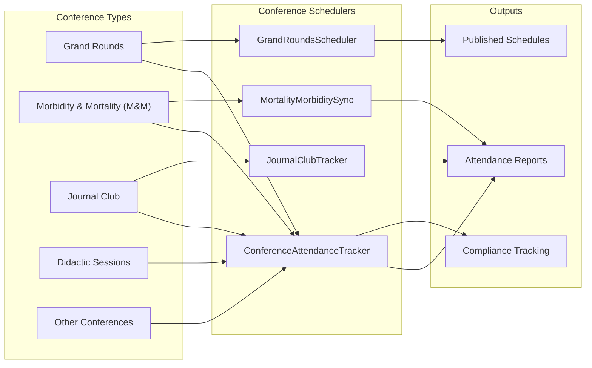
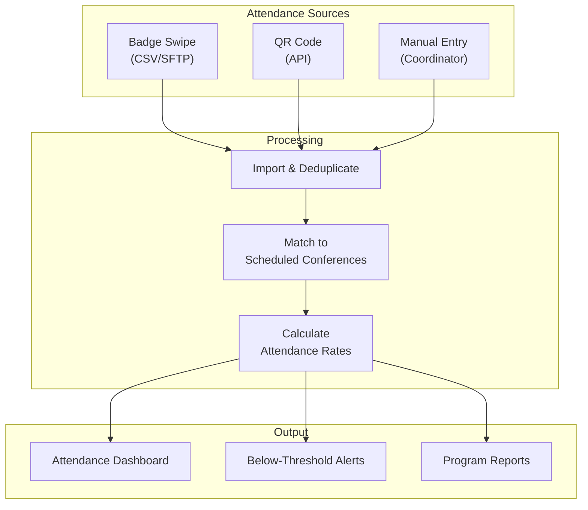

# Conference Schedulers

The conference schedulers manage academic conference tracking, which is a core requirement for medical education programs. ACGME requires programs to provide and document regular educational conferences, and residents must maintain minimum attendance rates.

## Overview

| Scheduler | Frequency | Purpose |
|-----------|-----------|---------|
| [ConferenceAttendanceTracker](#conferenceattendancetracker) | Daily at 10:00 PM | Process and reconcile conference attendance records |
| [GrandRoundsScheduler](#grandroundsscheduler) | Weekly (Sunday 8:00 PM) | Generate and distribute weekly grand rounds schedule |
| [MortalityMorbiditySync](#mortalitymorbiditysync) | Weekly (Friday 6:00 AM) | Sync M&M conference data and attendance |
| [JournalClubTracker](#journalclubtracker) | Monthly (1st at 9:00 AM) | Track journal club participation and article assignments |



---

## ConferenceAttendanceTracker

**Purpose:** Processes and reconciles conference attendance records from multiple sources (badge swipe, QR code sign-in, manual entry) and calculates attendance percentages against program requirements. This is the primary conference scheduler that all conference types feed into.

**Frequency:** Daily at 10:00 PM

**Data Flow:**

1. Imports raw attendance data from sign-in systems:
   - Badge swipe systems (CSV file import from SFTP)
   - QR code check-in app (API pull)
   - Manual attendance sheets (entered by coordinators)
2. Deduplicates and reconciles attendance records across sources
3. Matches attendance records to scheduled conferences
4. Calculates per-resident attendance statistics:
   - Attendance rate by conference type
   - Rolling 6-month and 12-month attendance percentages
   - Excused absence handling (vacation, away rotations)
5. Updates the conference attendance dashboard
6. Flags residents below the minimum attendance threshold (typically 70-80%)
7. Sends weekly attendance summary to program directors



**Key Stored Procedures:**
- `usp_ImportConferenceAttendanceRaw` -- Imports raw attendance data from external sources
- `usp_DeduplicateAttendanceRecords` -- Removes duplicate sign-in records
- `usp_MatchAttendanceToConference` -- Links attendance records to conference schedules
- `usp_CalculateAttendancePercentage` -- Computes attendance rates per resident
- `usp_FlagLowAttendance` -- Identifies residents below required attendance thresholds
- `usp_GenerateAttendanceSummaryReport` -- Creates program-level attendance reports

**Configuration:**
- `MinimumAttendancePercentage` -- Required attendance rate (default: 70%)
- `AttendanceCalculationWindowMonths` -- Rolling window for rate calculation (default: 12)
- `ExcusedAbsenceRotationTypes` -- Rotation types that excuse conference absence
- `AttendanceSourcePriority` -- Priority order when deduplicating (default: Badge > QR > Manual)

---

## GrandRoundsScheduler

**Purpose:** Generates and distributes the weekly grand rounds schedule, including speaker assignments, topic notifications, and room reservations. Grand rounds is the flagship educational conference for most academic departments.

**Frequency:** Weekly (Sunday at 8:00 PM)

**Data Flow:**

1. Retrieves the upcoming week's grand rounds schedule from the conference calendar
2. Confirms speaker availability and topic details
3. Generates the weekly grand rounds announcement:
   - Date, time, and location
   - Speaker name and credentials
   - Topic title and learning objectives
   - CME credit eligibility
4. Distributes the announcement via email to all department members
5. Posts the schedule to the in-app conference calendar
6. Sends speaker confirmation and logistics email

**Key Stored Procedures:**
- `usp_GetUpcomingGrandRoundsSchedule` -- Retrieves next week's grand rounds
- `usp_GetGrandRoundsDistributionList` -- Gets the department email distribution list
- `usp_PublishGrandRoundsToCalendar` -- Posts to the in-app conference calendar
- `usp_LogGrandRoundsDistribution` -- Records distribution activity

---

## MortalityMorbiditySync

**Purpose:** Synchronizes Morbidity and Mortality (M&M) conference data, including case presentations, attendance, and follow-up action items. M&M conferences are critical quality improvement activities in medical education where adverse patient outcomes and near-misses are reviewed.

**Frequency:** Weekly (Friday at 6:00 AM)

**Data Flow:**

1. Retrieves M&M conference records from the past week
2. Syncs case presentation data (anonymized patient cases)
3. Processes attendance records for M&M sessions
4. Tracks action items and follow-up outcomes from previous M&M sessions
5. Updates QI (Quality Improvement) metrics dashboards
6. Generates M&M activity reports for program leadership

**Key Stored Procedures:**
- `usp_GetRecentMandMConferences` -- Retrieves M&M conference records
- `usp_SyncMandMAttendance` -- Processes M&M attendance data
- `usp_TrackMandMActionItems` -- Updates follow-up action item status
- `usp_GenerateMandMActivityReport` -- Creates M&M summary reports

:::info
M&M conference data is handled with extra sensitivity due to patient safety and quality improvement protections. All case data is de-identified, and M&M records may be protected under state peer review statutes.
:::

---

## JournalClubTracker

**Purpose:** Tracks journal club participation, article assignments, and presentation schedules. Journal club is an educational activity where trainees critically appraise published medical literature.

**Frequency:** Monthly (1st of each month at 9:00 AM)

**Data Flow:**

1. Retrieves journal club schedules for the current month
2. Confirms article assignments and presenter assignments
3. Sends reminder emails to assigned presenters with preparation guidelines
4. Tracks participation records from previous month's sessions
5. Calculates journal club participation rates per resident
6. Generates monthly journal club activity report

**Key Stored Procedures:**
- `usp_GetJournalClubSchedule` -- Retrieves monthly journal club schedule
- `usp_GetJournalClubAssignments` -- Lists article and presenter assignments
- `usp_RecordJournalClubParticipation` -- Logs participation data
- `usp_CalculateJournalClubParticipationRate` -- Computes participation percentages
- `usp_GenerateJournalClubReport` -- Creates monthly activity report

---

## Troubleshooting

### Common Issues

| Issue | Cause | Resolution |
|-------|-------|------------|
| Attendance not importing | Badge swipe file not placed on SFTP | Check SFTP connection; verify file generation on sign-in system |
| Low attendance rates incorrect | Excused absences not properly categorized | Review rotation type mappings in `ExcusedAbsenceRotationTypes` |
| Grand rounds email not sent | Distribution list empty or Mailgun error | Check distribution list query; verify Mailgun API status |
| M&M data sync incomplete | Conference record not finalized | Ensure M&M coordinators mark conferences as complete |
| Journal club assignments missing | Schedule not entered for current month | Remind program coordinator to enter monthly schedule |

### Checking Scheduler Logs

```sql
SELECT TOP 20 *
FROM SchedulerLog
WHERE SchedulerName IN (
    'ConferenceAttendanceTracker', 'GrandRoundsScheduler',
    'MortalityMorbiditySync', 'JournalClubTracker'
)
ORDER BY ExecutionDate DESC;
```

### Attendance Debugging

```sql
-- Check attendance import status for a specific date
SELECT
    ConferenceDate,
    ConferenceName,
    Source,
    COUNT(*) AS AttendeeCount
FROM ConferenceAttendance
WHERE ConferenceDate = @Date
GROUP BY ConferenceDate, ConferenceName, Source;

-- Check a resident's attendance rate
SELECT
    r.Name,
    ct.ConferenceType,
    COUNT(CASE WHEN ca.Attended = 1 THEN 1 END) AS Attended,
    COUNT(*) AS TotalScheduled,
    CAST(COUNT(CASE WHEN ca.Attended = 1 THEN 1 END) AS FLOAT) / COUNT(*) * 100 AS AttendanceRate
FROM Residents r
JOIN ConferenceAttendance ca ON r.ID = ca.ResidentID
JOIN ConferenceType ct ON ca.ConferenceTypeID = ct.ID
WHERE ca.ConferenceDate >= DATEADD(MONTH, -12, GETDATE())
AND r.ID = @ResidentID
GROUP BY r.Name, ct.ConferenceType;
```
