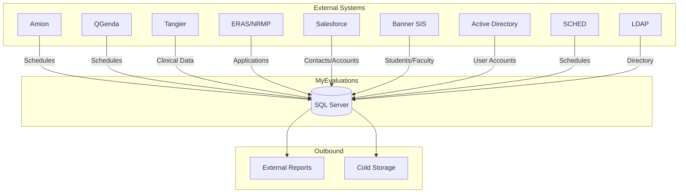
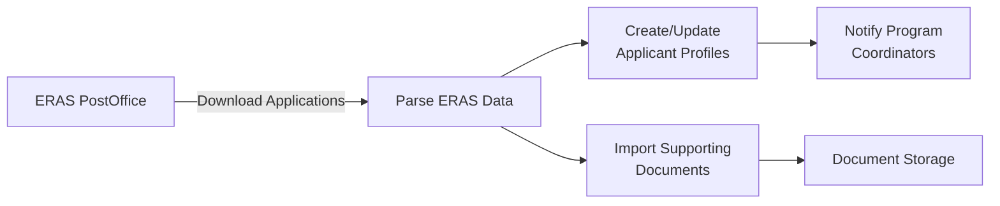
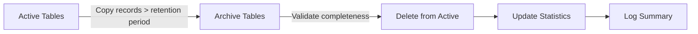

# Data Integration Schedulers

The data integration schedulers handle synchronization between MyEvaluations and external systems. These are the most numerous category of schedulers, reflecting the reality that a healthcare education platform must integrate with many hospital, university, and vendor systems.

## Overview

| Scheduler | Frequency | Purpose |
|-----------|-----------|---------|
| [AmionSync](#amionsync) | Every 6 hours | Sync schedules from Amion scheduling system |
| [QGendaSync](#qgendasync) | Every 6 hours | Sync schedules from QGenda scheduling system |
| [TangierSync](#tangiersync) | Daily at 1:00 AM | Sync clinical data with Tangier |
| [ERASDataImport](#erasdataimport) | During ERAS season (Sept-Mar), daily at 4:00 AM | Import residency application data from ERAS |
| [SalesforceSync](#salesforcesync) | Daily at 2:00 AM | Sync institution and contact data with Salesforce |
| [BannerIntegration](#bannerintegration) | Daily at 3:00 AM | Sync student/employee data from Banner SIS |
| [ADUserSync](#adusersync) | Every 4 hours | Sync user accounts from Active Directory |
| [SCHEDSync](#schedsync) | Daily at 5:00 AM | Sync scheduling data from SCHED system |
| [LDAPSync](#ldapsync) | Every 4 hours | Sync user directory from LDAP |
| [ExternalDataExport](#externaldataexport) | Weekly (Saturday 2:00 AM) | Export data to external reporting systems |
| [ReportGenerator](#reportgenerator) | Nightly at midnight | Generate scheduled reports |
| [DataArchiveService](#dataarchiveservice) | Monthly (1st at 1:00 AM) | Archive old data to cold storage |



---

## AmionSync

**Purpose:** Synchronizes resident and attending schedules from Amion (a widely used physician scheduling system). The synced data drives evaluation distribution, duty hour pre-population, and call schedule visibility within MyEvaluations.

**Frequency:** Every 6 hours

**Data Flow:**

1. Authenticates with the Amion API using institution-specific credentials
2. Retrieves schedule data for the configured date range (current + 30 days ahead)
3. Maps Amion schedule blocks to MyEvaluations rotation/assignment records
4. Performs upsert: creates new records, updates changed records, deactivates removed records
5. Triggers downstream processes (evaluation auto-assignment, duty hour pre-population)
6. Logs sync statistics (records added, updated, deleted, errors)

**Key Stored Procedures:**
- `usp_UpsertAmionScheduleData` -- Inserts or updates schedule records from Amion
- `usp_DeactivateRemovedAmionRecords` -- Marks records removed from Amion as inactive
- `usp_GetAmionSyncMapping` -- Retrieves the mapping between Amion IDs and MyEvaluations IDs
- `usp_TriggerPostSyncProcesses` -- Kicks off evaluation and duty hour recalculations

**Configuration:**
- `AmionApiUrl` -- Amion API endpoint URL (institution-specific)
- `AmionApiKey` -- Authentication key
- `AmionSyncDateRangeDays` -- Days ahead to sync (default: 30)
- `AmionInstitutionMapping` -- Maps Amion institution codes to MyEvaluations institution IDs

**Related Docs:** See [Amion & QGenda Integration](../integrations/amion-qgenda) for full API details.

---

## QGendaSync

**Purpose:** Synchronizes physician schedules from QGenda, an alternative scheduling system used by some institutions. Functions similarly to AmionSync but uses the QGenda REST API.

**Frequency:** Every 6 hours

**Data Flow:**

1. Authenticates with QGenda OAuth2 API
2. Retrieves schedule data for configured organizations and date range
3. Maps QGenda task/shift data to MyEvaluations rotation assignments
4. Performs delta sync (only processes changes since last sync)
5. Reconciles conflicts when both Amion and QGenda are configured
6. Logs sync results

**Key Stored Procedures:**
- `usp_UpsertQGendaScheduleData` -- Inserts or updates schedule records from QGenda
- `usp_GetQGendaLastSyncTimestamp` -- Retrieves the last successful sync time for delta queries
- `usp_ResolveSchedulingConflicts` -- Handles conflicts between multiple scheduling sources

**Configuration:**
- `QGendaApiUrl` -- QGenda API base URL
- `QGendaClientId` / `QGendaClientSecret` -- OAuth2 credentials
- `QGendaOrganizationKeys` -- Organization keys to sync

---

## TangierSync

**Purpose:** Synchronizes clinical documentation data with Tangier, a procedure logging and clinical experience tracking system used by some surgical and specialty programs.

**Frequency:** Daily at 1:00 AM

**Data Flow:**

1. Exports MyEvaluations case log data to Tangier (outbound sync)
2. Imports Tangier procedure records into MyEvaluations (inbound sync)
3. Reconciles duplicate records across both systems
4. Updates procedure count aggregates after sync

**Key Stored Procedures:**
- `usp_ExportCaseLogsToTangier` -- Prepares case log data for Tangier export
- `usp_ImportTangierProcedures` -- Imports procedure data from Tangier
- `usp_ReconcileTangierDuplicates` -- Identifies and merges duplicate entries

---

## ERASDataImport

**Purpose:** Imports residency application data from ERAS (Electronic Residency Application Service) during the annual Match season. This data populates applicant profiles, interview schedules, and rank list preparation tools in MyEvaluations.

**Frequency:** During ERAS season (September through March), daily at 4:00 AM

**Data Flow:**

1. Connects to the ERAS PostOffice/API
2. Downloads new and updated applications since the last import
3. Parses ERAS XML/JSON data into structured applicant records
4. Creates or updates applicant profiles in MyEvaluations
5. Imports supporting documents (CV, personal statement, letters of recommendation)
6. Notifies program coordinators of new applications received
7. Outside ERAS season, the scheduler runs but exits immediately with no action



**Key Stored Procedures:**
- `usp_ImportERASApplication` -- Creates or updates an applicant profile from ERAS data
- `usp_GetERASLastImportTimestamp` -- Retrieves the last successful import time
- `usp_StoreERASDocument` -- Saves imported documents to the document system
- `usp_NotifyNewERASApplications` -- Alerts coordinators of new applications

**Related Docs:** See [ERAS Integration](../integrations/eras) for full details.

---

## SalesforceSync

**Purpose:** Synchronizes institution and contact data between MyEvaluations and Salesforce CRM. This keeps the customer database aligned and supports the sales and customer success teams with up-to-date usage information.

**Frequency:** Daily at 2:00 AM

**Data Flow:**

1. Authenticates with Salesforce REST API using OAuth2
2. Bi-directional sync:
   - **Outbound:** Pushes institution usage metrics, user counts, and feature adoption data to Salesforce
   - **Inbound:** Pulls updated account information, contract details, and contact changes
3. Maps Salesforce Account IDs to MyEvaluations Institution IDs
4. Logs sync activity and conflict resolution

**Key Stored Procedures:**
- `usp_GetInstitutionUsageMetrics` -- Aggregates usage data for Salesforce export
- `usp_UpdateInstitutionFromSalesforce` -- Updates institution records from Salesforce data
- `usp_GetSalesforceSyncMapping` -- Retrieves ID mapping between systems

**Related Docs:** See [Salesforce Integration](../integrations/salesforce).

---

## BannerIntegration

**Purpose:** Synchronizes student and employee data from Ellucian Banner, a Student Information System (SIS) widely used by universities. This ensures that user profiles, program enrollments, and academic status are kept current.

**Frequency:** Daily at 3:00 AM

**Data Flow:**

1. Connects to the Banner API or reads from Banner data extract files (SFTP)
2. Retrieves student enrollment, program, and demographic data
3. Creates new user accounts for newly enrolled students
4. Updates existing user profiles with current enrollment status
5. Deactivates accounts for students who have graduated or withdrawn
6. Maps Banner program codes to MyEvaluations program IDs

**Key Stored Procedures:**
- `usp_ImportBannerStudentData` -- Creates or updates user records from Banner
- `usp_DeactivateGraduatedUsers` -- Marks graduated students as inactive
- `usp_GetBannerProgramMapping` -- Maps Banner codes to MyEvaluations IDs

**Related Docs:** See [Banner Integration](../integrations/banner).

---

## ADUserSync

**Purpose:** Synchronizes user accounts from Active Directory (AD), ensuring that new employees automatically get MyEvaluations accounts and terminated employees are deactivated.

**Frequency:** Every 4 hours

**Data Flow:**

1. Connects to the institution's Active Directory via LDAP
2. Queries for users in configured organizational units (OUs)
3. Creates new MyEvaluations accounts for new AD users
4. Updates name, email, department, and title from AD attributes
5. Deactivates MyEvaluations accounts for disabled/deleted AD users
6. Assigns default roles based on AD group membership

**Key Stored Procedures:**
- `usp_SyncADUserAccounts` -- Creates or updates user accounts from AD
- `usp_DeactivateRemovedADUsers` -- Deactivates users no longer in AD
- `usp_MapADGroupsToRoles` -- Maps AD groups to MyEvaluations roles

---

## SCHEDSync

**Purpose:** Synchronizes scheduling data from legacy SCHED systems still in use at some institutions. This is similar to AmionSync but for an older scheduling platform.

**Frequency:** Daily at 5:00 AM

**Data Flow:**

1. Reads SCHED data from file export (CSV/XML placed on SFTP) or direct database connection
2. Parses schedule assignments
3. Maps to MyEvaluations rotation and assignment records
4. Performs sync with conflict detection

**Key Stored Procedures:**
- `usp_ImportSCHEDData` -- Parses and imports SCHED schedule data
- `usp_MapSCHEDCodesToRotations` -- Maps SCHED codes to MyEvaluations rotations

---

## LDAPSync

**Purpose:** Synchronizes user directory information from LDAP (Lightweight Directory Access Protocol) for institutions that use LDAP directories separate from Active Directory.

**Frequency:** Every 4 hours

**Data Flow:**

1. Binds to the LDAP directory server
2. Searches configured base DNs for user entries
3. Extracts user attributes (name, email, department, title)
4. Syncs with MyEvaluations user profiles
5. Handles LDAP-specific attribute mapping

**Key Stored Procedures:**
- `usp_SyncLDAPUserAccounts` -- Syncs user data from LDAP
- `usp_GetLDAPAttributeMapping` -- Retrieves custom LDAP attribute mappings

---

## ExternalDataExport

**Purpose:** Generates and delivers data exports to external reporting systems, accreditation bodies, and institutional data warehouses. Supports multiple output formats (CSV, XML, JSON, Excel).

**Frequency:** Weekly (Saturday at 2:00 AM)

**Data Flow:**

1. Retrieves configured export definitions (which data, which format, which destination)
2. Executes data extraction queries
3. Transforms data into the required output format
4. Delivers files to configured destinations (SFTP, email, API endpoint)
5. Logs export statistics and delivery confirmation

**Key Stored Procedures:**
- `usp_GetExportDefinitions` -- Retrieves active export configurations
- `usp_ExecuteDataExport` -- Runs the configured data extraction query
- `usp_LogExportDelivery` -- Records export delivery status

---

## ReportGenerator

**Purpose:** Generates scheduled reports that are configured by administrators. Reports can be standard templates (evaluation summary, duty hour compliance, etc.) or custom ad-hoc report definitions.

**Frequency:** Nightly at midnight

**Data Flow:**

1. Retrieves report generation schedule
2. Executes report queries and aggregations
3. Renders reports in the configured format (PDF, Excel, HTML)
4. Stores generated reports in the document management system
5. Sends email notifications with report links to configured recipients

**Key Stored Procedures:**
- `usp_GetScheduledReports` -- Lists reports due for generation
- `usp_ExecuteReportQuery` -- Runs the report data query
- `usp_StoreGeneratedReport` -- Saves the generated report file

---

## DataArchiveService

**Purpose:** Archives old data to cold storage to maintain database performance. Moves records beyond the retention period (typically 7+ years) from active tables to archive tables or external storage.

**Frequency:** Monthly (1st of each month at 1:00 AM)

**Data Flow:**

1. Identifies records exceeding the configured retention period per table
2. Copies records to archive tables (suffixed with `_Archive`)
3. Validates archive completeness
4. Deletes original records from active tables
5. Updates table statistics after deletion
6. Logs archive summary (records moved per table)



**Key Stored Procedures:**
- `usp_GetTablesForArchival` -- Lists tables with archive-eligible records
- `usp_ArchiveTableRecords` -- Copies records to archive tables
- `usp_ValidateArchiveCompleteness` -- Verifies all records were archived
- `usp_PurgeArchivedRecords` -- Removes archived records from active tables

**Configuration:**
- `DefaultRetentionYears` -- Default retention period (default: 7)
- `TableRetentionOverrides` -- Per-table retention period overrides
- `ArchiveBatchSize` -- Records per batch to prevent locking (default: 10000)

---

## Troubleshooting

### Common Issues

| Issue | Cause | Resolution |
|-------|-------|------------|
| Amion/QGenda sync failures | API credentials expired or rate limited | Rotate credentials; check API quotas |
| ERAS import missing data | ERAS data format changed for the season | Review ERAS release notes; update parser |
| AD sync creating duplicate users | Email address mismatch between AD and MyEvaluations | Review matching logic; check for alias changes |
| Data export file truncated | Query timeout during large export | Increase query timeout; add date range filters |
| Archive service blocking queries | Archiving large batches locks tables | Reduce `ArchiveBatchSize`; run during maintenance window |

### Checking Scheduler Logs

```sql
SELECT TOP 20 *
FROM SchedulerLog
WHERE SchedulerName IN (
    'AmionSync', 'QGendaSync', 'ERASDataImport',
    'SalesforceSync', 'BannerIntegration', 'ADUserSync'
)
ORDER BY ExecutionDate DESC;
```
