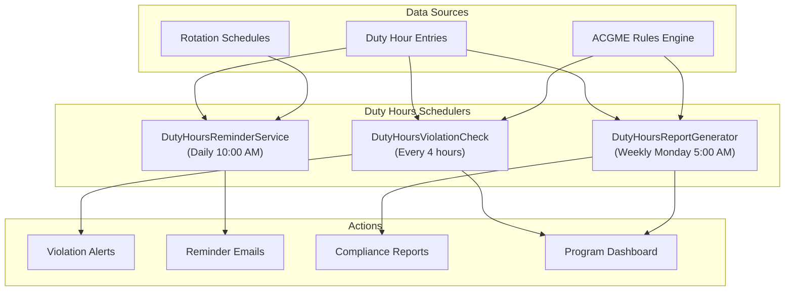
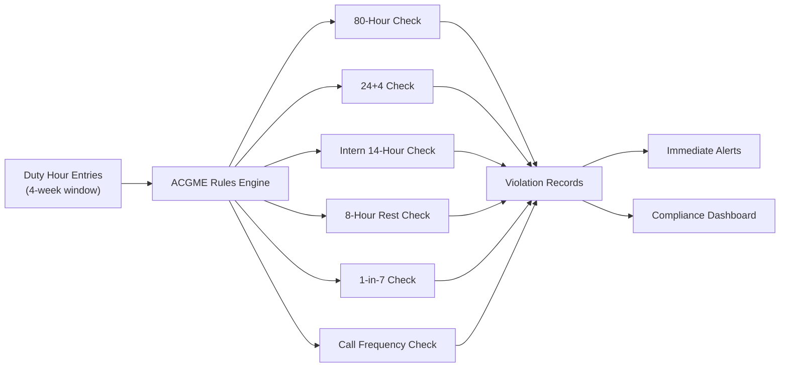
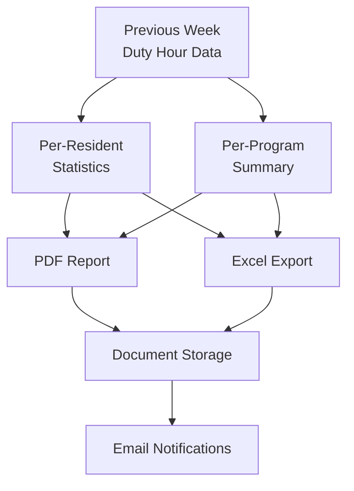

# Duty Hours Schedulers

The duty hours schedulers enforce ACGME (Accreditation Council for Graduate Medical Education) work hour regulations. These are among the most compliance-critical schedulers in the system, as duty hour violations can jeopardize a program's accreditation status. ACGME mandates strict limits on resident work hours to ensure patient safety and resident well-being.

## ACGME Duty Hour Rules

For context, the key ACGME duty hour limits that these schedulers enforce:

- **80-hour weekly limit** (averaged over 4 weeks)
- **24+4 rule** -- Maximum 24 hours of continuous duty plus 4 hours for transition/education
- **14-hour limit** for PGY-1 residents (interns)
- **8 hours off** between duty periods (10 hours recommended)
- **1 day in 7 free** from clinical duties (averaged over 4 weeks)
- **Every third night** call frequency limit

## Overview

| Scheduler | Frequency | Purpose |
|-----------|-----------|---------|
| [DutyHoursViolationCheck](#dutyhoursviolationcheck) | Every 4 hours | Check logged duty hours against ACGME compliance rules |
| [DutyHoursReminderService](#dutyhoursreminderservice) | Daily at 10:00 AM | Remind residents to log their duty hours |
| [DutyHoursReportGenerator](#dutyhoursreportgenerator) | Weekly (Monday 5:00 AM) | Generate weekly duty hours compliance reports |



---

## DutyHoursViolationCheck

**Purpose:** The most critical duty hours scheduler. Checks all active residents' logged duty hours against ACGME compliance rules and flags violations in real time. Violations are surfaced to program directors and compliance officers immediately.

**Frequency:** Every 4 hours

**Data Flow:**

1. Retrieves duty hour entries for all active residents for the rolling 4-week window
2. Applies each ACGME rule:
   - **80-hour rule:** Calculates total hours over the 4-week rolling average
   - **24+4 rule:** Identifies any continuous duty period exceeding 28 hours
   - **Intern rule:** Checks PGY-1 residents for shifts exceeding 14 hours
   - **8-hour rest rule:** Verifies minimum rest between duty periods
   - **1-in-7 rule:** Ensures at least one day free per week (4-week average)
   - **Call frequency:** Checks for every-third-night violations
3. Creates or updates violation records in the `DutyHourViolation` table
4. Sends immediate email alerts for new critical violations
5. Updates the program compliance dashboard



**Key Stored Procedures:**
- `usp_GetDutyHoursForComplianceCheck` -- Retrieves the 4-week rolling window of duty hours per resident
- `usp_CheckACGME80HourRule` -- Calculates weekly average hours
- `usp_CheckContinuousDutyPeriods` -- Identifies continuous duty period violations
- `usp_InsertDutyHourViolation` -- Records detected violations
- `usp_GetExistingViolationsForPeriod` -- Prevents duplicate violation records

**Configuration:**
- `DutyHourCheckIntervalHours` -- How often the check runs (default: 4)
- `ViolationAlertRecipients` -- Email addresses for violation alerts
- `ExcludeRotationTypes` -- Rotation types exempt from duty hour rules (e.g., research, vacation)
- `PGY1ThresholdHours` -- Intern continuous duty limit (default: 14)

**Error Handling:**
- If the rules engine encounters incomplete data (e.g., missing entries), it flags the resident for manual review rather than generating a false violation
- Violations that are later corrected by data entry changes are automatically resolved on the next run

---

## DutyHoursReminderService

**Purpose:** Sends daily reminders to residents who have not logged their duty hours for the current or previous day. Timely and accurate duty hour logging is essential for compliance monitoring.

**Frequency:** Daily at 10:00 AM

**Data Flow:**

1. Identifies residents on active clinical rotations
2. Checks for duty hour entries in the past 24-48 hours
3. Identifies residents with missing or incomplete entries
4. Sends personalized reminder emails with a link to the duty hour entry form
5. Escalates to program coordinator if a resident has not logged for 3+ consecutive days

**Key Stored Procedures:**
- `usp_GetResidentsWithMissingDutyHours` -- Identifies residents without recent duty hour entries
- `usp_GetDutyHourLoggingStreak` -- Calculates consecutive days without logging
- `usp_LogDutyHourReminder` -- Records reminder activity

**Configuration:**
- `DutyHourReminderGracePeriodHours` -- Hours after shift before reminder is sent (default: 18)
- `EscalationThresholdDays` -- Days without logging before escalation (default: 3)

---

## DutyHoursReportGenerator

**Purpose:** Generates comprehensive weekly duty hours compliance reports for program directors, compliance officers, and the GME office. These reports are essential for accreditation documentation and program self-study.

**Frequency:** Weekly (Monday at 5:00 AM)

**Data Flow:**

1. Aggregates duty hour data for the previous week (Sunday to Saturday)
2. Calculates per-resident statistics:
   - Total hours worked
   - Average weekly hours (4-week rolling)
   - Number of violations by type
   - Logging compliance rate
3. Generates per-program summary:
   - Program-wide violation rate
   - Comparison to prior weeks (trend)
   - Residents of concern (chronic violators or non-loggers)
4. Creates PDF and Excel report files
5. Stores reports in the document management system
6. Emails report links to program directors and the GME office



**Key Stored Procedures:**
- `usp_GenerateWeeklyDutyHourReport` -- Aggregates weekly duty hour statistics
- `usp_GetDutyHourTrendData` -- Provides historical trend comparisons
- `usp_GetChronicViolators` -- Identifies residents with recurring violations
- `usp_StoreDutyHourReport` -- Saves generated reports to document storage

**Output Files:**
- `DutyHours_Weekly_{ProgramName}_{Date}.pdf` -- Program-level compliance report
- `DutyHours_Weekly_{ProgramName}_{Date}.xlsx` -- Detailed data export
- `DutyHours_GMESummary_{Date}.pdf` -- Institution-wide summary for GME office

---

## Troubleshooting

### Common Issues

| Issue | Cause | Resolution |
|-------|-------|------------|
| False violations detected | Resident logged hours in wrong timezone | Check timezone settings; correct entries and re-run |
| Reminders sent to residents on vacation | Vacation rotation not excluded from checks | Add rotation type to `ExcludeRotationTypes` config |
| Reports not generating | PDF rendering library error or disk space | Check server disk space; verify report library dependencies |
| Violations not clearing after correction | Correction made after violation check window | Wait for next check cycle or trigger manual re-check |
| 80-hour violation incorrectly flagged | Moonlighting hours included without opt-in | Verify moonlighting hours are properly categorized |

### Manual Violation Re-check

To manually trigger a violation re-check for a specific resident:

```sql
-- Check current violations for a resident
SELECT *
FROM DutyHourViolation
WHERE ResidentID = @ResidentID
AND ViolationDate >= DATEADD(WEEK, -4, GETDATE())
ORDER BY ViolationDate DESC;

-- Check recent scheduler runs
SELECT TOP 10 *
FROM SchedulerLog
WHERE SchedulerName = 'DutyHoursViolationCheck'
ORDER BY ExecutionDate DESC;
```
