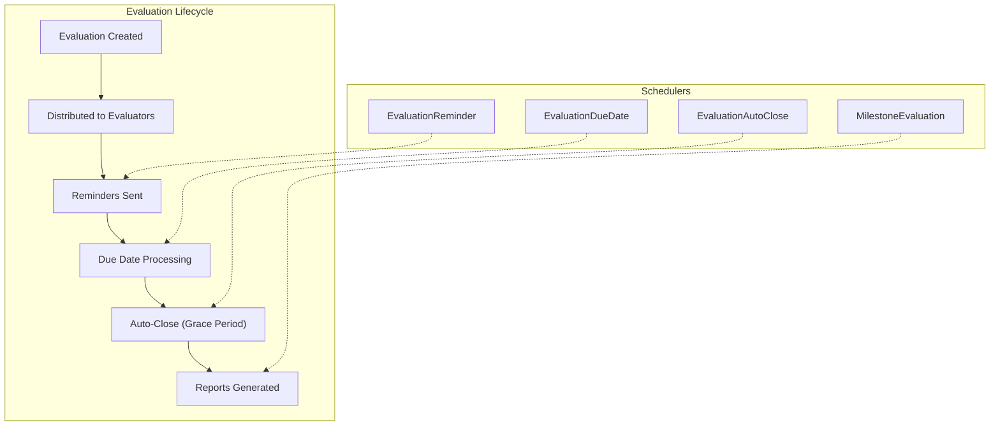
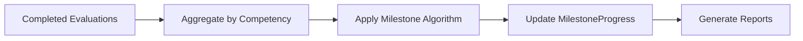
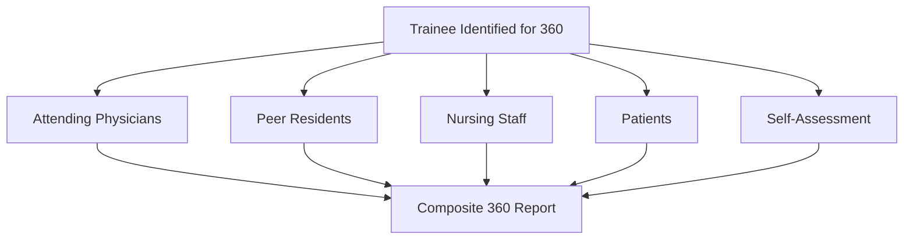

# Evaluation & Assessment Schedulers

The evaluation schedulers are among the most critical services in the MyEvaluations platform. They manage the lifecycle of evaluation forms -- from creation and distribution to reminders, due date enforcement, and automatic closure. These schedulers ensure that residents, faculty, and program administrators complete their evaluations on time.

## Overview

| Scheduler | Frequency | Purpose |
|-----------|-----------|---------|
| [EvaluationReminder](#evaluationreminder) | Daily at 6:00 AM | Send reminder emails for pending evaluations |
| [EvaluationDueDate](#evaluationduedate) | Daily at 7:00 AM | Process evaluations that have reached their due date |
| [EvaluationAutoClose](#evaluationautoclose) | Daily at 2:00 AM | Auto-close evaluations past the grace period |
| [MilestoneEvaluation](#milestoneevaluation) | Nightly at 11:00 PM | Calculate milestone achievement levels |
| [PeerEvaluation](#peerevaluation) | Weekly (Monday 6:00 AM) | Distribute and manage peer evaluation cycles |
| [360Evaluation](#360evaluation) | Monthly (1st at 6:00 AM) | Manage multi-rater 360 evaluation distribution |



---

## EvaluationReminder

**Purpose:** Sends reminder emails to evaluators who have pending (incomplete) evaluations approaching their due date.

**Frequency:** Daily at 6:00 AM

**Data Flow:**

1. Queries `Evaluation` table for records where `Status = 'Pending'` and `DueDate` is within the configured reminder window (default: 7 days)
2. Groups evaluations by evaluator to avoid sending multiple emails
3. Renders email template with evaluation list, due dates, and direct links
4. Sends via Mailgun API
5. Updates `LastReminderSent` timestamp on each evaluation record
6. Logs summary to `SchedulerLog`

**Key Stored Procedures:**
- `usp_GetPendingEvaluationsForReminder` -- Retrieves evaluations due within the reminder window
- `usp_UpdateEvaluationReminderSent` -- Marks evaluations as reminded

**Configuration:**
- `ReminderDaysBeforeDue` -- Number of days before due date to start sending reminders (default: 7)
- `MaxRemindersPerEvaluation` -- Maximum number of reminder emails per evaluation (default: 3)
- `ReminderEmailTemplate` -- Configurable email template ID

**Error Handling:**
- Failed email sends are retried up to 3 times with exponential backoff
- Evaluations with invalid evaluator email addresses are flagged for admin review

---

## EvaluationDueDate

**Purpose:** Processes evaluations that have reached their due date, updating their status and triggering notifications to program administrators.

**Frequency:** Daily at 7:00 AM

**Data Flow:**

1. Queries evaluations where `DueDate <= GETDATE()` and `Status = 'Pending'`
2. Updates status to `'Overdue'`
3. Sends overdue notification to the evaluator
4. Sends summary notification to program administrator if configured
5. Records the status change in the audit trail

**Key Stored Procedures:**
- `usp_GetEvaluationsPastDueDate` -- Retrieves evaluations past their due date
- `usp_UpdateEvaluationStatusOverdue` -- Batch updates evaluation status
- `usp_InsertEvaluationAuditTrail` -- Records status change

---

## EvaluationAutoClose

**Purpose:** Automatically closes evaluations that have remained in `Pending` or `Overdue` status beyond the configured grace period. This prevents stale evaluations from accumulating indefinitely.

**Frequency:** Daily at 2:00 AM

**Data Flow:**

1. Queries evaluations where `DueDate + GracePeriodDays <= GETDATE()` and `Status IN ('Pending', 'Overdue')`
2. Sets status to `'AutoClosed'`
3. Records partial responses (if any) for reporting
4. Sends notification to program administrator with list of auto-closed evaluations
5. Updates aggregate completion statistics

**Key Stored Procedures:**
- `usp_GetEvaluationsForAutoClose` -- Retrieves evaluations past the grace period
- `usp_AutoCloseEvaluations` -- Batch closes evaluations and preserves partial data

**Configuration:**
- `GracePeriodDays` -- Number of days after due date before auto-close (default: 30)
- `PreservePartialResponses` -- Whether to keep partial form data (default: true)

---

## MilestoneEvaluation

**Purpose:** Recalculates milestone achievement levels for residents based on their most recent evaluation data. Milestones are defined by the ACGME (Accreditation Council for Graduate Medical Education) and track trainee progression across competency domains.

**Frequency:** Nightly at 11:00 PM

**Data Flow:**

1. Queries completed evaluations with milestone-related questions since the last calculation
2. Aggregates scores by resident, competency domain, and milestone level
3. Applies the program's milestone calculation algorithm (weighted averages, thresholds)
4. Updates the `MilestoneProgress` table with new achievement levels
5. Generates milestone progression reports for program directors



**Key Stored Procedures:**
- `usp_GetEvaluationsForMilestoneCalc` -- Retrieves evaluation data for milestone recalculation
- `usp_UpdateMilestoneProgress` -- Updates milestone levels per resident per competency
- `usp_GenerateMilestoneSummaryReport` -- Creates aggregate reports

---

## PeerEvaluation

**Purpose:** Manages the distribution and collection cycle for peer evaluations, where residents evaluate their fellow residents on teamwork, communication, and professionalism competencies.

**Frequency:** Weekly (Monday at 6:00 AM)

**Data Flow:**

1. Checks for active peer evaluation cycles configured by program administrators
2. Randomly assigns peer evaluators (avoiding self-evaluation and ensuring diversity)
3. Creates evaluation records and distributes notification emails
4. Tracks completion rates and sends weekly status reports to program directors

**Key Stored Procedures:**
- `usp_GetActivePeerEvalCycles` -- Retrieves active peer evaluation configurations
- `usp_AssignPeerEvaluators` -- Creates random evaluator assignments
- `usp_GetPeerEvalCompletionStatus` -- Reports on completion rates

---

## 360Evaluation

**Purpose:** Manages multi-rater (360-degree) evaluation distribution where a trainee receives feedback from attending physicians, peers, nurses, patients, and self-assessment. This provides a comprehensive view of clinical competence.

**Frequency:** Monthly (1st of each month at 6:00 AM)

**Data Flow:**

1. Identifies trainees due for 360 evaluations based on program configuration
2. Selects evaluators from each rater category (attending, peer, nurse, patient, self)
3. Creates evaluation forms customized by rater type
4. Distributes invitations with unique access links
5. Monitors response rates and sends reminders to non-responders
6. Once sufficient responses are collected, generates the composite 360 report



**Key Stored Procedures:**
- `usp_Get360EvalCandidates` -- Identifies trainees due for 360 evaluations
- `usp_Select360Evaluators` -- Selects evaluators across rater categories
- `usp_Generate360CompositeReport` -- Aggregates multi-rater feedback

**Configuration:**
- `MinResponsesPerCategory` -- Minimum responses needed per rater category (default: 3)
- `360EvalFrequencyMonths` -- How often each trainee receives a 360 (default: 6)

---

## Troubleshooting

### Common Issues

| Issue | Cause | Resolution |
|-------|-------|------------|
| Reminders not sending | Mailgun API key expired or rate limited | Check Mailgun dashboard; rotate API key if needed |
| Evaluations not auto-closing | `GracePeriodDays` set too high | Review config in database; adjust grace period |
| Milestone scores not updating | No new completed evaluations since last run | Verify evaluation completion flow; check for stuck evaluations |
| Duplicate reminders sent | Scheduler ran twice (manual + scheduled) | Check Windows Task Scheduler for duplicate triggers |

### Checking Scheduler Logs

```sql
SELECT TOP 20 *
FROM SchedulerLog
WHERE SchedulerName LIKE 'Evaluation%'
ORDER BY ExecutionDate DESC;
```
