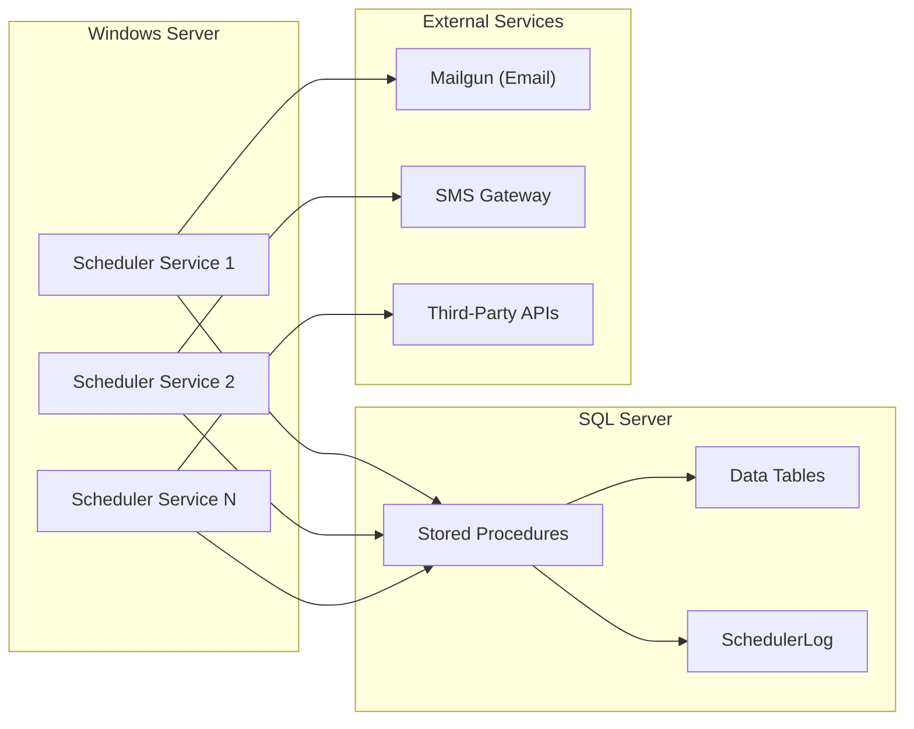
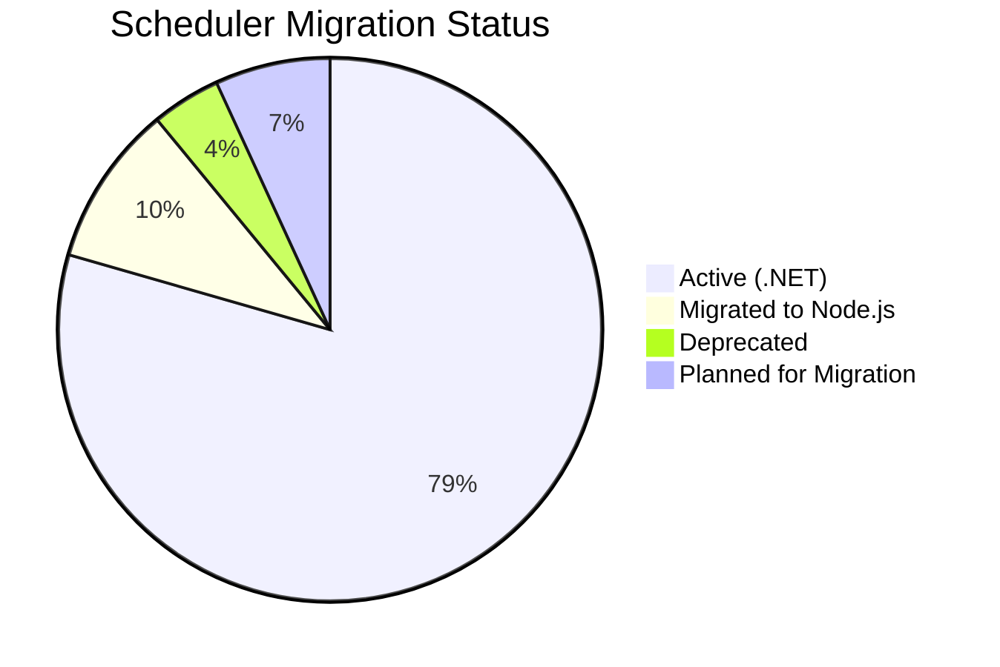

import SchedulerCatalog from '@site/src/components/SchedulerCatalog';
import schedulerData from '@site/generated/dotnet-metadata/schedulers.json';

# Scheduler Overview

The MyEvaluations .NET backend runs **70+ Windows Services** (schedulers) that execute background tasks on configurable schedules. These services are critical to the platform's operation, handling everything from evaluation reminders and duty hour compliance checks to third-party data synchronization and system maintenance.

## How Schedulers Work

Each scheduler is implemented as a **Windows Service** that:

1. Runs on a dedicated Windows Server alongside the IIS-hosted web application
2. Executes on a configurable schedule (cron-like intervals, daily, weekly, or monthly)
3. Connects to the shared SQL Server database using ADO.NET and stored procedures
4. Logs execution results to the `SchedulerLog` table for monitoring and debugging
5. Sends notifications (email, SMS) when action is required by users or administrators



## Scheduler Categories

The 70+ schedulers are organized into **9 functional categories**:

| Category | Count | Description | Documentation |
|----------|-------|-------------|---------------|
| **Evaluation** | 6 | Evaluation reminders, due dates, auto-close, milestones, peer and 360 reviews | [Evaluation Schedulers](./evaluation-schedulers) |
| **Clinical** | 7 | Patient logs, case verification, procedure counts, rotation sync, supervision | [Clinical Schedulers](./clinical-schedulers) |
| **Duty Hours** | 3 | ACGME compliance checks, reminders, report generation | [Duty Hours Schedulers](./duty-hours-schedulers) |
| **Learning** | 8 | Assignments, quizzes, CME credits, portfolios, scholarly activity, curriculum | [Learning Schedulers](./learning-schedulers) |
| **License** | 6 | License expiration, certification renewal, DEA, board cert, credentialing | [License Schedulers](./license-schedulers) |
| **Communication** | 6 | Email digests, notification batching, SMS alerts, announcements, surveys | [Communication Schedulers](./communication-schedulers) |
| **Data Integration** | 12 | Amion, QGenda, Tangier, ERAS, Salesforce, Banner, AD/LDAP, exports | [Data Integration Schedulers](./data-integration-schedulers) |
| **Admin** | 8 | Database cleanup, session purge, audit archival, backups, health checks | [Admin Schedulers](./admin-schedulers) |
| **Conference** | 4 | Attendance tracking, grand rounds, M&M sync, journal club | [Conference Schedulers](./conference-schedulers) |

## Interactive Scheduler Catalog

Use the interactive table below to search, filter, and explore all schedulers across categories.

:::note Auto-Generated Content
This catalog is populated by the `parse:dotnet:schedulers` script. Run `npm run parse:dotnet:schedulers` to refresh the data from the source code.
:::

<SchedulerCatalog schedulers={schedulerData.schedulers} />

## Common Scheduler Architecture

All schedulers follow a consistent pattern:

```csharp
public class MySchedulerService : ServiceBase
{
    private Timer _timer;
    private readonly ILogger _logger;

    protected override void OnStart(string[] args)
    {
        _timer = new Timer(Execute, null, TimeSpan.Zero, TimeSpan.FromHours(1));
    }

    private void Execute(object state)
    {
        try
        {
            // 1. Query database for records to process
            // 2. Apply business logic
            // 3. Send notifications if needed
            // 4. Log results to SchedulerLog
        }
        catch (Exception ex)
        {
            LogError(ex);
        }
    }

    protected override void OnStop()
    {
        _timer?.Dispose();
    }
}
```

## Configuration

Scheduler configuration is managed through:

- **App.config** -- Connection strings, schedule intervals, feature flags
- **Database config table** -- Runtime-configurable settings (e.g., email templates, thresholds)
- **Windows Service Manager** -- Start type (Automatic, Manual, Disabled)

## Monitoring

Scheduler health is monitored via:

1. **SchedulerLog table** -- Every execution writes a row with status, duration, and records processed
2. **Windows Event Log** -- Service start/stop events and unhandled exceptions
3. **Admin dashboard** -- The web application provides a scheduler status overview for administrators
4. **Email alerts** -- Critical scheduler failures trigger notification emails to the operations team

## Migration Status

Some schedulers have been or are being migrated to the Node.js backend as **BullMQ workers**. See the [Migration Status](../migration/status) page for the current state of scheduler migration.



## File Reference

Browse per-file implementation documentation for every scheduler class:

- [**Scheduler Implementation Files**](./files/schedulers) — 160 classes across 66 scheduler projects, with summaries, key methods, stored procedures, and migration notes
