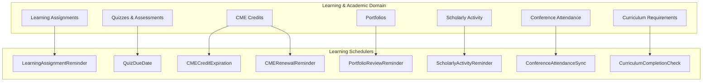
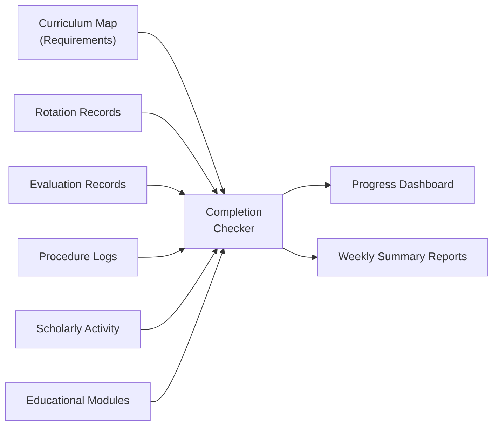

# Learning & Academic Schedulers

The learning schedulers manage the educational lifecycle of medical trainees, covering learning assignments, quiz deadlines, CME (Continuing Medical Education) credit tracking, portfolio reviews, scholarly activity monitoring, conference attendance, and curriculum completion verification.

## Overview

| Scheduler | Frequency | Purpose |
|-----------|-----------|---------|
| [LearningAssignmentReminder](#learningassignmentreminder) | Daily at 7:00 AM | Remind trainees of pending learning assignments |
| [QuizDueDate](#quizduedate) | Daily at 6:00 AM | Process quizzes approaching or past due date |
| [CMECreditExpiration](#cmecreditexpiration) | Weekly (Monday 3:00 AM) | Check for expiring CME credits |
| [CMERenewalReminder](#cmerenewalreminder) | Monthly (1st at 6:00 AM) | Send CME renewal cycle reminders |
| [PortfolioReviewReminder](#portfolioreviewreminder) | Monthly (15th at 7:00 AM) | Remind faculty of pending portfolio reviews |
| [ScholarlyActivityReminder](#scholarlyactivityreminder) | Monthly (1st at 8:00 AM) | Track and remind of scholarly activity requirements |
| [ConferenceAttendanceSync](#conferenceattendancesync) | Daily at 11:00 PM | Sync conference attendance records |
| [CurriculumCompletionCheck](#curriculumcompletioncheck) | Weekly (Friday 10:00 PM) | Verify curriculum completion progress |



---

## LearningAssignmentReminder

**Purpose:** Sends reminder notifications to trainees who have pending learning assignments (articles, modules, videos, or activities) that are approaching their due date or are overdue.

**Frequency:** Daily at 7:00 AM

**Data Flow:**

1. Queries `LearningAssignment` table for incomplete assignments within the reminder window
2. Groups by trainee to consolidate multiple assignments into a single notification
3. Includes assignment title, due date, and completion link in the email
4. Tracks reminder count to avoid excessive notifications
5. Escalates to program coordinator for assignments overdue by more than 14 days

**Key Stored Procedures:**
- `usp_GetPendingLearningAssignments` -- Retrieves incomplete assignments nearing due date
- `usp_UpdateAssignmentReminderCount` -- Increments reminder counter
- `usp_GetOverdueAssignmentsForEscalation` -- Lists assignments overdue beyond threshold

---

## QuizDueDate

**Purpose:** Processes quizzes that are approaching their due date or have passed it. Updates quiz status, locks submissions for past-due quizzes, and notifies trainees and program staff.

**Frequency:** Daily at 6:00 AM

**Data Flow:**

1. Identifies quizzes due within the next 48 hours (upcoming reminders)
2. Identifies quizzes past due date that are still open
3. Locks past-due quizzes (prevents further submissions)
4. Records partial scores for quizzes submitted after the lock
5. Sends upcoming-due reminders and overdue notifications

**Key Stored Procedures:**
- `usp_GetQuizzesApproachingDueDate` -- Finds quizzes due within the reminder window
- `usp_LockOverdueQuizzes` -- Closes submissions for past-due quizzes
- `usp_RecordQuizPartialScore` -- Saves partial scores for incomplete quizzes

---

## CMECreditExpiration

**Purpose:** Monitors CME credit records for upcoming expirations. CME credits typically have a validity period (often 3 years), and healthcare professionals must maintain a minimum number of active credits for licensure and hospital privileges.

**Frequency:** Weekly (Monday at 3:00 AM)

**Data Flow:**

1. Scans CME credit records expiring within the next 90 days
2. Groups by user and calculates remaining valid credits vs. required minimums
3. Sends tiered notifications:
   - **90 days:** Informational notice
   - **60 days:** Warning with renewal resources
   - **30 days:** Urgent alert with compliance deadline
4. Updates the CME compliance dashboard

**Key Stored Procedures:**
- `usp_GetExpiringCMECredits` -- Retrieves CME credits expiring within the specified window
- `usp_CalculateCMECreditBalance` -- Computes active credit totals per user
- `usp_UpdateCMEComplianceDashboard` -- Refreshes compliance tracking views

---

## CMERenewalReminder

**Purpose:** Sends reminders at the start of each CME renewal cycle, informing physicians and trainees of their credit requirements, current credit balance, and upcoming renewal deadlines.

**Frequency:** Monthly (1st of each month at 6:00 AM)

**Data Flow:**

1. Identifies users whose CME renewal cycle falls within the current month or quarter
2. Calculates current credit balance and deficit (if any)
3. Generates personalized renewal summary with:
   - Credits earned to date
   - Credits required for renewal
   - Shortfall amount
   - Upcoming CME opportunities (linked conferences, online modules)
4. Sends email with renewal summary and action items

**Key Stored Procedures:**
- `usp_GetCMERenewalCandidates` -- Identifies users approaching renewal deadlines
- `usp_GetCMECreditSummary` -- Aggregates earned vs. required credits
- `usp_GetUpcomingCMEOpportunities` -- Lists available CME activities

---

## PortfolioReviewReminder

**Purpose:** Reminds faculty advisors to complete portfolio reviews for their assigned trainees. Portfolio reviews are periodic assessments of a trainee's overall progress, including evaluations, scholarly work, patient logs, and personal learning goals.

**Frequency:** Monthly (15th of each month at 7:00 AM)

**Data Flow:**

1. Identifies faculty-trainee pairs with pending portfolio reviews
2. Checks the last completed review date against the program's required frequency
3. Sends reminders to faculty with links to the trainee's portfolio
4. Includes a summary of new items added since the last review

**Key Stored Procedures:**
- `usp_GetPendingPortfolioReviews` -- Retrieves overdue portfolio reviews
- `usp_GetPortfolioChangesSinceLastReview` -- Lists new items in the trainee's portfolio
- `usp_LogPortfolioReviewReminder` -- Records reminder activity

---

## ScholarlyActivityReminder

**Purpose:** Tracks resident scholarly activity requirements (research projects, publications, presentations, quality improvement projects) and sends reminders to residents who are behind on their academic requirements.

**Frequency:** Monthly (1st of each month at 8:00 AM)

**Data Flow:**

1. Retrieves scholarly activity requirements by program and PGY level
2. Compares each resident's documented activities against requirements
3. Identifies residents with deficits
4. Sends personalized reminders with current activity summary and requirements
5. Notifies program directors of residents significantly behind

**Key Stored Procedures:**
- `usp_GetScholarlyActivityRequirements` -- Retrieves requirements by program/level
- `usp_GetResidentScholarlyActivities` -- Lists documented activities per resident
- `usp_CalculateScholarlyActivityDeficit` -- Computes the gap between actual and required

---

## ConferenceAttendanceSync

**Purpose:** Synchronizes conference attendance records from sign-in systems and calculates attendance percentages against program requirements. Many programs require minimum conference attendance rates (typically 70-80%) for academic compliance.

**Frequency:** Daily at 11:00 PM

**Data Flow:**

1. Imports attendance data from external sign-in systems (badge swipe, QR code, manual entry)
2. Matches attendance records to scheduled conferences
3. Calculates running attendance percentage per resident per conference type
4. Updates the attendance tracking dashboard
5. Flags residents below the minimum attendance threshold

**Key Stored Procedures:**
- `usp_ImportConferenceAttendanceRecords` -- Imports raw attendance data
- `usp_CalculateConferenceAttendanceRate` -- Computes attendance percentages
- `usp_FlagLowConferenceAttendance` -- Identifies residents below thresholds

---

## CurriculumCompletionCheck

**Purpose:** Verifies that trainees are on track with their curriculum requirements, checking completion of required rotations, evaluations, procedures, scholarly activities, and educational modules against the program's curriculum map.

**Frequency:** Weekly (Friday at 10:00 PM)

**Data Flow:**

1. Loads the curriculum requirements map for each program and PGY level
2. Checks each trainee's progress against every requirement category:
   - Required rotations completed
   - Evaluation forms completed
   - Procedure minimums met
   - Scholarly activity requirements met
   - Educational module completions
3. Generates a completion percentage per category and overall
4. Updates the trainee's curriculum progress dashboard
5. Sends weekly progress summaries to program directors



**Key Stored Procedures:**
- `usp_GetCurriculumRequirements` -- Loads program curriculum map
- `usp_CheckCurriculumCompletionByResident` -- Evaluates completion per requirement
- `usp_GenerateCurriculumProgressReport` -- Creates progress summary

---

## Troubleshooting

### Common Issues

| Issue | Cause | Resolution |
|-------|-------|------------|
| CME credits not expiring | Expiration date field null or incorrect | Run data quality check on CME credit records |
| Conference attendance not syncing | External sign-in system API changed | Check API endpoint and authentication credentials |
| Curriculum progress shows 0% | Curriculum map not configured for the program | Verify curriculum setup in program administration |
| Duplicate assignment reminders | Scheduler running in multiple environments | Ensure scheduler is only active in production |

### Checking Scheduler Logs

```sql
SELECT TOP 20 *
FROM SchedulerLog
WHERE SchedulerName IN (
    'LearningAssignmentReminder', 'QuizDueDate',
    'CMECreditExpiration', 'CMERenewalReminder',
    'CurriculumCompletionCheck'
)
ORDER BY ExecutionDate DESC;
```
