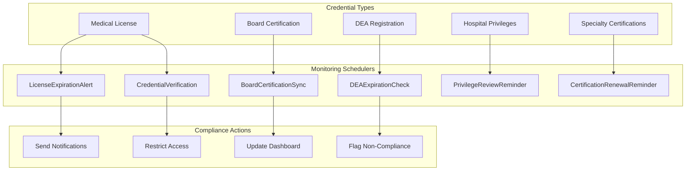

# License & Certification Schedulers

The license and certification schedulers monitor the compliance status of healthcare professionals' credentials, licenses, and certifications. These schedulers are essential for ensuring that all practitioners maintain valid credentials, which is a regulatory requirement for patient care delivery.

## Overview

| Scheduler | Frequency | Purpose |
|-----------|-----------|---------|
| [LicenseExpirationAlert](#licenseexpirationalert) | Daily at 6:00 AM | Alert users of upcoming license expirations |
| [CertificationRenewalReminder](#certificationrenewalreminder) | Weekly (Monday 7:00 AM) | Remind of certification renewal deadlines |
| [DEAExpirationCheck](#deaexpirationcheck) | Daily at 5:00 AM | Check DEA registration expiration dates |
| [BoardCertificationSync](#boardcertificationsync) | Monthly (1st at 2:00 AM) | Sync board certification status from external sources |
| [CredentialVerification](#credentialverification) | Weekly (Wednesday 3:00 AM) | Verify credentials against primary sources |
| [PrivilegeReviewReminder](#privilegereviewreminder) | Monthly (1st at 7:00 AM) | Remind of upcoming hospital privilege reviews |



---

## LicenseExpirationAlert

**Purpose:** Monitors medical license expiration dates and sends tiered alerts to license holders and their program administrators. An expired medical license means a physician cannot legally practice, making this scheduler critical for patient safety and institutional compliance.

**Frequency:** Daily at 6:00 AM

**Data Flow:**

1. Scans the `License` table for licenses expiring within 90, 60, 30, and 7 days
2. Categorizes alerts by urgency level:
   - **90 days:** Informational -- begin renewal process
   - **60 days:** Reminder -- renewal should be in progress
   - **30 days:** Warning -- urgent action required
   - **7 days:** Critical -- immediate action or practice restrictions
3. Sends personalized emails with license details and renewal instructions
4. Notifies the credentialing office for licenses expiring within 30 days
5. Flags users with expired licenses for access restriction review

**Key Stored Procedures:**
- `usp_GetExpiringLicenses` -- Retrieves licenses within the alert window
- `usp_GetExpiredLicenses` -- Lists licenses that have already expired
- `usp_FlagUserForCredentialReview` -- Marks users for compliance review
- `usp_LogLicenseAlert` -- Records alert delivery

**Configuration:**
- `LicenseAlertWindows` -- Days before expiration for each alert tier (default: 90, 60, 30, 7)
- `AutoRestrictOnExpiration` -- Whether to auto-restrict system access on expiration (default: false)
- `CredentialingOfficeEmail` -- Email for the credentialing department

---

## CertificationRenewalReminder

**Purpose:** Sends reminders for certifications that require periodic renewal, including specialty certifications, BLS/ACLS/PALS, and other professional certifications tracked in the system.

**Frequency:** Weekly (Monday at 7:00 AM)

**Data Flow:**

1. Queries certifications expiring within the next 120 days
2. Groups by certification type and urgency
3. Includes renewal requirements and resources in the notification
4. Tracks certification compliance rates per department
5. Sends summary reports to department heads

**Key Stored Procedures:**
- `usp_GetExpiringCertifications` -- Retrieves certifications nearing expiration
- `usp_GetCertificationComplianceByDepartment` -- Aggregates compliance rates
- `usp_LogCertificationReminder` -- Records reminder delivery

---

## DEAExpirationCheck

**Purpose:** Specifically monitors DEA (Drug Enforcement Administration) registration expiration dates. A valid DEA registration is required for physicians to prescribe controlled substances. Expired DEA registrations must trigger immediate notification and prescription privilege restrictions.

**Frequency:** Daily at 5:00 AM

**Data Flow:**

1. Retrieves all active DEA registrations with expiration dates within 60 days
2. Checks for any DEA registrations that have already expired
3. For expired DEA registrations:
   - Immediately flags the prescriber in the system
   - Notifies the pharmacy department
   - Alerts the medical staff office
   - Records the event in the compliance audit trail
4. For expiring DEA registrations:
   - Sends renewal reminders to the prescriber
   - Notifies the credentialing office

**Key Stored Procedures:**
- `usp_GetExpiringDEARegistrations` -- Retrieves DEA registrations nearing expiration
- `usp_GetExpiredDEARegistrations` -- Lists expired DEA registrations
- `usp_FlagPrescriberForDEAExpiration` -- Restricts prescribing privileges
- `usp_NotifyPharmacyDEAExpiration` -- Alerts pharmacy of expired prescriber

---

## BoardCertificationSync

**Purpose:** Synchronizes board certification status from external verification sources. Board certification (e.g., ABMS member boards) is tracked for credentialing and is often a requirement for hospital privileges and insurance panel participation.

**Frequency:** Monthly (1st of each month at 2:00 AM)

**Data Flow:**

1. Retrieves the list of physicians requiring board certification verification
2. Queries external board certification databases (where API access is available)
3. Compares external status with internal records
4. Updates certification status, expiration dates, and verification timestamps
5. Flags discrepancies for manual review by the credentialing office
6. Generates a monthly board certification status report

**Key Stored Procedures:**
- `usp_GetPhysiciansForBoardCertCheck` -- Lists physicians due for board cert verification
- `usp_UpdateBoardCertificationStatus` -- Updates certification records
- `usp_FlagBoardCertDiscrepancy` -- Marks records with mismatched data
- `usp_GenerateBoardCertReport` -- Creates monthly summary report

---

## CredentialVerification

**Purpose:** Performs primary source verification (PSV) of physician credentials by checking against authoritative databases. This includes medical license verification through state medical board APIs, education verification, and training history confirmation.

**Frequency:** Weekly (Wednesday at 3:00 AM)

**Data Flow:**

1. Identifies credentials due for reverification (based on verification expiry dates)
2. Submits verification requests to primary sources:
   - State medical board databases
   - NPDB (National Practitioner Data Bank)
   - AMA Physician Masterfile
   - Education/training verification services
3. Processes verification responses
4. Updates credential verification status and timestamp
5. Flags failed verifications for credentialing office review

**Key Stored Procedures:**
- `usp_GetCredentialsDueForVerification` -- Lists credentials needing reverification
- `usp_UpdateCredentialVerificationResult` -- Records verification outcome
- `usp_FlagFailedVerification` -- Flags credentials that failed verification

---

## PrivilegeReviewReminder

**Purpose:** Sends reminders for upcoming hospital privilege reviews. Hospital privileges must be periodically renewed (typically every 2 years), requiring documentation of clinical activity, competency, and continuing education.

**Frequency:** Monthly (1st of each month at 7:00 AM)

**Data Flow:**

1. Identifies practitioners with privilege review dates in the next 90 days
2. Generates pre-populated review packets with:
   - Clinical activity summary (case volumes, outcomes)
   - Evaluation summaries
   - CME credit status
   - Malpractice history
   - Peer reference status
3. Sends reminder to the practitioner with checklist of required documents
4. Sends notification to the medical staff office with review schedule

**Key Stored Procedures:**
- `usp_GetUpcomingPrivilegeReviews` -- Lists practitioners due for privilege review
- `usp_GeneratePrivilegeReviewPacket` -- Creates pre-populated review data
- `usp_LogPrivilegeReviewReminder` -- Records reminder activity

---

## Troubleshooting

### Common Issues

| Issue | Cause | Resolution |
|-------|-------|------------|
| License alerts not sending | License expiration date stored as NULL | Run data quality report on License table |
| DEA check flagging valid registrations | External data source returning stale data | Verify API connection; manually update record if confirmed valid |
| Board cert sync showing errors | API rate limiting from external verification service | Check API quotas; adjust sync batch size |
| Privilege review packets incomplete | Missing clinical activity data | Verify case log and evaluation data are up to date |

### Checking Scheduler Logs

```sql
SELECT TOP 20 *
FROM SchedulerLog
WHERE SchedulerName IN (
    'LicenseExpirationAlert', 'CertificationRenewalReminder',
    'DEAExpirationCheck', 'BoardCertificationSync',
    'CredentialVerification', 'PrivilegeReviewReminder'
)
ORDER BY ExecutionDate DESC;
```
