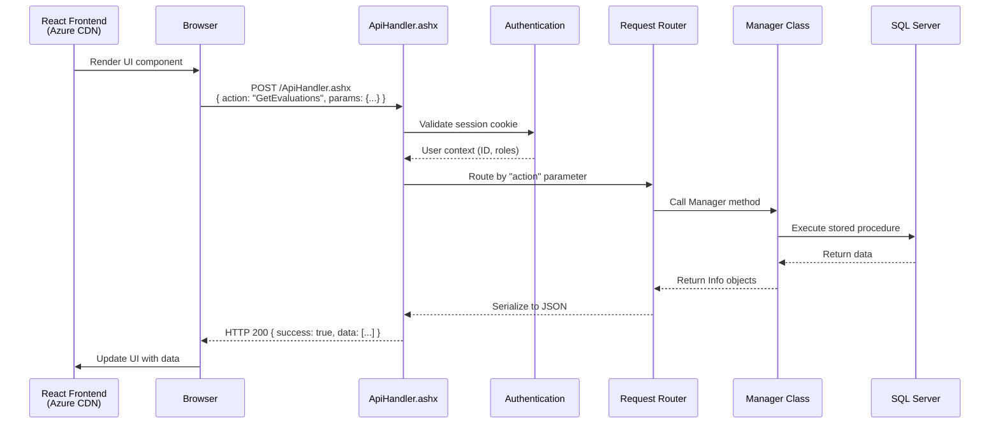
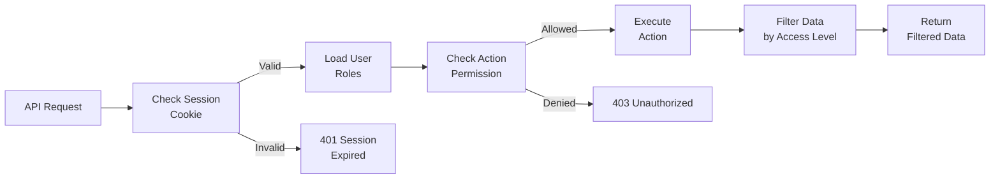

# ApiHandler.ashx -- Central JSON API Router

`ApiHandler.ashx` is the **single HTTP handler** that serves as the JSON API gateway for the React frontend. All AJAX requests from the modern React UI (and some legacy JavaScript) route through this handler, which authenticates the request, routes it to the appropriate Manager class, and returns JSON responses.

## How It Works



## Request Format

All requests to `ApiHandler.ashx` are HTTP POST requests with JSON body:

```json
{
  "action": "GetEvaluationsByProgram",
  "params": {
    "programId": 123,
    "startDate": "2025-07-01",
    "endDate": "2025-12-31",
    "status": "Pending"
  }
}
```

**Headers:**
- `Content-Type: application/json`
- Cookie-based session authentication (ASP.NET session cookie)

## Response Format

### Success Response

```json
{
  "success": true,
  "data": [
    {
      "evaluationId": 456,
      "formName": "End of Rotation Evaluation",
      "evaluatorName": "Dr. Smith",
      "subjectName": "Dr. Johnson",
      "status": "Pending",
      "dueDate": "2025-09-15T00:00:00"
    }
  ],
  "totalCount": 42,
  "message": null
}
```

### Error Response

```json
{
  "success": false,
  "data": null,
  "message": "You do not have permission to access this resource.",
  "errorCode": "UNAUTHORIZED"
}
```

## Request Routing

The `action` parameter maps to a specific handler method. The routing is implemented as a large switch statement (or dictionary lookup in newer code):

```csharp
public class ApiHandler : IHttpHandler, IRequiresSessionState
{
    public void ProcessRequest(HttpContext context)
    {
        try
        {
            // 1. Parse JSON request body
            var request = ParseRequestBody(context);
            string action = request["action"]?.ToString();

            // 2. Authenticate user from session
            var user = GetAuthenticatedUser(context);
            if (user == null)
            {
                ReturnError(context, "Session expired", "SESSION_EXPIRED", 401);
                return;
            }

            // 3. Route to handler based on action
            object result = RouteAction(action, request["params"], user);

            // 4. Return JSON response
            ReturnSuccess(context, result);
        }
        catch (UnauthorizedException ex)
        {
            ReturnError(context, ex.Message, "UNAUTHORIZED", 403);
        }
        catch (Exception ex)
        {
            LogError(ex);
            ReturnError(context, "An error occurred", "SERVER_ERROR", 500);
        }
    }

    private object RouteAction(string action, JToken params, UserInfo user)
    {
        switch (action)
        {
            // Evaluation actions
            case "GetEvaluations":
                return EvaluationManager.GetEvaluations(user, params);
            case "GetEvaluationsByProgram":
                return EvaluationManager.GetByProgram(
                    params["programId"].Value<int>(),
                    params["startDate"].Value<DateTime>(),
                    params["endDate"].Value<DateTime>());
            case "SaveEvaluationResponse":
                return EvaluationManager.SaveResponse(user, params);

            // Duty Hours actions
            case "GetDutyHourEntries":
                return DutyHourManager.GetEntries(user, params);
            case "SaveDutyHourEntry":
                return DutyHourManager.SaveEntry(user, params);

            // ... hundreds more action cases ...

            default:
                throw new ArgumentException($"Unknown action: {action}");
        }
    }
}
```

## Authentication & Authorization

1. **Session validation:** Every request checks for a valid ASP.NET session cookie
2. **User context:** The authenticated user's ID, roles, and institution are loaded from the session
3. **Action-level permissions:** Each action verifies the user has the required role/permission
4. **Data-level filtering:** Manager methods filter data based on the user's institution and program access



## Action Categories

The ApiHandler routes to approximately **200+ distinct actions** organized by domain:

| Category | Example Actions | Count |
|----------|----------------|-------|
| Evaluations | `GetEvaluations`, `SaveResponse`, `GetFormDefinition` | ~40 |
| Duty Hours | `GetDutyHourEntries`, `SaveEntry`, `GetComplianceStatus` | ~15 |
| Clinical | `GetPatientLogs`, `SaveCaseLog`, `GetProcedureCounts` | ~20 |
| Users | `GetUserProfile`, `SearchUsers`, `GetUserPermissions` | ~15 |
| Programs | `GetPrograms`, `GetRotations`, `GetResidentList` | ~20 |
| Reports | `GetReportData`, `GenerateReport`, `ExportData` | ~25 |
| CME | `GetCMECredits`, `SaveCMECredit`, `GetCMECompliance` | ~10 |
| Admin | `GetSystemConfig`, `UpdateSetting`, `GetAuditLog` | ~20 |
| Notifications | `GetNotifications`, `MarkRead`, `GetPreferences` | ~10 |
| Other | Various domain-specific actions | ~30+ |

## Performance Considerations

- **No rate limiting** -- The ApiHandler does not implement rate limiting (relies on IIS and network-level controls)
- **Synchronous execution** -- All requests are processed synchronously (no async/await in the .NET Framework 4.6.1 codebase)
- **Session state locking** -- ASP.NET session state can cause request queuing for the same user (requests serialize per session)
- **Large payload responses** -- Some actions return large datasets; consider pagination parameters

## Error Codes

| Code | Meaning |
|------|---------|
| `SESSION_EXPIRED` | User's session has expired; redirect to login |
| `UNAUTHORIZED` | User lacks permission for the requested action |
| `INVALID_PARAMS` | Required parameters are missing or invalid |
| `NOT_FOUND` | Requested resource does not exist |
| `VALIDATION_ERROR` | Business rule validation failed |
| `SERVER_ERROR` | Unexpected server error (logged for investigation) |

## Related Documentation

- [NewFrontend Integration](./new-frontend) -- How the React frontend is loaded
- [Authentication Pattern](../patterns/authentication) -- Session and SSO details
- [Web Structure](./structure) -- Overall Web project layout
