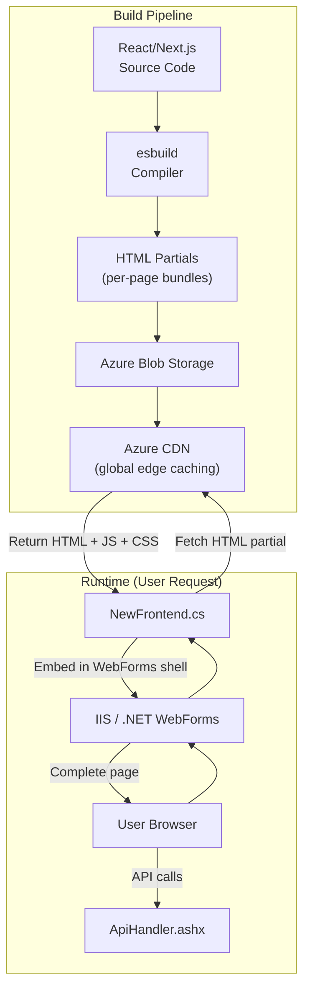
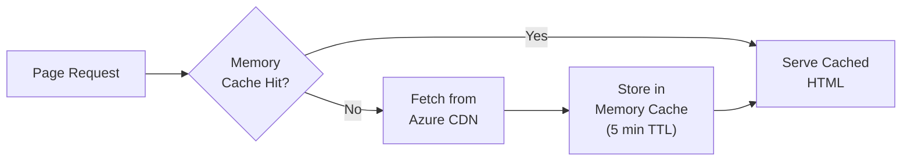

# NewFrontend.cs -- React Integration Layer

`NewFrontend.cs` is the bridge between the legacy ASP.NET WebForms application and the modern React frontend. It fetches pre-built React HTML partials from Azure CDN and embeds them within the .NET WebForms shell, enabling a gradual migration to React without requiring a full rewrite.

## Architecture



## How It Works

### 1. React Build Process

The React frontend (Next.js + Plasmic) is compiled using **esbuild** into self-contained HTML partials. Each page/feature produces a single HTML file containing:

- Inline CSS (scoped to the component)
- JavaScript bundle (React components + dependencies)
- Data fetching logic (calls ApiHandler.ashx for data)

These HTML files are uploaded to **Azure Blob Storage** and served through **Azure CDN** for low-latency global delivery.

### 2. .NET Shell Loading

When a user navigates to a page that has been migrated to React, the .NET WebForms page uses `NewFrontend.cs` to:

```csharp
public class NewFrontend
{
    private static readonly HttpClient _httpClient = new HttpClient();
    private static readonly MemoryCache _cache = MemoryCache.Default;

    // CDN base URL from configuration
    private static string CdnBaseUrl =>
        ConfigurationManager.AppSettings["NewFrontendCdnUrl"];

    /// <summary>
    /// Fetches a React HTML partial from CDN and returns it for embedding.
    /// Results are cached in memory for the configured duration.
    /// </summary>
    public static async Task<string> GetPartialAsync(string pageName)
    {
        string cacheKey = $"react_partial_{pageName}";

        // Check memory cache first
        string cachedHtml = _cache.Get(cacheKey) as string;
        if (cachedHtml != null)
            return cachedHtml;

        // Fetch from CDN
        string url = $"{CdnBaseUrl}/{pageName}.html";
        string html = await _httpClient.GetStringAsync(url);

        // Cache for configured duration (default: 5 minutes)
        int cacheDurationMinutes = int.Parse(
            ConfigurationManager.AppSettings["NewFrontendCacheDuration"] ?? "5");
        _cache.Set(cacheKey, html, DateTimeOffset.Now.AddMinutes(cacheDurationMinutes));

        return html;
    }

    /// <summary>
    /// Injects user context data that the React app needs for authentication
    /// and personalization.
    /// </summary>
    public static string GetUserContextScript(UserInfo user)
    {
        var context = new
        {
            userId = user.UserID,
            userName = user.UserName,
            roles = user.Roles,
            institutionId = user.InstitutionID,
            programIds = user.ProgramIDs,
            csrfToken = GetCsrfToken()
        };

        return $"<script>window.__ME_USER_CONTEXT__ = {JsonConvert.SerializeObject(context)};</script>";
    }
}
```

### 3. Page Embedding

The ASPX page embeds the React partial within the WebForms master page:

```aspx
<%@ Page Language="C#" MasterPageFile="~/MasterPages/NewFrontend.Master"
         AutoEventWireup="true" CodeBehind="EvaluationList.aspx.cs" %>

<asp:Content ContentPlaceHolderID="MainContent" runat="server">
    <!-- User context for React -->
    <%= NewFrontend.GetUserContextScript(CurrentUser) %>

    <!-- React partial from CDN -->
    <div id="react-root">
        <%= NewFrontend.GetPartial("evaluation-list") %>
    </div>
</asp:Content>
```

## Page Migration Status

The following pages have been migrated from WebForms to React:

| Page | React Partial Name | Migration Date | Notes |
|------|--------------------|----------------|-------|
| Evaluation List | `evaluation-list` | Migrated | Full feature parity |
| Evaluation Form | `evaluation-form` | Migrated | Dynamic form rendering |
| Duty Hour Entry | `duty-hour-entry` | Migrated | Mobile-responsive |
| Dashboard (Resident) | `dashboard-resident` | Migrated | Widgets-based layout |
| Dashboard (Faculty) | `dashboard-faculty` | Migrated | Customizable views |
| Patient Log Entry | `patient-log-entry` | Migrated | Auto-complete fields |
| CME Credit Entry | `cme-credit-entry` | Migrated | Validation improvements |
| User Profile | `user-profile` | Migrated | Photo upload added |
| Notification Center | `notification-center` | Migrated | Real-time updates |
| Reports Viewer | `reports-viewer` | Migrated | Interactive charts |
| Conference Schedule | `conference-schedule` | Migrated | Calendar integration |
| Milestone Dashboard | `milestone-dashboard` | Migrated | Spider charts |
| Rotation Calendar | `rotation-calendar` | In Progress | -- |
| Program Admin | `program-admin` | In Progress | -- |
| Credential Tracker | `credential-tracker` | Planned | -- |

## Caching Strategy

The caching layer prevents excessive CDN requests:



| Cache Layer | TTL | Purpose |
|-------------|-----|---------|
| In-memory (MemoryCache) | 5 minutes | Avoid repeated CDN requests from the same IIS worker |
| Azure CDN | 1 hour | Edge caching for global distribution |
| Browser cache | Versioned URLs | Bust cache on deploy with version hash |

## Configuration

```xml
<appSettings>
  <!-- Azure CDN URL for React HTML partials -->
  <add key="NewFrontendCdnUrl" value="https://myevalscontent.azureedge.net/frontend/v2" />

  <!-- In-memory cache duration in minutes -->
  <add key="NewFrontendCacheDuration" value="5" />

  <!-- Feature flag to enable/disable React frontend per page -->
  <add key="NewFrontend_EvaluationList_Enabled" value="true" />
  <add key="NewFrontend_DutyHourEntry_Enabled" value="true" />
  <add key="NewFrontend_RotationCalendar_Enabled" value="false" />
</appSettings>
```

## Error Handling

When the CDN is unavailable or a partial fails to load:

1. **Timeout:** `HttpClient` has a 5-second timeout for CDN requests
2. **Fallback:** If the React partial fails to load, the page falls back to the original WebForms implementation
3. **Logging:** CDN failures are logged with the partial name and error details
4. **Circuit breaker:** After 5 consecutive failures, CDN requests are paused for 60 seconds to prevent cascading timeouts

```csharp
public static string GetPartialWithFallback(string pageName)
{
    try
    {
        return GetPartial(pageName);
    }
    catch (Exception ex)
    {
        Logger.Warn($"Failed to load React partial '{pageName}': {ex.Message}");
        return null; // Signals the ASPX page to render WebForms fallback
    }
}
```

## Communication Between React and .NET

The React components communicate with the .NET backend via:

1. **`window.__ME_USER_CONTEXT__`** -- User identity and permissions injected as a global JavaScript object
2. **`ApiHandler.ashx`** -- All data operations go through the centralized API handler
3. **URL routing** -- The .NET app handles URL routing; React components are rendered within the routed page
4. **Events** -- Custom DOM events for communication between React components and any remaining WebForms JavaScript

## Related Documentation

- [ApiHandler](./api-handler) -- The API gateway that React components call
- [React Frontend Overview](/docs/react-frontend/overview) -- Full React frontend documentation
- [Migration Strategy](/docs/dotnet-backend/migration/strategy) -- Strangler fig migration approach
