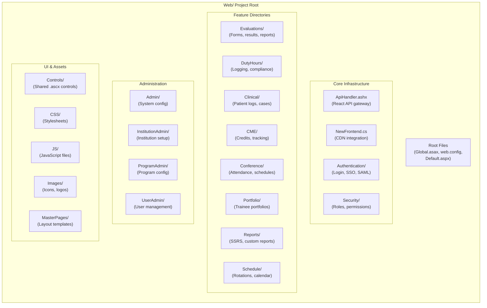

# Web Project Structure

The `Web/` project is the ASP.NET WebForms application that serves the MyEvaluations user interface. It contains **50+ subdirectories** organized by feature area, each containing ASPX pages, code-behind files, user controls, and static assets. This is the largest project in the solution by file count.

## Directory Map



## Complete Directory Listing

| Directory | Purpose | Key Files | Approx. Files |
|-----------|---------|-----------|---------------|
| `/` (Root) | Application entry point and global configuration | `Global.asax`, `web.config`, `Default.aspx`, `ApiHandler.ashx` | 15 |
| `Admin/` | System-level administration (superadmin) | Configuration pages, system settings | 20 |
| `Authentication/` | Login, logout, SSO, SAML, password reset | `Login.aspx`, `SAML/`, `SSO/` | 25 |
| `Announcements/` | System and program announcements | Create, edit, view announcements | 8 |
| `BlockSchedule/` | Block rotation schedule management | Schedule builder, calendar views | 12 |
| `Calendar/` | Calendar views for events and schedules | Monthly, weekly, daily views | 10 |
| `CaseLog/` | Case log entry and management | Entry forms, verification, reports | 15 |
| `Clinical/` | Clinical experience tracking | Patient encounters, procedure logs | 20 |
| `CME/` | CME credit management | Credit entry, tracking, compliance reports | 18 |
| `Conference/` | Conference management and attendance | Schedules, sign-in, attendance reports | 22 |
| `Controls/` | Shared WebForms user controls (.ascx) | Navigation, grids, pickers, panels | 40+ |
| `CSS/` | Stylesheets | Main styles, print styles, responsive | 15 |
| `Dashboard/` | User dashboards by role | Resident, faculty, admin dashboards | 12 |
| `Documents/` | Document management | Upload, download, viewer | 10 |
| `DutyHours/` | Duty hour logging and compliance | Entry forms, violation reports, summaries | 25 |
| `ERAS/` | ERAS integration pages | Application viewer, import status | 8 |
| `ESignature/` | Electronic signature workflows | Document signing, status tracking | 10 |
| `Evaluations/` | Evaluation forms and results | Form builder, completion, results, aggregate reports | 45 |
| `Export/` | Data export functionality | CSV, Excel, PDF export handlers | 10 |
| `Faculty/` | Faculty-specific features | Faculty dashboard, activity reports | 12 |
| `Feedback/` | Feedback collection | Feedback forms, results | 8 |
| `Goals/` | Learning goals and milestones | Goal setting, tracking, ACGME milestones | 15 |
| `Help/` | Help and documentation pages | FAQ, user guides, tooltips | 8 |
| `Images/` | Static images | Icons, logos, UI elements | 100+ |
| `Import/` | Data import functionality | CSV import, bulk upload | 10 |
| `InstitutionAdmin/` | Institution-level administration | Institution setup, branding, features | 18 |
| `JS/` | JavaScript files | jQuery plugins, custom scripts, validation | 50+ |
| `LearningAssignment/` | Learning assignment management | Assignment creation, tracking, completion | 12 |
| `License/` | License and credential tracking | License entry, expiration tracking | 10 |
| `Mail/` | Email-related pages | Email templates, preview, delivery logs | 8 |
| `MasterPages/` | Layout master pages | Main layout, admin layout, print layout | 5 |
| `Milestones/` | ACGME milestone tracking | Milestone data entry, reporting, CCC tools | 15 |
| `Mobile/` | Mobile-optimized pages (legacy) | Simplified views for mobile browsers | 12 |
| `NewFrontend/` | React frontend integration | CDN loader, partial embedding | 5 |
| `Notifications/` | Notification management | Notification center, preferences | 8 |
| `PatientLog/` | Patient encounter logging | Patient log forms, summaries | 15 |
| `Portfolio/` | Trainee portfolio management | Portfolio views, review forms | 12 |
| `Procedures/` | Procedure logging and tracking | Procedure entry, minimum tracking | 12 |
| `ProgramAdmin/` | Program-level administration | Program setup, evaluation config, rotation config | 25 |
| `Quiz/` | Quiz and assessment management | Quiz builder, taking, results | 15 |
| `Reports/` | Reporting center | Report library, SSRS viewer, custom reports | 30 |
| `Resident/` | Resident-specific features | Resident dashboard, progress tracking | 15 |
| `Resources/` | Localization and resource files | .resx files for multi-language support | 20 |
| `Rotation/` | Rotation management | Rotation setup, assignment, calendar | 18 |
| `Schedule/` | Schedule management | Master schedule, call schedules | 15 |
| `ScholarlyActivity/` | Scholarly work tracking | Research projects, publications | 10 |
| `Security/` | Security configuration | Role management, permissions | 12 |
| `Survey/` | Survey management | Survey builder, distribution, results | 15 |
| `Timesheet/` | Timesheet management | Time entry, approval workflows | 10 |
| `Upload/` | File upload handling | Upload handlers, file processing | 5 |
| `UserAdmin/` | User management | User CRUD, role assignment, bulk import | 20 |

## Key Root Files

### Global.asax

Application lifecycle events, error handling, and startup configuration:

```csharp
public class Global : HttpApplication
{
    void Application_Start(object sender, EventArgs e)
    {
        // Configure routing
        // Initialize caching
        // Set up error handling
    }

    void Application_Error(object sender, EventArgs e)
    {
        // Global error handler
        // Log to database
        // Redirect to error page
    }

    void Session_Start(object sender, EventArgs e)
    {
        // Initialize user session
        // Load user preferences
    }
}
```

### web.config

Central configuration file containing:
- Connection strings
- Authentication and authorization settings
- Custom HTTP handlers and modules
- Application settings (feature flags, API keys, timeouts)
- IIS configuration (URL rewrite rules, static content settings)

### Default.aspx

The application entry point that redirects authenticated users to their role-specific dashboard.

## Master Pages

The application uses ASP.NET Master Pages for consistent layout:

| Master Page | Purpose |
|-------------|---------|
| `Site.Master` | Main application layout (header, navigation, sidebar, footer) |
| `Admin.Master` | Administration pages layout (extended navigation) |
| `Print.Master` | Print-friendly layout (no navigation, minimal styling) |
| `Blank.Master` | Minimal layout for popups and embedded content |
| `NewFrontend.Master` | Layout for React-embedded pages |

## Related Documentation

- [ApiHandler](./api-handler) -- The central JSON API endpoint
- [NewFrontend](./new-frontend) -- How React partials are embedded
- [User Controls](./user-controls) -- Reusable UI components
- [**Web Page Reference**](../file-index) — Per-file documentation for all 1,644 Web/ source files across 32 subdirectories (also browsable via the **Page Reference** sidebar section)
