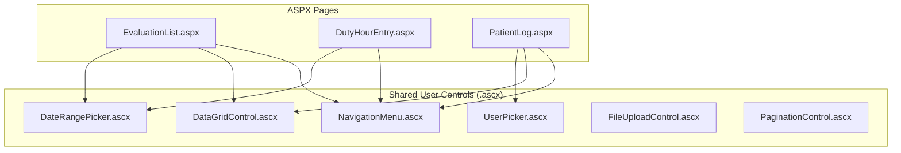

# User Controls (.ascx)

The MyEvaluations Web application uses ASP.NET WebForms **user controls** (`.ascx` files) as reusable UI components. These controls encapsulate common UI patterns like data grids, date pickers, navigation menus, and form sections that are shared across multiple pages.

## Overview

User controls are located in the `Controls/` directory and are organized by functional area. The application contains **40+ reusable controls** that form the building blocks of the WebForms UI.



## Key User Controls

### Navigation Controls

| Control | File | Purpose |
|---------|------|---------|
| NavigationMenu | `NavigationMenu.ascx` | Main application navigation menu (role-aware) |
| BreadcrumbTrail | `BreadcrumbTrail.ascx` | Page breadcrumb navigation |
| SidebarMenu | `SidebarMenu.ascx` | Context-sensitive sidebar navigation |
| TabControl | `TabControl.ascx` | Tabbed content switching |
| QuickLinks | `QuickLinks.ascx` | Role-based quick action links |

### Data Display Controls

| Control | File | Purpose |
|---------|------|---------|
| DataGridControl | `DataGridControl.ascx` | Sortable, filterable data grid with pagination |
| PaginationControl | `PaginationControl.ascx` | Standard pagination (page numbers, prev/next) |
| SortableHeader | `SortableHeader.ascx` | Column header with sort indicators |
| EmptyStatePanel | `EmptyStatePanel.ascx` | "No data found" message with action links |
| StatusBadge | `StatusBadge.ascx` | Color-coded status indicator |

### Form Controls

| Control | File | Purpose |
|---------|------|---------|
| DateRangePicker | `DateRangePicker.ascx` | Start/end date selector with presets |
| UserPicker | `UserPicker.ascx` | Auto-complete user search and selection |
| ProgramPicker | `ProgramPicker.ascx` | Program selection dropdown (respects user access) |
| FileUploadControl | `FileUploadControl.ascx` | Drag-and-drop file upload with validation |
| RichTextEditor | `RichTextEditor.ascx` | WYSIWYG text editor for comments/narratives |
| SignatureCapture | `SignatureCapture.ascx` | Electronic signature pad |

### Evaluation Controls

| Control | File | Purpose |
|---------|------|---------|
| EvaluationFormRenderer | `EvaluationFormRenderer.ascx` | Renders dynamic evaluation forms from form definitions |
| LikertScale | `LikertScale.ascx` | Standard Likert scale response control (1-5 or 1-9) |
| MilestoneSlider | `MilestoneSlider.ascx` | ACGME milestone level selector |
| NarrativeResponse | `NarrativeResponse.ascx` | Multi-line text response with character count |
| EvaluationSummaryChart | `EvaluationSummaryChart.ascx` | Visual summary of evaluation scores |

### Reporting Controls

| Control | File | Purpose |
|---------|------|---------|
| ReportViewer | `ReportViewer.ascx` | Embedded SSRS report viewer |
| ChartControl | `ChartControl.ascx` | Server-side chart rendering |
| ExportToolbar | `ExportToolbar.ascx` | Export buttons (PDF, Excel, CSV) |
| FilterPanel | `FilterPanel.ascx` | Collapsible filter criteria panel |

## Common Usage Pattern

### Registering a User Control

```aspx
<%@ Register TagPrefix="me" TagName="UserPicker" Src="~/Controls/UserPicker.ascx" %>
<%@ Register TagPrefix="me" TagName="DateRange" Src="~/Controls/DateRangePicker.ascx" %>
```

### Using Controls in a Page

```aspx
<asp:Content ContentPlaceHolderID="MainContent" runat="server">
    <div class="filter-bar">
        <me:ProgramPicker ID="ProgramFilter" runat="server"
            OnProgramChanged="ProgramFilter_Changed"
            ShowAllOption="true" />

        <me:DateRange ID="DateFilter" runat="server"
            DefaultRange="CurrentAcademicYear"
            OnDateRangeChanged="DateFilter_Changed" />

        <me:UserPicker ID="ResidentFilter" runat="server"
            RoleFilter="Resident"
            Placeholder="Search residents..."
            OnUserSelected="ResidentFilter_Selected" />
    </div>

    <me:DataGridControl ID="EvaluationGrid" runat="server"
        PageSize="25"
        AllowSorting="true"
        AllowExport="true"
        EmptyDataText="No evaluations found for the selected criteria." />
</asp:Content>
```

### Code-Behind Interaction

```csharp
public partial class EvaluationList : BasePage
{
    protected void Page_Load(object sender, EventArgs e)
    {
        if (!IsPostBack)
        {
            LoadEvaluations();
        }
    }

    protected void ProgramFilter_Changed(object sender, EventArgs e)
    {
        LoadEvaluations();
    }

    private void LoadEvaluations()
    {
        int programId = ProgramFilter.SelectedProgramID;
        DateTime startDate = DateFilter.StartDate;
        DateTime endDate = DateFilter.EndDate;

        var evaluations = EvaluationManager.GetEvaluationsByProgram(
            programId, startDate, endDate);

        EvaluationGrid.DataSource = evaluations;
        EvaluationGrid.DataBind();
    }
}
```

## Control Communication

Controls communicate with their host pages through:

1. **Properties:** Controls expose public properties that pages can set
2. **Events:** Controls raise custom events when user interactions occur
3. **ViewState:** Control state is preserved across postbacks via ViewState
4. **FindControl:** Pages can access child controls within user controls (though this is discouraged)

```csharp
// User control defines an event
public partial class UserPicker : UserControl
{
    public event EventHandler<UserSelectedEventArgs> UserSelected;

    public int SelectedUserID { get; set; }
    public string RoleFilter { get; set; }
    public string Placeholder { get; set; }

    protected void UserSearchResult_Click(object sender, EventArgs e)
    {
        SelectedUserID = int.Parse(((LinkButton)sender).CommandArgument);
        UserSelected?.Invoke(this, new UserSelectedEventArgs(SelectedUserID));
    }
}
```

## Migration Notes

:::info React Migration
As pages are migrated to the React frontend, the user controls are replaced by React components. The React components call the same ApiHandler.ashx endpoints but render client-side instead of server-side. Controls for pages that have been migrated to React are still maintained for backward compatibility but are no longer actively developed.
:::

## Related Documentation

- [Web Structure](./structure) -- Overall Web project layout
- [ApiHandler](./api-handler) -- How React components interact with the backend
- [React Frontend Overview](/docs/react-frontend/overview) -- Modern UI component library
