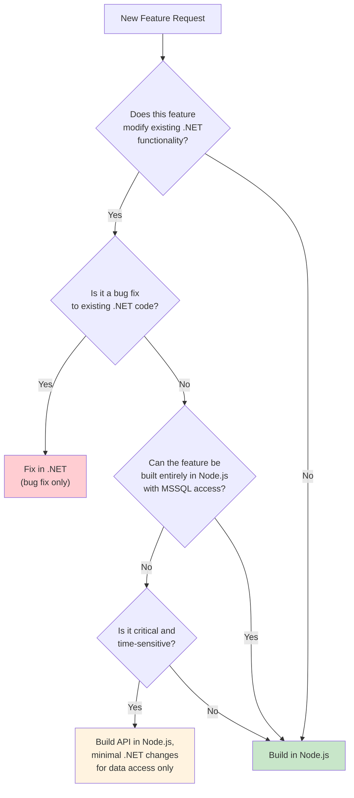
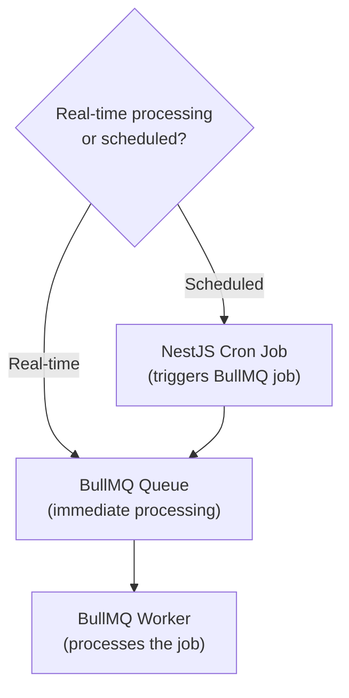

# Adding a New Feature

This guide helps you decide where to build a new feature and walks through the steps for each system.

## Decision Tree: Which Backend?



### The Rule

> **All new features are built on Node.js + React.** The .NET backend only receives bug fixes.

This is the core migration principle. Even if a feature touches data that exists in MSSQL, the business logic and API should be in NestJS with MikroORM accessing the shared database.

## Building a Feature in Node.js

### Step 1: Create the NestJS Module

```bash
# Generate a new module with NestJS CLI
npx nest g module modules/my-feature
npx nest g controller modules/my-feature
npx nest g service modules/my-feature
```

### Step 2: Choose the Database

| Scenario | Database | ORM Configuration |
|----------|----------|-------------------|
| Feature uses only new data | PostgreSQL | MikroORM PostgreSQL driver |
| Feature reads existing .NET data | MSSQL | MikroORM MSSQL driver |
| Feature needs both | MSSQL + PostgreSQL | Dual MikroORM config |

### Step 3: Create MikroORM Entities

```typescript
// For MSSQL (shared data)
// src/entities/mssql/evaluation.entity.ts
@Entity({ tableName: 'tblEvaluation' })
export class Evaluation {
  @PrimaryKey()
  EvaluationID!: number;

  @Property()
  Title!: string;
}

// For PostgreSQL (new data)
// src/entities/postgres/performance-review.entity.ts
@Entity()
export class PerformanceReview {
  @PrimaryKey()
  id!: number;

  @Property()
  reviewDate!: Date;
}
```

### Step 4: Implement the Service

```typescript
@Injectable()
export class MyFeatureService {
  constructor(
    @InjectRepository(MyFeatureEntity)
    private readonly repo: EntityRepository<MyFeatureEntity>,
  ) {}

  async create(dto: CreateMyFeatureDto): Promise<MyFeatureDto> {
    const entity = this.repo.create(dto);
    await this.repo.persistAndFlush(entity);
    return MyFeatureDto.fromEntity(entity);
  }
}
```

### Step 5: Build the REST API

```typescript
@Controller('my-feature')
@UseGuards(JwtAuthGuard)
export class MyFeatureController {
  constructor(private readonly myFeatureService: MyFeatureService) {}

  @Post()
  async create(@Body() dto: CreateMyFeatureDto): Promise<MyFeatureDto> {
    return this.myFeatureService.create(dto);
  }

  @Get(':id')
  async findOne(@Param('id') id: number): Promise<MyFeatureDto> {
    return this.myFeatureService.findById(id);
  }
}
```

### Step 6: Add Validation

```typescript
export class CreateMyFeatureDto {
  @IsString()
  @IsNotEmpty()
  title: string;

  @IsDateString()
  startDate: string;
}
```

### Step 7: Write Tests

```typescript
describe('MyFeatureService', () => {
  let service: MyFeatureService;

  beforeEach(async () => {
    const module = await Test.createTestingModule({
      providers: [MyFeatureService],
    }).compile();

    service = module.get(MyFeatureService);
  });

  it('should create a feature', async () => {
    const result = await service.create({ title: 'Test', startDate: '2025-01-01' });
    expect(result.title).toBe('Test');
  });
});
```

### Step 8: Add Background Job (If Needed)

```typescript
// Worker processor
@Processor('my-feature-queue')
export class MyFeatureProcessor {
  @Process('send-reminder')
  async handleReminder(job: Job<MyFeatureReminderData>): Promise<void> {
    // Process the job
  }
}
```

## Building the UI in React

### Step 1: Create the React Page

If this is a new page that will replace a WebForms page (or be a new page entirely):

1. Create a new page in `pages/New/MyFeature/index.tsx`
2. Build the UI using Plasmic components or custom components
3. Connect to the Node.js API using the API client

### Step 2: Embed in .NET Shell (If Needed)

If the page needs to live within the existing .NET WebForms navigation:

1. Build the HTML partial via `npm run build:html`
2. The .NET `NewFrontend.cs` will fetch and embed it automatically based on URL routing

### Step 3: Standalone Page (If Applicable)

If the page can be a standalone React route (not embedded in .NET):

1. Create the page normally in Next.js
2. Add navigation link in the appropriate place
3. Handle authentication via JWT cookies

## Adding a Background Job

If the feature needs scheduled or async processing:



See [Creating a Scheduler](/docs/guides/creating-scheduler) for details on building background jobs.

## Fixing a Bug in .NET

If you must fix a bug in the .NET backend:

1. Identify the affected Manager class and stored procedure
2. Debug using Visual Studio (see [Debugging Guide](/docs/guides/debugging))
3. Make the minimal change needed to fix the bug
4. Test locally with the debugger
5. Create a PR against the `master` branch
6. Deploy via Visual Studio publish (manual deployment)

:::warning
Do not add new features, refactor large sections, or create new stored procedures in the .NET backend unless it is a critical bug fix that cannot wait for Node.js migration.
:::

## Deployment Checklist

After building the feature:

- [ ] All tests pass (unit + integration)
- [ ] Code review approved
- [ ] API documentation updated (Swagger annotations)
- [ ] Database migrations tested
- [ ] Feature flag configured (if gradual rollout needed)
- [ ] Merged to `main`
- [ ] Verified in dev environment
- [ ] Production deployment scheduled
