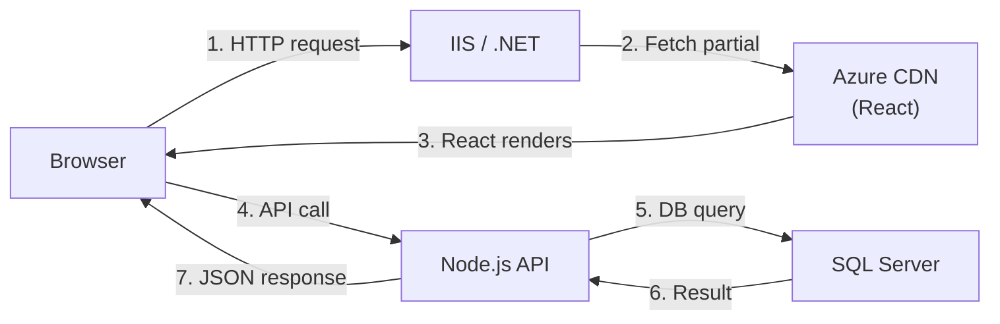

# Debugging Guide

This guide covers debugging techniques for each system in the MyEvaluations platform. Since the platform spans four codebases and two databases, effective debugging often requires tracing requests across multiple systems.

## .NET Backend Debugging

### Visual Studio Debugger

The primary debugging tool for the .NET backend:

1. Open `MyEvaluations2009.sln` in Visual Studio 2022
2. Set `Web/Login.aspx` as the Start Page
3. Press **F5** to start with debugger attached
4. Set breakpoints in Manager classes, code-behind files, or `ApiHandler.ashx`

### Key Debugging Entry Points

| Scenario | Where to Set Breakpoints |
|----------|-------------------------|
| WebForms page issue | The `.aspx.cs` code-behind file for that page |
| API call from React | `ApiHandler.ashx` -- the central JSON API router |
| Business logic bug | The relevant `*Manager.cs` class |
| Data access issue | `DBDataAccess.cs` or `CustomCommand.cs` |
| Authentication problem | `Web/Security/` classes and SAML handler |
| Scheduler/service issue | The Windows Service's `Program.cs` or main worker class |

### Viewing SQL Queries

Since all data access goes through stored procedures:

1. Use **SQL Server Profiler** to capture executed stored procedures
2. Filter by the application name or database
3. Copy the stored procedure call and parameters to SSMS for direct testing

```sql
-- Example: Test a stored procedure directly
EXEC usp_EvalGetByID @EvaluationID = 12345
```

### Logging

The .NET backend uses Enterprise Library logging. Logs are written to:
- Application event log (Windows Event Viewer)
- Log files in the configured log directory

Increase verbosity by adjusting the logging configuration in `Web.config`.

## Node.js Backend Debugging

### VS Code Debugger

1. Open the `myevals-nodejs-backend` folder in VS Code
2. Use the pre-configured launch profile: **Debug Server**
3. Set breakpoints in controllers, services, or workers
4. Press **F5** to start

Alternatively, start with the debug flag:

```bash
npm run start:debug
```

Then attach VS Code's debugger to port 9229.

### Debugging BullMQ Workers

Workers run as separate processes. To debug a specific worker:

1. Start the worker in debug mode:
   ```bash
   node --inspect dist/workers/evaluation-reminder.worker.js
   ```
2. Attach VS Code's debugger to the worker process

### Logging

Structured JSON logs via Winston/Pino:

```bash
# Set log level for verbose output
LOG_LEVEL=debug npm run start:dev
```

### Database Query Debugging

MikroORM can log all generated SQL:

```typescript
// In mikro-orm.config.ts
{
  debug: true, // Logs all SQL queries to console
}
```

### Request Tracing

Use the `x-request-id` header to trace a request through logs:

```bash
curl -H "x-request-id: debug-123" http://localhost:3000/api/evaluations/1
# Then grep logs for "debug-123"
```

## React Frontend Debugging

### React DevTools

Install the [React DevTools](https://react.dev/learn/react-developer-tools) browser extension:

- **Components tab** -- Inspect component tree, props, state, and hooks
- **Profiler tab** -- Identify performance bottlenecks and unnecessary re-renders

### Browser DevTools

| Tab | Use For |
|-----|---------|
| Console | JavaScript errors, `console.log` output |
| Network | API call inspection, response payloads, timing |
| Sources | Setting breakpoints in the bundled JavaScript |
| Application | Cookies, local storage, session data |

### Debugging API Calls

1. Open the Network tab in browser DevTools
2. Filter by `XHR/Fetch`
3. Look at the request URL to determine which backend is being called:
   - URLs containing `ApiHandler.ashx` go to the .NET backend
   - URLs containing `/api/` go to the Node.js backend
4. Inspect the request payload and response

### Debugging Plasmic Components

Plasmic-generated components can be difficult to debug because they are auto-generated:

- Set breakpoints in **wrapper components** (custom code), not in Plasmic-generated files
- Use React DevTools to inspect props being passed to Plasmic components
- Check the Plasmic Studio for layout and styling issues

## SQL Server Debugging

### SQL Server Management Studio (SSMS)

For investigating data issues:

```sql
-- Find a specific evaluation
SELECT * FROM tblEvaluation WHERE EvaluationID = 12345;

-- Check stored procedure definition
EXEC sp_helptext 'usp_EvalGetByID';

-- View recent errors in SQL Server
SELECT TOP 50 * FROM sys.messages WHERE severity > 10;
```

### SQL Server Profiler

For tracing queries from both backends:

1. Open SQL Server Profiler
2. Create a new trace connected to the dev database
3. Filter events:
   - **RPC:Completed** for stored procedure calls
   - **SQL:BatchCompleted** for ad-hoc queries
4. Optionally filter by **ApplicationName** to distinguish .NET vs Node.js traffic

### Query Performance

```sql
-- Find slow queries
SELECT TOP 20
    qs.total_elapsed_time / qs.execution_count AS avg_elapsed_time,
    qs.execution_count,
    SUBSTRING(qt.text, 1, 100) AS query_text
FROM sys.dm_exec_query_stats qs
CROSS APPLY sys.dm_exec_sql_text(qs.sql_handle) qt
ORDER BY avg_elapsed_time DESC;
```

## MAUI App Debugging

### Android Debugging

1. Connect a physical device via USB or start an emulator
2. Set breakpoints in Visual Studio
3. Press **F5** to deploy and debug
4. Use **Logcat** (via Android Studio or `adb logcat`) for native logs

```bash
# View app logs via adb
adb logcat -s MyEvaluations
```

### iOS Debugging

1. Connect a physical device or start a simulator (Mac required)
2. Set breakpoints in Visual Studio for Mac or Xcode
3. Press **F5** to deploy and debug
4. Use Xcode's **Console** for native logs

### Realm Database Inspection

To inspect the local Realm database on a device:

1. Use [Realm Studio](https://www.mongodb.com/docs/realm/studio/) (desktop app)
2. Pull the Realm file from the device:
   ```bash
   adb pull /data/data/com.myevaluations.app/files/default.realm ./debug/
   ```
3. Open the file in Realm Studio

### Network Debugging

Use a proxy tool like [Charles Proxy](https://www.charlesproxy.com/) or [mitmproxy](https://mitmproxy.org/) to inspect API calls from the mobile app.

## Cross-System Debugging

When a bug spans multiple systems, trace the request path:



### Debugging Steps

1. **Start at the browser** -- Check the Network tab for the failing request
2. **Identify the backend** -- Is it calling .NET (`ApiHandler.ashx`) or Node.js (`/api/`)?
3. **Check backend logs** -- Look at the relevant backend's logs for errors
4. **Inspect the database** -- Verify the data exists and is correct in SQL Server
5. **Check the stored procedure** -- If using a stored proc, test it directly in SSMS

## Common Debugging Scenarios

| Scenario | Tools | First Step |
|----------|-------|-----------|
| Page won't load | Browser DevTools (Console + Network) | Check for JavaScript errors |
| API returns 500 | Backend logs (VS debugger or Winston) | Find the stack trace |
| Wrong data displayed | SSMS + SQL Profiler | Query the database directly |
| Evaluation not sent | Windows Service logs or BullMQ dashboard | Check the scheduler/worker |
| Mobile crash | App Center crash reports | Read the stack trace |
| Slow page load | SQL Profiler + New Relic | Find slow queries |
