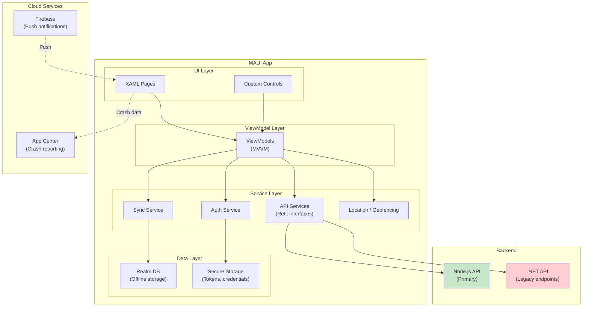
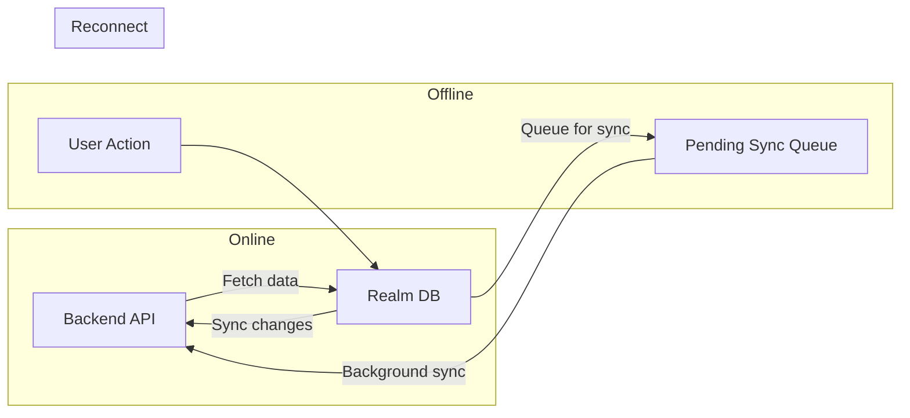
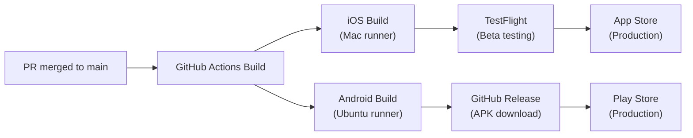

# MAUI App Overview

The MyEvaluations mobile app (`myevals-xamarin-app`) is a cross-platform application built on **.NET MAUI 9**, targeting iOS and Android. It provides field access to evaluations, clinical hours, geofencing, and more.

:::info Repository
**GitHub:** `github.com/myevaluations/myevals-xamarin-app`
**Branch:** `main`
**Language:** C# (.NET MAUI)
**Current Version:** v5.5.7
:::

:::note Historical Name
The repository is named `myevals-xamarin-app` because it originated as a Xamarin.Forms app. It has since been migrated to .NET MAUI 9, but the repository name was retained for continuity.
:::

## Technology Stack

| Component | Technology | Version |
|-----------|-----------|---------|
| Framework | .NET MAUI | 9.0 |
| Language | C# | 12 |
| Runtime | .NET | 9.0 |
| Local Database | Realm | Latest |
| Push Notifications | Firebase Cloud Messaging | -- |
| HTTP Client | Refit | 7.x |
| Architecture | MVVM | -- |
| DI Container | .NET MAUI built-in | -- |
| IDE | Visual Studio 2022 | 17.x |
| iOS Build | Xcode (via Mac) | 15+ |
| Android Build | Android SDK | 34 |
| CI/CD | GitHub Actions | -- |
| Distribution (iOS) | TestFlight | -- |
| Distribution (Android) | GitHub Releases | -- |

## Architecture



## Key Features

### Evaluations
- Complete and submit evaluations on mobile
- Offline evaluation completion with sync when back online
- Push notifications for pending evaluations

### Clinical Hours / Duty Hours
- Log duty hours from the field
- Time entry with start/end times
- Compliance alerts for ACGME violations

### MyQuickPass (Geofencing)
- Location-based check-in and check-out
- Geofenced clinical sites for automatic time logging
- Background location tracking with battery optimization

### QR Code Scanning
- Scan QR codes for event attendance
- Conference check-in via QR

### Patient Log
- Log patient encounters on the go
- Diagnosis and procedure code lookup
- Offline entry with background sync

### Push Notifications
- Firebase Cloud Messaging for evaluation reminders
- Duty hour compliance alerts
- Administrative announcements

## Offline-First with Realm

The app uses [Realm](https://realm.io/) as a local database for offline support:



- Data is cached locally in Realm for offline access
- User actions (evaluations, duty hours) are saved to Realm first
- A sync service detects connectivity and pushes pending changes to the backend
- Conflict resolution follows a last-write-wins strategy for most data types

## API Communication

The app uses [Refit](https://github.com/reactiveui/refit) for type-safe HTTP API calls:

```csharp
// Example Refit interface
public interface IEvaluationApi
{
    [Get("/api/evaluations/pending")]
    Task<List<EvaluationDto>> GetPendingEvaluationsAsync();

    [Post("/api/evaluations/{id}/submit")]
    Task SubmitEvaluationAsync(int id, [Body] EvaluationSubmission submission);
}
```

The app primarily communicates with the Node.js backend, with some legacy endpoints still pointing to the .NET backend.

## Platform-Specific Features

| Feature | iOS | Android |
|---------|-----|---------|
| Push Notifications | APNs via Firebase | FCM direct |
| Background Sync | Background App Refresh | WorkManager |
| Geofencing | Core Location | Google Play Services |
| Biometric Auth | Face ID / Touch ID | Fingerprint / Face Unlock |
| File Sharing | Share Sheet | Intent system |

## Release Process



## Key Metrics

| Metric | Value |
|--------|-------|
| Current Version | v5.5.7 |
| Platforms | iOS + Android |
| Architecture | MVVM |
| Offline Database | Realm |
| API Client | Refit |
| Push Provider | Firebase |

<!-- AUTO-GENERATED: Version numbers and feature details will be enriched from repo-sync scripts -->
