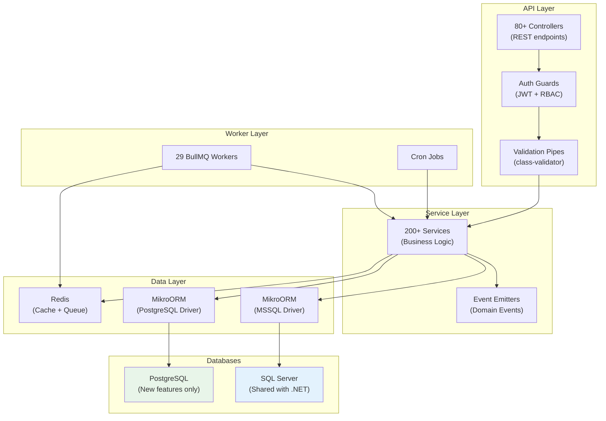
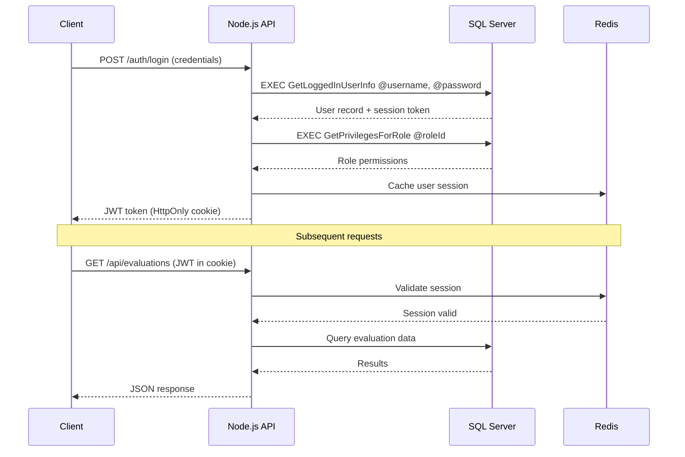

# Node.js Backend Overview

The Node.js backend (`myevals-nodejs-backend`) is the modern replacement for the legacy .NET monolith, built on **NestJS 10** with **MikroORM** for database access. It runs on Azure Docker Swarm and progressively takes over functionality from the .NET backend via the Strangler Fig pattern.

:::info Repository
**GitHub:** `github.com/myevaluations/myevals-nodejs-backend`
**Branch:** `main`
**PRs:** 2,581+
**Language:** TypeScript
:::

## Technology Stack

| Component | Technology | Version |
|-----------|-----------|---------|
| Runtime | Node.js | 20 LTS |
| Framework | NestJS | 10.x |
| Language | TypeScript | 5.x |
| ORM | MikroORM | 6.x |
| Databases | SQL Server + PostgreSQL | Dual |
| Queue | BullMQ + Redis | 5.x |
| Auth | JWT + Shared MSSQL stored procs | -- |
| API Docs | Swagger (OpenAPI) | 3.0 |
| Testing | Jest | 29.x |
| Logging | Winston + Pino | -- |
| APM | New Relic | -- |
| Error Tracking | Sentry | -- |
| Deployment | Docker Swarm (Azure VMs) | -- |
| CI/CD | GitHub Actions | -- |

:::tip Database Cross-Reference
The Node.js backend shares stored procedures with the .NET backend via the common MSSQL database. See [SP Reconciliation](/docs/database/sproc-reconciliation) for the full list of shared stored procedures and [Database Schema](/docs/database/overview) for the complete schema documentation.
:::

## Architecture

## Domain Modules (~28)

The backend is organized into domain-driven NestJS modules:

| Module | Description | Database |
|--------|-------------|----------|
| `auth` | Authentication, JWT tokens, SSO | MSSQL (shared) |
| `users` | User management, profiles, roles | MSSQL (shared) |
| `evaluations` | Evaluation forms, distribution, completion | MSSQL (shared) |
| `duty-hours` | ACGME duty hour tracking, violations | MSSQL (shared) |
| `patient-log` | Patient encounter logging | MSSQL (shared) |
| `procedures` | Clinical procedure tracking | MSSQL (shared) |
| `goals` | Goals and milestones tracking | MSSQL (shared) |
| `notifications` | Email and push notification dispatch | MSSQL + PostgreSQL |
| `ape` | Annual Program Evaluation | PostgreSQL |
| `caw` | Clinical Activity Worksheet | PostgreSQL |
| `performance` | Performance reviews | PostgreSQL |
| `onboarding` | New resident onboarding workflows | PostgreSQL |
| `posts` | Posts and announcements | PostgreSQL |
| `simpl` | SIMPL procedure assessment | PostgreSQL |
| `programs` | Program and institution management | MSSQL (shared) |
| `reports` | Report generation and export | MSSQL (shared) |
| `files` | File upload and Azure Blob Storage | Both |
| `scheduling` | Rotation and block scheduling | MSSQL (shared) |
| `mobile` | MAUI mobile app API endpoints | Both |
| `admin` | System administration | Both |
| `health` | Health check endpoints | -- |
| `config` | Dynamic configuration | PostgreSQL |
| `audit` | Audit logging | PostgreSQL |
| `integrations` | Third-party integrations | Both |

## BullMQ Workers (29)

Background job processing is handled by BullMQ workers running as separate Docker Swarm services:

| Worker | Description | Schedule |
|--------|-------------|----------|
| `evaluation-reminder` | Send evaluation completion reminders | Every 6 hours |
| `evaluation-auto-file` | Auto-file overdue evaluations | Daily |
| `duty-hour-reminder` | Remind residents to log duty hours | Weekly |
| `notification-email` | Process email notification queue | Real-time |
| `notification-push` | Process push notification queue | Real-time |
| `report-generator` | Generate large reports asynchronously | On demand |
| `data-import` | Process bulk data imports | On demand |
| `file-processor` | Process uploaded files (PDF, images) | Real-time |
| `audit-log` | Write audit events asynchronously | Real-time |
| `cache-invalidation` | Invalidate stale cache entries | Periodic |

:::note
The 29 BullMQ workers are progressively replacing the 70+ .NET Windows Services. See the [Migration Status](/docs/dotnet-backend/migration/status) for which schedulers have been migrated.
:::

## Authentication Flow

The Node.js backend shares authentication with the .NET backend through MSSQL stored procedures:

## Dual Database Strategy

The backend connects to two databases simultaneously:

- **MSSQL**: All legacy data shared with the .NET backend. Used for features being migrated or features that need access to legacy data.
- **PostgreSQL**: All new features built exclusively on Node.js. Used for APE, CAW, Performance, Onboarding, and other features that never existed in .NET.

See [Shared Database](/docs/dotnet-backend/migration/shared-database) for rules about schema changes and coexistence.

## Deployment

| Environment | Infrastructure | Replicas |
|-------------|---------------|----------|
| Development | Azure VM (Docker Swarm) | 1 server, 1 worker |
| Staging | Azure VM (Docker Swarm) | 1 server, 2 workers |
| Production | Azure VM (Docker Swarm) | 2 servers, 4 workers |

Deployment is managed via GitHub Actions:
- Push to `main` auto-deploys to the development environment
- Production deployments are triggered manually via GitHub Actions workflow dispatch
- Infrastructure is managed with CDKTF (Terraform CDK)

## Key Metrics

| Metric | Value |
|--------|-------|
| Pull Requests | 2,581+ |
| Controllers | 80+ |
| Services | 200+ |
| BullMQ Workers | 29 |
| Domain Modules | ~28 |
| MikroORM Entities | 150+ |
| Test Coverage | Growing |

<!-- AUTO-GENERATED: Module counts, endpoint counts, and worker details will be enriched from repo-sync scripts -->
