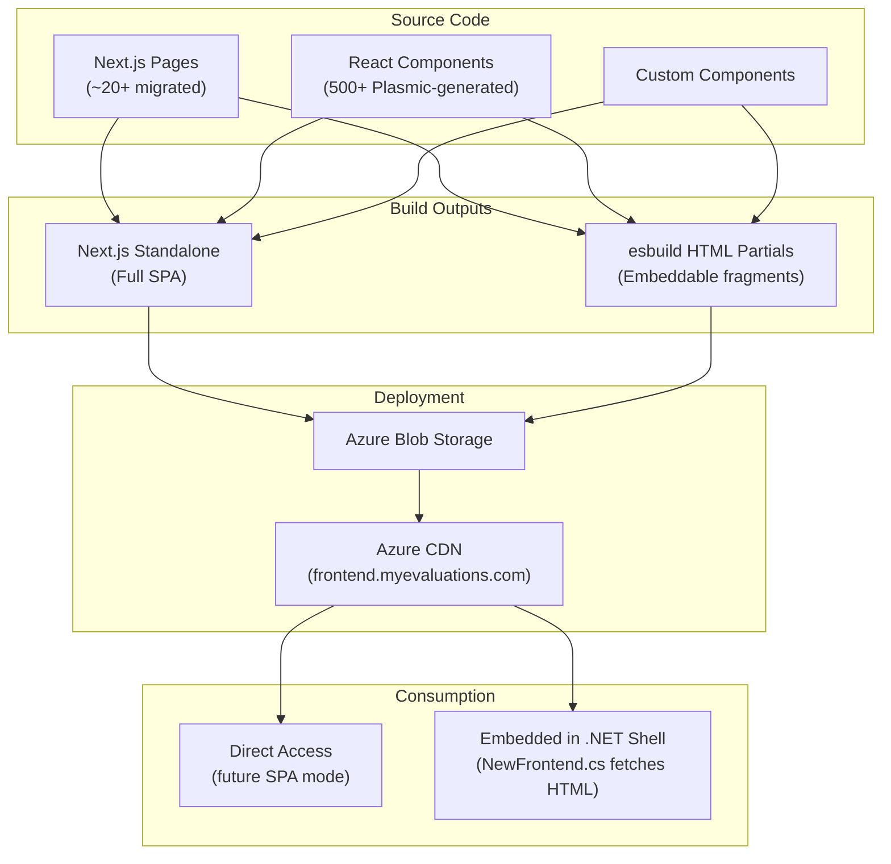
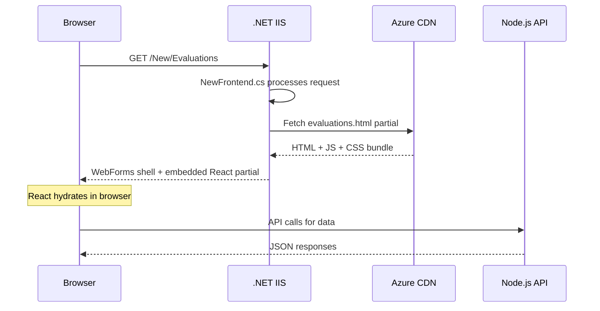

# React Frontend Overview

The React frontend (`myevals-react-frontend`) is the modern UI layer for MyEvaluations, progressively replacing legacy ASP.NET WebForms pages. It is built on **Next.js 13.5** with **Plasmic** as a visual builder and deployed to **Azure CDN**.

:::info Repository
**GitHub:** `github.com/myevaluations/myevals-react-frontend`
**Branch:** `main`
**Language:** TypeScript
:::

## Technology Stack

| Component | Technology | Version |
|-----------|-----------|---------|
| Framework | Next.js | 13.5 |
| Language | TypeScript | 5.x |
| Visual Builder | Plasmic | Latest |
| Build Tool | esbuild (HTML partials) | 0.x |
| Styling | CSS Modules + Plasmic styles | -- |
| State Management | React Context + SWR | -- |
| HTTP Client | Axios | -- |
| CDN | Azure CDN | -- |
| Storage | Azure Blob Storage | -- |
| CI/CD | GitHub Actions | -- |

## Architecture

The React frontend has a unique dual-output architecture:



### Why Dual Build?

The .NET WebForms application serves as the "shell" -- it provides navigation, session management, and authentication. Rather than running React as a separate SPA (which would require duplicating auth and navigation), React pages are built as **HTML partials** that get embedded within the WebForms shell.



## Plasmic Visual Builder

[Plasmic](https://www.plasmic.app/) is a visual builder that generates React components. It allows designers and developers to build UI without writing code for every component.

- **500+ auto-generated components** from Plasmic studio
- Components are exported as React code and committed to the repository
- Custom logic is added via code components that wrap Plasmic-generated UI
- Plasmic studio is used for layout, styling, and component composition

### Plasmic Workflow

1. Design or modify a component in Plasmic Studio
2. Sync changes to the codebase via Plasmic CLI (`plasmic sync`)
3. Add custom logic in wrapper components if needed
4. Build and deploy via GitHub Actions

## Migrated Pages (~20+)

The following WebForms pages have been replaced by React equivalents:

| Page | .NET Original | React Replacement | Status |
|------|--------------|-------------------|--------|
| Evaluation Form | `Evaluations/EvalForm.aspx` | `/New/Evaluations` | Live |
| Duty Hours Entry | `DutyHours/Entry.aspx` | `/New/DutyHours` | Live |
| Patient Log Entry | `PatientLog/Entry.aspx` | `/New/PatientLog` | Live |
| User Profile | `Security/Profile.aspx` | `/New/Profile` | Live |
| Dashboard | `Home.aspx` | `/New/Dashboard` | Live |
| Goals & Milestones | `Goals/Milestones.aspx` | `/New/Goals` | Live |

:::note
The exact list of migrated pages is maintained in the React frontend repository. The table above shows representative examples.
:::

## API Communication

The React frontend communicates with two backends:

| Backend | Access Pattern | Use Case |
|---------|---------------|----------|
| .NET Backend | Via `ApiHandler.ashx` (JSON API router) | Legacy data, existing business logic |
| Node.js Backend | Direct REST API calls | New features, migrated endpoints |

The routing is transparent to the React code -- API utility functions abstract which backend is being called.

## Build and Deployment

```bash
# Development
npm run dev          # Next.js dev server on port 3000

# Production builds
npm run build        # Next.js standalone build
npm run build:html   # esbuild HTML partial build
npm run build:all    # Both builds

# Plasmic
npx plasmic sync     # Sync components from Plasmic Studio
```

### Deployment Pipeline

1. Developer pushes to `main`
2. GitHub Actions runs lint, type-check, and build
3. HTML partials are uploaded to Azure Blob Storage
4. Azure CDN cache is purged
5. The .NET backend immediately serves the new partials

## Key Metrics

| Metric | Value |
|--------|-------|
| Plasmic Components | 500+ |
| Custom Components | 100+ |
| Migrated Pages | ~20+ |
| Build Output (HTML partials) | ~15 MB |
| CDN Endpoint | `frontend.myevaluations.com` |

<!-- AUTO-GENERATED: Component counts and page migration details will be enriched from repo-sync scripts -->
