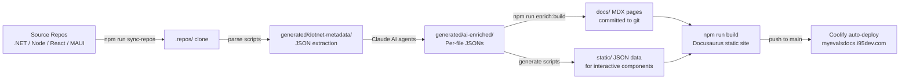

# Site User Guide

This guide explains what the MyEvaluations docs site contains, how to navigate it, and how to use its interactive features effectively.

---

## What This Site Covers

| Layer | Files | Directories | What's Documented |
|-------|-------|-------------|-------------------|
| **Web Application** | 1,644 | 32 | Every ASPX code-behind page in the WebForms UI |
| **Business Layer** | 556 | 22 modules | Business managers, services, and shared logic |
| **Schedulers** | 160 | 65 projects | All Windows Service scheduled jobs |
| **Supporting Projects** | 62 | 9 | Shared libraries, utilities, and service projects |
| **Total** | **2,422** | **128** | Full AI-enriched per-file documentation |

All per-file documentation is generated by Claude AI from source code analysis. Each file record includes: summary, business purpose, key methods, stored procedure references, complexity rating, and migration relevance.

---

## Quick Navigation

| I need to… | Go here |
|------------|---------|
| Fix a bug in a module | **Business Modules** → expand the relevant module page |
| Know what will break if I change a business manager | **Business Modules** → DependentsPanel at the bottom |
| Find the most complex files to migrate | **Tech Debt Radar** → filter by migration = High |
| Trace a stored procedure through all layers | **Data Access → Stored Procedures** → SprocMap 3-tier view |
| Understand when schedulers run | **Schedulers → Timeline** |
| Browse all files in a directory | **Web Application → Page Reference** or **Business Modules → File Reference** |
| Ask a freeform question | 🤖 **AI chat button** (bottom-right of any page) |
| Start as a new team member | **Onboarding Path** (sidebar top) |

---

## Sidebar Section Guide

### Onboarding Path
A curated walkthrough for new engineers: system overview, dev environment setup, first tasks, and architecture context. Start here if you're new to the project.

### Architecture
Five pages covering the system's high-level design: service overview, data flow through the strangler-fig migration, deployment topology, authentication model, and database schema.

### .NET Backend *(primary focus)*
The largest section — 119 pages documenting the legacy .NET 4.6.1 WebForms monolith. Sub-sections cover patterns, business modules, schedulers, data access, web pages, supporting projects, integrations, and migration planning.

### Node.js Backend
Overview and getting-started guide for the modern NestJS replacement backend being built alongside the .NET monolith.

### React Frontend
Overview and getting-started guide for the Next.js + Plasmic visual builder frontend that progressively replaces WebForms pages.

### MAUI Mobile App
Overview and getting-started guide for the .NET MAUI 9 cross-platform mobile app (iOS + Android).

### Cross-Cutting
Platform-wide concerns: migration status dashboard, feature matrix across all layers, coding standards, and onboarding checklist.

### Guides
Practical how-to guides: debugging workflows, adding new features, creating schedulers, and common bug patterns.

---

## Interactive Features

| Component | Where | What It Does | Key Tips |
|-----------|-------|--------------|----------|
| **FileReference** | Business/Web/Scheduler file reference pages | Expandable table of all files in a directory with methods, SPs, and complexity | Click any row to expand full details |
| **DependentsPanel** | Business module overview pages | Shows all web and scheduler files that import a given business manager | Lazy-loaded on page scroll |
| **SprocMap** | Data Access → Stored Procedures | 3-tier view: SP → business manager → web/scheduler callers | Use the search box to jump to a specific SP |
| **FeatureMap** | .NET Backend → Feature Map | Accordion mapping of user-facing features to their code modules | Expand rows to see file lists |
| **ModuleHealthDashboard** | .NET Backend → Module Health | Color-coded health grid (complexity + migration + coverage) | Click any cell to open that module's docs |
| **TechDebtRadar** | .NET Backend → Tech Debt Radar | Interactive scatter plot: X = migration, Y = complexity, size = lines | Filter by layer and minimum migration relevance; click bubbles to navigate |
| **SchedulerTimeline** | Schedulers → Timeline | 24-hour grid + frequency accordion for all 65 scheduler projects | Search by name or domain in the accordion |
| **AI Chat** | Every page (bottom-right button) | Claude-powered Q&A across all documentation | Ask natural language questions about any module, file, or pattern |

---

## Common Developer Scenarios

### 1. Investigating a Bug in a Module

1. Open **Business Modules** in the sidebar
2. Navigate to the relevant module (e.g., *Evaluations*)
3. Read the module overview and key workflows
4. Scroll to **File Reference** → expand the file in question
5. Check **Key Methods** and **Stored Procedures** for the relevant logic
6. Use the **GitHub source link** (↗) to open the file in the repository

### 2. Planning a Feature Change

1. Identify the business manager that owns the feature
2. Open that module's docs → scroll to **DependentsPanel**
3. Review all web pages and schedulers that depend on this manager
4. Check **Tech Debt Radar** → filter by that module's files to assess complexity
5. Use **Data Access → Stored Procedures** to trace any SPs that will be affected

### 3. Migration Planning

1. Open **Tech Debt Radar** → set Min Migration = "High"
2. Identify top-right quadrant files (high complexity + high migration relevance)
3. Click a bubble to open that file's documentation
4. Review the migration note on that file's page
5. Cross-reference with **Migration → Status** for overall progress

### 4. Debugging a Scheduler Issue

1. Open **Schedulers → Timeline** — confirm the expected run time
2. Navigate to the relevant scheduler doc page (click ↗ in the accordion)
3. Check the **Configuration** and **Troubleshooting** sections on that page
4. If timing seems off: verify Windows Task Scheduler configuration matches documentation
5. Check **Data Integration** or **Evaluations** schedulers if the issue involves external sync

### 5. Onboarding a New Team Member

1. Start at **Onboarding Path** — complete all 5 steps in order
2. Read **Architecture → Overview** for the strangler-fig migration context
3. Browse **Business Modules** to understand the domain model
4. Try the **AI Chat** button to ask questions in plain English
5. Run a search (Ctrl+K) for any specific class or file you're working on

---

## Data Pipeline

How documentation is generated and updated:



The AI enrichment step uses Claude CLI Task agents running against the source code. After enrichment, `npm run enrich:build` regenerates all MDX pages, then `npm run build` verifies the site builds without errors before committing.

---

## Accuracy Limitations

:::caution
AI-generated documentation has inherent limitations. Keep the following in mind:

- **Method signatures** are inferred from source code — some descriptions may be paraphrased or incomplete
- **Stored procedure lists** are extracted via regex; dynamic SQL or string-concatenated SP names may be missed
- **Business purpose descriptions** reflect the AI's interpretation of the code, not official specifications
- **Migration notes** are advisory — always validate against the actual migration strategy documentation
- **Line counts** are from the last parse run and may not reflect recent commits
:::

When in doubt, click the GitHub source link (↗) on any file page to verify against the live source.

---

## How to Regenerate Documentation

After source code changes or when enrichment data becomes stale:

```bash
# Full pipeline (requires all repos accessible)
npm run sync-repos          # Re-clone source repos
npm run parse:dotnet:full   # Re-parse all .NET metadata
npm run enrich:build        # Merge AI batches + regenerate MDX pages

# Regenerate interactive data files
npm run generate:tech-debt  # Rebuild static/tech-debt-data.json
npm run generate:scheduler-timeline  # Rebuild static/scheduler-data.json

# Verify and deploy
npm run build               # Verify zero errors
git add -A && git commit    # Commit generated pages + static data
git push origin main        # Triggers Coolify auto-deploy
```

AI enrichment (the expensive step) runs via Claude CLI Task agents and is done manually when significant new code is added. The weekly automated pipeline handles routine freshness.
